#Nifi实战

[TOC]

##1 NiFi综述
Nifi用于构建系统间自动化的数据流。由于有些系统用于生产数据，有些系统用于消费数。为解决数据生产与消费问题，产生很多解决模式，其中最广泛和最简易的消费模式为**企业集成模式（EIP Enterprise Integration Pattern）**。  

数据流所面临的高级挑战：  
- 系统宕机
网络故障、磁盘故障、软件故障以及人为错误  
- 消费数据超过可访问数据容量的
有时一个数据源会超过数据链处理和传输的速度，但它仅仅会若关联到一个发布的问题
- 数据重量无法保证（边界条件仅仅是一些建议）
数据质量不高，经常会获取到超大、超小、太快、太慢、过期的、错误的以及格式错误的数据  
- 数据流变化快（曾经的脏数据变成下一代的信号量）
一个组织的优先级变化的非常快。创建新数据流或者在已有的数据流上的修改也必须快  
- 系统的进化与发展不在同一速率
特定系统所使用的协议与数据结构，往往任意调整，并不考虑周边系统。数据流用于连接大量的分布式系统组件，数据流本身是一种松散的或者独立运行的架构，使各系统能够独立运行而不是在一起工作  
- 承诺与安全
法律、法规、政策会发生变化，商业协议会发生变化，系统与系统以及系统与用户之间的交互必须保证安全、可信并且可以计算的  
- 产品的持续改进
产品的改进经常会发生在产品的生产环境  

多年以来，数据流(dataflow)已经成为架构中必备的罪恶组件。尽管目前通过一系列进化，使数据流获得了一定关注，并帮助一些企业取得了重要的成功。这些技术包括：SOA（Service Oriented Architecture）、API的崛起、物联网（IoT Internet of Things）、大数据技术。对于服务对隐私以及安全有着苛刻的要求。在这些新概念与需要的背景下，数据流的需求同样大幅度的提高。数据流的使用场景发生一定的变化，复杂的范围、适应变化的速度、规模以及边缘的变化变得非常普遍。NiFi的建立是为了帮助解决这些现代的数据流挑战。  

###1.1 NiFi的核心概念
Nifi的核心理念是基于流程的编程（FBP Flow Based Programming）。以下是Nifi的概念，帮助理解FBP：  
Nifi术语|FBP术语|描述
----|------|-------
流程文件（FlowFile）|信息包（Information Packet）|流程文件代表每个系统间运动的对象，Nifi跟踪一个Key/Value的字符串键值对的map  
流程文件处理器（FlowFile Processor）|黑盒（Black Box）|处理器实际工作的单元。EIP中，处理器进行系统间的数据路由、转换、调解。处理器访问特定FlowFile中的属性以及上下文流。在特定的工作单元，处理器可以操作多个FlowFile，执行commit或rollback操作  
连接（Connection）|有界缓冲区（Bounded Buffer）|连接为两个处理器提供连接。像一个队列一样，协调多个不同速率的处理之间的互动。这些队列可以动态地优先级排序，并且在压力调节时可以在负载上有上界  
流程控制器（Flow Controller）|调度器|流程控制器管理流程连接、处理器的线程数等。流程控制器充当FlowFile与处理器之间的代理，促进两者之间信息交换
处理组（Process Group）|子网（subnet）|处理组是一系列特定的处理以及连接，通过输入端口接收数据通过输出数据发送数据。处理组允许创建新组件简化其他组件的组成  

这种设计模型与SEDA类似，使Nifi具有很多优势，成为一个高效、有力的、可扩展的数据流构建平台。优势包括：
- 处理流程的可视化创建与管理
- 内在具有异步性，即使在处理与流量高峰时，仍能确保高生产能力和自然缓冲
- 提供一个高度并发的模型，而不需要开发人员考虑并发的复杂性
- 高内聚和松散耦合组件的开发模式。组件可以在其他上下文中重用，并提升单元的可测试性
- 连接资源的受限使系统的反压力及压力释放非常自然和直观
- 与粗粒度的catch-all的方式处理错误与异常不同，异常处理将变得比较愉快
- 数据流入与流出系统以及在系统中的流向都能非常容易以及易于理解的方式跟踪

###1.2 NiFi架构
  
NiFi运行在主机操作系统的Java虚拟机。Java虚拟机中的NiFi主要组件包括：  
- Web Server
确能够通过HTTP命令和控制API控制NiFi运行
- 流出控制器（Flow Controller）
流出控制器是处理的大脑。提供运行时的线程扩展，管理处理器能够按照日程执行并获取足够的资源
- 扩展（Extensions）
NiFi具有多种类型的扩展。主要是对JVM中的操作和执行进行扩展
- FlowFile库（FlowFile Repository）
FlowFile库用于跟踪给定FlowFile在流程中的状态。库的实现采用可插拔式。默认的方法是在指定磁盘分区上的持久写前日志
- 上下文库（Content Repository）
上下文库是给定FlowFile实际内容字节的位置。存储库的实现是可插拔的。默认的方法是一个相当简单的机制，它将数据块存储在文件系统中。可以指定多个文件系统存储位置，以便获得不同的物理分区，从而减少单个卷的争用
- 来源库（Provenance Repository）
来源库是存储所有来源事件数据位置。存储库结构是可插拔的，默认的实现是使用一个或多个物理磁盘卷。在每个位置事件数据都被索引和搜索。

  

自NiFi 1.0版，NiFi集群就采用无Master并行集群。每个NiFi节点执行相同的数据加工任务，但是每个节点上处理不同的数据集。Apache ZooKeeper选举一个集群协调区（Cluster Coordinator），如果出现故障ZooKeeper自动进行处理。所有集群节点向集群协调器报告心跳及状态。集群协调器负责切断或连接节点。并且，每个集群有唯一的主节点，该节点也由ZooKeeper选举而来。统一通过节点中任意一台机器的UI界面访问NiFi集群，对数据加工流程进行管理。任何操作都将被复制分发到集群中的任意节点，集群运行多个入口点

###1.3 NiFi的性能期望与特性
NiFi在设计上充分利用宿主机的性能，充分利用CPU以及磁盘的性能。在后续的管理手册中有相关的最佳实践与配置
- IO
系统的生产性与延迟由于配置而产生很大差异。对于系统中可插拔的方法，其性能由实现方式决定。仍然有一些具体的广泛使用的开箱即用的实现。所有的持久化操作都要保证数据的交付并使用本地磁盘。普通服务器标准磁盘或者RAID磁盘阵列，保守估计读写速率应在50MB/s左右。NiFi在很多数据流程的读写速率将更加高效，能够达到100MB/s甚至更高。NiFi性能的提升主要由于物理分区的增加和上下文库的增加可以使性能得到线性的提升。NiFi的性能瓶颈将会出现在FlowFile库和来源库。NiFi计划提供一个性能测试基准以及性能测试模板，使用户可以便捷的测试他们的系统并识别其中的瓶颈以及影响性能的因素。这个模板也可以帮助管理员更简便的修改数据处理流程并验证修改对性能的影响
- CPU
当一个特定的处理器被赋予一个线程来执行时，流程控制器（Flow Controller）充当控制引擎。处理器一旦处理完成将立刻归还线程。流控制器可以为它所维护的各种线程池提供一个配置值，指示可用线程。要使用的线程的理想数量取决于主机系统资源的核心数量，以及该系统是否运行其他服务，以及流程中处理的性质，比如：IO处理繁重的流程，需要多创建线程
- 内存
NiFi在JVM中运行，因此NiFi的内存限制有JVM决定。JVM的GC机制是约束系统实际内存的重要因素，同时，随着系统的运行也能起到调节系统性能的作用。NiFi任务会由于同时读同样的内容（content）而造成I/O紧张，需要配置足够的磁盘空间优化性能

###1.4 总结
以上宏观的对NiFi基础原理进行了描述，形成了NiFi的鸟瞰视图，介绍了NiFi的特性。NiFi的关键特性分为如下几类：流程管理、易用性、安全性、可扩展性架构、灵活扩展模型。  
- 流程控制
	- 保证送达（Guarantee Delivery）：NiFi的核心理念是大规模以及保证送达。NiFi通过有效地使用专门构建的持久写日志和内容存储库实现保证送达。NiFi的设计方式是允许非常高的事务率，有效的负载扩展（load-spreading），复制-写(copy-on-write)等机制发挥传统磁盘读/写的优势。
	- 利用数据缓存回压或释放压力：NiFi对队列数据进行缓存，当队列达到极限时提供回压能力，当数据达到某一时限时，将数据从缓存中清除
	- 优先化队列（Prioritized Queuing）：NiFi运行设置多种优先级方案以决定如何在队列中检索数据。默认情况下是按时间升序（即最老的先被检索出），也可以按时间降序，也可以按值进行降序。可以通过自定义的方案指定优先级
	- 处理流程的服务质量（QoS Quality of Service）（延迟、加工性能、运行数据丢失（loss tolerance））：有些特定的加工流程中的数据十分重要，数据丢失不能容忍。也有一些时候，它必须在几秒钟内被处理和交付，被处理到任何值或送达任何地方。NiFi支持这些关注点的细粒度流特定配置。
- 易用性
	- 可视化的命令与控制：数据加工流程可能会非常复杂。对于加工流程的可视化，可以大大降低复杂性，并且可以发现需要简化的领域。NiFi不仅能够对加工流程进行可视化操作还能对运行时进行可视化。比起传统的“设计/部署”模式，NiFi的开发模式更像黏土。对于流程的修改会立即生效。更改是细粒度的，并且与受影响的组件隔离。您不需要停止整个流或一组流，只是为了进行一些特定的修改。
	- 流程模板（Flow Template）:数据流程高度面向模式，并且解决相同问题可以有不同的解决方案，共享最佳实践可以对解决问题很有帮助。模板允许主题专家构建和发布他们的流设计，并让其他人从中受益和协作。
	- 数据起源（Data Provenance）：NiFi自动记录、索引，并将源数据作为对象流入系统，甚至在数据扇入、扇出以及转换等更多场景。这些信息对于运维支持、故障定位、性能优化以及其他场景至关重要  
>在软件设计中，扇入和扇出的概念是指应用程序模块之间的层次调用情况。  
按照结构化设计方法，一个应用程序是由多个功能相对独立的模块所组成。  
扇入：是指直接调用该模块的上级模块的个数。扇入大表示模块的复用程序高。  
扇出：是指该模块直接调用的下级模块的个数。扇出大表示模块的复杂度高，需要控制和协调过多的下级模块；但扇出过小（例如总是1）也不好。扇出过大一般是因为缺乏中间层次，应该适当增加中间层次的模块。扇出太小时可以把下级模块进一步分解成若干个子功能模块，或者合并到它的上级模块中去。  
设计良好的软件结构，通常顶层扇出比较大，中间扇出小，底层模块则有大扇入  
更加恰当的说法是：描述负载状况的一种描述方式
	- 恢复/适当粒度的向回滚缓冲区中记录历史：NiFi的内容库设计了历史回滚缓冲区。数据在存储到达一定时间后会被清除或者在空间不足时被清除。这种特性与数据来源的容量相结合。为实现点击内容、内容下载和重放提供了非常有用的基础，所有这些操作都在数据对象的生命周期中进行记录，甚至可以跨域多个代
- 安全性
	- 系统到系统：数据流程的安全性很高。NiFi使用双向SSL认证模式对数据流程的各个节点实现安全交换。NiFi还可以对交换的内容利用共享密钥的方式进行加密/解密，或者在发送端/接收端使用其他机制完成数据的加解密
	- 用户到系统：NiFi支持两种方式的SSL认证，并提供可插入的授权，这样它就可以正确地控制用户的访问权限，并在特定的级别（只读、dataflow manager、admin）。如果用户将一个敏感的属性输入到流中，那么它就会立即被加密落盘到服务器端，即使是在其加密的形式中也不会再次暴露在客户端。
	- 多租户授权（Multi-tenant Authorization）：对数据加工流程上的组件进行多级授权，运行管理员在适当的粒度上进行访问控制。这样NiFi集群可以处理一个或多个组织的请求。与孤立的拓扑相比，多承租者授权可以为dataflow管理提供一个自服务模型，允许每个团队或组织对流进行管理，并充分了解剩余的流，而这些流是他们无法访问的。
- 可扩展架构（Extensible Architecture）
	- 扩展：NiFi核心思想是扩展性，NiFi是一个数据处理的平台，通过一些可预知性、可重复行为与数据加工处理流程进行交互。扩展的要点包括：处理器、控制器服务、报告任务、优先排序器和客户用户界面。
	- 类加载器隔离（Classloader Isolation）：对于任何基于组件的系统，依赖性问题都会很快发生。NiFi通过提供一个定制的类装入器模型来解决这个问题，确保每个扩展包都暴露在非常有限的依赖集合中。因此，可以构建扩展，而不关心它们是否会与另一个扩展冲突。这些扩展包的概念称为“NiFi档案”，并在【开发人员指南】中更详细地讨论。
	- 站点到站点通信协议：NiFi实例之间的首选通信协议是NiFi站点到站点（S2S）协议。S2S可以轻松、高效、安全地将数据从一个NiFi实例转移到另一个NiFi实例。NiFi客户端库可以很容易地构建并打包到其他应用程序或设备中，通过S2S与NiFi进行通信。基于Socket的协议和HTTP（S）协议都支持S2S作为底层传输协议，这使得将代理服务器嵌入到S2S通信中成为可能。
- 灵活扩展模型（Flexible Scaling Model）
	- 水平扩展（集群）：按之前所说，NiFi的设计目的是通过将许多节点聚集在一起来进行扩展。如果一个节点被供应并配置为每秒处理数百MB，通过配置集群来处理GB每秒。这就带来了在NiFi和它获取数据的系统之间的负载平衡和故障转移代理挑战。使用基于异步队列的协议，如消息传递服务、卡夫卡等可以提供帮助。NiFi的“站点到站点”特性使NiFi与客户端（包括与其他NiFi集群）通过授权的端口的通信、信息共享、数据交换更高效。
	- 扩大&下降（Scale-up & down）：NiFi也被设计成以一种非常灵活的方式进行扩容与收缩。从NiFi框架的角度提高吞吐量方面，在配置时，可以在调度选项卡下增加处理器上的并发任务数量。NiFi允许更多的进程同时执行，提供更大的吞吐量。另外，NiFi可以完美收缩规模，在边缘设备上运行，由于硬件资源有限，需要占用少量的内存。要特别解决最后一公里数据收集挑战和边缘的场景，您可以在一下连接找到解决方案：  
https://cwiki.apache.org/confluence/display/NIFI/MiNiFi  
MiNiFi 是Apache NiFi的子项目  

##2 NiFi入门
###2.1 术语
- **流程文件（FlowFile）**：每一块用户数据（用户交给NiFi进行处理或者分发的数据）都是一个流程文件（FlowFile）。一个流程文件由两部分组成：属性（Attribute）和内容（Content），内容是用户数据本身，属性时一个Key/Value的键值对，而这对数据与用户数据密切相关
- **处理器（Processor）**：NiFi的处理器组件主要包括：创建、发送、接收、转换、路由、切分、合并以及处理流程文件。处理器是用户创建自己的数据加工流程的重要的部件

###2.2 NiFi下载
在如下路径下载NiFi对应版本：  
[http://nifi.apache.org/download.html](http://nifi.apache.org/download.html)  
###2.3 NiFi运行
####2.3.1 Windows用户运行NiFi
Windows用户，在bin目录下，以管理员身份运行run-nifi.bat即可启动NiFi  
出现如下窗口，说明应用已启动  
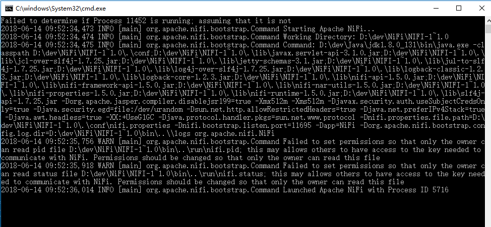  
####2.3.2 Linux/ Mac OS用户运行NiFi
Linux用户将需要运行bin/nifi.sh  
若需要后台运行则需要执行：bin/nifi.sh start  
查看NiFi运行专科需要执行：bin/nifi.sh status  
停止NiFi服务需要执行：bin/nifi.sh stop  
####2.3.3 服务化安装
Linux用户可以将NiFi安装成服务。在安装目录中执行如下命令，将服务安装成默认名称nifi：  
bin/nifi.sh install
如果需要指定安装的服务名需要在命令后增加一个服务名（serviceName是服务名称）：  
bin/nifi.sh install [serviceName]
eg. bin/nifi.sh install dataflow  
服务安装完成后可以通过以下命令启停查看状态：
sudo service nifi start  
sudo service nifi stop  
sudo service nifi status  
####2.3.4 服务验证
当NiFi服务启动后，通过访问如下路径可以访问控制台：  
htttp://localhost:8080/nifi/  
如果NiFi正常启动，将出现如下窗口：  
  
NiFi的控制面板的布局如下：  
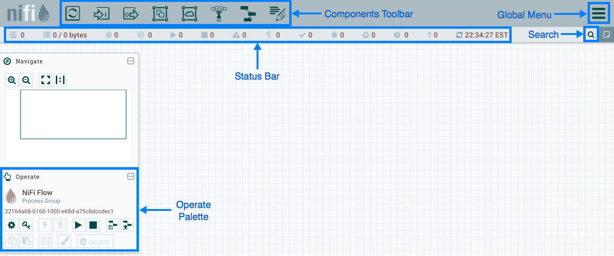  
点击页面右上角的菜单按钮【】  
  
####2.3.5 添加处理器（Processor）  
可以拖拽【】将处理器放到画布上，创建数据加工流程  
将处理器拖到画布上之后，会出现对话框，选择处理器种类  
  
对话框左边是一些tags，是开发人员为处理器定义的一些标签，可以理解为关键字。可以帮助开发人员通过标签迅速过滤处理器类型。通过对话框右上角的Filter也可以通过输入关键字对处理器进行过滤  
例如：我们需要将本地文件传到NiFi，我们可以通过file关键字进行过滤，当然通过local关键字过滤效果更好。
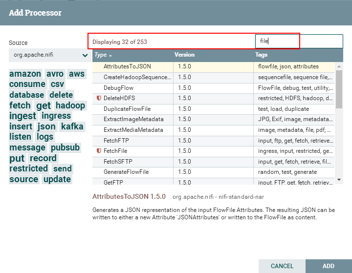  
  
在对话框下有一个关于处理器的简短介绍
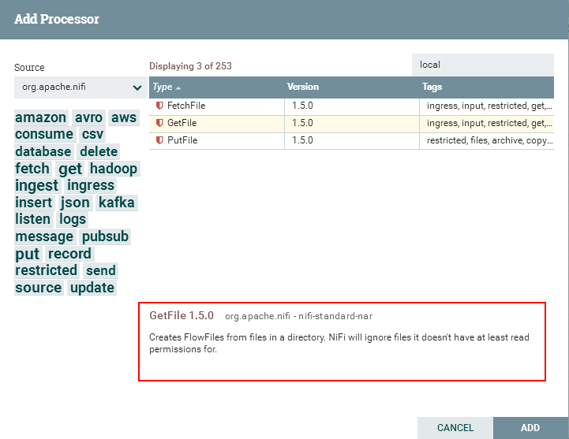  
按描述，GetFile处理器从本地磁盘拉数据到NiFi，然后将本地文件删除。  
点击【Add】按钮或者双击处理器，将处理器添加到画布上  
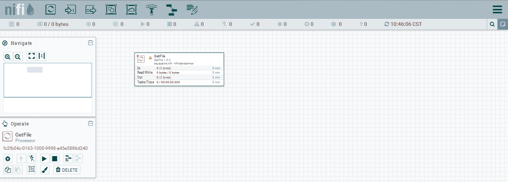  
####2.3.6 配置处理器
右键点击处理器选择【Configure】配置处理器。
  
处理器的配置页面时多页签页面  
  
对于处理器的配置重点关注【Properties】页签。在Properties页签内，是一个属性列表。每个处理器的属性列表都不相同。必填字段为粗体字，在必填属性未被设置的情况下，处理器无法运行   
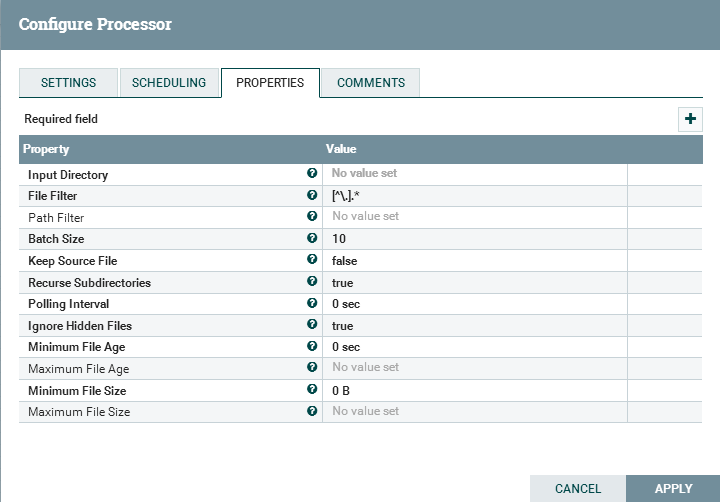   
在GetFile处理器最关键的属性就是获取文件的本地目录。设置【Input Directory】属性。如果设置该路径，  
  
当不知道该属性的用途时，可以将鼠标滑至【】图标，显示该属性的提示信息。提示信息中还包括默认值。有些属性支持表达式语言（Expression Language可以参考如下链接）在提示信息中显示。  
【[Expression Language / Using Attributes in Property Values](http://nifi.apache.org/docs/nifi-docs/html/getting-started.html#ExpressionLanguage)  】
  
点击【Apply】按钮提交，并关闭对话框  
####2.3.7 连接处理器
每个处理器都有一系列被定义为【关系（Relationship）】的对象，这些对象用于发送数据。当一个处理器完成了自己流程文件（FlowFile）的加工后，它将结果传给其中的一个关系。关系使用户可以配置灵活处置处理后的结果。如，许多处理器定义了两个关系：成功/失败。用户就可以定义条正常路径处理正常处理后的结果以及一条异常处理由于某些原因不能处理的数据。或者，根据用例，可以将两个关系路由到相同的处理流程的路径上。
在完成GetFile处理器配置后，在处理器左上角有一个【】图标，表示该处理器仍然不可用。通过这个图标可以看到成功的关系并没定义，鼠标移动到【】图标可以看到提示信息。提示该警告信息意味着NiFi并不知道在处理器成功传输数据后应该相关的关系后续应该有哪些操作  
  
为将流程完整化，需要再追加一个处理器与GetFile处理器连接。与上面的步骤一样，只不过我们追加一个日志在已有的FlowFile上，所以追加一个LogAttributes处理器  
  
为连接GetFile与LogAttribute处理器，鼠标移动到GetFile处理器上时会出现一个【】图标，拉一条线从GetFile到LogAttribute将会弹出一个连接两个处理器的关系配置页面。NiFi自带的校验功能可以将不合理的线条拖拽控制住，比如从LogAttribute拉线到GetFile就不能成功  
  
打开【Setting】选项卡来配置连接的行为  
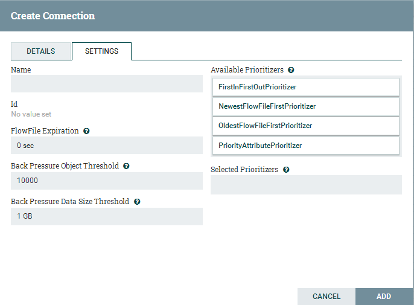  
可以为连接指定名称，如果不指定名称，连接名将会按照关系命名。还可以为数据指定时限，默认情况下是“0秒”，意味着数据将永不过期，但可以修改改属性值，当连接达到移动时间，NiFi将自动删除过期的文件  
背压阀（backpressure threshold）在队列达到一定深度时，源处理器将不再运行。这种机制运行管理员处理一个处理器产生数据能力高于另一个处理器的消费数据能力的业务场景。引入了反压力配置，在导入数据的处理遇到反压机制时，将会停止导入新数据，在系统恢复消费能力时又可以重新开始导入数据  
在对话框的右侧是排序器（Prioritizer），允许管理员指定数据在队列中的顺序。可以将【可用排序器】列表中的排序器拖拽到【已选择排序器】内按顺序激活排序器。如果在指定的排序器内指定多个排序器，第一个排序器先生效，按照第一个排序器判断两个FlowFile都满足，再按照第二个计算  
完成关系设定后，点击【Add】完成关系设置  
在完成关系的设置后，处理器就不是感叹号而变成【】  
  
此时LogAttribute处理器由于没有指定成功后的关系而变成不可用。此时需要声明当LogAttribute执行成功后，将自动终止，这样流程文件在处理结束后数据将丢弃。设置方法：在LogAttribute处理器的【设置】页签中，将Automatically Terminate Relationships下的success勾选框选中，则两个处理器都不再报警告了
  
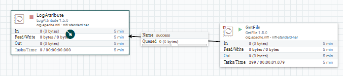  
####2.3.8 启动/停止处理器
右键点击流程上的每个处理器，点击【Start】菜单项。也可以用shift+鼠标左键选中每个处理器，然后再右键点击【Start】同时启动每个处理器  
同样可以使用Operate面板上的启动停止按钮将处理器组内的处理器全部启动或停止  
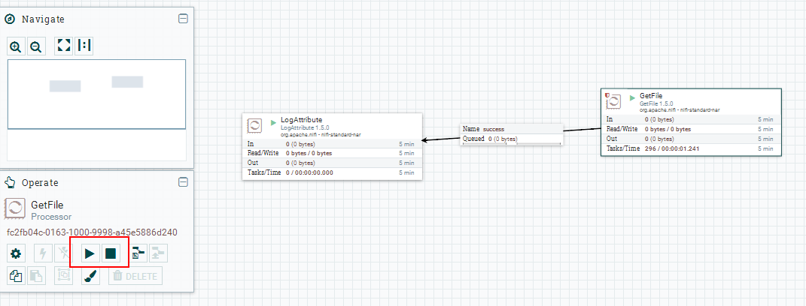  
一旦处理器开始运行，状态图标就由停止变成运行状态。点击上下文菜单（右键点击处理器调出的菜单）【Stop】可以停止处理器  
一旦处理器运行起来，就不能再配置处理器。右键点击正在运行的处理器只能查看正在运行的处理器的配置情况。如果想要修改处理器，需要停止处理并等待正在执行的流程执行完毕。处理器正在处理的任务应该会在右上角的In属性显示  
  
####2.3.9 获取处理器的更多信息
右键点击处理器，在上下文菜单中点击【View Usage】查看NiFi的处理器文档查看处理器的用途、关系属性以及与其他处理器的差别  
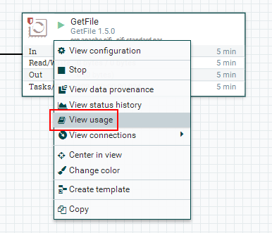  
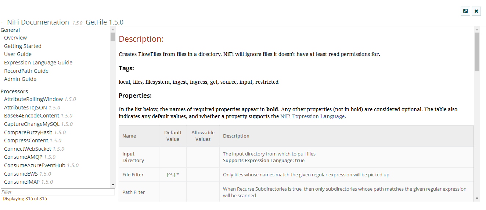  
####2.3.10 其他组件
NiFi有大量数据处理组件，利用这些组件可以构建数据加工流程。这些组件包括输入输出端口、漏斗、处理组、远程处理组。这些组件的详细介绍在后续详细的手册中介绍  

