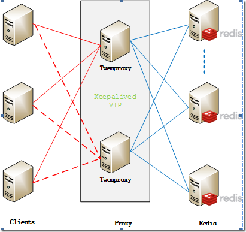

###1 Redis相比memcached有哪些优势？
1. memcached所有的值均是简单的字符串，redis作为其替代者，支持更为丰富的数据类型
2. redis的速度比memcached快很多
3. redis可以持久化其数据

###2 Redis支持哪几种数据类型？
String、List、Set、Sorted Set、hashes

###3 Redis集群方案应该怎么做？都有哪些方案？
Redis常用的分区集群方案有：

- 客户端分区就是在客户端就已经决定数据会被存储到哪个redis节点或者从哪个redis节点读取。大多数客户端已经实现了客户端分区。

- 代理分区 意味着客户端将请求发送给代理，然后代理决定去哪个节点写数据或者读数据。代理根据分区规则决定请求哪些Redis实例，然后根据Redis的响应结果返回给客户端。redis和memcached的一种代理实现就是Twemproxy

- 查询路由(Query routing) 的意思是客户端随机地请求任意一个redis实例，然后由Redis将请求转发给正确的Redis节点。Redis Cluster实现了一种混合形式的查询路由，但并不是直接将请求从一个redis节点转发到另一个redis节点，而是在客户端的帮助下直接redirected到正确的redis节点。

twemproxy，大概概念是，它类似于一个代理方式，使用方法和普通redis无任何区别，设置好它下属的多个redis实例后，使用时在本需要连接redis的地方改为连接twemproxy，它会以一个代理的身份接收请求并使用一致性hash算法，将请求转接到具体redis，将结果再返回twemproxy。使用方式简便(相对redis只需修改连接端口)，对旧项目扩展的首选。 问题：twemproxy自身单端口实例的压力，使用一致性hash后，对redis节点数量改变时候的计算值的改变，数据无法自动移动到新的节点。
  

###4 Redis回收使用的是什么算法？
LRU：最近最少使用原则  

###5 为什么要做Redis分区？
分区可以让Redis管理更大的内存，Redis将可以使用所有机器的内存。如果没有分区，你最多只能使用一台机器的内存。分区使Redis的计算能力通过简单地增加计算机得到成倍提升,Redis的网络带宽也会随着计算机和网卡的增加而成倍增长。

###6 Redis的内存占用情况怎么样？
Redis的内存占用率比普通的键值对要高，主要是由于Redis的键值还同步记录很多元数据信息，如类型信息引用计数等。
给你举个例子： 100万个键值对（键是0到999999值是字符串“hello
world”）约用了100MB。同样的数据放到一个key里只需要16MB，这是因为键值有一个很大的开销。在Memcached上执行也是类似的结果，但是相对Redis的开销要小一点点，Redis记录的信息会比较多。  

###7 memcached与redis的区别？
1. Redis不仅仅支持简单的k/v类型的数据，同时还提供list，set，zset，hash等数据结构的存储。而memcache只支持简单数据类型，需要客户端自己处理复杂对象
2. Redis支持数据的持久化，可以将内存中的数据保持在磁盘中，重启的时候可以再次加载进行使用（PS：持久化在rdb、aof）。
3. 由于Memcache没有持久化机制，因此宕机所有缓存数据失效。Redis配置为持久化，宕机重启后，将自动加载宕机时刻的数据到缓存系统中。具有更好的灾备机制。
4. Memcache可以使用Magent在客户端进行一致性hash做分布式。Redis支持在服务器端做分布式（PS:Twemproxy/Codis/Redis-cluster多种分布式实现方式）
5. Memcached的简单限制就是键（key）和Value的限制。最大键长为250个字符。可以接受的储存数据不能超过1MB（可修改配置文件变大），因为这是典型slab 的最大值，不适合虚拟机使用。而Redis的Key长度支持到512k。
6. Redis使用的是单线程模型，保证了数据按顺序提交。Memcache需要使用cas保证数据一致性。CAS（Check and Set）是一个确保并发一致性的机制，属于“乐观锁”范畴；原理很简单：拿版本号，操作，对比版本号，如果一致就操作，不一致就放弃任何操作cpu利用。由于Redis只使用单核，而Memcached可以使用多核，所以平均每一个核上Redis在存储小数据时比Memcached性能更 高。而在100k以上的数据中，Memcached性能要高于Redis 。
7. memcache内存管理：使用Slab Allocation。原理相当简单，预先分配一系列大小固定的组，然后根据数据大小选择最合适的块存储。避免了内存碎片。（缺点：不能变长，浪费了一定空间）memcached默认情况下下一个slab的最大值为前一个的1.25倍。
8. redis内存管理： Redis通过定义一个数组来记录所有的内存分配情况， Redis采用的是包装的malloc/free，相较于Memcached的内存管理方法来说，要简单很多。由于malloc首先以链表的方式搜索已管理的内存中可用的空间分配，导致内存碎片比较多

