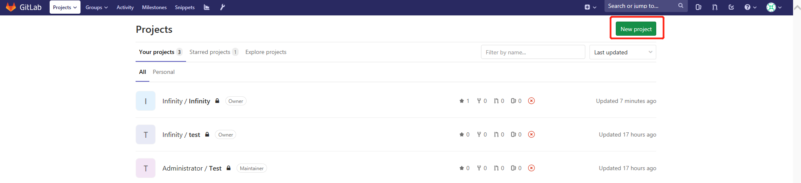

#Git/GitLab实操  
[TOC]  

##1 Ubuntu环境下Gitlab安装  

###1.1 安装Gitlab  

**1)  安装并配置必要的依赖项**  
升级Ubuntu依赖包：  
~~~
sudo apt-get update
~~~

安装open-ssl、ca-certificates：  
~~~
sudo apt-get install -y curl openssh-server ca-certificates
~~~

安装Postfix以发送通知电子邮件。如果要使用其他解决方案发送电子邮件，请跳过此步骤并在安装GitLab后配置外部SMTP服务器。  
~~~
sudo apt-get install -y postfix
~~~

在Postfix安装期间，可能会出现配置屏幕。选择“Internet Site”并按Enter键。使用服务器的外部DNS作为“邮件名称”，然后按Enter键。如果出现其他屏幕，请继续按Enter键接受默认值。  

**2）添加GitLab软件包存储库并安装软件包**  
添加GitLab包存储库:
~~~
curl https://packages.gitlab.com/install/repositories/gitlab/gitlab-ee/script.deb.sh | sudo bash
~~~

**3) 配置启动Gitlab服务**

■重新配置gitlab  
~~~
sudo gitlab-ctl reconfigure
~~~

■开启关闭gitlab服务  
开启服务：  
~~~
service sshd start
service postfix start
sudo gitlab-ctl start
~~~

关闭服务：  
~~~
sudo gitlab-ctl stop
~~~

重启服务：  
~~~
sudo gitlab-ctl restart
~~~

**4）测试gitlab服务**
在浏览器中输入：http://ip:port  
直接输IP地址及端口即可访问gitlab  
  

###1.2 问题处理
1）在安装Gitlab并启动后，出现502错误  
  

初步判断是服务器内存过低，将服务器内存扩为8G以上。  
如果不是资源的问题，需要考虑增大等待的时间。  
修改gitlab.rb命令对配置进行编辑：  
在gitlab.rb中添加  
~~~
unicorn['worker_processes'] = 3
unicorn['worker_timeout'] = 60
~~~

然后重新配置gitlab ，执行如下命令  
~~~
sudo gitlab-ctl reconfigure
~~~

##2 Gitlab使用  

打开浏览器输入地址后，系统会默认以root登录，需要重置root用户密码。  
###2.1 管理员创建工程
**1）以root用户身份创建分组（Group）**
  
录入Group的名称，编辑Group名称后，可以通过Group Url访问Group。设置Group的可见性为成员可见（Private）。  
  
**2）以root身份创建项目（Project）**
  
录入Project Name，并可以选择Group。项目的公开级别选择Private，逐个用户授权。  

###2.2 成员注册  
1）项目组成员访问Gitlab服务器，选择用户注册进行注册。  
注册后，进行登录。  
2）创建SSH Key  
为了确保用户可以向gitlab的Repository中提交代码，需要创建fingerprint即SSH Key。  
使用本地的cmd命令行中，ssh-keygen生成rsa key pair。如下代码所示，可以设置用户邮箱进行用户fingerprint的区分。  
~~~
ssh-keygen -t rsa -C "your_email@example.com"
~~~

前往.ssh目录下查看生成的rsa及.pub文件。  
  

通过文本编辑器打开id_test_rsa.pub文件，这是该用户的公钥。将内容粘贴至Key文本输入框中。  
  

已添加的key如下：  
  

###2.3 管理员管理添加成员
root用户在创建的工程中可以添加成员。  
在工程Profile面板，选择Setting → Member  
  
1）选择成员  
  

2）选择角色权限  
  

3）选择期限  
  

4）完成添加成员  
  

##3 Gitlab客户端使用
1）安装Git-2.22.0-64-bit.exe  
  

2）本地创建存放git文件的目录  
  

3）启动Git Bash命令行窗口  
  

4）初始化工程  
在使用git前，需要将目录变成git项目。  
~~~
git init
~~~
  

5）克隆已有仓库  
要check已有工程，需要通过工程的地址进行下载。一般使用http下载即可。  
  
设置远程地址：
~~~
git remote add origin http://XXX/xxx/xxx.git
~~~

设置用户：
~~~
git config --global user.name 'XXX'
~~~

check out 远程的master分支
~~~
git checkout master
~~~

拖拽代码：
~~~
git pull
~~~

6）添加内容  
假设在工程目录下添加了如下文件夹与文件  
  

通过git add命令将文件加入git缓存中  
~~~
git add
~~~

7）提交更新内容  
指定用户  
~~~
git config --global user.name 'XXX'
~~~

指定远程服务器  
~~~
git remote add origin http://XXX/xxx/xxx.git
~~~

在提交前需要先从remote服务器下载最新的代码：  
~~~
git fetch
git pull
~~~

之后再push本地库的代码：  
~~~
git push origin master
~~~

【注】如果在git pull、git clone出现RPC failed; curl 18 transfer closed with outstanding read data 
原因1：缓存区溢出
~~~
gitconfig http.postBuffer 524288000
~~~

原因2：网络下载速度缓慢
~~~
git config --global http.lowSpeedLimit 0
git config --global http.lowSpeedTime 999999
~~~

