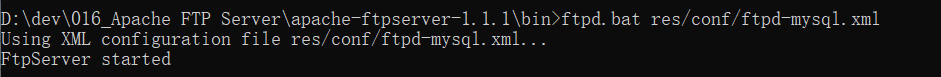

# Apache FTP Server实操
## 1 下载Apache FTP Server
https://www.apache.org/dyn/closer.lua/mina/ftpserver/1.1.1/dist/apache-ftpserver-1.1.1.zip  

## 2 FTP Server启动前提需要配置JAVA_HOME  
（略）

## 3 建表初始化用户数据  
在MySQL数据库中创建FTP_USER表。建表语句使用`res/ftp-db.sql`  
  
创建测试用户：
~~~SQL
INSERT INTO `ftpserver`.`ftp_user` (`userid`, `userpassword`, `homedirectory`, `enableflag`, `writepermission`, `idletime`, `uploadrate`, `downloadrate`, `maxloginnumber`, `maxloginperip`) VALUES ('admin', 'admin', 'D:/', '1', '1', '0', '0', '0', '0', '0');
INSERT INTO `ftpserver`.`ftp_user` (`userid`, `userpassword`, `homedirectory`, `enableflag`, `writepermission`, `idletime`, `uploadrate`, `downloadrate`, `maxloginnumber`, `maxloginperip`) VALUES ('henry', '123456', 'D:/data', '1', '0', '0', '0', '0', '0', '0');
~~~

## 4 创建ftp配置文件
copy配置文件``
注释默认的用户管理文件user.properties.
~~~xml
<file-user-manager file="./res/conf/users.properties" />
~~~
追加db-user-manager配置：  
encrypt-passwords表示密码不需要加密。  
实际只需要添加查询相关标签如：authenticate、is-admin、select-all-users、select-user即可，其他标签都是对接接口时使用。  
~~~XML
<db-user-manager encrypt-passwords="clear">
        <!-- 数据源信息，ftpserver为MySQL数据库名称，为用户名以及密码 -->
        <data-source>
            <beans:bean class="org.apache.commons.dbcp.BasicDataSource">
                <beans:property name="driverClassName" value="com.mysql.jdbc.Driver" />
                <beans:property name="url" value="jdbc:mysql://IP/db" />
                <beans:property name="username" value="USER" />
                <beans:property name="password" value="PASSWORD" />
            </beans:bean>
        </data-source>
        <insert-user>INSERT INTO FTP_USER (userid, userpassword,
            homedirectory, enableflag, writepermission, idletime, uploadrate,
            downloadrate) VALUES ('{userid}', '{userpassword}',
            '{homedirectory}',
            {enableflag}, {writepermission}, {idletime},
            {uploadrate},
            {downloadrate})
        </insert-user>
        <update-user>UPDATE FTP_USER SET
            userpassword='{userpassword}',homedirectory='{homedirectory}',enableflag={enableflag},writepermission={writepermission},idletime={idletime},uploadrate={uploadrate},downloadrate={downloadrate}
            WHERE userid='{userid}'
        </update-user>
        <delete-user>DELETE FROM FTP_USER WHERE userid = '{userid}'
        </delete-user>
        <select-user>SELECT userid, userpassword, homedirectory,
            enableflag, writepermission, idletime, uploadrate, downloadrate,
            maxloginnumber, maxloginperip FROM
            FTP_USER WHERE userid = '{userid}'
        </select-user>
        <select-all-users>
            SELECT userid FROM FTP_USER ORDER BY userid
        </select-all-users>
        <is-admin>SELECT userid FROM FTP_USER WHERE userid='{userid}'
            AND
            userid='admin'
        </is-admin>
        <authenticate>SELECT userpassword from FTP_USER WHERE
            userid='{userid}'
        </authenticate>
    </db-user-manager>
~~~

【注】由于使用Spring的beans标签，需要在xml中引用namespace：  
~~~xml
xmlns:beans="http://www.springframework.org/schema/beans"
~~~

## 5 将相关jar拷贝到common/lib目录下  
commons-dbcp-1.4.jar  
commons-pool-1.6.jar  
mysql-connector-java-5.1.27.jar  
  

## 6 启动  
执行：  
`ftpd.bat res/conf/ftpd-mysql.xml`  
  

## 7 登录验证  
由于普通用户的默认地址为D:/data  
FTP客户端配置如下：  
  

登录后，查看目录内容：  
  

实际目录下结构为：  
  

内容一致。

测试文件读取：  
  

由于普通用户的写权限关闭。
  
文件写入时报错：
  

使用admin具有写权限的用户测试文件写入：
  

