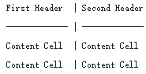
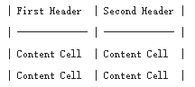

#Markdown语法
##1 换行分段
换行：行末加两个或以上个空格  
分段：两个回车  
##2 表格
语法如下：  
  
  
##3 字体
\color=#0099ff size=72 face="黑体"\
##4 菜单语法
1）菜单列表的写法：  
\[一、有利因素](#1)  
\[二、不利因素](#2)

2）需要跳转的位置处写法：  
\##\一、有利因素\  
\##\二、不利因素\   
##5 空格
空格：&nbsp；  
制表符：&nbsp；*4  

