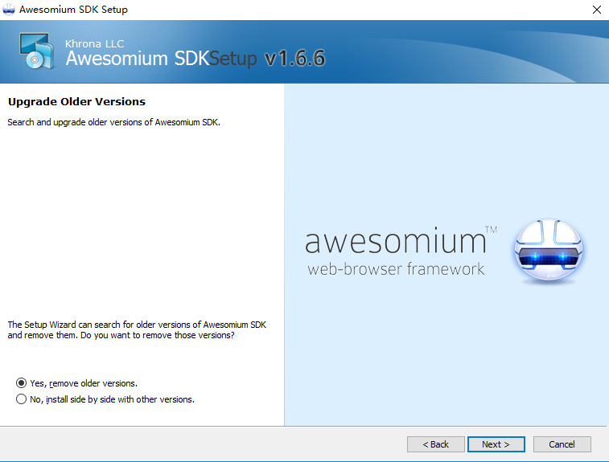

#MarkdownPad实操
##1 HTML渲染组件出错
在打开MarkdownPad时，弹出【HTML渲染组件出错】的对话框  
  
经查询可以通过下载 **awesomium_v1.6.6_sdk_win.exe** 下载地址： 
https://link.zhihu.com/?target=http%3A//markdownpad.com/download/awesomium_v1.6.6_sdk_win.exe 
安装手顺： 
 
 
 
选择典型安装【Typical】<br.>
 
安装完成！ 
 
重启MarkdownPad，渲染正常 
 
##2 MarkdownPad无法显示表格
MarkdownPad无法显示表格是由于MarkdownPad所默认的Markdown处理器是普通Markdown处理器。需要更改为Markdown扩展处理器。
在【工具】→【选项】→【Markdown】选项卡中进行设置  
  
