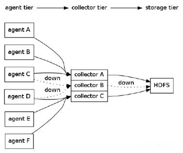

#1 scribe、chukwa、kafka、flume日志系统对比
##1.1 背景介绍
许多公司的平台每天会产生大量的日志（一般为流式数据，如，搜索引擎的pv，查询等），处理这些日志需要特定的日志系统，一般而言，这些系统需要具有以下特征：  
1. 构建应用系统和分析系统的桥梁，并将它们之间的关联解耦；  
2. 支持近实时的在线分析系统和类似于Hadoop之类的离线分析系统；  
3. 具有高可扩展性。即：当数据量增加时，可以通过增加节点进行水平扩展。  

本文从设计架构，负载均衡，可扩展性和容错性等方面对比了当今开源的日志系统，包括facebook的scribe，apache的chukwa，linkedin的kafka和cloudera的flume等。

##1.2 FaceBook的Scribe
Scribe是facebook开源的日志收集系统，在facebook内部已经得到大量的应用。它能够从各种日志源上收集日志，存储到一个中央存储系统 （可以是NFS，分布式文件系统等）上，以便于进行集中统计分析处理。它为日志的“分布式收集，统一处理”提供了一个可扩展的，高容错的方案。

它最重要的特点是容错性好。当后端的存储系统crash时，scribe会将数据写到本地磁盘上，当存储系统恢复正常后，scribe将日志重新加载到存储系统中。
  
架构：  
scribe的架构比较简单，主要包括三部分，分别为scribe agent， scribe和存储系统。  
(1) scribe agent  
scribe agent实际上是一个thrift client。 向scribe发送数据的唯一方法是使用thrift client， scribe内部定义了一个thrift接口，用户使用该接口将数据发送给server。  
(2) scribe  
scribe接收到thrift client发送过来的数据，根据配置文件，将不同topic的数据发送给不同的对象。scribe提供了各种各样的store，如 file， HDFS等，scribe可将数据加载到这些store中。  
(3) 存储系统  
存储系统实际上就是scribe中的store，当前scribe支持非常多的store，包括file（文件），buffer（双层存储，一个主储存， 一个副存储），network（另一个scribe服务器），bucket（包含多个 store，通过hash的将数据存到不同store中），null(忽略数据)，thriftfile（写到一个Thrift TFileTransport文件中）和multi（把数据同时存放到不同store中）。  
##1.3 Apache的Chukwa
chukwa是一个非常新的开源项目，由于其属于hadoop系列产品，因而使用了很多hadoop的组件（用HDFS存储，用mapreduce处理数据），它提供了很多模块以支持hadoop集群日志分析。

需求：  
(1) 灵活的，动态可控的数据源  
(2) 高性能，高可扩展的存储系统  
(3) 合适的框架，用于对收集到的大规模数据进行分析  
  
架构：  
Chukwa中主要有3种角色，分别为：adaptor，agent，collector。  
(1) Adaptor 数据源  
可封装其他数据源，如file，unix命令行工具等  
目前可用的数据源有：hadoop logs，应用程序度量数据，系统参数数据（如linux cpu使用流率）。  
(2) HDFS 存储系统  
Chukwa采用了HDFS作为存储系统。HDFS的设计初衷是支持大文件存储和小并发高速写的应用场景，而日志系统的特点恰好相反，它需支持高并发低速 率的写和大量小文件的存储。需要注意的是，直接写到HDFS上的小文件是不可见的，直到关闭文件，另外，HDFS不支持文件重新打开。  
(3) Collector和Agent  
为了克服(2)中的问题，增加了agent和collector阶段。  
Agent的作用：给adaptor提供各种服务，包括：启动和关闭adaptor，将数据通过HTTP传递给Collector；定期记录adaptor状态，以便crash后恢复。  

Collector的作用：对多个数据源发过来的数据进行合并，然后加载到HDFS中；隐藏HDFS实现的细节，如，HDFS版本更换后，只需修改collector即可。  

(4) Demux和achieving  
直接支持利用MapReduce处理数据。它内置了两个mapreduce作业，分别用于获取data和将data转化为结构化的log。存储到data store（可以是数据库或者HDFS等）中。  

##1.4 LinkedIn的Kafka
Kafka是2010年12月份开源的项目，采用scala语言编写，使用了多种效率优化机制，整体架构比较新颖（push/pull），更适合异构集群。

设计目标：  
(1) 数据在磁盘上的存取代价为O(1)  
(2) 高吞吐率，在普通的服务器上每秒也能处理几十万条消息  
(3) 分布式架构，能够对消息分区  
(4) 支持将数据并行的加载到hadoop  
  

架构：  

Kafka实际上是一个消息发布订阅系统。producer向某个topic发布消息，而consumer订阅某个topic的消息，进而一旦有新的关于 某个topic的消息，broker会传递给订阅它的所有consumer。 在kafka中，消息是按topic组织的，而每个topic又会分为多个partition，这样便于管理数据和进行负载均衡。同时，它也使用了 zookeeper进行负载均衡。  

Kafka中主要有三种角色，分别为producer，broker和consumer  
(1) Producer  
Producer的任务是向broker发送数据。Kafka提供了两种producer接口，一种是low_level接口，使用该接口会向特定的 broker的某个topic下的某个partition发送数据；另一种那个是high level接口，该接口支持同步/异步发送数据，基于zookeeper的broker自动识别和负载均衡（基于Partitioner）。  

其中，基于zookeeper的broker自动识别值得一说。producer可以通过zookeeper获取可用的broker列表，也可以在zookeeper中注册listener，该listener在以下情况下会被唤醒：  

a．添加一个broker  
b．删除一个broker  
c．注册新的topic  
d．broker注册已存在的topic  

当producer得知以上时间时，可根据需要采取一定的行动。

(2) Broker  
Broker采取了多种策略提高数据处理效率，包括sendfile和zero copy等技术。
(3) Consumer  
consumer的作用是将日志信息加载到中央存储系统上。kafka提供了两种consumer接口，一种是low level的，它维护到某一个broker的连接，并且这个连接是无状态的，即，每次从broker上pull数据时，都要告诉broker数据的偏移 量。另一种是high-level 接口，它隐藏了broker的细节，允许consumer从broker上push数据而不必关心网络拓扑结构。更重要的是，对于大部分日志系统而 言，consumer已经获取的数据信息都由broker保存，而在kafka中，由consumer自己维护所取数据信息。  

##1.5 Cloudera的Flume

Flume是cloudera于2009年7月开源的日志系统。它内置的各种组件非常齐全，用户几乎不必进行任何额外开发即可使用。

设计目标：

(1) 可靠性  
当节点出现故障时，日志能够被传送到其他节点上而不会丢失。Flume提供了三种级别的可靠性保障，从强到弱依次分别为：end-to-end（收到数据 agent首先将event写到磁盘上，当数据传送成功后，再删除；如果数据发送失败，可以重新发送。），Store on failure（这也是scribe采用的策略，当数据接收方crash时，将数据写到本地，待恢复后，继续发送），Best effort（数据发送到接收方后，不会进行确认）。  

(2) 可扩展性  
Flume采用了三层架构，分别问agent，collector和storage，每一层均可以水平扩展。其中，所有agent和collector由 master统一管理，这使得系统容易监控和维护，且master允许有多个（使用ZooKeeper进行管理和负载均衡），这就避免了单点故障问题。

(3) 可管理性  
所有agent和colletor由master统一管理，这使得系统便于维护。用户可以在master上查看各个数据源或者数据流执行情况，且可以对各 个数据源配置和动态加载。Flume提供了web 和shell script command两种形式对数据流进行管理。

(4) 功能可扩展性  
用户可以根据需要添加自己的agent，colletor或者storage。此外，Flume自带了很多组件，包括各种agent（file， syslog等），collector和storage（file，HDFS等）。  
  
架构：

正如前面提到的，Flume采用了分层架构，由三层组成，分别为agent，collector和storage。其中，agent和collector均由两部分组成：source和sink，source是数据来源，sink是数据去向。

(1) agent

agent的作用是将数据源的数据发送给collector，Flume自带了很多直接可用的数据源（source），如：

text(“filename”)：将文件filename作为数据源，按行发送

tail(“filename”)：探测filename新产生的数据，按行发送出去

fsyslogTcp(5140)：监听TCP的5140端口，并且接收到的数据发送出去

同时提供了很多sink，如：

console[("format")] ：直接将将数据显示在桌面上

text(“txtfile”)：将数据写到文件txtfile中

dfs(“dfsfile”)：将数据写到HDFS上的dfsfile文件中

syslogTcp(“host”,port)：将数据通过TCP传递给host节点

(2) collector

collector的作用是将多个agent的数据汇总后，加载到storage中。它的source和sink与agent类似。

下面例子中，agent监听TCP的5140端口接收到的数据，并发送给collector，由collector将数据加载到HDFS上。

~~~
host : syslogTcp(5140) | agentSink("localhost",35853) ;
collector : collectorSource(35853) | collectorSink("hdfs://namenode/user/flume/ ","syslog");
~~~

一个更复杂的例子如下：有6个agent，3个collector，所有collector均将数据导入HDFS中。agent A，B将数据发送给collector A，agent C，D将数据发送给collectorB，agent C，D将数据发送给collectorB。同时，为每个agent添加end-to-end可靠性保障（Flume的三种可靠性保障分别由 agentE2EChain, agentDFOChain, and agentBEChain实现），如，当collector A出现故障时，agent A和agent B会将数据分别发给collector B和collector C。

  

~~~
agentA : src | agentE2EChain("collectorA:35853","collectorB:35853");
 
agentB : src | agentE2EChain("collectorA:35853","collectorC:35853");
 
agentC : src | agentE2EChain("collectorB:35853","collectorA:35853");
 
agentD : src | agentE2EChain("collectorB:35853","collectorC:35853");
 
agentE : src | agentE2EChain("collectorC:35853","collectorA:35853");
 
agentF : src | agentE2EChain("collectorC:35853","collectorB:35853");
 
collectorA : collectorSource(35853) | collectorSink("hdfs://...","src");
 
collectorB : collectorSource(35853) | collectorSink("hdfs://...","src");
 
collectorC : collectorSource(35853) | collectorSink("hdfs://...","src");
~~~