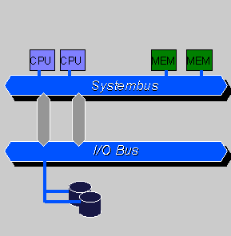
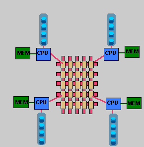

#MPP 架构数据库
MPP (Massively Parallel Processing)，大规模并行处理系统，这样的系统是由许多松耦合的处理单元组成的，要注意的是这里指的是处理单元而不是处理器。每个单元内的 CPU都有自己私有的资源，如总线，内存，硬盘等。在每个单元内都有操作系统和管理数据库的实例复本。这种结构最大的特点在于不共享资源。  

MPP架构数据库应具有的特征：  
- 任务并行执行;
- 数据分布式存储(本地化);
- 分布式计算;
- 私有资源;
- 横向扩展;
- Shared Nothing架构。

##1 新型MPP数据库的价值
**技术：**基于列存储+MPP架构的新型数据库在核心技术上跟传统数据库有巨大差别，是为面向结构化数据分析设计开发的，能够有效处理PB级别的数据量。在技术上为很多行业用户解决了数据处理性能问题。  

**用户价值：**新型数据库是运行在x-86 PC服务器之上的，可以大大降低数据处理的成本(1个数量级)。  

**未来趋势：**新型数据库将逐步与Hadoop生态系统结合混搭使用，用MPP处理PB级别的、高质量的结构化数据，同时为应用提供丰富的SQL和事务支持能力;用Hadoop实现半结构化、非结构化数据处理。这样可同时满足结构化、半结构化和非结构化数据的处理需求  

"大数据"关注的更多是用户行为、群体趋势、事件之间的相关性等，而不仅仅是过去的KPI，。这就对数据分析平台对数据的分析能力和性能提出了新的要求和挑战。  

Greenplum是一种基于postgresql的分布式数据库。其采用shared nothing架构（MPP），主机，操作系统，内存，存储都是自我控制的，不存在共享。也就是每个节点都是一个单独的数据库。节点之间的信息交互是通过节点互联网络实现。通过将数据分布到多个节点上来实现规模数据的存储，通过并行查询处理来提高查询性能。  

这个怎么感觉就像是把小数据库组织起来，联合成一个大型数据库。将数据分片，存储在每个节点上。每个节点仅查询自己的数据。所得到的结果再经过主节点处理得到最终结果。通过增加节点数目达到系统线性扩展。  

##2 SMP、NUMA、MPP系统比较
###2.1 三种架构原理
1. SMP (Symmetric Multi Processing)
对称多处理系统内有许多紧耦合多处理器，在这样的系统中，所有的CPU共享全部资源，如总线，内存和I/O系统等，操作系统或管理数据库的复本只有一个，这种系统有一个最大的特点就是共享所有资源。  
  
2. MPP (Massively Parallel Processing)
大规模并行处理系统，这样的系统是由许多松耦合的处理单元组成的，要注意的是这里指的是处理单元而不是处理器。每个单元内的CPU都有自己私有的资源，如总线，内存，硬盘等。在每个单元内都有操作系统和管理数据库的实例复本。这种结构最大的特点在于不共享资源。  
  
既然有两种结构，那它们各有什么特点呢？采用什么结构比较合适呢？通常情况下，MPP系统因为要在不同处理单元之间传送信息（请注意上图），所以它的效率要比SMP要差一点，但是这也不是绝对的，因为MPP系统不共享资源，因此对它而言，资源比SMP要多，当需要处理的事务达到一定规模时，MPP的效率要比SMP好。这就是看通信时间占用计算时间的比例而定，如果通信时间比较多，那MPP系统就不占优势了，相反，如果通信时间比较少，那MPP系统可以充分发挥资源的优势，达到高效率。当前使用的OTLP程序中，用户访问一个中心数据库，如果采用SMP系统结构，它的效率要比采用MPP结构要快得多。而MPP系统在决策支持和数据挖掘方面显示了优势，可以这样说，如果操作相互之间没有什么关系，处理单元之间需要进行的通信比较少，那采用MPP系统就要好，相反就不合适了。  
通过上面两个图我们可以看到，对于SMP来说，制约它速度的一个关键因素就是那个共享的总线，因此对于DSS程序来说，只能选择MPP，而不能选择SMP，当大型程序的处理要求大于共享总线时，总线就没有能力进行处理了，这时SMP系统就不行了。当然了，两个结构互有优缺点，如果能够将两种结合起来取长补短，当然最好了。  

3. NUMA(Non-Uniform Memory Access)
利用NUMA技术，可以把几十个CPU(甚至上百个CPU)组合在一个服务器内。NUMA多处理机模型如图所示，其访问时间随存储字的位置不同而变化。其共享存储器物理上是分布在所有处理机的本地存储器上。所有本地存储器的集合组成了全局地址空间，可被所有的处理机访问。处理机访问本地存储器是比较快的，但访问属于另一台处理机的远程存储器则比较慢，因为通过互连网络会产生附加时延  
  
NUMA服务器的基本特征是具有多个CPU模块，每个CPU模块由多个CPU(如4个)组成，并且具有独立的本地内存、I/O槽口等。
  
由于其节点之间可以通过互联模块(如称为Crossbar Switch)进行连接和信息交互，因此每个CPU可以访问整个系统的内存(这是NUMA系统与MPP系统的重要差别)。显然，访问本地内存的速度将远远高于访问远地内存(系统内其它节点的内存)的速度，这也是非一致存储访问NUMA的由来。  
由于这个特点，为了更好地发挥系统性能，开发应用程序时需要尽量减少不同CPU模块之间的信息交互。利用NUMA技术，可以较好地解决原来SMP系统的扩展问题，在一个物理服务器内可以支持上百个CPU。比较典型的NUMA服务器的例子包括HP的Superdome、SUN15K、IBMp690等。  
但NUMA技术同样有一定缺陷，由于访问远地内存的延时远远超过本地内存，因此当CPU数量增加时，系统性能无法线性增加。如HP公司发布Superdome服务器时，曾公布了它与HP其它UNIX服务器的相对性能值，结果发现，64路CPU的Superdome (NUMA结构)的相对性能值是20，而8路N4000(共享的SMP结构)的相对性能值是6.3. 从这个结果可以看到，8倍数量的CPU换来的只是3倍性能的提升

###2.2 三种体系架构之间的差异

####2.2.1 NUMA、MPP、SMP之间性能的区别

NUMA的节点互联机制是在同一个物理服务器内部实现的，当某个CPU需要进行远地内存访问时，它必须等待，这也是NUMA服务器无法实现CPU增加时性能线性扩展。

MPP的节点互联机制是在不同的SMP服务器外部通过I/O实现的，每个节点只访问本地内存和存储，节点之间的信息交互与节点本身的处理是并行进行的。因此MPP在增加节点时性能基本上可以实现线性扩展。

SMP所有的CPU资源是共享的，因此完全实现线性扩展。

####2.2.2 NUMA、MPP、SMP之间扩展的区别

NUMA理论上可以无限扩展，目前技术比较成熟的能够支持上百个CPU进行扩展。如HP的SUPERDOME。 
MPP理论上也可以实现无限扩展，目前技术比较成熟的能够支持512个节点，数千个CPU进行扩展。 
SMP扩展能力很差，目前2个到4个CPU的利用率最好，但是IBM的BOOK技术，能够将CPU扩展到8个。 
MPP是由多个SMP构成，多个SMP服务器通过一定的节点互联网络进行连接，协同工作，完成相同的任务。

####2.2.3 MPP和SMP、NUMA应用之间的区别

- MPP的优势
MPP系统不共享资源，因此对它而言，资源比SMP要多，当需要处理的事务达到一定规模时，MPP的效率要比SMP好。由于MPP系统因为要在不同处理单元之间传送信息，在通讯时间少的时候，那MPP系统可以充分发挥资源的优势，达到高效率。也就是说：操作相互之间没有什么关系，处理单元之间需要进行的通信比较少，那采用MPP系统就要好。因此，MPP系统在决策支持和数据挖掘方面显示了优势。
- SMP的优势
MPP系统因为要在不同处理单元之间传送信息，所以它的效率要比SMP要差一点。在通讯时间多的时候，那MPP系统可以充分发挥资源的优势。因此当前使用的OLTP程序中，用户访问一个中心数据库，如果采用SMP系统结构，它的效率要比采用MPP结构要快得多。
- NUMA架构的优势
NUMA架构来看，它可以在一个物理服务器内集成许多CPU，使系统具有较高的事务处理能力，由于远地内存访问时延远长于本地内存访问，因此需要尽量减少不同CPU模块之间的数据交互。显然，NUMA架构更适用于OLTP事务处理环境，当用于数据仓库环境时，由于大量复杂的数据处理必然导致大量的数据交互，将使CPU的利用率大大降低。

###2.3 总结

传统的多核运算是使用SMP(Symmetric Multi-Processor )模式：将多个处理器与一个集中的存储器和I/O总线相连。所有处理器只能访问同一个物理存储器，因此SMP系统有时也被称为一致存储器访问(UMA)结构体系，一致性意指无论在什么时候，处理器只能为内存的每个数据保持或共享唯一一个数值。很显然，SMP的缺点是可伸缩性有限，因为在存储器和I/O接口达到饱和的时候，增加处理器并不能获得更高的性能，与之相对应的有AMP架构，不同核之间有主从关系，如一个核控制另外一个核的业务，可以理解为多核系统中控制平面和数据平面。

NUMA模式是一种分布式存储器访问方式，处理器可以同时访问不同的存储器地址，大幅度提高并行性。 NUMA模式下，处理器被划分成多个”节点”（node）， 每个节点被分配有的本地存储器空间。 所有节点中的处理器都可以访问全部的系统物理存储器，但是访问本节点内的存储器所需要的时间，比访问某些远程节点内的存储器所花的时间要少得多。

NUMA 的主要优点是伸缩性。NUMA 体系结构在设计上已超越了 SMP 体系结构在伸缩性上的限制。通过 SMP，所有的内存访问都传递到相同的共享内存总线。这种方式非常适用于 CPU 数量相对较少的情况，但不适用于具有几十个甚至几百个 CPU 的情况，因为这些 CPU 会相互竞争对共享内存总线的访问。NUMA 通过限制任何一条内存总线上的 CPU 数量并依靠高速互连来连接各个节点，从而缓解了这些瓶颈状况。

###2.4 名词
|概念|描述|
|---|---|
|SMP|称为共享存储型多处理机(Shared Memory mulptiProcessors), 也称为对称型多处理机（Symmetry MultiProcessors)。物理存储器被所有处理机均匀共享。所有处理机对所有存储字具有相同的存取时间，这就是为什么称它为均匀存储器存取的原因。每台处理机可以有私用高速缓存,外围设备也以一定形式共享。|
|UMA|称为均匀存储器存取（Uniform-Memory-Access)|
|NUMA|非均匀存储器存取（Nonuniform-Memory-Access）其访问时间随存储字的位置不同而变化。其共享存储器物理上是分布在所有处理机的本地存储器上。所有本地存储器的集合组成了全局地址空间，可被所有的处理机访问。处理机访问本地存储器是比较快的，但访问属于另一台处理机的远程存储器则比较慢，因为通过互连网络会产生附加时延。|
|COMA|只用高速缓存的存储器结构（Cache-Only Memory Architecture）一种只用高速缓存的多处理机。COMA模型是NUMA机的一种特例，只是将后者中分布主存储器换成了高速缓存, 在每个处理机结点上没有存储器层次结构,全部高速缓冲存储器组成了全局地址空间。远程高速缓存访问则借助于分布高速缓存目录进行。是CC-NUMA体系结构的竞争者，两者拥有相同的目标，但实现方式不同。COMA节点不对内存部件进行分布，也不通过互连设备使整个系统保持一致性。COMA节点没有内存，只在每个Quad中配置大容量的高速缓存|
|ccNUMA	|高速缓存相关的非一致性内存访问（CacheCoherentNon-UniformMemoryAccess）在CC-NUMA系统中，分布式内存相连接形成单一内存，内存之间没有页面复制或数据复制，也没有软件消息传送。CC-NUMA只有一个内存映象，存储部件利用铜缆和某些智能硬件进行物理连接。CacheCoherent是指不需要软件来保持多个数据拷贝的一致性，也不需要软件来实现操作系统与应用系统的数据传输。如同在SMP模式中一样，单一操作系统和多个处理器完全在硬件级实现管理|

##MPP的缺点
1. 扩展性： 
为什么 MPP DB 扩展性不好？ 
MPP DB 还是基于原 DB 扩展而来， DB 里面天然追求一致性（ Consistency ），必然带来分区容错性较差。集群规模变得太大，业务数据太多时， MPP DB 的元数据管理就完全是一个灾难。元数据巨大无比，一旦出错很难恢复，动不动导致毁库。 
所以 MPP DB 要在扩展性上有质的提示，要对元数据，以及数据存储有架构上的突破，降低对一致性的要求，这样扩展性才能提升，否则的话很难相信一个 MPP DB 数据库是可以容易扩展的。 
这和 Hadoop 动不动 4,5 千个节点一个节点集群简直不在一个数量级上。

2. 并发的支持： 
一个查询系统，设计出来就是提供人用的，所以能支持的同时并发越高越好。MPP DB 核心原理是一 个大的查询通过分析为一一个子查询，分布到底层的执行，最后再合并结果，说白了就是通过多线程并发来暴力 SCAN 来实现高速。 这种暴力SCAN的方法，对单个查询来说，动用了整个系统的能力，单个查询比较快，但同时带来用力过猛的问题，整个系统能支持的并发必然不高，从目前实际使用的经验来说，也就支持50～100的并发能力。 
当前Hbase/IMPALA应对复杂查询时，也是通过全盘SCAN的方法来实现的，这种场景下，硬盘数量越多越好，转速越快越好。hbase为什么号称支持上千并发，这也是在特定的场景下（查询时带用户标示，即带row key)才能实现的，复杂查询场景下，什么系统都歇菜。 
所以MPP DB应用场景已经非常明显了，适合小集群（100以内），低并发的（50左右）的场景。MPP DB未来是不是趋势，我不知道，但是至少目前来看，用MPP DB来应对大数据的实时分析系统是非常吃力的

