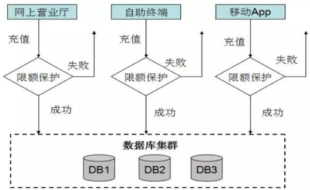
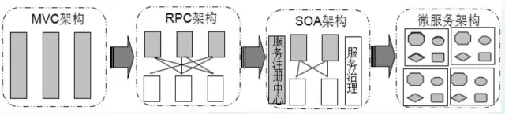
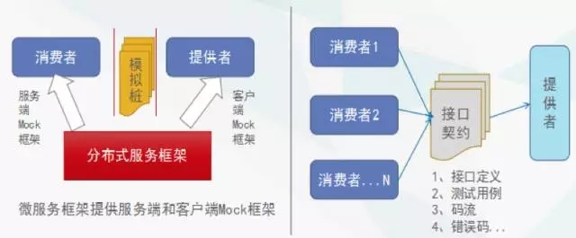
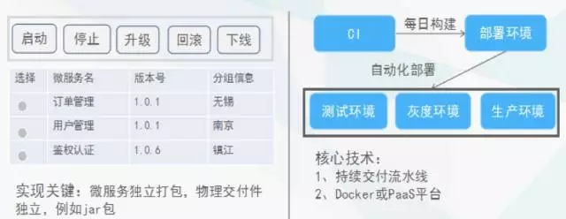
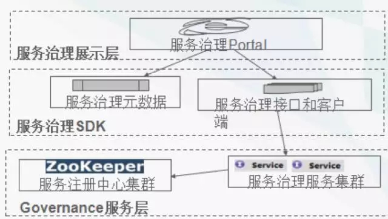
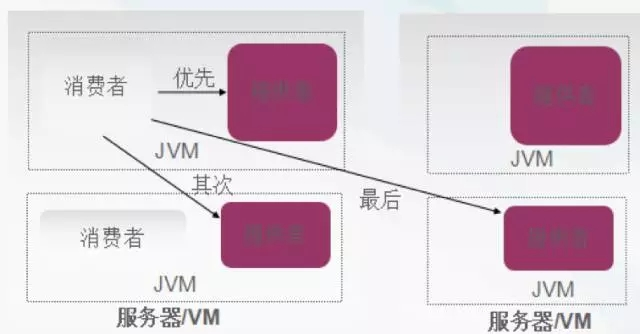
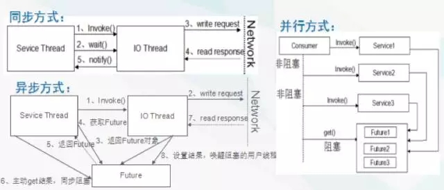
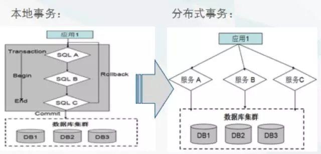
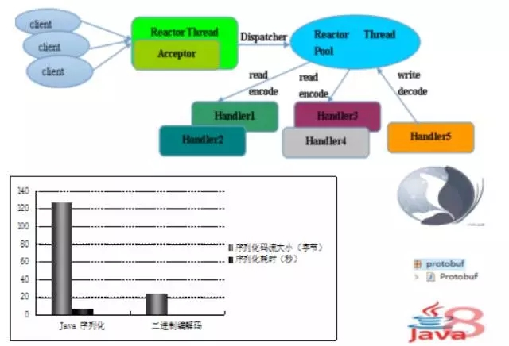

#华为内部如何实施微服务架构？基本就靠这5大原则
*2016-08-23 李林锋 聊聊架构*  
随着业务的发展，代码量的膨胀和团队成员的增加，传统单体式架构的弊端越来越凸显，严重制约了业务的快速创新和敏捷交付。为了解决传统单体架构面临的挑战，先后演进出了SOA服务化架构、RPC框架、分布式服务框架，最后就是当今非常流行的微服务架构。

微服务化架构并非银弹，它的实施本身就会面临很多陷阱和挑战，涉及到设计、开发、测试、部署、运行和运维等各个方面，一旦使用不当，则会导致整个微服务架构改造的效果大打折扣，甚至失败。

本文从微服务的生命周期全过程，阐述微服务架构的改造如何实施，以及如何避开各种陷阱，提升实施效率。 **注：本文内容是华为近几年来的服务化经验分享实录，如果你看的不酸爽，可以直接调到文末报名我们的线下活动，9月华为的同学会做一个线下的workshop，限额80人！**

在实施微服务架构改造之前，我们的产品线遇到一个很大挑战，就是需求的交付周期越来越短，采用的传统MVC单体架构越来越难满足特性快速交付和上线的需求。传统的电信项目，团队规模往往都非常大，甚至会跨地域。跨团队、跨地域的分布式协同开发，代码的重用和共享是个难题。

例如我们的支付功能需要新增一个限额保护， 短短十几行代码的一个小需求，评估之后竟然需要9个星期才能上线。原因就是限额保护功能需要同时在9个不同的功能模块中修改， 新增900多个测试用例用来做全量的回归测试，示例如下：
  

通过对已有的MVC单体架构进行分析，我们发现主要存在如下几个问题：

- **研发成本高：**代码重复率高，需求变更困难，无法满足新业务快速上线和敏捷交付。
- **测试、部署成本高：**业务运行在一个进程中，因此系统中任何程序的改变，都需要对整个系统重新测试并部署。
- **可伸缩性差：**水平扩展只能基于整个系统进行扩展，无法针对某一个功能模块按需扩展。
- **可靠性差：**某个应用BUG，例如死循环、OOM等，会导致整个进程宕机，影响其它合设的应用。

代码维护成本高：本地代码在不断的迭代和变更，最后形成了一个个垂直的功能孤岛，只有原来的开发者才理解接口调用关系和功能需求，新加入人员或者团队其它人员很难理解和维护这些代码。

依赖关系无法有效管理：服务间依赖关系变得错踪复杂，甚至分不清哪个应用要在哪个应用之前启动，架构师都不能完整的描述应用的架构关系。

以上问题的应对策略，就是服务化。

首先，需要对业务进行拆分。当业务量大了以后，特别是当不同的功能耦合在一起的时候，任何一个地方的改动都是非常困难的，必须对业务进行拆分，拆分的策略有两种：

- **横向拆分。**按照不同的业务域进行拆分，例如订单、商品、库存、号卡资源等。形成独立的业务领域微服务集群。
- **纵向拆分。**把一个业务功能里的不同模块或者组件进行拆分。例如把公共组件拆分成独立的原子服务，下沉到底层，形成相对独立的原子服务层。这样一纵一横，就可以实现业务的服务化拆分。

其次，要做好微服务的分层：梳理和抽取核心应用、公共应用，作为独立的服务下沉到核心和公共能力层，逐渐形成稳定的服务中心，使前端应用能更快速的响应多变的市场需求。

完成服务的拆分和分层工作之后，就会涉及到分布式的部署和调用。如何透明化、高效的发现服务，需要一个服务注册中心，通过服务化和订阅、发布机制对应用调用关系解耦，支持服务的自动注册和发现。

##服务化架构的演进历史
在实施微服务架构之前，我们一起回顾下服务化架构的演进历史。   
  
**MVC**
MVC架构大部分人都用过，它主要用来解决前后端、界面、控制逻辑和业务逻辑分层问题。比较流行的技术堆栈就是Spring + Struts + iBatis（Hibernate）+ Tomcat（JBoss）。

**RPC**
随着业务特别是互联网的发展，业务规模的扩大，模块化逐步成为一种趋势，此时解决模块之间远程调用的RPC框架应运而生。RPC需要解决模块之间跨进程通信的问题，不同的团队开发不同的模块，通过一个RPC框架实现远程调用，RPC框架帮业务把通信细节给屏蔽掉，但是RPC框架也有自身的缺点。

RPC本身不负责服务化，例如：服务的自动发现不管、服务的应用和发布不管、服务的运维和治理也不管。没有透明化、服务化的能力，对整个应用层的侵入还是比较深的。

**SOA**
SOA服务化架构，企业级资产重用和异构系统间的集成对接，SOA架构的现状：在传统企业IT领域，主要是解决异构系统之间的互通和粗粒度的标准化（WebService）。互联网领域，提供一套高效支撑应用快速开发迭代的服务化架构。例如各个互联网公司自研或者开源的分布式服务框架。

**微服务架构**
首先看一下微服务架构的定义：微服务（MSA）是一种架构风格，旨在通过将功能分解到各个离散的服务中以实现对解决方案的解耦。它有如下几个特征：

- 小，且只干一件事情。
- 独立部署和生命周期管理。
- 异构性
- 轻量级通信，RPC或者Restful。

##微服务架构的拆分原则
微服务架构的实施过程中，首先遇到的最大的难题，就是它的拆分原则。

微服务拆分原则：**围绕业务功能进行垂直和水平拆分。大小粒度是难点，也是团队争论的焦点。**

**不好的实践**
- 以代码量作为衡量标准，例如500行以内。  
- 拆分的粒度越小越好，例如以单个资源的操作粒度为划分原则。  

**建议的原则**
- 功能完整性、职责单一性。
- 粒度适中，团队可接受。
- 迭代演进，非一蹴而就。
- API的版本兼容性优先考虑。

代码量多少不能作为衡量微服务划分是否合理的原则，因为我们知道同样一个服务，功能本身的复杂性不同，代码量也不同。还有一点需要重点强调，在项目刚开始的时候，不要期望微服务的划分一蹴而就。

微服务架构的演进，应该是一个**循序渐进**的过程。在一个公司、一个项目组，它也需要一个循序渐进的演进过程。一开始划不好，没有关系。当演进到一个阶段时，微服务的部署、测试和运维等成本都非常低的时候，这对于你的团队来说就是一个好的微服务。

##微服务架构的开发原则
微服务的开发还会面临依赖滞后的问题。例如：A要做一个身份证号码校验，依赖服务提供者B。由于B把身份证号码校验服务的开发优先级排的比较低，无法满足A的交付时间点。A会面临要么等待，要么自己实现一个身份证号码校验功能。

以前单体架构的时候，大家需要什么，往往喜欢自己写什么，这其实是没有太严重的依赖问题。但是到了微服务时代，**微服务是一个团队或者一个小组提供的，**这个时候一定没有办法在某一个时刻同时把所有的服务都提供出来，“需求实现滞后”是必然存在的。

一个好的实践策略就是**接口先行，语言中立，**服务提供者和消费者解耦，并行开发，提升产能。无论有多少个服务，首先需要把接口识别和定义出来，然后双方基于接口进行契约驱动开发，利用Mock服务提供者和消费者，互相解耦，并行开发，实现依赖解耦。

采用契约驱动开发，如果需求不稳定或者经常变化，就会面临一个接口契约频繁变更的问题。对于服务提供者，不能因为担心接口变更而迟迟不对外提供接口，对于消费者要拥抱变更，而不是抱怨和抵触。要解决这个问题，一种比较好的实践就是**管理 + 技术**双管齐下：

- 允许接口变更，但是对变更的频度要做严格管控。
- 提供全在线的API文档服务（例如Swagger UI），将离线的API文档转成全在线、互动式的API文档服务。
- API变更的主动通知机制，要让所有消费该API的消费者能够及时感知到API的变更。
- 契约驱动测试，用于对兼容性做回归测试。

##微服务架构的测试原则
微服务开发完成之后需要对其进行测试。微服务的测试包括单元测试、接口测试、集成测试和行为测试等，其中最重要的就是契约测试：  
  
利用微服务框架提供的Mock机制，可以分别生成模拟消费者的客户端测试桩和提供者的服务端测试桩，双方可以基于Mock测试桩对微服务的接口契约进行测试，双方都不需要等待对方功能代码开发完成，实现了并行开发和测试，提高了微服务的构建效率。基于接口的契约测试还能快速的发现不兼容的接口变更，例如修改字段类型、删除字段等。  

##微服务架构的部署原则
测试完成之后，需要对微服务进行自动化部署。微服务的部署原则：**独立部署和生命周期管理、基础设施自动化**。需要有一套类似于CI/CD的流水线来做基础设施自动化，具体可以参考Netflix开源的微服务持续交付流水线Spinnaker：
  
最后一起看下微服务的运行容器：微部署可以部署在Dorker容器、PaaS平台（VM）或者物理机上。使用Docker部署微服务会带来很多优先：

- 一致的环境，线上线下环境一致。
- 避免对特定云基础设施提供商的依赖。
- 降低运维团队负担。
- 高性能接近裸机性能。
- 多租户。

相比于传统的物理机部署，微服务可以由PaaS平台实现微服务自动化部署和生命周期管理。除了部署和运维自动化，微服务云化之后还可以充分享受到更灵活的资源调度：

- 云的弹性和敏捷。
- 云的动态性和资源隔离。

##微服务架构的治理原则
微服务部署上线之后，最重要的工作就是服务治理。微服务治理原则：线上治理、实时动态生效。

微服务常用的治理策略：

- 流量控制：动态、静态流控制。
- 服务降级。
- 超时控制。
- 优先级调度。
- 流量迁移。
- 调用链跟踪和分析。
- 服务路由。
- 服务上线审批、下线通知。
- SLA策略控制。

微服务治理模型如下所示：
  
最上层是为服务治理的UI界面，提供在线、配置化的治理界面供运维人员使用。SDK层是提供了微服务治理的各种接口，供服务治理Portal调用。最下面的就是被治理的微服务集群，集群各节点会监听服务治理的操作去做实时刷新。例如：修改了流控阈值之后，服务治理服务会把新的流控的阈值刷到服务注册中心，服务提供者和消费者监听到阈值变更之后，获取新的阈值并刷新到内存中，实现实时生效。由于目前服务治理策略数据量不是特别大，所以可以将服务治理的数据放到服务注册中心（例如etcd/ZooKeeper），没有必要再单独做一套。  

##微服务最佳实践 
介绍完微服务实施之后，下面我们一起学习下微服务的最佳实践。

**服务路由：**本地短路策略。关键技术点：优先调用本JVM内部服务提供者，其次是相同主机或者VM的，最后是跨网络调用。通过本地短路，可以避免远程调用的网络开销，降低服务调用时延、提升成功率。原理如下所示：  
  

**服务调用方式：**同步调用、异步调用、并行调用。一次服务调用，通常就意味着会挂一个服务调用线程。采用异步调用，可以避免线程阻塞，提升系统的吞吐量和可靠性。但是在实际项目中异步调用也有一些缺点，导致使用不是特别广泛：  

- 需要写异步回调逻辑，与传统的接口调用使用方式不一致，开发难度大一些。
- 一些场景下需要缓存上下文信息，引入可靠性问题。

并行调用适用于多个服务调用没有上下文依赖，逻辑上可以并行处理，类似JDK的Fork/Join, 并行服务调用涉及到同步转异步、异步转同步、结果汇聚等，技术实现难度较大，目前很多服务框架并不支持。采用并行服务调用，可以把传统串行的服务调用优化成并行处理，能够极大的缩短服务调用时延。三种服务调用方式的原理图如下：  
  
微服务故障隔离：线程级、进程级、容器级、VM级、物理机级等。关键技术点：

- 支持服务部署到不同线程/线程池中。
- 核心服务和非核心服务隔离部署。
- 为了防止线程膨胀，支持共享和独占两种线程池策略。

  

谈到分布式，就绕不开事务一致性问题：大部分业务可以通过最终一致性来解决，极少部分需要采用强一致性。  

  

具体的策略如下：

- 最终一致性，可以基于消息中间件实现。
- 强一致性，使用TCC框架。服务框架本身不会直接提供“分布式事务”，往往根据实际需要迁入分布式事务框架来支持分布式事务。

微服务的性能三要素：

- I/O模型，这个通常会选用非堵塞的，Java里面可能用java原生的。 
- 线程调度模型。
- 序列化方式。

公司内部服务化，对性能要求较高的场景，建议使用异步非阻塞I/O（Netty） + 二进制序列化（Thrift压缩二进制等） + Reactor线程调度模型。  

  

最后我们一起看下微服务的接口兼容性原则：技术保障、管理协同。

- 制定并严格执行《微服务前向兼容性规范》，避免发生不兼容修改或者私自修改不通知周边的情况。
- 接口兼容性技术保障：例如Thrift的IDL，支持新增、修改和删除字段、字段定义位置无关性，码流支持乱序等。
- 持续交付流水线的每日构建和契约化驱动测试，能够快速识别和发现不兼容。

##作者介绍
李林锋，2007年毕业于东北大学，2008年加入华为，从事电信软件的架构设计和开发。8年Java NIO通信框架、网关平台和中间件设计和开发经验，精通Java NIO、Netty和Mina等NIO通信框架，《Netty权威指南》作者，目前从事云平台相关的架构设计和开发。

