#QQ亿级日活跃业务后台核心技术揭秘
*声明：本篇文章来自于腾讯SNG和msup共同举办的技术开放日后台专场出品人傅鸿城的分享，由壹佰案例整理原创首发，转载或节选内容前需获授权。 
嘉宾：傅鸿城，腾讯专家工程师、QQ音乐技术总监。 
责编：钱曙光，关注架构和算法领域，寻求报道或者投稿请发邮件qianshg@csdn.net，另有「CSDN 高级架构师群」，内有诸多知名互联网公司的大牛架构师，欢迎架构师加微信qshuguang2008申请入群，备注姓名+公司+职位。*  

[TOC]

##引言
作为本次技术开放日后台架构专场的出品人我今天给大家带来《构造高可靠海量用户服务-SNG数亿级日活跃业务后台核心技术揭秘》，一起探讨怎么**从可用性的维度提升海量服务的可靠性及海量服务的故障处理方式**，包括：

1. SNG后台架构的概览；
1. 面向海量服务的设计原则。腾讯海量服务的后台设计一般通用的解决方案是什么，包括如何提升海量服务的高可用性，如何从架构层、产品层、运维层提升服务的合理性；
1. 后台服务故障解决思路。

##SNG业务情况

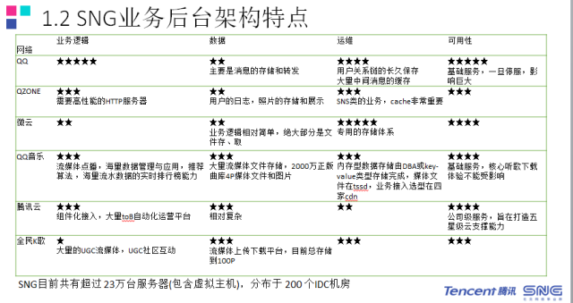  
SNG是腾讯基于社交的业务群，包括QQ、QZone、QQ音乐、腾讯云、K歌、企鹅MV、全民影帝、天天P图等众多业务。根据SNG后台架构从业务逻辑、数据层面、运维包括整个可用性方面的星级评定：

- QQ是腾讯持续了16年的业务，它的业务非常复杂，从通讯角度主要是消息存储和转发，QQ团队致力于打造一个永不宕机的服务。
- QZone一直是中国社交产品的领航者，是腾讯第一个博士Ross总在负责的业务，前端需要高性能的接入服务器，它的移动端通过框架WNS逐渐开放到腾讯云上，第三方开发商也可以用到 QZone高性能的基础框架。
- QQ音乐主要涉及流媒体点播、MV体系、海量正版知识库建设等，目前已经DAU对外我们已经宣布过亿，是国内人气最旺的领先互联网音乐平台。
- 腾讯云有着腾讯最优秀的海量服务解决能力，给各种2B运营商提供运营化平台，可以节省创业公司特别是中小型初创公司大量研发成本，在做的应该有不少是创业者，欢迎来用腾讯云产品。
- 全民K歌，两年前Ross总从空间过来兼任数字音乐部后开始启动团队做的，在推出不到两年的时间目前注册用户已远超竞品，在业务逻辑方面主要涉及大量的UGC流媒体上传存储和分发、feeds管理和互动、知识库管理等，大家没安装的可以回去尽快安装一个，里面也有优质的用户在唱歌。  

##如何定义可用性
从大家都熟知的案例入手，12306刚上线的时候经常会出现挂机的情况然后显示一条公告“正在进行故障维修”，特别是春节、节假日等抢票高峰期，严重影响用户的使用。

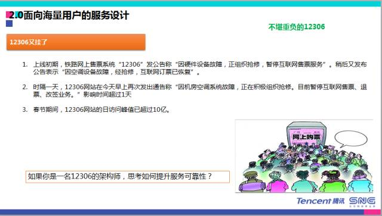  

作为互联网架构师，要怎么提升12306的可用性？故障明显影响可用性的指标，那么到底怎样定义大型互联网服务的可用性？怎样定义一个合理的团队可用性能指标？如何提升可用性？

###1. 怎样定义大型互联网服务的可用性？
可用性是系统或服务的健壮性和可靠性。每个服务包括QQ、QZone发生故障我们都会评估，是一级故障还是二级故障还是三级故障。 
在业务场景里，最核心的是用户价值的体现，我们把可用性更合理定义为：

P=（总用户价值-因事故损失的用户价值）/总用户价值*100%

###2. 怎样定义可用性指标？
无论是用QQ、QQ音乐还是QQ空间，如果中断1分钟，用户自查问题；中断5分钟以上用户开始有疑问；中断30分钟的时候论坛等地方开始有投诉出现，而中断数个小时的时候，用户有可能会放弃这个软件投奔竞品。  

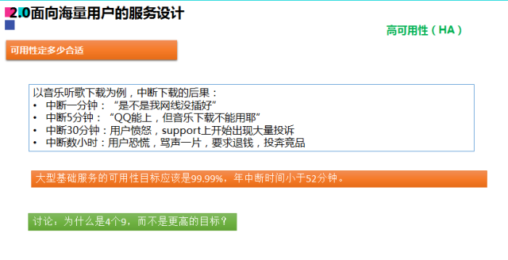  

对于腾讯而言，后台服务可用性都是四个九，四个九转化为时间就要求一年内的故障时间不能超过52分钟。有人会问为什么是四个九而不是五个九？为什么不越高越好？

直接原因是成本。我们做服务从刚上线保证两个九；之后不断优化、架构调整，比如服务器做容灾部署、做双中心，从两个九提升到三个九；又投入大量的研发精力和研发人员从三个九提升到四个九，而要达到五个九需要增加几个数量级的投入。在通往五个九的过程中，除了架构设计的合理性，还依赖于整个电信运营商的专线带宽、机房设备，这些都会换算到系统故障率里，怎么预防也需要投入很多精力。所以我们目前是维持在四个九。

而在我们公司内部，有时发生了专线故障，例如有些业务的故障率非常高、有大量投诉，那么这些业务后台架构自身肯定存在问题，包括整体系统架构、前后台的系统架构都是有问题的。

###3. 谈怎么做之前，先说说估算
我们在评审一个架构师的时候很看重他的系统架构，可能45分钟的评审时间有一半都在讨论这个系统架构的合理性是什么、为什么要这么设计、有没有一些演进的历史和背景。

系统架构对于架构师来说是非常重要的，作为一个架构师，要能够概要且具体地画出系统架构、说出系统架构，对自己的系统架构的了解程度也会体现出你对整个业务的把控能力。

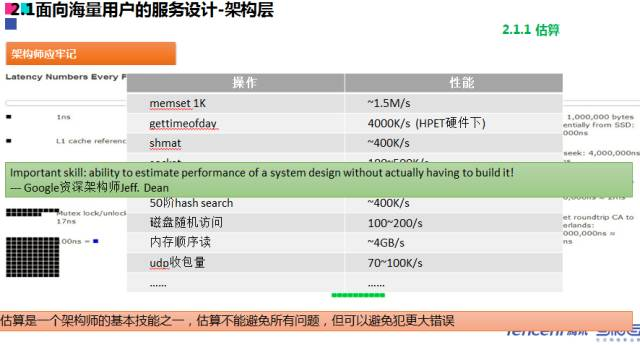   

架构师的基本能力其实是估算的能力。我之前经常会问一些来参加通**道答辩的同事，他们会讲：“我做这个系统的并发量是每秒1万笔”，问他怎么得出来的，他说是压力测试。我们认为工程师有能力通过压力测试测试出来并了解系统最大的并发能力，但这不是一个架构师的能力。**

一个架构师在系统没有上线时就应该可以预测服务的最高并发量，而不是通过系统测试。Google的首席架构师也说过，其实一个好的系统架构师不是通过测试来得知系统能力，而是通过估算。这是架构师的基本技能，可能没法避免所有的错误，但是他可以避免大的错误。

##面向海量用户的服务设计：架构层
以过往数据举例，某天有10亿访问量，而每天都有86400秒，我估算成10万秒，可以换算得到每秒的平均访问是差不多1万，再换算成高峰区的并发量，是平均浏览量的2-3倍，那么高峰时并发量大约是2-3万每秒。

架构师要有这种意识，你怎么把业务运营指标抽象化成每个技术细节，这也是我前文提到的架构师要能够对很多运营数据了如指掌。

###1. 代码级优化
做到了如指掌首先要对每个颗粒度的数据有足够的了解，能够从系统架构和技术显性估算出来业务的数据，再回归到本身，这就肯定和代码相关。

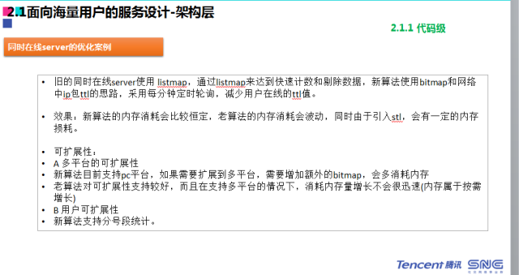  
我们基础数据服务组长haifeng刚入职没多久的时候就用新的技术组件对代码进行优化，提升服务的高可用性。他在没上线前就可以预测到优化将带来多少在线流量变化和业务量增加情况下减少的设备数，在不变或者提升用户体验的情况下来做成本和带宽的优化及技术的优化。

代码是支撑整个海量服务的基础。我们在招聘时会看你是一个超级程序员还是普通程序员，这个从代码方面就可以看出来。如果是经验非常丰富或者不断追求进步的架构师，就会不断的问自己写代码有没有瓶颈或者优化空间。

腾讯也有程序员只是停留在被安排的任务完成，没有思考如何更好的完成，而有的程序员在完成之后还要花很多时间不断推行优化，甚至发现有可能存在的内存泄露或者漏洞，前者只是完成安排给自己的任务，而后者在不断思考，往往有超越预期的表现。

要成长为架构师，就要不断思考你所服务的产品里有多少耗内存、有多少有瓶颈或优化空间。比如如何加速TCP、TCP2.0有什么昕的特性，这是作为一个架构师要不断给自己思考和反思的点，这是提升整个海量服务的基础。

##2. 系统设计级优化
架构师除了要推动项目组不断优化代码，同时也要关注系统设计的合理性。以用户场景举例，进入QQ音乐之后，用户会收藏自己的歌单，在外面看来比较简单的系统结构，但蕴含着很复杂的技术逻辑。

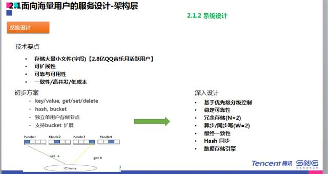  

这些技术逻辑是为了保证高可用的情况下，各个模块能独立化部署，能够很好的做服务的升级、扩容。技术要点是存储，做为架构师在提到做一些个体的收藏时，就要从技术的角度拆分成可量化和可理解的指标，包括存储和大量的小份文件、包括2.8亿的用户怎么存储，这些问题肯定要列出来；还要思考怎么可拓展，以后不止是收藏歌曲，还可以收藏专辑、歌单、专题等等；还有可用性，深层次思考后台要用什么方式进行部署以保证数据的可靠性、一致性。这些都是做任务分解和拆解时需要有的思考。

深度设计要基于优先级分级控制，比如我们用户分PC客户端、web、Android、iOS等，用户在web收藏一首歌就会刷新页面或者离开页面，服务器就需要实时写入,而pc或手机客户端可以给一个数据到本地，写入本地记载，服务器处理不那么实时处理，这对我们五千万在线的高峰是有帮助的，我们可以允许一定的存储冗余。

这就是基于优先级的快慢处理处理方案，比如客户端方面，我们可以慢处理，后台只要发送给服务器端，服务器端告诉前端收藏成功，可能还没有成功，服务器端的处理程序会写入消息队列里面，由另外的进程再进一步处理，而web发送过来的请求就会采用实时处理的方式。

一谈到服务刚上线，可能有大系统对服务做推广，这时候映射到代码层级，你可能每个代码优化提升1毫秒，这对于整个高并发来说就是非常可观的一笔数据。每个用户处理时间少1毫秒，1000个用户服务处理就可以减少1秒。所以在整个互联网后台开发里面，每个代码细节都非常重要，当然还有存储一致性。

###3. 柔性服务思维
从系统层面来说，你不只是做系统，而是在做服务。做服务我们也有很多服务的思维，比如说你怎样保障系统不会由于某个故障马上让前端受影响，我们的思维叫逻辑性服务的思维。

就这几类的故障来说，比如硬件方面、网络层面、还有代码层面都会有很多故障，如果没有这种逻辑性服务，可能会影响80%以上的用户，这是我们所不能接受的。

腾讯的每个后台CGI自动化测试标准是1秒，从用户请求到返回操作的时间如果大于1秒就不达标。为了使得每个CGI都尽可能达标，我们会采取很多策略，比如上传很多类型的CGI，就会有很多思维要思考：后台有没有雪崩，思考的方式包括识别关键路径和非关键路径。

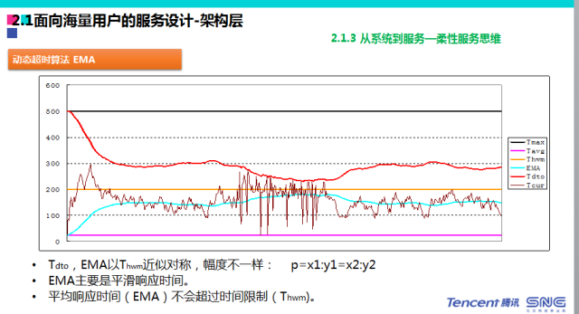

**在腾讯的很多应用，引入了类似于股票EMI的算法，就是请求预期；**当股票价格很低的时候，你的预期空间很大，股价很高的时候，你的预期很低。比如CGI访问服务器，如果访问都在10毫秒以内，那么timeout超时时间可以设置得很长。如果返回时间已经到100毫秒、1秒，甚至更长时间，这时候就是timeout超时要设置尽可能短，这是防雪崩的措施之一，对后端能起到有效的保护。

有些业务是不能接受有损的，比如银行的交易或者支付购买；但是有些可以，比如QQ登陆到主页的信息遇到服务器故障或是看会员级别时会员的服务器挂掉，这个时候可以快速返回，这是可以接受有损服务的场景。

  

**怎么识别关键路径和非关键路径？**腾讯一切以用户价值为核心，做关键路径和识别的时候，通常要看这个点对用户是不是最关键的。比如登陆一个客户端进来，显示的用户信息哪些最重要？很多业务场景就可以识别出来哪些是关键路径，哪些是非关键路径。

QQ空间也有很多这样的案例，比如在出现机房故障的时候，可以设置80%的流量可用、50%的流量可用，也可以设置对黄钻客户优先可用的策略。系统出现故障的时候，我们也要有应急策略。我们也会有些容灾的策略，会分级别，根据网络故障级别进行容灾的控制。

###4.负载均衡
腾讯的很多服务是基于LVS的主网结构开展的。腾讯有一个GSLB，这是我们全级的负载均衡系统，我们每个域名都会经过GSLB和LVS。比如你是上海电信的用户，在整个过程中都会经历腾讯前期负载控制器，会找到然后返回这个IDC。

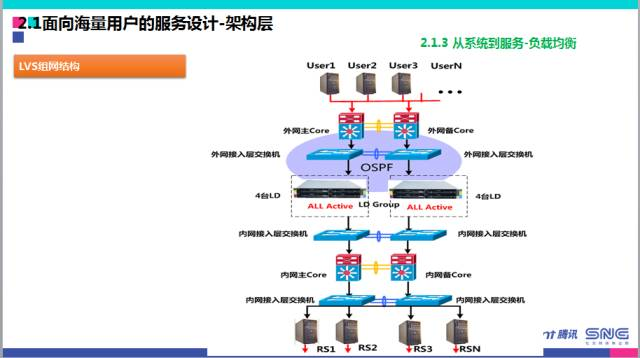  

这个工作原理基于腾讯本身是海量服务的互联网公司，我们做了大量的测试，测试结果是它可以达到最有效的调度结果，给出最优的调度结果，包括IDC的各类故障，它会提前预知。部署的模块最好是独立化部署。

##面向海量用户的服务设计：运维层
如果系统缺少监控就不是好的系统，在SNG包括腾讯各个研发团队非常重视这块，你对这个系统的每个环节、每个模块都要一切尽在掌握，想做到这一点很重要的是你整个模块的系统监控。

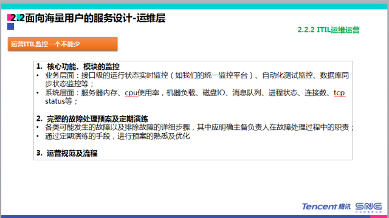  

腾讯有大量的网管平台，每台设备当前的CPU状况、网络的出口、上行下行流量，每个都会有很详细的配置，这也是辅助你做到一致性的服务。还有安全性，比如游戏币购买、会员开通关闭等，可能平时的消息发送要防止被别人窜入或者消息外泄，要注意很多问题，我认为系统监控是整个后台开发非常基础的方面。

##面向海量用户的服务设计：产品层
产品策略，我现在负责我们部门的基础数据中心，有些和搜索、曲库产品等相关的事情，从整个打造海量服务来看良好的产品设计环节是不可或缺的环节。

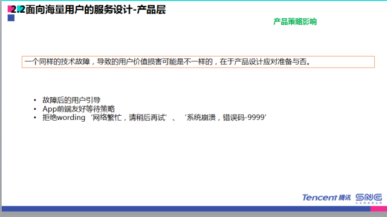

当故障的时候，我们之前有些故障的提示是很讨厌的，例如网络繁忙、系统崩溃、IE可能中毒类似的提示是非常不友好的，是需要摈弃的产品设计。即便系统真的要挂掉也不要闭上眼睛，给到用户足够放心友好的提示，这个是会在你整个技术故障的时候对用户是最大的心理安慰。

##后台故障解决思路
从后台故障解决思路来说，当你去负责后台系统的时候，因为系统主要是在线上运营的，总会有各种故障，你怎么发现这些问题呢？

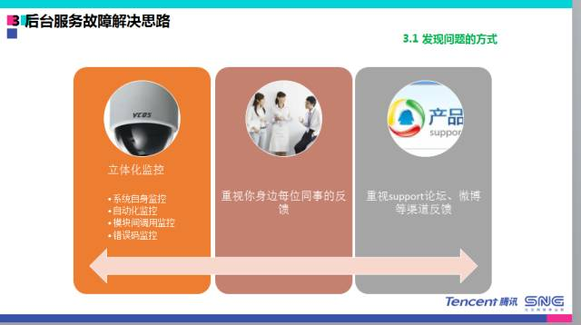  

监控非常重要，系统化监控、自动化监控，所谓自动化监控是除用户外，还有很多测试机，它自己也会定时发起测试，模拟用户的请求，然后判断返回值成功或失败，从而判断服务是否正常。**另外必须重视你身边每位同事的反馈，包括每个用户的反馈。**

从外围到核心问题的本质，比如有些用户不能用，有些用户能用，要看有没有地域集中的大范围投诉，这些肯定要排除的。有没有客户版本问题，有没有运营商电路的问题，有没有组件问题。**其实很多时候分析问题，排除法很重要，最终总能找到核心的关键问题。**

我觉得对于后端领域的常出现的问题，有些经验非常资深的人一看就知道问题，但是当你对问题不太明确，可能定位非常烦琐的情况下，就要罗列所有环节然后采用排除法排除原因，没有办法排除的就是问题的根本原因。

这里有些经验的总结，所有bug只要提出来，总是可以找到原因，可以解决的，这也是程序员的最大价值。当你找不到自己系统问题的时候，就要找其他系统问题。定位问题的时候，要经常思考自己的系统有没有问题，然后思考其他系统的问题。

构建海量服务是很大、很深的话题。在整个SNG里面，其实很多的业务都在不断和海量服务的请求、每次系统问题甚至故障都在打交道，这非常锻炼人的系统架构能力，也从中会有很多的经验和启发。

--EOF--