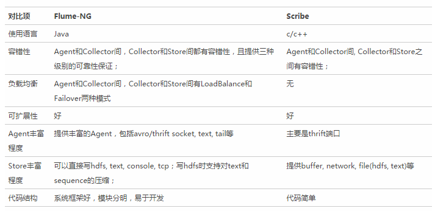
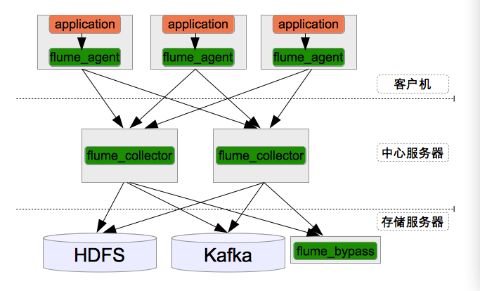
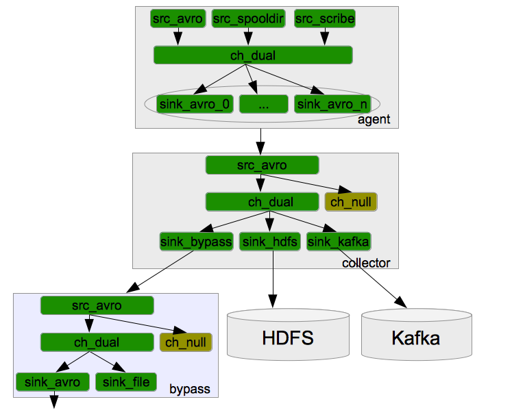
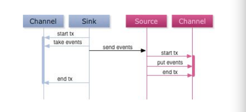
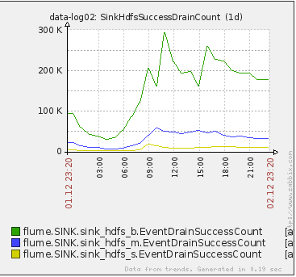
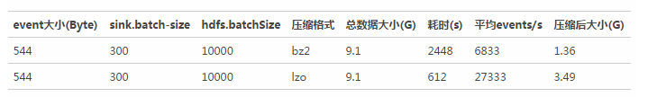
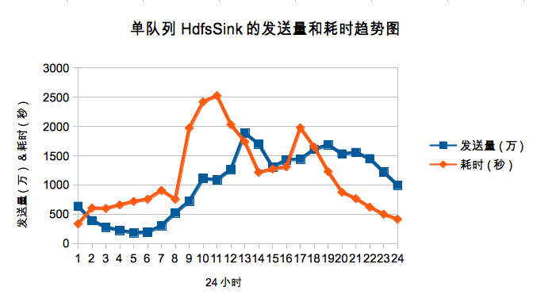
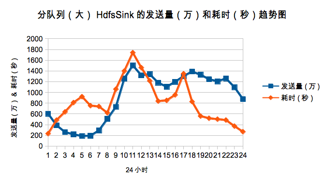

#基于Flume的美团日志收集系统
>美团的日志收集系统负责美团的所有业务日志的收集，并分别给Hadoop平台提供离线数据和Storm平台提供实时数据流。美团的日志收集系统基于Flume设计和搭建而成。
《基于Flume的美团日志收集系统》将分两部分给读者呈现美团日志收集系统的架构设计和实战经验。
第一部分架构和设计，将主要着眼于日志收集系统整体的架构设计，以及为什么要做这样的设计。
第二部分改进和优化，将主要着眼于实际部署和使用过程中遇到的问题，对Flume做的功能修改和优化等。

[TOC]
##1 日志收集系统简介
日志收集是大数据的基石。

许多公司的业务平台每天都会产生大量的日志数据。收集业务日志数据，供离线和在线的分析系统使用，正是日志收集系统的要做的事情。高可用性，高可靠性和可扩展性是日志收集系统所具有的基本特征。

目前常用的开源日志收集系统有Flume, Scribe等。Flume是Cloudera提供的一个高可用的，高可靠的，分布式的海量日志采集、聚合和传输的系统，目前已经是Apache的一个子项目。Scribe是Facebook开源的日志收集系统，它为日志的分布式收集，统一处理提供一个可扩展的，高容错的简单方案。  

##2 常用的开源日志收集系统对比
下面将对常见的开源日志收集系统Flume和Scribe的各方面进行对比。对比中Flume将主要采用Apache下的Flume-NG为参考对象。同时，美团将常用的日志收集系统分为三层（Agent层，Collector层和Store层）来进行对比。  
  
##3 美团日志收集系统架构
美团的日志收集系统负责美团的所有业务日志的收集，并分别给Hadoop平台提供离线数据和Storm平台提供实时数据流。美团的日志收集系统基于Flume设计和搭建而成。目前每天收集和处理约T级别的日志数据。  

下图是美团的日志收集系统的整体框架图。  
  
a. 整个系统分为三层：Agent层，Collector层和Store层。其中Agent层每个机器部署一个进程，负责对单机的日志收集工作；Collector层部署在中心服务器上，负责接收Agent层发送的日志，并且将日志根据路由规则写到相应的Store层中；Store层负责提供永久或者临时的日志存储服务，或者将日志流导向其它服务器。

b. Agent到Collector使用LoadBalance策略，将所有的日志均衡地发到所有的Collector上，达到负载均衡的目标，同时并处理单个Collector失效的问题。

c. Collector层的目标主要有三个：SinkHdfs, SinkKafka和SinkBypass。分别提供离线的数据到Hdfs，和提供实时的日志流到Kafka和Bypass。其中SinkHdfs又根据日志量的大小分为SinkHdfs_b，SinkHdfs_m和SinkHdfs_s三个Sink，以提高写入到Hdfs的性能，具体见后面介绍。

d. 对于Store来说，Hdfs负责永久地存储所有日志；Kafka存储最新的7天日志，并给Storm系统提供实时日志流；Bypass负责给其它服务器和应用提供实时日志流。

下图是美团的日志收集系统的模块分解图，详解Agent, Collector和Bypass中的Source, Channel和Sink的关系。
  
a. 模块命名规则：所有的Source以src开头，所有的Channel以ch开头，所有的Sink以sink开头；

b. Channel统一使用美团开发的DualChannel，具体原因后面详述；对于过滤掉的日志使用NullChannel，具体原因后面详述；

c. 模块之间内部通信统一使用Avro接口；
##4 架构设计考虑
###4.1 可用性(availablity)
对日志收集系统来说，可用性(availablity)指固定周期内系统无故障运行总时间。要想提高系统的可用性，就需要消除系统的单点，提高系统的冗余度。下面来看看美团的日志收集系统在可用性方面的考虑。

####4.1.1 Agent死掉
Agent死掉分为两种情况：机器死机或者Agent进程死掉。

对于机器死机的情况来说，由于产生日志的进程也同样会死掉，所以不会再产生新的日志，不存在不提供服务的情况。

对于Agent进程死掉的情况来说，确实会降低系统的可用性。对此，美团有下面三种方式来提高系统的可用性。首先，所有的Agent在supervise的方式下启动，如果进程死掉会被系统立即重启，以提供服务。其次，对所有的Agent进行存活监控，发现Agent死掉立即报警。最后，对于非常重要的日志，建议应用直接将日志写磁盘，Agent使用spooldir的方式获得最新的日志。
####4.1.2 Collector死掉
由于中心服务器提供的是对等的且无差别的服务，且Agent访问Collector做了LoadBalance和重试机制。所以当某个Collector无法提供服务时，Agent的重试策略会将数据发送到其它可用的Collector上面。所以整个服务不受影响。  
####4.1.3 Hdfs正常停机
美团在Collector的HdfsSink中提供了开关选项，可以控制Collector停止写Hdfs，并且将所有的events缓存到FileChannel的功能。
####4.1.4 Hdfs异常停机或不可访问
假如Hdfs异常停机或不可访问，此时Collector无法写Hdfs。由于美团使用DualChannel，Collector可以将所收到的events缓存到FileChannel，保存在磁盘上，继续提供服务。当Hdfs恢复服务以后，再将FileChannel中缓存的events再发送到Hdfs上。这种机制类似于Scribe，可以提供较好的容错性。
####4.1.5 Collector变慢或者Agent/Collector网络变慢
如果Collector处理速度变慢（比如机器load过高）或者Agent/Collector之间的网络变慢，可能导致Agent发送到Collector的速度变慢。同样的，对于此种情况，美团在Agent端使用DualChannel，Agent可以将收到的events缓存到FileChannel，保存在磁盘上，继续提供服务。当Collector恢复服务以后，再将FileChannel中缓存的events再发送给Collector。
####4.1.6 Hdfs变慢
当Hadoop上的任务较多且有大量的读写操作时，Hdfs的读写数据往往变的很慢。由于每天，每周都有高峰使用期，所以这种情况非常普遍。

对于Hdfs变慢的问题，美团同样使用DualChannel来解决。当Hdfs写入较快时，所有的events只经过MemChannel传递数据，减少磁盘IO，获得较高性能。当Hdfs写入较慢时，所有的events只经过FileChannel传递数据，有一个较大的数据缓存空间。
###4.2 可靠性(reliability)
对日志收集系统来说，可靠性(reliability)是指Flume在数据流的传输过程中，保证events的可靠传递。

对Flume来说，所有的events都被保存在Agent的Channel中，然后被发送到数据流中的下一个Agent或者最终的存储服务中。那么一个Agent的Channel中的events什么时候被删除呢？当且仅当它们被保存到下一个Agent的Channel中或者被保存到最终的存储服务中。这就是Flume提供数据流中点到点的可靠性保证的最基本的单跳消息传递语义。

那么Flume是如何做到上述最基本的消息传递语义呢？

首先，Agent间的事务交换。Flume使用事务的办法来保证event的可靠传递。Source和Sink分别被封装在事务中，这些事务由保存event的存储提供或者由Channel提供。这就保证了event在数据流的点对点传输中是可靠的。在多级数据流中，如下图，上一级的Sink和下一级的Source都被包含在事务中，保证数据可靠地从一个Channel到另一个Channel转移。
  
其次，数据流中 Channel的持久性。Flume中MemoryChannel是可能丢失数据的（当Agent死掉时），而FileChannel是持久性的，提供类似mysql的日志机制，保证数据不丢失。  
###4.3 可扩展性(scalability)
对日志收集系统来说，可扩展性(scalability)是指系统能够线性扩展。当日志量增大时，系统能够以简单的增加机器来达到线性扩容的目的。

对于基于Flume的日志收集系统来说，需要在设计的每一层，都可以做到线性扩展地提供服务。下面将对每一层的可扩展性做相应的说明。  
####4.3.1 Agent层
对于Agent这一层来说，每个机器部署一个Agent，可以水平扩展，不受限制。一个方面，Agent收集日志的能力受限于机器的性能，正常情况下一个Agent可以为单机提供足够服务。另一方面，如果机器比较多，可能受限于后端Collector提供的服务，但Agent到Collector是有Load Balance机制，使得Collector可以线性扩展提高能力。
####4.3.2 Collector层
对于Collector这一层，Agent到Collector是有Load Balance机制，并且Collector提供无差别服务，所以可以线性扩展。其性能主要受限于Store层提供的能力。

####4.3.3 Store层
对于Store这一层来说，Hdfs和Kafka都是分布式系统，可以做到线性扩展。Bypass属于临时的应用，只对应于某一类日志，性能不是瓶颈。

###4.4 Channel的选择
Flume1.4.0中，其官方提供常用的MemoryChannel和FileChannel供大家选择。其优劣如下：
- MemoryChannel: 所有的events被保存在内存中。优点是高吞吐。缺点是容量有限并且Agent死掉时会丢失内存中的数据。
- FileChannel: 所有的events被保存在文件中。优点是容量较大且死掉时数据可恢复。缺点是速度较慢。
上述两种Channel，优缺点相反，分别有自己适合的场景。然而，对于大部分应用来说，美团希望Channel可以同提供高吞吐和大缓存。基于此，美团开发了DualChannel。

**DualChannel**：基于 MemoryChannel和 FileChannel开发。当堆积在Channel中的events数小于阈值时，所有的events被保存在MemoryChannel中，Sink从MemoryChannel中读取数据； 当堆积在Channel中的events数大于阈值时， 所有的events被自动存放在FileChannel中，Sink从FileChannel中读取数据。这样当系统正常运行时，美团可以使用MemoryChannel的高吞吐特性；当系统有异常时，美团可以利用FileChannel的大缓存的特性。
###4.5 和scribe兼容
在设计之初，美团就要求每类日志都有一个category相对应，并且Flume的Agent提供AvroSource和ScribeSource两种服务。这将保持和之前的Scribe相对应，减少业务的更改成本。

###4.6 权限控制
在目前的日志收集系统中，美团只使用最简单的权限控制。只有设定的category才可以进入到存储系统。所以目前的权限控制就是category过滤。

如果权限控制放在Agent端，优势是可以较好地控制垃圾数据在系统中流转。但劣势是配置修改麻烦，每增加一个日志就需要重启或者重载Agent的配置。

如果权限控制放在Collector端，优势是方便进行配置的修改和加载。劣势是部分没有注册的数据可能在Agent/Collector之间传输。

考虑到Agent/Collector之间的日志传输并非系统瓶颈，且目前日志收集属内部系统，安全问题属于次要问题，所以选择采用Collector端控制。

###4.7 提供实时流
美团的部分业务，如实时推荐，反爬虫服务等服务，需要处理实时的数据流。因此美团希望Flume能够导出一份实时流给Kafka/Storm系统。

一个非常重要的要求是实时数据流不应该受到其它Sink的速度影响，保证实时数据流的速度。这一点，美团是通过Collector中设置不同的Channel进行隔离，并且DualChannel的大容量保证了日志的处理不受Sink的影响。

##5 系统监控
对于一个大型复杂系统来说，监控是必不可少的部分。设计合理的监控，可以对异常情况及时发现，只要有一部手机，就可以知道系统是否正常运作。对于美团的日志收集系统，美团建立了多维度的监控，防止未知的异常发生。
###5.1 发送速度，拥堵情况，写Hdfs速度
通过发送给zabbix的数据，美团可以绘制出发送数量、拥堵情况和写Hdfs速度的图表，对于超预期的拥堵，美团会报警出来查找原因。

下面是Flume Collector HdfsSink写数据到Hdfs的速度截图：
  
下面是Flume Collector的FileChannel中拥堵的events数据量截图：  
  
###5.2 flume写hfds状态的监控
Flume写入Hdfs会先生成tmp文件，对于特别重要的日志，美团会每15分钟左右检查一下各个Collector是否都产生了tmp文件，对于没有正常产生tmp文件的Collector和日志美团需要检查是否有异常。这样可以及时发现Flume和日志的异常.  
###5.3 日志大小异常监控
对于重要的日志，美团会每个小时都监控日志大小周同比是否有较大波动，并给予提醒，这个报警有效的发现了异常的日志，且多次发现了应用方日志发送的异常，及时给予了对方反馈，帮助他们及早修复自身系统的异常。

通过上述的讲解，美团可以看到，基于Flume的美团日志收集系统已经是具备高可用性，高可靠性，可扩展等特性的分布式服务。

##6 改进优化
下面，美团将会讲述在实际部署和使用过程中遇到的问题，对Flume的功能改进和对系统做的优化。
###6.1 Flume的问题总结
在Flume的使用过程中，遇到的主要问题如下：

a. Channel“水土不服”：使用固定大小的MemoryChannel在日志高峰时常报队列大小不够的异常；使用FileChannel又导致IO繁忙的问题；

b. HdfsSink的性能问题：使用HdfsSink向Hdfs写日志，在高峰时间速度较慢；

c. 系统的管理问题：配置升级，模块重启等；
###6.2 Flume的功能改进和优化点
从上面的问题中可以看到，有一些需求是原生Flume无法满足的，因此，基于开源的Flume美团增加了许多功能，修改了一些Bug，并且进行一些调优。下面将对一些主要的方面做一些说明
####6.2.1 增加Zabbix monitor服务
一方面，Flume本身提供了http, ganglia的监控服务，而美团目前主要使用zabbix做监控。因此，美团为Flume添加了zabbix监控模块，和sa的监控服务无缝融合。

另一方面，净化Flume的metrics。只将美团需要的metrics发送给zabbix，避免 zabbix server造成压力。目前美团最为关心的是Flume能否及时把应用端发送过来的日志写到Hdfs上， 对应关注的metrics为：
- Source : 接收的event数和处理的event数  
- Channel : Channel中拥堵的event数  
- Sink : 已经处理的event数  

####6.2.2 为HdfsSink增加自动创建index功能
首先，美团的HdfsSink写到hadoop的文件采用lzo压缩存储。 HdfsSink可以读取hadoop配置文件中提供的编码类列表，然后通过配置的方式获取使用何种压缩编码，美团目前使用lzo压缩数据。采用lzo压缩而非bz2压缩，是基于以下测试数据：  
  
其次，美团的HdfsSink增加了创建lzo文件后自动创建index功能。Hadoop提供了对lzo创建索引，使得压缩文件是可切分的，这样Hadoop Job可以并行处理数据文件。HdfsSink本身lzo压缩，但写完lzo文件并不会建索引，美团在close文件之后添加了建索引功能。  
~~~java
/**  
   * Rename bucketPath file from .tmp to permanent location.  
   */  
  private void renameBucket() throws IOException, InterruptedException {   
      if(bucketPath.equals(targetPath)) {   
              return;   
        }   
  
        final Path srcPath = new Path(bucketPath);   
        final Path dstPath = new Path(targetPath);   
  
        callWithTimeout(new CallRunner<Object>() {   
              @Override  
              public Object call() throws Exception {   
                if(fileSystem.exists(srcPath)) { // could block   
                      LOG.info("Renaming " + srcPath + " to " + dstPath);   
                     fileSystem.rename(srcPath, dstPath); // could block   
  
                      //index the dstPath lzo file   
                      if (codeC != null && ".lzo".equals(codeC.getDefaultExtension()) ) {   
                              LzoIndexer lzoIndexer = new LzoIndexer(new Configuration());   
                              lzoIndexer.index(dstPath);   
                      }   
                }   
                return null;   
              }   
    });   
}  
~~~

####6.2.3 增加HdfsSink的开关
美团在HdfsSink和DualChannel中增加开关，当开关打开的情况下，HdfsSink不再往Hdfs上写数据，并且数据只写向DualChannel中的FileChannel。以此策略来防止Hdfs的正常停机维护。
####6.2.4 增加DualChannel
Flume本身提供了MemoryChannel和FileChannel。MemoryChannel处理速度快，但缓存大小有限，且没有持久化；FileChannel则刚好相反。美团希望利用两者的优势，在Sink处理速度够快，Channel没有缓存过多日志的时候，就使用MemoryChannel，当Sink处理速度跟不上，又需要Channel能够缓存下应用端发送过来的日志时，就使用FileChannel，由此美团开发了DualChannel，能够智能的在两个Channel之间切换。

其具体的逻辑如下：
~~~java
/***  
 * putToMemChannel indicate put event to memChannel or fileChannel  
 * takeFromMemChannel indicate take event from memChannel or fileChannel  
 * */  
private AtomicBoolean putToMemChannel = new AtomicBoolean(true);   
private AtomicBoolean takeFromMemChannel = new AtomicBoolean(true);   
  
void doPut(Event event) {   
        if (switchon && putToMemChannel.get()) {   
              //往memChannel中写数据   
              memTransaction.put(event);   
  
              if ( memChannel.isFull() || fileChannel.getQueueSize() > 100) {   
                putToMemChannel.set(false);   
              }   
        } else {   
              //往fileChannel中写数据   
              fileTransaction.put(event);   
        }   
  }   
  
Event doTake() {   
    Event event = null;   
    if ( takeFromMemChannel.get() ) {   
        //从memChannel中取数据   
        event = memTransaction.take();   
        if (event == null) {   
            takeFromMemChannel.set(false);   
        }    
    } else {   
        //从fileChannel中取数据   
        event = fileTransaction.take();   
        if (event == null) {   
            takeFromMemChannel.set(true);   
  
            putToMemChannel.set(true);   
        }    
    }   
    return event;   
}
~~~

####6.2.5 增加NullChannel
Flume提供了NullSink，可以把不需要的日志通过NullSink直接丢弃，不进行存储。然而，Source需要先将events存放到Channel中，NullSink再将events取出扔掉。为了提升性能，美团把这一步移到了Channel里面做，所以开发了NullChannel。
####6.2.6 增加KafkaSink
为支持向Storm提供实时数据流，美团增加了KafkaSink用来向Kafka写实时数据流。其基本的逻辑如下：
~~~java

    public class KafkaSink extends AbstractSink implements Configurable {   
            private String zkConnect;   
            private Integer zkTimeout;   
            private Integer batchSize;   
            private Integer queueSize;   
            private String serializerClass;   
            private String producerType;   
            private String topicPrefix;   
      
            private Producer<String, String> producer;   
      
            public void configure(Context context) {   
                //读取配置，并检查配置   
            }   
      
            @Override  
            public synchronized void start() {   
                //初始化producer   
            }   
      
            @Override  
            public synchronized void stop() {   
                //关闭producer   
            }   
      
            @Override  
            public Status process() throws EventDeliveryException {   
      
                Status status = Status.READY;   
      
                Channel channel = getChannel();   
                Transaction tx = channel.getTransaction();   
                try {   
                        tx.begin();   
      
                        //将日志按category分队列存放   
                        Map<String, List<String>> topic2EventList = new HashMap<String, List<String>>();   
      
                        //从channel中取batchSize大小的日志，从header中获取category，生成topic，并存放于上述的Map中；   
      
                        //将Map中的数据通过producer发送给kafka    
      
                       tx.commit();   
                } catch (Exception e) {   
                        tx.rollback();   
                        throw new EventDeliveryException(e);   
                } finally {   
                    tx.close();   
                }   
                return status;   
            }   
    }  
~~~
####6.2.7 修复和scribe的兼容问题
Scribed在通过ScribeSource发送数据包给Flume时，大于4096字节的包，会先发送一个Dummy包检查服务器的反应，而Flume的ScribeSource对于logentry.size()=0的包返回TRY_LATER，此时Scribed就认为出错，断开连接。这样循环反复尝试，无法真正发送数据。现在在ScribeSource的Thrift接口中，对size为0的情况返回OK，保证后续正常发送数据。
###6.3 Flume系统调优经验总结
####6.3.1 基础参数调优经验
HdfsSink中默认的serializer会每写一行在行尾添加一个换行符，美团日志本身带有换行符，这样会导致每条日志后面多一个空行，修改配置不要自动添加换行符；
lc.sinks.sink_hdfs.serializer.appendNewline = false
调大MemoryChannel的capacity，尽量利用MemoryChannel快速的处理能力；
调大HdfsSink的batchSize，增加吞吐量，减少hdfs的flush次数；
适当调大HdfsSink的callTimeout，避免不必要的超时错误；
####6.3.2 HdfsSink获取Filename的优化
HdfsSink的path参数指明了日志被写到Hdfs的位置，该参数中可以引用格式化的参数，将日志写到一个动态的目录中。这方便了日志的管理。例如美团可以将日志写到category分类的目录，并且按天和按小时存放：

lc.sinks.sink_hdfs.hdfs.path = /user/hive/work/orglog.db/%{category}/dt=%Y%m%d/hour=%H
HdfsS ink中处理每条event时，都要根据配置获取此event应该写入的Hdfs path和filename，默认的获取方法是通过正则表达式替换配置中的变量，获取真实的path和filename。因为此过程是每条event都要做的操作，耗时很长。通过美团的测试，20万条日志，这个操作要耗时6-8s左右。

由于美团目前的path和filename有固定的模式，可以通过字符串拼接获得。而后者比正则匹配快几十倍。拼接定符串的方式，20万条日志的操作只需要几百毫秒。
####6.3.3 HdfsSink的b/m/s优化
在美团初始的设计中，所有的日志都通过一个Channel和一个HdfsSink写到Hdfs上。美团来看一看这样做有什么问题。

首先，美团来看一下HdfsSink在发送数据的逻辑：
~~~java
    //从Channel中取batchSize大小的events   
    for (txnEventCount = 0; txnEventCount < batchSize; txnEventCount++) {   
        //对每条日志根据category append到相应的bucketWriter上；   
        bucketWriter.append(event);   
    ｝   
      
    for (BucketWriter bucketWriter : writers) {   
        //然后对每一个bucketWriter调用相应的flush方法将数据flush到Hdfs上   
        bucketWriter.flush();   
    ｝  
~~~
假设美团的系统中有100个category，batchSize大小设置为20万。则每20万条数据，就需要对100个文件进行append或者flush操作。

其次，对于美团的日志来说，基本符合80/20原则。即20%的category产生了系统80%的日志量。这样对大部分日志来说，每20万条可能只包含几条日志，也需要往Hdfs上flush一次。

上述的情况会导致HdfsSink写Hdfs的效率极差。下图是单Channel的情况下每小时的发送量和写hdfs的时间趋势图。
  
鉴于这种实际应用场景，美团把日志进行了大小归类，分为big, middle和small三类，这样可以有效的避免小日志跟着大日志一起频繁的flush，提升效果明显。下图是分队列后big队列的每小时的发送量和写hdfs的时间趋势图。
  
##7 未来发展
目前，Flume日志收集系统提供了一个高可用，高可靠，可扩展的分布式服务，已经有效地支持了美团的日志数据收集工作。

后续，美团将在如下方面继续研究：

日志管理系统：图形化的展示和控制日志收集系统；
跟进社区发展：跟进Flume 1.5的进展，同时回馈社区；