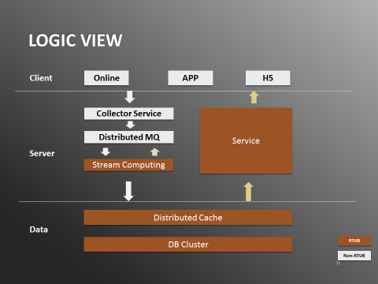
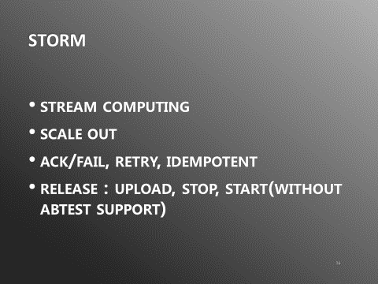
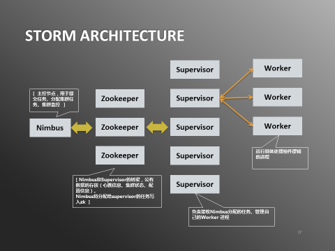
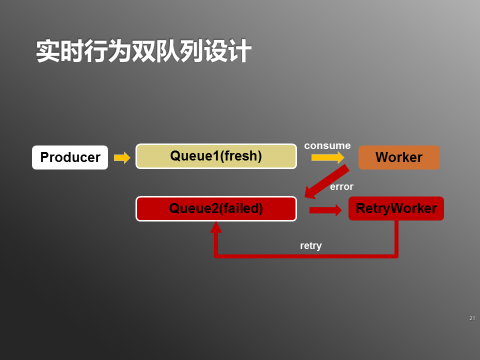
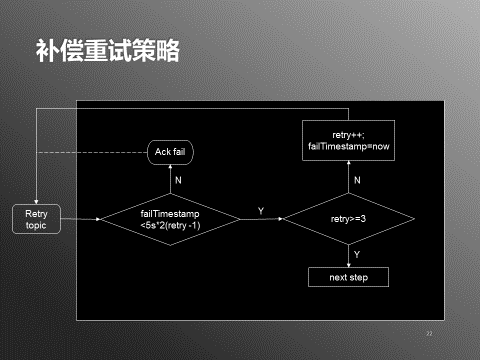
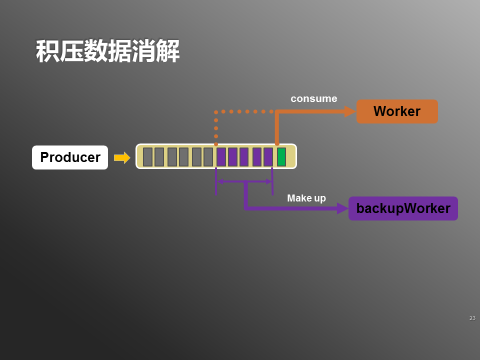
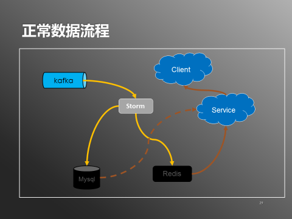
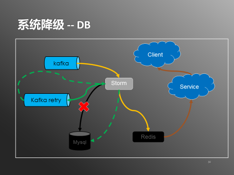
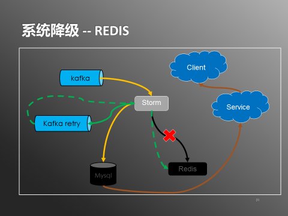
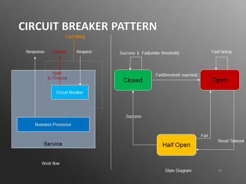

#日处理20亿数据，实时用户行为服务系统架构实践 
携程实时用户行为服务作为基础服务，目前普遍应用在多个场景中，比如猜你喜欢（携程的推荐系统）、动态广告、用户画像、浏览历史等等。

以猜你喜欢为例，猜你喜欢为应用内用户提供潜在选项，提高成交效率。旅行是一项综合性的需求，用户往往需要不止一个产品。作为一站式的旅游服务平台，跨业务线的推荐，特别是实时推荐，能实际满足用户的需求，因此在上游提供打通各业务线之间的用户行为数据有很大的必要性。

携程原有的实时用户行为系统存在一些问题，包括：1）数据覆盖不全；2）数据输出没有统一格式，对众多使用方提高了接入成本；3）日志处理模块是web service，比较难支持多种数据处理策略和实现方便扩容应对流量洪峰的需求等。

而近几年旅游市场高速增长，数据量越来越大，并且会持续快速增长。有越来越多的使用需求，对系统的实时性，稳定性也提出了更高的要求。总的来说，当前需求对系统的实时性/可用性/性能/扩展性方面都有很高的要求。
[TOC]
##一、架构
这样的背景下，我们按照如下结构重新设计了系统：
  
新的架构下，数据有两种流向，分别是处理流和输出流。

在处理流，行为日志会从客户端（App/Online/H5）上传到服务端的Collector Service。Collector Service将消息发送到分布式队列。数据处理模块由流计算框架完成，从分布式队列读出数据，处理之后把数据写入数据层，由分布式缓存和数据库集群组成。

输出流相对简单，Web Service的后台会从数据层拉取数据，并输出给调用方，有的是内部服务调用，比如推荐系统，也有的是输出到前台，比如浏览历史。系统实现采用的是Java+Kafka+Storm+Redis+MySQL+Tomcat+Spring的技术栈。

- Java：目前公司内部Java化的氛围比较浓厚，并且Java有比较成熟的大数据组件
- Kafka/Storm：Kafka作为分布式消息队列已经在公司有比较成熟的应用，流计算框架Storm也已经落地，并且有比较好的运维支持环境。
- Redis： Redis的HA，SortedSet和过期等特性比较好地满足了系统的需求。
- MySQL: 作为基础系统，稳定性和性能也是系统的两大指标，对比NoSQL的主要选项，比如HBase和ElasticSearch，十亿数据级别上MySQL在这两方面有更好的表现，并且经过设计能够有不错的水平扩展能力。

目前系统每天处理20亿左右的数据量，数据从上线到可用的时间在300毫秒左右。查询服务每天服务8000万左右的请求，平均延迟在6毫秒左右。下面从实时性/可用性/性能/部署几个维度来说明系统的设计。

##二、实时性
作为一个实时系统，实时性是首要指标。线上系统面对着各种异常情况。例如如下几种情况：

1. 突发流量洪峰，怎么应对；
2. 出现失败数据或故障模块，如何保证失败数据重试并同时保证新数据的处理；
3. 环境问题或bug导致数据积压，如何快速消解；
4. 程序bug，旧数据需要重新处理，如何快速处理同时保证新数据；

系统从设计之初就考虑了上述情况。

首先是用storm解决了突发流量洪峰的问题。storm具有如下特性：
  

作为一个流计算框架，和早期大数据处理的批处理框架有明显区别。批处理框架是执行完一次任务就结束运行，而流处理框架则持续运行，理论上永不停止，并且处理粒度是消息级别，因此只要系统的计算能力足够，就能保证每条消息都能第一时间被发现并处理。

对当前系统来说，通过storm处理框架，消息能在进入kafka之后毫秒级别被处理。此外，storm具有强大的scale out能力。只要通过后台修改worker数量参数，并重启topology（storm的任务名称），可以马上扩展计算能力，方便应对突发的流量洪峰。

对消息的处理storm支持多种数据保证策略，at least once，at most once，exactly once。对实时用户行为来说，首先是保证数据尽可能少丢失，另外要支持包括重试和降级的多种数据处理策略，并不能发挥exactly once的优势，反而会因为事务支持降低性能，所以实时用户行为系统采用的at least once的策略。这种策略下消息可能会重发，所以程序处理实现了幂等支持。

storm的发布比较简单，上传更新程序jar包并重启任务即可完成一次发布，遗憾的是没有多版本灰度发布的支持。
  
在部分情况下数据处理需要重试，比如数据库连接超时，或者无法连接。连接超时可能马上重试就能恢复，但是无法连接一般需要更长时间等待网络或数据库的恢复，这种情况下处理程序不能一直等待，否则会造成数据延迟。实时用户行为系统采用了双队列的设计来解决这个问题。
  

生产者将行为纪录写入Queue1（主要保持数据新鲜），Worker从Queue1消费新鲜数据。如果发生上述异常数据，则Worker将异常数据写入Queue2（主要保持异常数据）。

这样Worker对Queue1的消费进度不会被异常数据影响，可以保持消费新鲜数据。RetryWorker会监听Queue2，消费异常数据，如果处理还没有成功，则按照一定的策略（如下图）等待或者重新将异常数据写入Queue2。
  
另外，数据发生积压的情况下，可以调整Worker的消费游标，从最新的数据重新开始消费，保证最新数据得到处理。中间未经处理的一段数据则启动backupWorker，指定起止游标，在消费完指定区间的数据之后，backupWorker会自动停止。（如下图）  
  
##三、可用性
作为基础服务，对可用性的要求比一般的服务要高得多，因为下游依赖的服务多，一旦出现故障，有可能会引起级联反应影响大量业务。项目从设计上对以下问题做了处理，保障系统的可用性：

1. 系统是否有单点？
2. DB扩容/维护/故障怎么办？
3. Redis维护/升级补丁怎么办？
4. 服务万一挂了如何快速恢复？如何尽量不影响下游应用？

首先是系统层面上做了全栈集群化。kafka和storm本身比较成熟地支持集群化运维；web服务支持了无状态处理并且通过负载均衡实现集群化；Redis和DB方面携程已经支持主备部署，使用过程中如果主机发生故障，备机会自动接管服务；通过全栈集群化保障系统没有单点。

另外系统在部分模块不可用时通过降级处理保障整个系统的可用性。先看看正常数据处理流程：（如下图）  
  
在系统正常状态下，storm会从kafka中读取数据，分别写入到redis和mysql中。服务从redis拉取（取不到时从db补偿），输出给客户端。DB降级的情况下，数据流程也随之改变（如下图）
  
当mysql不可用时，通过打开db降级开关，storm会正常写入redis，但不再往mysql写入数据。数据进入reids就可以被查询服务使用，提供给客户端。另外storm会把数据写入一份到kafka的retry队列，在mysql正常服务之后，通过关闭db降级开关，storm会消费retry队列中的数据，从而把数据写入到mysql中。redis和mysql的数据在降级期间会有不一致，但系统恢复正常之后会通过retry保证数据最终的一致性。redis的降级处理也类似（如下图）  
  
唯一有点不同的是Redis的服务能力要远超过MySQL。所以在Redis降级时系统的吞吐能力是下降的。这时我们会监控db压力，如果发现MySQL压力较大，会暂时停止数据的写入，降低MySQL的压力，从而保证查询服务的稳定。

为了降低故障情况下对下游的影响，查询服务通过Netflix的Hystrix组件支持了熔断模式（如下图）。  
  
在该模式下，一旦服务失败请求在给定时间内超过一个阈值，就会打开熔断开关。在开关开启情况下，服务对后续请求直接返回失败响应，不会再让请求经过业务模块处理，从而避免服务器进一步增加压力引起雪崩，也不会因为响应时间延长拖累调用方。

开关打开之后会开始计时，timeout后会进入Half Open的状态，在该状态下会允许一个请求通过，进入业务处理模块，如果能正常返回则关闭开关，否则继续保持开关打开直到下次timeout。这样业务恢复之后就能正常服务请求。

另外，为了防止单个调用方的非法调用对服务的影响，服务也支持了多个维度限流，包括调用方AppId/ip限流和服务限流，接口限流等。  

##四、性能&扩展
由于在线旅游行业近几年的高速增长，携程作为行业领头羊也蓬勃发展，因此访问量和数据量也大幅提升。公司对业务的要求是可以支撑10倍容量扩展，扩展最难的部分在数据层，因为涉及到存量数据的迁移。

实时用户行为系统的数据层包括Redis和MySQL，Redis因为实现了一致性哈希，扩容时只要加机器，并对分配到新分区的数据作读补偿就可以。

MySQL方面，我们也做了水平切分作为扩展的准备，分片数量的选择考虑为2的n次方，这样做在扩容时有明显的好处。因为携程的mysql数据库现在普遍采用的是一主一备的方式，在扩容时可以直接把备机拉平成第二台（组）主机。假设原来分了2个库，d0和d1，都放在服务器s0上，s0同时有备机s1。扩容只需要如下几步：  

1. 确保s0 -> s1同步顺利，没有明显延迟
2. s0暂时关闭读写权限
3. 确认s1已经完全同步s0更新
4. s1开放读写权限
5. d1的dns由s0切换到s1
6. s0开放读写权限

迁移过程利用MySQL的复制分发特性，避免了繁琐易错的人工同步过程，大大降低了迁移成本和时间。整个操作过程可以在几分钟完成，结合DB降级的功能，只有在DNS切换的几秒钟时间会产生异常。

整个过程比较简单方便，降低了运维负担，一定程度也能降低过多操作造成类似GitLab式悲剧的可能性。

##五、部署
前文提到Storm部署是比较方便的，只要上传重启就可以完成部署。部署之后由于程序重新启动上下文丢失，可以通过Kafka记录的游标找到之前处理位置，恢复处理。  
另外有部分情况下程序可能需要多版本运行，比如行为纪录暂时有多个版本，这种情况下我们会新增一个backupJob，在backupJob中运行历史版本。  

>**作者：**陈清渠，毕业于武汉大学，多年软件及互联网行业开发经验。14年加入携程，先后负责了订单查询服务重构，实时用户行为服务搭建等项目的架构和研发工作，目前负责携程技术中心基础业务研发部订单中心团队。  
**声明：**本文来自SDCC 2017·上海站之架构峰会的演讲整理，SDCC 2017·深圳站召开在即，架构峰会的所有嘉宾均已邀请完毕，点击查看7位一线架构师。  

