#魅族大数据之流平台设计部署实践  
>**导读：**魅族大数据的流平台系统拥有自设计的采集SDK，自设计支持多种数据源采集的Agent组件，还结合了Flume、Spark、Metaq、Storm、Kafka、Hadoop等技术组件，本文就魅族流平台对大量数据的采集、实时计算、系统分析方法，全球多机房数据采集等问题进行介绍。
流平台是魅族大数据平台的重要部分，包括数据采集、数据处理、数据存储、数据计算等模块，流平台为大数据提供了强大的支撑能力。
文章还介绍了魅族大数据流平台的架构、设计方式、常用组件、核心技术框架等方面的内容，还原魅族大数据平台的搭建过程及遇到的问题。

[TOC]

##一、魅族大数据平台架构
如图所示便是魅族的大数据平台架构。  
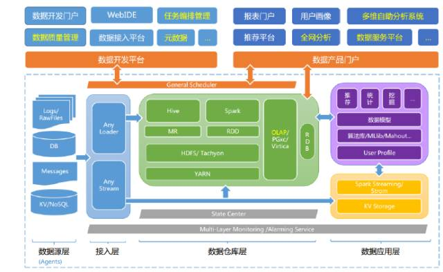  
- 左边是多样性的数据源接入；
- 右上是离线数据的采集；
- 下面是流平台（也是今天分享的主角）；
- 中间是集群的部署；
- 右边是ETL的数据挖掘、算法库和一些数据模型；
- 左上角是数据开发平台，比如webIDE可以使得开发人员更便捷地做一些数据查询和管理；
- 最右边的是一个数据产品门户，包括我们的用户画像、统计系统等，这里面包含大数据的很多组件，比如数据采集、数据处理、数据存储、数据挖掘等，最后产生大数据的雏形。

##二、流平台介绍
流平台是大数据平台一个比较重要的部分，主要包括四个部分：数据采集、数据处理、数据存储、计算能力。  
- **数据采集**  
“谁拥有了整个世界的数据，他就是最大的赢家”，这句话虽然有点夸张，但是却表达了数据采集的重要性。一个大数据平台数据的多样性、数据量的级别很大程度上决定了大数据的能力和丰富程度。  
- **数据处理**  
这里讲的数据处理并不是像末端那么专业的数据清洗，更多的是为后续入库做一些简单处理，以及实时计算。
- **数据存储**  
计算能力，包括离线计算和实时计算  

流平台为大数据提供非常强大的支撑，数据统计分析、数据挖掘、神经网络的图形计算等都可以依靠计算能力进行。  

实时计算是指在一定单位的时间延迟范围内，基于增量的数据推算出结果，再结合历史数据得到期望的分析结果。这个时间是根据业务需求而定。  

1. **流平台架构**
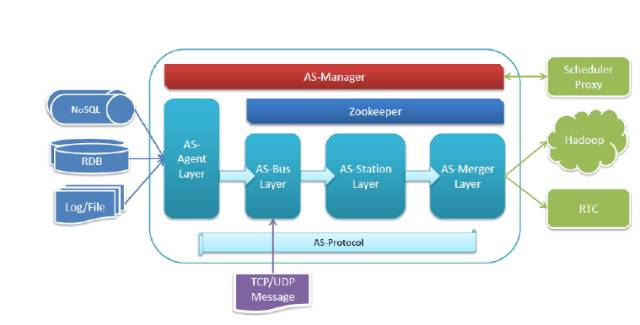  
上图是我们的流平台架构图  
  - 左边是数据源，像NoSQL、RDB、文件类型；
  - 最右边是集群，下面还有其他的一些Hadoop（存储）；
  - 中间的框是核心，也就是流平台；
  - 最上面的是AS-Manager（我们的流管理平台），承载了非常多的管理功能；
  - 下面是Zookeeper，这是一个非常流行的集成管理中心，魅族的一些架构都会用到它，流平台也不例外，Zookeeper可以说贯穿了我们整个流平台的架构；  
  - 最下面是AS-Protocol，我们自己设计的流平台的数据对象协议，打通了整个流平台的数据链路；  
  - 中间四个框是核心的四个模块：采集模块、数据中转模块、缓存模块、实时计算模块，也叫合并层。  
2. **具体架构介绍**
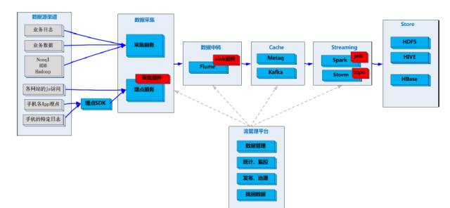  
这是我们的具体架构图。  
业务规模：从这边采集数据到经过流平台最后经过实时计算或入库，它的数据量量级在千亿级别。  
3. **组件**
  - 数据源渠道
前面提到采集数据源渠道的多样性决定了大数据平台的相应能力和综合程度。我们这边首先会有一个文件类的业务数据，包括业务日志、业务数据、数据库文件，这些都会经过采集服务采集。  
下面这一块包括一些网站的js访问、手机各APP埋点、特点的应用日志文件（它会通过手机端的一些埋点上访到我们的埋点服务）。  
  - 数据采集
数据采集分为两个部分：采集服务、独立部署的埋点服务。图中只显示了一个埋点服务，里面还会有很多的第三方业务，第三方业务通过这个红色的插件接入我们的采集。  
  - 数据中转
通过采集模块把数据流转到中转模块，中转模块采用的是目前比较流行的flume组件，红色sink是我们自己开发的。  
  - Cache
sink把前面的数据转给缓存层，缓存层里有metaq和Kafka。  
  - Streaming
实时计算模块上线了Spark和Storm，较早上线的是Spark，目前两个都在用的原因是它会适应不同的业务场景。  
  - Store  
最后面是我们提供给落地的store层，像HIVE、Hbase等等。  
  - 流管理平台  
最下面是流管理平台，图中有四条线连着四个核心模块，对这四个模块进行非常重要且非常丰富的逻辑管理，包括数据管理、对各节点的监控、治理、实时命令的下发等。  

##三、流平台设计  
1. 概念解读  
  - Message：就是一条消息，是最小的数据单位。业务方给的一条数据就是一个message；我们去采集文件的话，一行数据就是一个message  
  - AS-Protocol：是我们自己设计的流平台数据的对象，它会对一批量的message进行打包，然后再加上一些必要的变量做一个封装。  
  - Event，会提供一个类似的标准接口，这个地方其实更多的是为了打通采集的流平台。它最重要的一个变量是Topic，就是说我拿到了我的AS-Protocol就可以根据对应的Topic发到相应的登录去缓存提取，因为我们的AS-Protocol除了起始端和结束端以外，中间层是不用解析协议的。  
  - Type，数据格式目前是Json和Hive格式，可以根据业务去扩展。  
  - Compress，Hive格式在空间上也是非常有优势的，非常适合于网络传输压缩。当压缩数据源质量没有达到一定量的程度的时候会越压越大，所以我们要判断是否需要压缩。我们压缩采用的是一个全系统  
  - Data_timestamp，数据的时间是最上面的message，每一个message会携带一个数据时间.这个比较好理解，就是入库之后会用做数据统计和分析的。  
  - Send_timestamp，发送时间会携带在我们的AS-Protocol里，它声明了每一个数据包发送的时间  
  - Unique Key，每一个数据包都有一个唯一的标识，这个也是非常重要的，它会跟着AS-Protocol和Event走通整个平台的数据链路，在做数据定位、问题定位的时候非常有用，可以明确查到每个数据包在哪个链路经历了什么事情。  
  - Topic。这个不需多言。  
  - Data_Group，数据分组是我们非常核心的一个设计思想，原则上我们是一个业务对应一个数据分组。  
  - Protobuf序列化，我们会对Event数据做一个PT序列化，然后再往上面传，这是为了节省数据流量。
2. 协议设计  
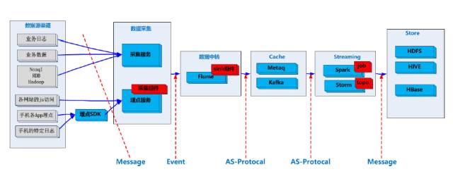  
如图所示为Event、As-Protocol和Message的关系。  
最上层是Event，里面有一个Unique Key和Topic包括了我们的As-Protocol，然后是数据格式、发动时间是否压缩、用什么方式压缩，还携带一些额外的变量。最后面是一个Body，Body其实就是一个message的宿主，以字节流的方式存储。这个就是我们一个数据对象的协议设计。  
接下来看数据在整个架构里是如何流转和传输的。  
首先是数据源渠道，最左边的是message，任何业务方的数据过来都是一条message，经过数据采集把一批message打包封装成Event，再发给数据中转模块，也叫flume。把Event拆出来，有一个topic，最后把As-protocol放到相应位置缓存，消费对应的Topic，拿到对应的As-Protocol，并把这个数据包解析出来，得到一条一条的message，这时就可以进行处理、入库或实时计算。  
需要特别注意的是message和Event。每个Message的业务量级是不一样的，有几十B、几百B、几千B的差别，打包成As-Protocol的时候要试试批量的数目有多少，原则上压缩后的数据有个建议值，这个建议值视业务而定，DataGroup打包的数量是可以配的。  
3. 数据分组设计
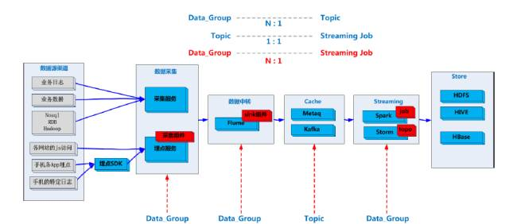  
如图所示是我们的DataGroup设计。首先看最上面，一个Topic可以定义N个DataGroup。往下是Topic和streaming Job一比一的关系，就是说一个实时的Group只需要对应一个Topic，如果两个业务不相关就对应的两个Topic，用两个Job去处理，最后得到想要的关系。  

  从架构图可以看到DataGroup的扭转关系。最初数据采集每一个节点会声明它是属于哪一个DataGroup，上传数据会处于这个DataGroup，经过数据中转发给我们的分布式缓存也对应了Topic下面不同的分组数据。最后Streaming交给我Topic，我可以帅选出在最上面的关系，去配置DataGroup，可以非常灵活地组合。这就是DataGroup的设计思想。  

##四、采集组件Agent
1. **概述**  
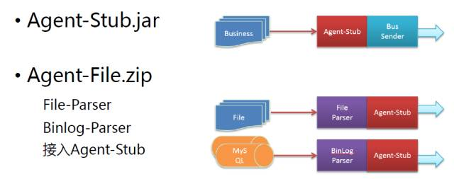  
如图所示，这是完全由我们自己设计和实现的一款组件。右边是采集组件，分为两部分：一个是基于java环境的独立工作程序；另一个是jar插件。插件叫Agen-Stub.jar；独立层是Agent-File.zip，Agent-File有一个paresr支持不同的文件类型，目前支持的file和Binlog，可扩展。根据需要可以增加parser，也是接入Agent-stub，拥有Agent-stub的一些特性。

  如上图右侧的示意图，Agent-stub接入多个Business，前面提到的一个埋点服务就是一个Business，它把数据交给Agent-stub，Agent-stub会往后发展，与file和MySQL相对应的是file parser，出来是Agent-stub，流程是一样的。  

2. **Agent-Stub.jar**  
接下来看Agent-Stub是如何设计的。  
**多线程、异步。这个毫无疑问**，做插件化肯定是这样考虑的，不能阻塞上层业务。  
**内存小队列+磁盘压缩队列。**这是我们改进最大的一个地方，早期版本中我们采用的是内存大队列，如果只有内存大队列缺点非常明显：
程序正常启动的时候大队列里的数据怎么办？要等他发完吗？还是不发完？当大队列塞满的时候，还有对上层业务的侵入性怎么办？程序遇到问题时怎么办？大队列可能是50万、100万甚至更多。
采用了内存小队列+磁盘压缩队列后可以解决正常程序的启停，保证数据没有问题，还可以解决空间的占用清空性的问题，以此同时，磁盘压缩队列还可以在程序出错的时候加速发送。
解释一下磁盘压缩队列， 这次我们设计协议的思想很简单：压缩之后得到一个字节速度，存在磁盘的文件里，这个文件按照小时存储，这时对于二次发送带来的损耗并不大，不需要重新阻断数据也不需要解析和压缩，只需要读出来发出去。后面还有一个提升就是磁盘发送队列跟内存发送队列是单独分开的，这样更能提升二次数据的发送性能。
**无损启停。**正常的启动和停止，数据是不会停止不会丢失的。
**Agent的版本号自动上报平台。**这个非常重要，我们早期的版本是没有的，可以想象一下当你的Agent节点是几千上万，如果没有一个平台直观地管理，那将是一个怎样恐怖的局面。现在我们每一个Agent启动的时候都会创建一个node path，把版本号放到path里，在管理平台解析这个path，然后做分类，我们的版本就是这样上报的。
**自动识入源，智能归类。**别接入源，智能归类。这个其实和上面那点是一样的，在早期版本中我们做一个Agent的标识，其实就是一个IP+一个POD，就是说你有几千个IP+POD量表需要人工管理，工作量非常大且乏味。我们优化了一个自动识别，把DataGroup放到Agent的node path里，管理平台可以做到自动识别。
**Agent的全面实时监控。**包括内存队列数、磁盘队列数、运行状态、出错状态、qps等，都可以Agent上报，并且在管理平台直观地看到哪一个节点是什么样子的。其做法也依赖于zookeeper的实现和承载，这里其实就是对zk node的应用，我们有一个定时线程收集当前Agent必要的数据，然后传到node的data上去，管理平台会获取这些date，最后做一个平台化的展示。
**支持实时命令。**包括括限流，恢复限流、停止、调整心跳值等，大大提高了运维能力。其实现原理也是依赖于Agent，这里我们创建一个Data Group，通过管理平台操作之后把数据放到Data Group里，然后会有一个监听者去监听获取数据的变化并作出相应的逻辑。
**兼容Docker。**目前魅族在用Doker，Doker对我们这边的Agent来讲是一个挑战，它的启动和停止是非常态化的，就是你可能认为相同的Docker容器不会重启第二次。
3. Agent-File.zip
**接入Agent-Stub。** Agent-file首先是接入Agent-stub，拥有Agent-stub的一些特性。
**兼容Docker。**因为启动和停止的常态，假设我们刚刚一个业务接入了Agent-stub，那停止的时候它会通知我，Agent-stub会把小队列里的数据抓到磁盘压缩队列里去。但是这里需要注意的是：磁盘压缩队列不能放到Docker自己的文件系统里，不然它停了之后数据就没有人能够得到了。
当Agent-stub停的时候，会有一个标识说磁盘要做队列，我们的数据有没有发完，磁盘压缩队列里有一个评级的标识文件，这时要用到Agent-file，Agent-file有一个单独的扫描线程一个个地去扫描Docker目录，扫到这个文件的时候判断其数据有没有发完，如果没发完就只能当做一个发送者。
支持重发历史数据。做大数据的可能都知道这些名词，比如昨天的数据已经采集完了，但由于某些原因有可能数据有遗漏，需要再跑一次后端的补贴逻辑，或者上马训练，这时就要做数据重发。我们在管理平台上就会有一个支持这种特定文件或特定时间段的选择，Agent接收到这个命令的时候会把相应的数据发上去，当然前提是数据不要被清了。
**管理平台自助升级。**这个可以理解成软件升级，Agent可以说是非常常见的组件，但是我们重新设计时把自动升级考虑在内，这也是我们为什么设计自己做而不是用开源的组件。这样做带来的好处是非常大的，我们几千个Agent在平台里只需要一键就可以完成自动升级。
**文件名正则表达式匹配。**文件名的扫描是用自动表达式。
**源目录定时扫描 and Jnotify。重点介绍文件扫描机制。**早期的版本是基于Agent-fire和KO-F两者结合做的数据采集：Agent-file是加码里对文件变更的事件鉴定，包括重命名、删除、创建都有一个事件产生；KO-F是拿到文件下的最佳数据。假设源目录里有一千个文件，KO-F现场就是一千个，Agent-file对应的文件变革赋予的追加、重命名等都可能会产生一系列事件，逻辑复杂。
所以我们设计了源目录定时扫描的机制，首先有一个目标，就是我们的文件队列，包括为未读文件、已读文件做区别，区别之后扫描，当然还会有像文件摘要等的存在这里不细讲，扫描之后更新未读文件、已读文件列表。
之所以加Jnotify是因为我们发现只用定制扫描不能解决所有业务场景的问题，jootify在这里起到补充定制扫描的作用，解决文件风险和文件产程的问题。
**单文件读取。**早期版本中这一点依赖于文件列表，当文件非常多时程序变得非常不稳定，因为可能要开几百个或几千个线程。后来我们改成了单文件的读取，上文提到的扫描机制会产生一个文件队列，然后从文件队列里读取，这样一个个文件、一段段图，程序就非常稳定了。
**文件方式存储offset，无损启停。**早期采用切入式PTE做存储，衔接非常重，后来我们改成文件方式存储，设计非常简单就只有两个文件：一个是目录下面所有文件的offset；一个是正在读的文件的offset。这里涉及到无损启停和策略的问题，我们定了一个5次算法：就是每读了5次就会刷盘一次，但只刷在读文件，别的文件不会变化，所以可以想象得到，当这个程序被替换走的时候，最多也就是重复5条数据，不会导致数据丢失。
4. **Agent示意图**  
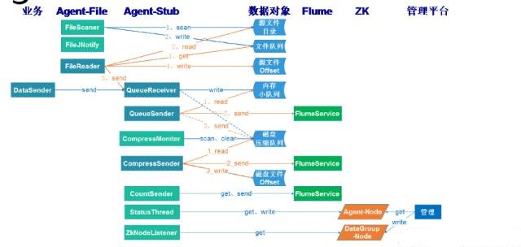  
如图是Agent示意图。上面是Agent-file和数据对象。Agent启动的时候要把里面的offset文件取来，就会产生未读文件和已读文件列表，扫描文件目录，然后更新文件队列，还有一个fileJNotify是相对应的文件队列。然后有一个比较重要的fileReader，我会先从文件队列里拿到再去读实际文件，读完刷盘之后这一块就成功了，我会根据我的刷盘去刷新offset。

  上图左边有一个业务加了一个Agent-stub，最后变成flume，这里有一个QueueReceiver（队列接收者），filereader和业务方的DataSender会把message发过来，QueueReceiver接受的数据就是一条条的message，然后发送到内存小队列里，当这边的小队列满了怎么办呢？中间有一个额外的固定大小的性能提升的地方用于message归类，当这个fIieReader往这个内存小队列发的时候发现塞不进去了，就会在规定大小的队列里发，当一个固定大小的队列满了之后就会打包压缩，以字节处理的方式存到磁盘压缩队列。

  再来说说我们为什么会提出二次数据的发送，其实就是多了一个countsender即压缩队列的发送者，直接的数据来源是磁盘压缩队列，与上面的并生没有任何冲突。Countsender的数据对账功能是我们整个平台的核心功能之一，基于这个统计的数据确保了其完整性，少一条数据我们都知道，在采集层有一个countsender，以另外一个渠道发出去，和真正的数据源渠道不一样，会更加的轻量化更加可靠，且数值非常小。

  最后是前文提到的监控和命令的实现，一边是Agentnode，一边是数据管理。
5. **Agent的坑**  
**丢数据。**如前文提到内存大队列带来的问题。

  **版本管理的问题**。

  **tailf -f的问题**。

  **网络原因导致zk删节点问题**。网络不稳定的时候，ZK会有一个节点的心跳检测，不稳定的时候监测会以为节点已经不存在了而把节点删掉，这会导致管理平台的节点监控、文件下发全部都失效。解决办法就是在message加一层控制检查线程，发现节点不在了再创建一遍。

  **乱码的问题**。可能会跟一些远程访问的软件相关，原则上我们假设第二次启动的时候没有配置我们的编码，默认与系统一致，但当远程软件启动的时候可能会发生不一样的地方，所以不要依赖于默认值，一定要在启动程序里设置希望的编码。

  **日志问题**，在插件化的时候肯定要考虑到业务方的日志，我们把业务方的日志刷死了，当网络出现问题的时候每发送一条就失败一条，那是不是都要打印出来？我们的考虑是第一条不打印，后面可能十条打印一次，一百条打印一次，一千条打印一次，这个量取决于业务。补充一点，我们有一个统计线程，可以根据统计线程观察Agent的正常与否。  

##五、流管理平台
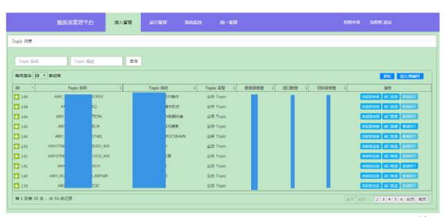  
如图所示，我们的流管理平台界面比较简单，但功能非常丰富，包括：
- 接入业务的管理、发布、上线；
- 对Agent节点进行实时监测、管理、命令；
- 对Flume进行监测、管理；
- 对实时计算的job的管理；
- 对全链路的数据流量对帐，这是我们自检的功能；
- 智能监控报警，我们有一个非常人性化的报警阀值的建议。取一个平均值，比如一周或一天，设定一个阀值，比如一天的流量访问次数可能是一千次，我们设计的报警是2000次，当连续一周都是2000次的时候就得改进。  

##六、数据中转
1. **背景**  
业务发展可能从1到100再到1000，或者当公司互联网发展到一定程度的时候业务可能遍布世界各地，魅族的云服务数据分为海外服务和国内服务，我们把业务拆分开来，大数据采集肯定也要跟着走，这就面临着数据中转的问题。  
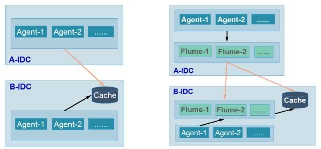  
如图所示是我们两个案例的示意图。黑色的是内网的线，橙色的是跨界性的线，有公网的、云端的、专线的，各种各样的网络情况。

  上面的是Agent集群，B-IDC也有一个Agent集群，直接访问我们登录的集群。

  这里第一个问题是我们的连接非常多，访问Agent节点的时候有几千个Agent节点就得访问几千个节点，这是不太友好的事情。另一个问题是当我们做升级迁移的时候，Agent要做修改和配置，必须得重启，当整个B-IDC迁移到A-IDC，我们加了一个Flyme集群。同样是一个Agent集群，下面有一个Flume集群，这样的好处：一是里面的连接非常少，线上的Flume一个ID就三台；二是这边承载了所有的Agent，除了Agent还有其他的采集都在A-IDC里中转，当这个片区要做升级的时候上面的业务是透明的，灵活性非常高。

2. **Flume介绍**
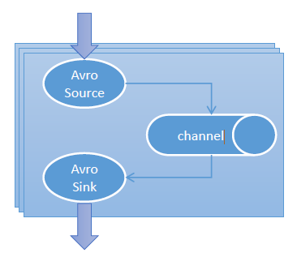  
Flume里有三个核心的部分：Source、Channel、Sink，Source是数据结构源；Channel相当于内存大队列，Sink是输出到不同的目标。官方提供了很多组件：Avro、HTTP、Thrift、Memory、File、Spillable Memory、Avro、Thrift、Hdfs、Hive。
3. **Flume实践**
无Group，采用Zookeeper做集群

  Agent采用LB做负载均衡，动态感知。结合Zookeeper可以感知到Agent列表，这时会采用负载均衡的做法找到当前的那个Flume，到后端的Flume直接变化的时候可以感知到从而下线。

  硬盘缓存、无损启停。采用memory可能会带来些不好的问题，如果内存队列改成文件就没有这个问题。因为内存速度快，存储强制刷新的时候就没有数据了，所以我们做了优化：还是采用memory，在Flume停的时候把数据采集下来，下一次启动的时候把数据发出去，这时就可以做到无损启停，但是有一点千万要注意：磁盘其实是固化在机器里面，当这台机器停下不再启动的时候，别忘了把数据移走发出去。

  停止顺序优化。在做优化的时候遇到源码的修改，其实就是Flume停止顺序的优化。原生里好像先停止Channel，然后提高sink，这就会导致想要做这个功能的时候做不到。我们应该先把这个数据改掉再去停止sink最后停止Channel，这样就保证Channel里的数据可以全部固化到硬盘里。

  多种转发方式。我们现在是全球的RBC，支持公网、内网、跨域性专线，我们提供一个非常好的功能：http sink，它也是一个安全的支持ssl的转换方式。

  自定义Sink，多线程发送（channel的get只能单线程）。
4. **停止顺序**
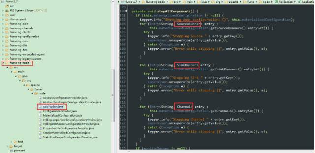  
如图是停止顺序的修改。这是一个sourceRunner、sink、channel。  
5. **Memory的capacity**  
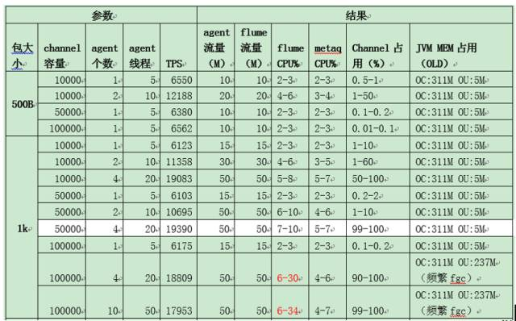  
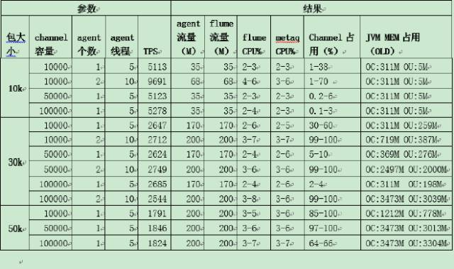  
选择内存之后，这个内存大小到底多少比较合适？如图所示，左边Flume是从500-1000，channel容量是5万、10万，还有Agent的个数、线程，我们发现在10万的时候它的fullGC是非常频繁的，所以我们最后定的大小是5万。当然不同的机器根据不同的测试得到自己的值，这个值不是恒定的。

  包大小从10K到30K到50K有什么不一样呢？很明显TPS从1万多降到了2000多，因为包越大网卡就越慢了，这里看到其实已经到了200兆（双网卡），把网卡跑满了。我们做流平台设计的时候，不希望链路被跑满，所以我们给了个建议值，大小在5-10K。当然，线上我们采用的万兆网卡。  

##七、实时计算
1. **实时计算集群**  
在SparkZK里直接写HA，可以减少不必要的MR提高IO，减少IO消耗。

  Kafka+Strom (ZK)  
2. Spark实践  
直接写HDFS底层文件

  自动创建不存在的Hive分区

  相应Metaq的日志切割，这一点上现在的Kafka是没有问题的，当时的日志切割会导致网络连接超时，我们查看源代码发现确实会堵塞，我们的解决方法是把切割调成多色或分区调多。

  不要定时的killJob。早期的Spark版本因为大批量的killJob导致一些不稳定的情况，某些job其实是没有被完全覆盖，假死在那里的。  
  
>作者：沈辉煌，魅族数据架构师，2010年加入魅族，负责大数据、云服务相关设计与研发；专注于分布式服务、分布式存储、海量数据下rdb与nosql融合等技术。

