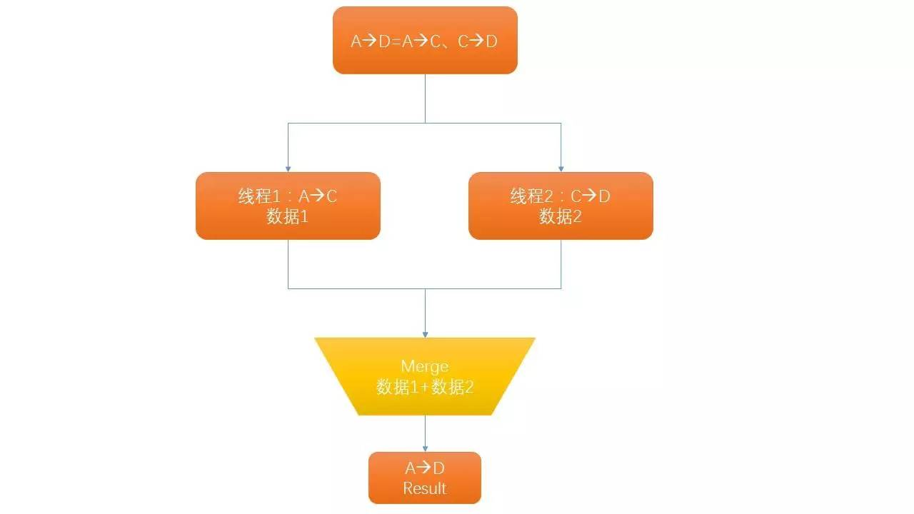

#去哪儿网机票搜索系统的高并发架构设计
“高并发”一直是大家感兴趣的话题。2010年~2012年，我曾在Qunar供职，主要负责机票搜索相关的业务，当时我们的搜索系统最高每天承载了亿级用户的高并发访问。那段日子，很苦很累，Qunar的发展很快，我也见证了搜索系统的技术演变历程，本文就来给大家讲讲机票高并发的故事。  

[TOC] 

##业务背景
Qunar成立于2005年，那时候大家还习惯打电话或者去代理商买机票。随着在线旅游快速发展，机票业务逐步来到线上。在“在线旅游”的大浪潮下，Qunar的核心业务主要是线上机票搜索和机票销售。根据2014年9月艾瑞监测数据，在旅行类网站月度独立访问量统计中，去哪儿网以4474万人名列前茅。截至2015年3月31日，去哪儿网可实时搜索约9000家旅游代理商网站，搜索范围覆盖全球范围内超过28万条国内及国际航线。  

Qunar由机票起家，核心产品包括机票搜索比价系统、机票销售OTA系统等。后来一度成为国内最大旅游搜索引擎，所以最开始大家知道Qunar都是从机票开始。  

在Qunar，我主要工作负责机票搜索系统。当时，搜索业务达到了日均十亿量级PV，月均上亿UV的规模。而整个搜索主系统设计上是比较复杂的，大概包含了七、八个子系统。那时线上服务器压力很大，时常出现一些高并发的问题。有时候为了解决线上问题，通宵达旦连续一两周是常有的事。尽管如此，我们还是对整个搜索系统做到了高可用、可扩展。  

为了大家了解机票搜索的具体业务，我们从用户角度看一下搜索的过程，如下图：  
  
根据上面的图片，简单解释下：

- 首页：用户按出发城市、到达城市、出发日期开始搜索机票，进入列表页。
- 列表页：展示第一次搜索结果，一般用户会多次搜索，直到找到适合他的航班，然后进入详情页。
- 产品详情页：用户填入个人信息，开始准备下单支付。

从上面的介绍可以看出，过程1和2是个用户高频的入口。用户访问流量一大，必然有高并发的情况。所以在首页和列表页会做一些优化：

- 前端做静态文件的压缩，优化Http请求连接数，以减小带宽，让页面更快加载出来。
- 前后端做了数据分离，让搜索服务解耦，在高并发情况下更灵活做负载均衡。
- 后端数据（航班数据）99%以上来自缓存，加载快，给用户更快的体验。而我们的缓存是  异步刷新的机制，后面会提及到。

在过亿级UV的搜索业务，其搜索结果核心指标：一是保证时间够快，二是保证结果实时最新。

为了达到这个指标，搜索结果就要尽量走缓存，我们会预先把航班数据放到缓存，当航班数据变化时，增量更新缓存系统。 所以，Qunar机票技术部就有一个全年很关键的一个指标：搜索缓存命中率，当时已经做到了>99.7%。再往后，每提高0.1%，优化难度成指数级增长了。哪怕是千分之一，也直接影响用户体验，影响每天上万张机票的销售额。

因此，搜索缓存命中率如果有微小浮动，运营、产品总监们可能两分钟内就会扑到我们的工位上，和钱挂上钩的系统要慎重再慎重。

这里还有几个值得关注的指标：

- 每台搜索实例的QPS（搜索有50~60台虚拟机实例，按最大并发量，每台请求吞吐量>1000）。
- 搜索结果的 Average-Time :  一般从C端用户体验来说，Average-Time 不能超过3秒的。

了解完机票搜索大概的流程，下面就来看看Qunar搜索的架构。

##搜索系统设计架构
  
Qunar搜索架构图  

上面提到搜索的航班数据都是存储在缓存系统里面。最早使用Memcached，通过一致Hash建立集群，印象大概有20台左右实例。 存储的粒度就是出发地和到达地全部航班数据。随着当时Redis并发读写性能稳步提高，部分系统开始逐步迁移到Redis，比如机票低价系统、推荐系统。

搜索系统按架构图，主要定义成前台搜索、后台搜索两大模块，分别用2、3标示，下面我也会重点解释。

###前台搜索  
主要读取缓存，解析，合并航班数据返回给用户端。

前台搜索是基于Web服务，高峰期时候最大启动了50台左右的Tomcat实例。搜索的URL规则是：出发城市+到达城市+出发日期，这和缓存系统存储最小单元：出发城市+到达城市+出发日期是一致的。

Tomcat服务我们是通过Nginx来做负载均衡，用Lua脚本区分是国际航线还是国内航线，基于航线类型，Nginx会跳转不同搜索服务器：主要是国际搜索、国内搜索(基于业务、数据模型、商业模式，完全分开部署)。不光如此，Lua还用来敏捷开发一些基本服务：比如维护城市列表、机场列表等。

###航班数据
上文我们一直提到航班数据，接下来简单介绍下航班的概念和基本类型，让大家有个印象，明白的同学可以跳过：

- 单程航班：也叫直达航班，比如BJ(北京)飞NY(纽约)。
- 往返航班：比如BJ飞NY，然后又从NY返回BJ。
- 带中转：有单程中转、往返中转；往返中转可以一段直达，一段中转。也可以两段都有中转，如下图：
  
其实，还有更复杂的情况：

如果哪天在BJ（北京）的你想来一次说走就走的旅行，想要去NY(纽约)。你选择了BJ直飞NY的单程航班。后来，你觉得去趟米国老不容易，想顺便去LA玩。那你可以先BJ飞到LA，玩几天，然后LA再飞NY。

不过，去了米国要回来吧，你也许：
1. NY直接飞回BJ。
2. 突然玩性大发，中途顺便去日本，从NY飞东京，再从东京飞BJ。
3. 还没玩够？还要从NY飞夏威夷玩，然后夏威夷飞东京，再东京飞首尔，最后首尔返回北京。

…… 有点复杂吧，这是去程中转、回程多次中转的航班路线。

对应国际航班还算非常正常的场景，比如从中国去肯尼亚、阿根廷，因为没有直达航班，就会遇到多次中转。所以，飞国外有时候是蛮有意思、蛮麻烦的一件事。

通过上面例子，大家了解到了机票中航线的复杂程度。但是，我们的缓存其实是有限的，它只保存了两个地方的航班信息。这样简单的设计也是有必然出发点：考虑用最简单的两点一线，才能最大限度上组合复杂的线路。

所以在前台搜索，我们还有大量工作要做，总而言之就是：

按照最终出发地、目的地，根据一定规则搜索出用户想要的航班路线。这些规则可能是：飞行时间最短、机票价格最便宜（一般中转就会便宜）、航班中转最少、最宜飞行时间。

你看，机票里面的航线是不是变成了数据结构里面的有向图，而搜索就等于在这个有向图中，按照一定的权重求出最优路线的过程！

###高并发下多线程应用
我们后端技术栈基于Java。为了搜索变得更快，我们大量把Java多线程特性用到了并行运算上。这样，充分利用CPU资源，让计算航线变得更快。 比如下面这样中转航线，就会以多线程方式并行先处理每一段航班。类似这样场景很多：  
  
Java的多线程对于高并发系统有下面的优势：

- Java Executor框架提供了完善线程池管理机制：譬如newCachedThreadPool、SingleThreadExecutor 等线程池。
- FutureTask类灵活实现多线程的并行、串行计算。
- 在高并发场景下，提供了保证线程安全的对象、方法。比如经典的ConcurrentHashMap，它比起HashMap，有更小粒度的锁，并发读写性能更好。线程安全的StringBuilder取代String、StringBuffer等等（Java在多线程这块实现是非常优秀和成熟的）。

###高并发下数据传输
因为每次搜索机票，返回的航班数据是很多的：

- 包含各种航线组合：单程、单程一次中转、单程多次中转，往返更不用说了。
- 航线上又区分上百种航空公司的组合。比如北京到纽约，有美国航空，国航，大韩，  东京等等各个国家的各大航空公司，琳琅满目。

那么，最早航班数据用标准的XML、JSON存储，不过随着搜索量不断飙升，CPU和带宽压力很大了。后来采取自己定义一种txt格式来传输数据：一方面数据压缩到原来30%~40%，极大的节约了带宽。同时CPU的运算量大大减低，服务器数量也随之减小。

在大用户量、高并发的情况下，是特别能看出开源系统的特点：比如机票的数据解析用到了很多第三方库，当时我们也用了Fastjson。在正常情况下，Fastjson 确实解析很快，一旦并发量上来，就会越来越吃内存，甚至JVM很快出现内存溢出。原因呢，很简单，Fastjson设计初衷是：先把整个数据装载到内存，然后解析，所以执行很快，但很费内存。

当然，这不能说Fastjson不优秀，现在看 GitHub上有8000多star。只是它不适应刚才的业务场景。

这里顺便说到联想到一个事：互联网公司因为快速发展，需要新技术来支撑业务。 那么，应用新的技术应该注意些什么呢？我的体会是：

- 好的技术要大胆尝试，谨慎使用。
- 优秀开源项目，注意是优秀。使用前一定弄清他的使用场景，多做做压力测试。
- 高并发的用户系统要做A/B测试，然后逐步导流，最后上线后还要有个观察期。

###后台搜索
后台搜索系统的核心任务是从外部的GDS系统抓取航班数据，然后异步写入缓存。

首先说一个概念GDS(Global Distribution System)即“全球分销系统”，是应用于民用航空运输及整个旅游业的大型计算机信息服务系统。通过GDS，遍及全球的旅游销售机构可以及时地从航空公司、旅馆、租车公司、旅游公司获取大量的与旅游相关的信息。

机票的源数据都来自于各种GDS系统，但每个GDS却千差万别：

1. 服务器遍布全球各地：国内GDS主要有中航信的IBE系统、黑屏数据（去机场、火车站看到售票员输入的电脑终端系统），国际GDS遍布于东南亚、北美、欧洲等等。
2. 通讯协议不一样，HTTP（API、Webservice）、Socket等等。
3. 服务不稳定，尤其国外的GDS，受网路链路影响，访问很慢（十几分钟长连接很常见），服务白天经常性挂掉。
4. 更麻烦的是：GDS一般付费按次查询，在大搜索量下，实时付费用它，估计哪家公司都得破产。而且就算有钱 , 各种历史悠久的GDS是无法承载任何的高并发查询。更苦的是，因为是创业公司，我们大都只能用免费的GDS，它们都是极其不稳定的。

所谓便宜没好货，最搞笑的一次是：曾经在米国的GDS挂了一、两天，技术们想联系服务商沟通服务器问题。因为是免费，就没有所谓的服务商一说，最后产品总监（算兼职商务吧）给了一个国外的网址，打开是这家服务商的工单页面，全英文，没有留任何邮箱。提交工单后，不知道什么时候回复。可以想想当时我的心情......

虽然有那么多困难，我们还是找到一些技术方案，具体如下。

###引入NIO框架
考虑GDS访问慢，不稳定，导致很多长连接。我们大量使用NIO技术：  
>NIO，是为了弥补传统I/O工作模式的不足而研发的，NIO的工具包提出了基于Selector（选择器）、Buffer（缓冲区）、Channel（通道）的新模式；Selector（选择器）、可选择的Channel（通道）和SelectionKey（选择键）配合起来使用，可以实现并发的非阻塞型I/O能力。

  
NIO并不是一下就凭空出来的，那是因为 Epoll 在Linux2.6内核中正式引入，有了I/O多路复用技术，它可以处理更多的并发连接。这才出现了各种应用层的NIO框架。

HTTP、Socket 都支持了NIO方式，在和GDS通信过程中，和过去相比：

- 通信从同步变成异步模式：CPU的开销、内存的占用都减低了一个数量级。
- 长连接可以支持更长超时时间，对国外GDS通信要可靠多了。
- 提高了后台搜索服务器的稳定性。

###消息队列
为了异步完成航班数据更新到缓存，我们采用消息队列方式(主备AMQ)来管理这些异步任务。具体实现如下。  
  
有一个问题，如何判断缓存过期呢？这里面有一个复杂的系统来设置的，它叫Router。资深运营会用它设置可以细化到具体一个航段的缓存有效期：比如说北京—NY，一般来说买机票的人不多的，航班信息缓存几天都没有问题。但如果北京—上海，那可能就最多5分钟了。

Router还有一个复杂工作，我叫它“去伪存真”。我们长期发现（真是便宜无好货），某些GDS返回航班数据不全是准确的，所以我们会把某些航线、甚至航班指定具体的GDS数据源，比如北京—新加坡：直达航班数据 来自于ABAQUS，但是中转数据，北京—上海—新加坡，  或者北京—台北—新加坡 从IBE来会精准些。

因此Router路由规则设计要很灵活。通过消息队列，也其实采用异步化方式让服务解耦，进行了很好的读写分离。  

###GDS服务抽象虚拟Node
为了管理好不同GDS资源，最大的利用它们。我们把GDS服务器抽象成一组Node节点来便于管理，像下面这样：  
  

具体原理：按照每个GDS服务器稳定性（通过轮休方式，不断Check它们的可用性）和查询性能，我们算出一个合理的权重，给它分配对应的一组虚拟的Node节点，这些Node节点由一个Node池统一管理。这样，不同的GDS系统都抽象成了资源池里面的一组相同的Node节点。

那么它具体如何运转的呢？

当缓存系统相关航班数据过期后，前台搜索告知MQ有实时搜索任务，MQ统一把异步任务交给Router，这个时候Router并不会直接请求GDS数据，而是去找Node池。Node池会动态分配一个Node节点给Router，最后Router查找Node节点映射的GDS，然后去请求数据，最后异步更新对应的缓存数据。通过技术的实现，我们把哪些不稳定的，甚至半瘫痪的GDS充分利用了起来（包含付费的一种黑屏终端，我们把它用成了免费模式，这里用到了某些黑科技，政策原因不方便透露），同时满足了前台上亿次搜索查询！

###监控系统
鉴于机票系统的复杂度和大业务量，完备监控是很必要的：

1、整个Qunar系统架构层级复杂，第三方服务调用较多（譬如GDS），早期监控系统基于CACTI+NAGIOS ，CACTI有很丰富的DashBoard，可以多维度的展示监控数据。除此以外，公司为了保证核心业务快速响应，埋了很多报警阈值。而且Qunar还有一个NOC小组，是专门24小时处理线上报警：记得当时手机每天会有各种系统上百条的报警短信。

当然，我还是比较淡定了。因为系统太多，报警信息也不尽是系统bug，它可能是某些潜在的问题预警，所以，系统监控非常至关重要。

2、复杂系统来源于复杂的业务，Qunar除了对服务器CPU、内存、IO系统监控以外，远远是不够的。我们更关心，或者说更容易出问题是业务的功能缺陷。所以，为了满足业务需要，我们当时研发了一套业务监控的插件，它的核心原理如下图：
  
它把监控数据先保存到内存中，内部定时程序每分钟上传数据到监控平台。同时它作为一个Plugin，可以即插即用。接入既有的监控系统，它几乎实时做到监控，设计上也避免了性能问题。后期，产品、运营还基于此系统，做数据分析和预测:比如统计出票正态分布等。因为它支持自定义统计，有很方便DashBoard实时展示。对于整个公司业务是一个很有力的支撑。

到今天，这种设计思路还在很多监控系统上看到相似的影子。  

###机票销售系统
机票另一个重要系统TTS：TTS(Total Solution)模式，是去哪儿网自主研发的交易平台，是为航空公司、酒店在线旅游产品销售系统。

TTS有大量商家入驻，商家会批量录入航班价格信息。

为了减少大量商家同时录入海量数据带来的数据库并发读写的问题，我们会依据每个商家规模，通过数据库动态保存服务器IP，灵活的切换服务器达到负载均衡的效果。这里不再细说了。

最后，回顾整个搜索架构的设计，核心思想体现了服务的一种解耦化。设计的系统虽然数量看起来很多，但是我们出发点都是把复杂的业务拆解成简单的单元，让每一个单元专注自己的任务。这样，每个系统的性能调优和扩展性变得容易。同时，服务的解耦使整个系统更好维护，更好支撑了业务。  

##作者介绍
**蒋志伟**，前美团、Qunar架构师，先后就职于阿里、Qunar、美团，精通在线旅游、O2O等业务，擅长大型用户的SOA架构设计，在垂直搜索系统领域有丰富的经验，尤其在高并发线上系统方面有深入的理论和实践，目前在pmcaff担任CTO。

