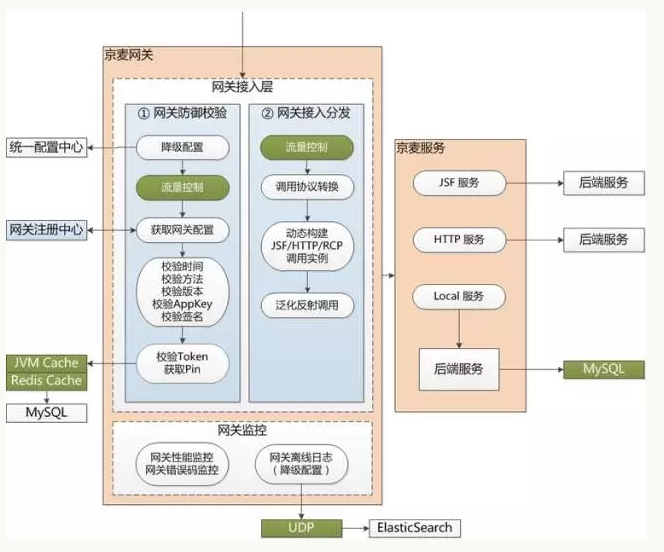
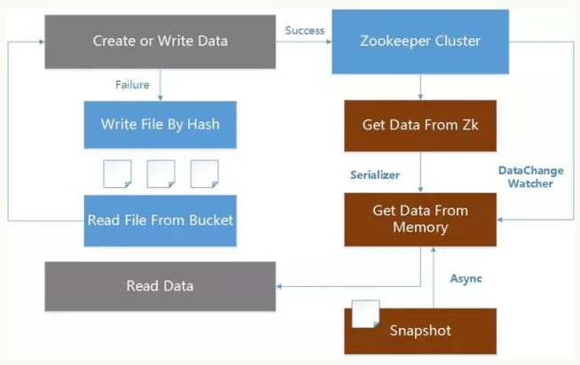
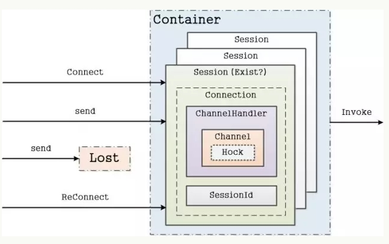
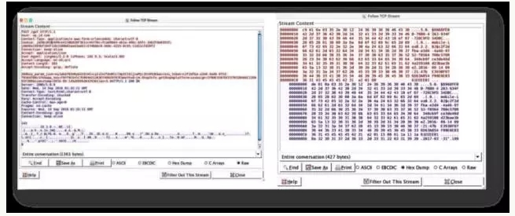
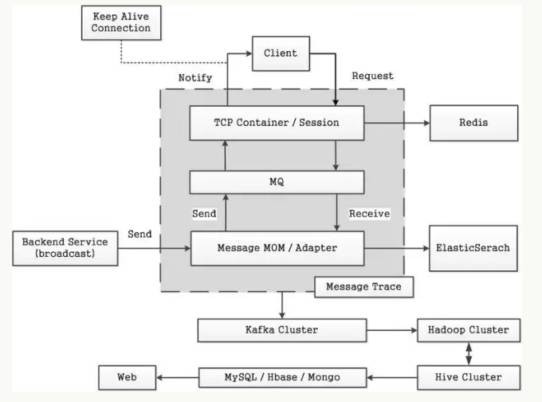
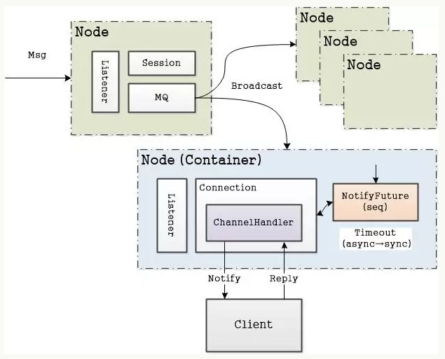

#京东京麦开放平台的高可用架构之路
[TOC]
京麦是京东商家的多端开放式工作平台，是京东十万商家唯一的店铺运营管理平台，为京东商家提供在移动和桌面端的操作业务，京麦本身是一个开放的端体系架构，由京东官方和 ISV 为商家提供多样的应用服务。

京麦开发平台是京东系统与外部系统通讯的重要平台，技术架构从早期的单一 Nginx+Tomcat 部署，到现在的单一职责，独立部署，去中心化，以及自主研发了 JSF/HTTP 等多种协议下的 API 网关、TCP 消息推送、APNs 推送、降级、限流等技术。

京麦开放平台每天承载海量的 API 调用、消息推送，经历了 4 年京东 618 的流量洗礼。本文将为您揭开京麦开放平台高性能 API 网关、高可靠的消息服务的技术内幕。

##1 高性能 API 网关
京东内部的数据分布在各个独立的业务系统中，包括订单中心、商品中心、商家中心等，各个独立系统间通过 JSF（Jingdong Service Framework）进行数据交换。而 API 网关基于 OAuth2 协议提供，ISV 调用是通过 HTTP 的 JSON 协议。

如何将这些内部数据安全可控地开放给外部 ISV 进行服务调用，以及如何快速地进行 API 接入实现数据报文转化，在这个背景下 API 网关诞生。  
  
API 网关在架构设计上采用了多层接口，到达网关的请求首先由网关接入层拦截处理，在接入层进行两个主要环节的处理：

1. 网关防御校验：这里包含降级和限流，以及多级缓存等，进行数据正确性校验；
2. 网关接入分发：网关分发会根据网关注册中心的数据进行协议解析，之后动态构建调用实例，完成服务泛化调用。

API 网关是为了满足 618 高并发请求下的应用场景，网关在服务调度、身份授权、报文转换、负载与缓存、监控与日志等关键点上进行了针对性的架构优化。

###1.1 API 元数据统一配置
API 的调用依赖对元数据获取，比如 API 的字段信息、流控信息、APP 密钥、IP 白名单等、权限配置等。在 618 场景下，元数据获取性能是 API 网关的关键点。基于 DB 元数据读取是不可取的，即使对 DB 做分库分表处理也不行，因为 DB 就不是用来抗量的。

其次，要考虑到元数据的更新问题，定时的轮训更新会产生极大延迟性，而且空轮训也是对系统资源的极大浪费，采用 MQ 广播通知不失为一种解决办法，但 MQ 仅仅解决数据同步的问题，数据缓存在集群里服务如何保证数据一致性和数据容灾，又极大的增加了系统复杂度。

所以综合考虑服务器性能和网络 IO 等因素，在 API 元数据读取采用基于 ZooKeeper 的统一配置，并自研实现多级缓存容灾架构方案，从 ZooKeeper、内存和本地文件等进行多级缓存，同时支持数据变更时即时同步，以及系统宕机网络异常等情况下的数据自动容灾等策略。  
  

**以读为例，**网关首先从内存中读取配置，如无数据，从 ZooKeeper 读取，读取后同步到内存，并异步保存本次快照。如果 ZooKeeper 数据变更，通过监听 ZooKeeper 的 DataChangeWatcher 变更同步数据。如果 ZooKeeper 宕机，重启服务器，系统还可以通过本地快照恢复最近一次的元数据配置。

###1.2 TCP 全双工的长链接会话通道
API HTTP 网关通过接口提供服务调用获取请求数据的，而搭建客户端与服务平台的 TCP 网关的双向通道，以保持客户端与服务平台的会话状态，则可以在 HTTP 网关基础上提供更多、更灵活的技术实现和业务实现。

在业务服务调用上通过 HTTP 网关，在平台服务调用上则通过 TCP 网关，实现平台与业务解耦，并且平台采用 TCP 通道还可以增加对平台的控制力，在此背景下诞生了 TCP 网关。

TCP 网关采用长连接通道，实现全双工会话。TCP 网关采用 Netty 作为 TCP 容器，在 ChannelPipe中加载自定义 ChannelHandler，构建 Container 容器，将每个 TCP Connection 封装到一个 Session 会话中，保存在 Container 容器中，由 Container 容器构建 Session 会话层提供逻辑层请求调用。

自研构建 Session 会话层是因为 HTTP 属于 OSI 的应用层，而 TCP 属于 OSI 的传输层，面向连接的编程极大的增加程序复杂度，所以将 Connection 封装在每一个 Session 会话里，再以微服务的方式提供服务调用，极大的精简了 TCP 编程。

##1.3 断线重连
客户端与服务端通过 TCP 长连接进行通信，但在中国复杂的网络环境下，移动客户端可能由于网络抖动、弱网络情况下，遭遇非正常网络闪断，如何处理断开后的断线重连，保证客户端与服务端的通讯稳定呢？

  
客户端每通过 TCP 与服务端进行一次建连，都会在服务容器里创建一个 Session 会话，该会话保存 Connection 的句柄，对应 Netty 的一个 Channel 通道。建连成功后，通过定时的心跳保持 Channel 属于 Active 活跃。但客户端进入弱网络环境下，客户端可能已经掉线，但并未向服务端主动发送关闭 Channel 请求，而服务端仍认为该 Channel 仍存活。直到在由服务端的会话存活检测机制检测到 Channel 已经 InActive，才会由服务端销毁该 Channel。

服务端的会话存活检测是 5 分钟一次，所以存在客户端掉线后，在 5 分钟内又重新建连，而这时服务端的建连逻辑，不是重新创建一个 Session，而是去寻找上一次的 Session，并更新标识存活。具体的实现是在每次建连的 Channel 里存入 SessionId，当网络闪断后，判断 Channel 是否存在 Session，之所以实现是得益于 Netty 的 ChannelHandlerContext，可以存储一个自定义属性到 Channel 的上下文中。

当然，TCP 网关一定是集群，所以，断线重连也是极有可能请求到不同的服务器上，而这种情况按照新 Connection 创建的 Session 处理，只有出现重连到同一服务器时，才需要考虑上述的处理逻辑。

###1.4 Protobuf 数据交换格式
HTTP 网关基于 JSON 进行数据传输，JSON 是 key-value 的键值对通信协议，所以生成报文会很大，所以影响传输性能。考虑到报文传输大小，在 TCP 网关中则通过 Protobuf 定义通信协议，提升数据传输效率  

  
Protobuf 支持 Java、Objective-C 和 C++ 等语言，现支持了京麦平台 PC 桌面客户端、移动 iOS 和 Android 客户端基于 Protobuf 通过 TCP 与服务端进行通信。  
###1.5 多维度流量控制
由于各个 API 的服务能力不一致，为了保证各个 API 能够稳定提供服务，不会被暴涨的请求流量击垮，那么多维度流量控制是 API 网关的一个重要环节。

目前 API 网关是采用令牌桶的方法，实现方式是 Guava RateLimter，简单有效，再结合统一配置中心，可以动态调整限流阈值。不用重启服务器即可实现快速限流策略调整。

在 API 网关里面还有一个设置，就是并发度，这个是方法粒度的，对每一个调用接口都有一个并发度数值设置，而且是动态设置，也是通过 ZooKeeper 下发到每一个服务节点上。并发度的具体实现是通过 JDK 的 Semaphore。

##2 高可靠的消息服务
API 网关提供 ISV 获取数据，但实时数据的获取，如果通过轮询网关，大量空转不仅非常的低效且浪费服务器资源。基于此，开放平台推出了消息推送技术，提供一个实时的、可靠的、异步的双向数据交换通道，提升 API 网关性能。

  
###2.1 AnyCall 和推送系统
####2.1.1 AnyCall
负责接收各业务中心的订单、商品、商家等消息，进行统一的消息过滤、转换、存储，及监控和统计等。各个过程中的消息状态，通过消息采集器存储到 ElasticSearch 和 HBase 进行存储。

####2.1.2 推送系统
基于 Netty 作为网络层框架，构建海量推送模型，使用静默长连接通道，实现从消息接收、推送、确认，整个过程的完全异步化处理。

解耦消息接入层和消息推送层，消息接入层只负责Request-Response和 Notice-Repley，而消息解析、适配、推送等逻辑处理都全部由消息推送层处理，而消息接入层和消息推送层之间则有消息队列异步进行通信。

###2.2 半推半拉还是半推半查?
####2.2.1 半推半拉
半推半拉模式中的“推”指的是由服务器推送 消息通知 到客户端，“拉”指的是客户端收到通知后再从服务器拉取 消息实体 到客户端本地存储。

其中消息通知发送的仅是一个命令关键字，这样的设计是考虑消息推送可能存在丢失，通过拉取的方式，确保即使消息通知未送达，在下次消息通知触发下的拉取也能把上一次消息拉取到本地。采用的半推半拉，每次仅推送通知，推送量小，实时性高。
####2.2.2 半推半查
后期京麦消息推送模式由“拉”改“查”，“查”指的是消息通知依旧推送，但客户端收到消息通知后 不再拉取消息实体，仅更新消息未读数和进行消息提醒等操作，而消息内容则是由服务端进行云端存储，采用轻客户端，重服务端的架构方案，只有用户点击查询消息时，才会按需进行数据查询，在客户端展示，但不存储。

这种推送模式的改动主要考虑了客户端拉取消息内容到本地存储，占用资源，重装之后客户端会丢失消息，以及多端存储的数据存在不一致等问题。消息云端存储基于 ElasticSearch 进行消息存储，并根据业务类型区分索引，通过 Routing 优化查询性能，支持多维度进行查询，性能稳定。

###2.3 消息确认
评估消息系统的一个核心指标是消息送达率。为保证每一条消息准确送达，为每条消息都会开启一个事务，从推送开始，到确认结束，如果超时未确认就会重发这条消息，这就是消息确认。

由于互联网环境复杂，消息超时时间不能设置太短，尤其在移动弱网络环境下。在本系统的中超时设置为 10 秒。

 
我们通过实现 Future 自定义 NotifyFuture，为每个下行通知分配一个 seq，并定义 NotifyFuture 的 timeout。即每个下行通知分配一个 seq 存储缓存中，等待客户端回应这个应答，如果应答， 则从缓存移出这个 seq，否则等待超时，自动从缓存中被移出。  

###2.4 APNs 消息推送
iOS 在系统层面与苹果 APNs（Apple Push Notification Service）服务器建立连接，应用通过 Socket 向 APNs Server 推送消息，然后再由 APNs 进行推送。但是基于 Socket 的 APNs 协议是一种反人类的设计，在推送消息存在很多问题。

鉴于此，对 APNs 推送服务进行重构，基于 Netty 构建了 HTTP2 协议的推送服务，支持同步和异步的推送方式；解决 Channel 异常及 InActive 时重连等问题，保证 HTTP2 推送管道的问题；同时通过 IdleStateHandler 保持 HTTP2 长连接的心跳 。

##3 总结和感悟
最后，总结历次的大促，京麦开发平台在进行服务化架构的演进过程中，所面临的技术难点，最重要的还是服务治理，即调用关系的梳理。因为我们要打造的不是一个系统，也不是一堆系统，而是一个平台生态，能够持续地提高系统的运营能力。

这里以“精打细算，大道至简”这句话结束此次京麦开放平台的总结。

##4 作者介绍
张松然，2013 年加入京东，一直从事京东商家麦开放平台的架构设计和开发工作，熟悉大规模分布式系统架构。在 Web 开发、架构优化上有较丰富的实战经历。有多年 NIO 领域的设计、开发经验，对 HTTP、TCP 长连接有深入研究与领悟。目前主要致力于多端开放平台技术架构的优化与实现

