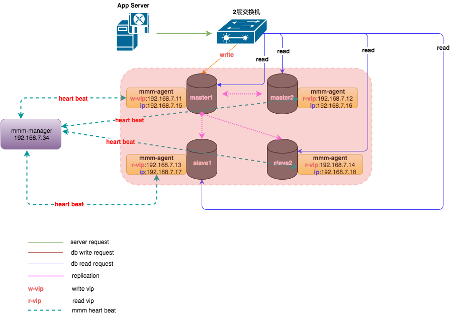
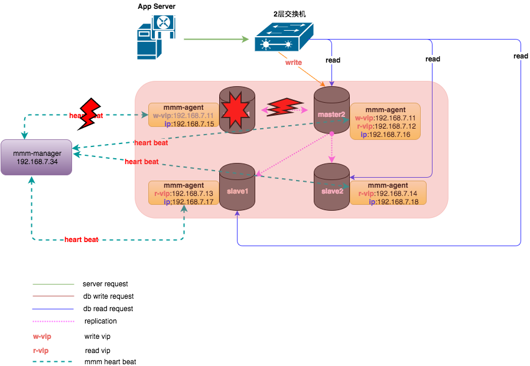
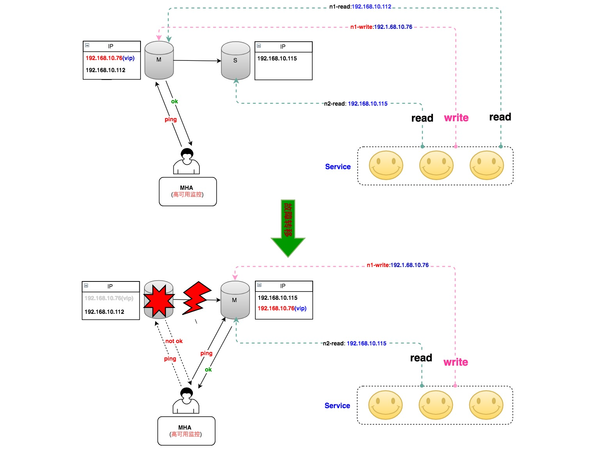
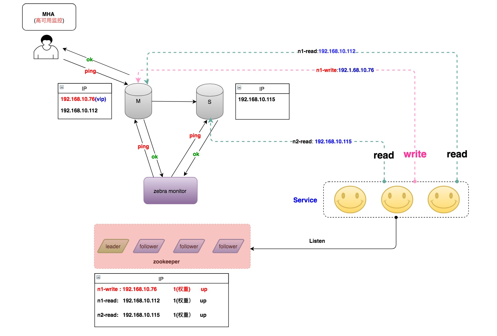
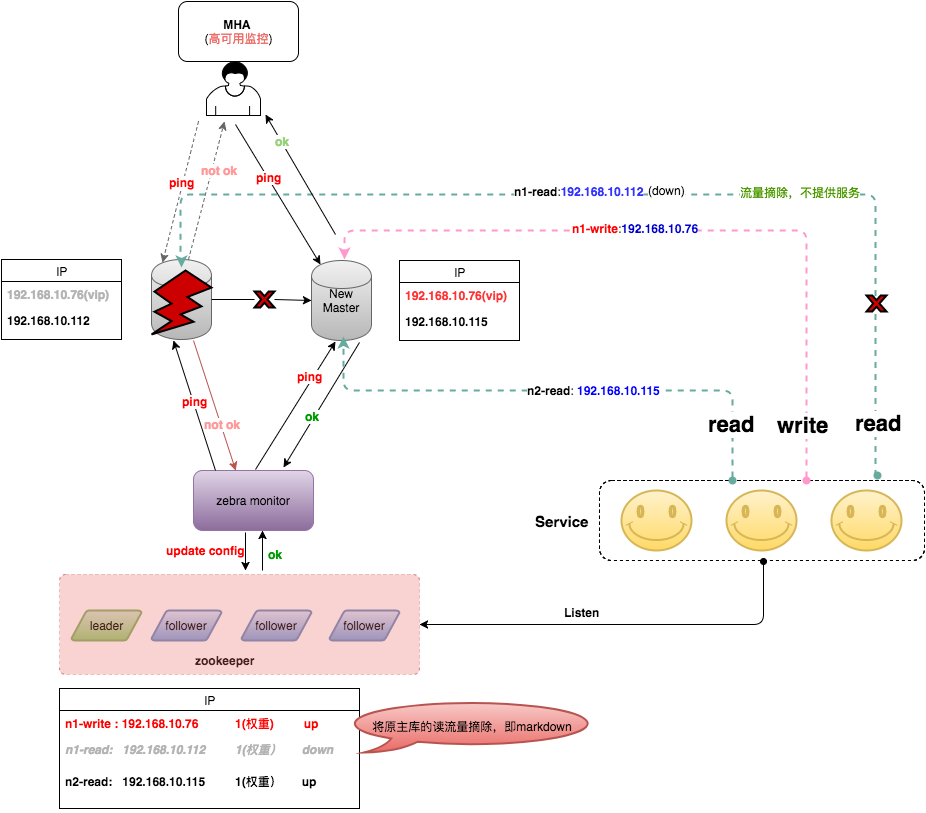
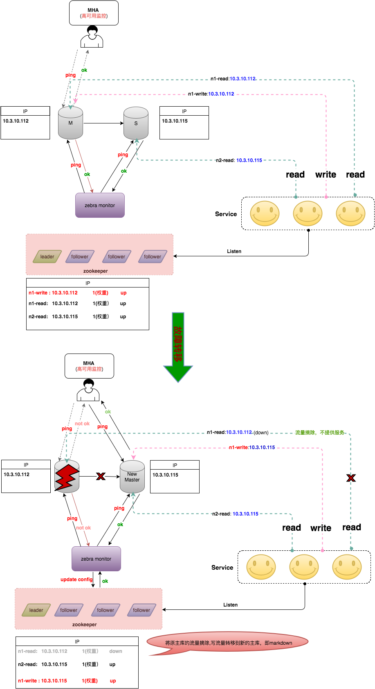
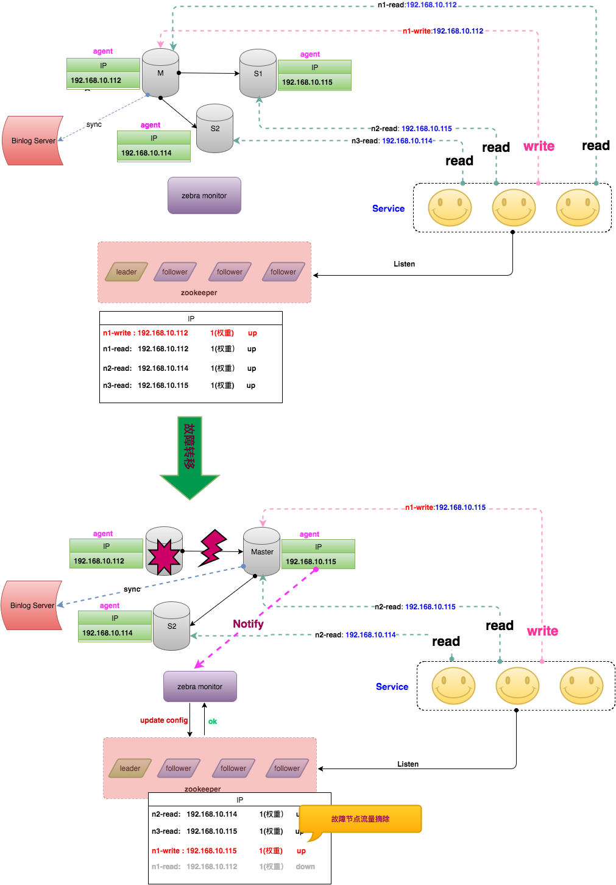
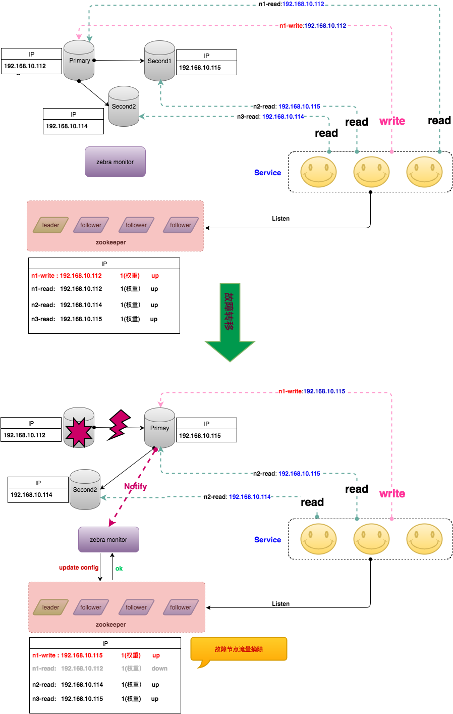

#美团点评数据库高可用架构的演进与设想
>金龙 ·2017-06-29 20:11
>本文介绍最近几年美团点评MySQL数据库高可用架构的演进过程，以及我们在开源技术基础上做的一些创新。同时，也和业界其它方案进行综合对比，了解业界在高可用方面的进展，和未来我们的一些规划和展望。
[TOC]

##1 MMM
在2015年之前，美团点评（点评侧）长期使用MMM（Master-Master replication manager for MySQL）做数据库高可用，积累了比较多的经验，也踩了不少坑，可以说MMM在公司数据库高速发展过程中起到了很大的作用。

MMM的架构如下。
  
如上所示，整个MySQL集群提供1个写VIP（Virtual IP）和N（N>=1）个读VIP提供对外服务。每个MySQL节点均部署有一个Agent（mmm-agent），mmm-agent和mmm-manager保持通信状态，定期向mmm-manager上报当前MySQL节点的存活情况（这里称之为心跳）。当mmm-manager连续多次无法收到mmm-agent的心跳消息时，会进行切换操作。

mmm-manager分两种情况处理出现的异常。
1. 出现异常的是从节点
	- mmm-manager会尝试摘掉该从节点的读VIP，并将该读VIP漂移到其它存活的节点上，通过这种方式实现从库的高可用。
2. 出现异常的是主节点
	- 如果当时节点还没完全挂，只是响应超时。则尝试将Dead Master加上全局锁（flush tables with read lock）。
	- 在从节点中选择一个候选主节点作为新的主节点，进行数据补齐。
	- 数据补齐之后，摘掉Dead Master的写VIP，并尝试加到新的主节点上。
	- 将其它存活的节点进行数据补齐，并重新挂载在新的主节点上。

主库发生故障后，整个集群状态变化如下：
  
mmm-manager检测到master1发生了故障，对数据进行补齐之后，将写VIP漂移到了master2上，应用写操作在新的节点上继续进行。

然而，MMM架构存在如下问题：
- VIP的数量过多，管理困难（曾经有一个集群是1主6从，共计7个VIP）。某些情况下会导致集群大部分VIP同时丢失，很难分清节点上之前使用的是哪个VIP。
- mmm-agent过度敏感，容易导致VIP丢失。同时mmm-agent自身由于没有高可用，一旦挂掉，会造成mmm-manager误判，误认为MySQL节点异常。
- mmm-manager存在单点，一旦由于某些原因挂掉，整个集群就失去了高可用。
- VIP需要使用ARP协议，跨网段、跨机房的高可用基本无法实现，保障能力有限。

同时，MMM是Google技术团队开发的一款比较老的高可用产品，在业内使用的并不多，社区也不活跃，Google很早就不再维护MMM的代码分支。我们在使用过程中发现大量Bug，部分Bug我们做了修改，并提交到开源社区，有兴趣的同学可以参考这里。

##2 MHA
针对于此，从2015年开始，美团点评对MySQL高可用架构进行了改进，全部更新为MHA，很大程度上解决了之前MMM遇到的各种问题。

MHA（MySQL Master High Availability）是由Facebook工程师Yoshinori Matsunobu开发的一款MySQL高可用软件。从名字就可以看出，MHA只负责MySQL主库的高可用。主库发生故障时，MHA会选择一个数据最接近原主库的候选主节点（这里只有一个从节点，所以该从节点即为候选主节点）作为新的主节点，并补齐和之前Dead Master 差异的Binlog。数据补齐之后，即将写VIP漂移到新主库上。

整个MHA的架构如下（为简单起见，只描述一主一从）：
  
这里我们对MHA做了一些优化，避免一些脑裂问题。

比如DB服务器的上联交换机出现了抖动，导致主库无法访问，被管理节点判定为故障，触发MHA切换，VIP被漂到了新主库上。随后交换机恢复，主库可被访问，但由于VIP并没有从主库上摘除，因此2台机器同时拥有VIP，会产生脑裂。我们对MHA Manager加入了向同机架上其他物理机的探测，通过对比更多的信息来判断是网络故障还是单机故障。

##3 MHA+Zebra (DAL)
Zebra（斑马）是美团点评基础架构团队开发的一个Java数据库访问中间件，是在c3p0基础上包装的美团点评内部使用的动态数据源，包括读写分离、分库分表、SQL流控等非常强的功能。它和MHA配合，成为了MySQL数据库高可用的重要一环。如下是MHA+Zebra配合的整体架构：
  
还是以主库发生故障为例，处理逻辑有如下两种方式：

- 当MHA切换完成之后，主动发送消息给Zebra monitor，Zebra monitor更新ZooKeeper的配置，将主库上配置的读流量标记为下线状态。
- Zebra monitor每隔一段时间（10s ~ 40s）检测集群中节点的健康状况，一旦发现某个节点出现了问题，及时刷新ZooKeeper中的配置，将该节点标记为下线。

一旦节点变更完成，客户端监听到节点发生了变更，会立即使用新的配置重建连接，而老的连接会逐步关闭。整个集群故障切换的过程如下（仅描述Zebra monitor主动探测的情况，第一种MHA通知请自行脑补^_^）。
  

由于该切换过程还是借助于VIP漂移，导致只能在同网段或者说同个二层交换机下进行，无法做到跨网段或者跨机房的高可用。为解决这个问题，我们对MHA进行了二次开发，将MHA添加VIP的操作去掉，切换完之后通知Zebra monitor去重新调整节点的读写信息（将Write调整为new master的实IP，将Dead Master的读流量摘除），整个切换就完全去VIP化，做到跨网段、甚至跨机房切换，彻底解决之前高可用仅局限于同网段的问题。上述切换过程就变成了如下图。
  

然而，这种方式中的MHA管理节点是单点，在网络故障或者机器宕机情况下依然存在风险。同时，由于Master-Slave之间是基于Binlog的异步复制，也就导致了主库机器宕机或者主库无法访问时，MHA切换过程中可能导致数据丢失。

另外，当Master-Slave延迟太大时，也会给数据补齐这一操作带来额外的时间开销。

##4 Proxy
除了Zebra中间件，美团点评还有一套基于Proxy的中间件，和MHA一起配合使用。当MHA切换后，主动通知Proxy来进行读写流量调整，Proxy相比Zebra更加灵活，同时也能覆盖非Java应用场景。缺点就是访问链路多了一层，对应的Response Time和故障率也有一定增加。有兴趣的同学们可以自行前往GitHub查询详细文档。
[详细文档](https://github.com/Meituan-Dianping/DBProxy)  

##5 未来架构设想
上文提到的MHA架构依然存在如下两个问题：

- 管理节点单点。
- MySQL异步复制中的数据丢失。

针对于此，我们在部分核心业务上使用Semi-Sync，可以保证95%以上场景下数据不丢失（依然存在一些极端情况下无法保障数据的强一致性）。另外，高可用使用分布式的Agent，在某个节点发生故障后，通过一定的选举协议来选择新的Master，从而解决了MHA Manager的单点问题。

针对上述问题，我们研究了业界的一些领先的做法，简单描述如下：
###5.1 主从同步数据丢失
针对主从同步的数据丢失，一种做法是创建一个Binlog Server，该Server模拟Slave接受Binlog日志，主库每次的数据写入都需要接收到Binlog Server的ACK应答，才认为写入成功。Binlog Server可以部署在就近的物理节点上，从而保证每次数据写入都能快速落地到Binlog Server。在发生故障时，只需要从Binlog Server拉取数据即可保证数据不丢失。
###5.2 分布式Agent高可用
针对MHA管理节点单点问题，一种做法是让MySQL数据库集群中每个节点部署Agent，发生故障时每个Agent均参与选举投票，选举出合适的Slave作为新的主库，防止只通过Manager来切换，去除MHA单点。整个架构如下图所示。
  
###5.3 MGR结合中间件高可用
上述方式某种程度上解决了之前的问题，但是Agent和Binlog Server却是新引入的风险，同时Binlog Server的存在，也带来了响应时间上的额外开销。有没有一种方式，能够去除Binlog Server和Agent，又能保证数据不丢失呢 ？答案当然是有的。

最近几年，MySQL社区关于分布式协议Raft和Paxos非常火，社区也推出了基于Paxos的MGR版本的MySQL，通过Paxos将一致性和切换过程下推到数据库内部，向上层屏蔽了切换细节。架构如下（以MGR的single-primary为例）。
  
当数据库发生故障时，MySQL内部自己进行切换。切换完成后将topo结构推送给Zebra monitor，Zebra monitor进行相应的读写流量变更。不过，该架构存在与Binlog Server同样的需要回复确认问题，就是每次主库数据写入，都需要大多数节点回复ACK，该次写入才算成功，存在一定的响应时间开销。同时，每个MGR集群必须需要奇数个数（大于1）的节点，导致原先只需要一主一从两台机器，现在需要至少三台，带来一定的资源浪费。但不管怎么说，MGR的出现是无疑是MySQL数据库又一次伟大的创新。 

##6 结语
本文介绍了美团点评MySQL数据库高可用架构从MMM到MHA+Zebra以及MHA+Proxy的演进历程，同时也介绍了业界一些高可用的做法。数据库最近几年发展突飞猛进，数据库的高可用设计上没有完美的方案，只有不断的突破和创新，我们也一直在这条路上探索更加优秀的设计与更加完美的方案。

##作者简介
金龙，14年加入新美大，主要从事相关的数据库运维，高可用和相关的运维平台建设。对运维高可用与架构相关感兴趣的同学可以关注我的个人微信公众号 “自己的设计师”，定期推送运维相关原创内容。

美团点评DBA团队招聘各类DBA人才，base北京上海均可。我们致力于为公司提供稳定、可靠、高效的在线存储服务，打造业界领先的数据库团队。这里有基于Redis Cluster构建的大规模分布式缓存系统Squirrel，也有基于Tair进行大刀阔斧改进的分布式KV存储系统Cellar，还有数千各类架构的MySQL实例，每天提供万亿级的OLTP访问请求。真正的海量、分布式、高并发环境。欢迎各位朋友推荐或自荐至jinlong.cai#dianping.com。

