#携程高可用架构的演变和迭代——应用开发者视角
>2017-07-01 CSDN
>**作者简介：**周源，携程技术中心基础业务研发部高级研发经理，从事软件开发10余年。2012年加入携程，先后参与支付、营销、客服、用户中心的设计和研发。
[TOC]

##前言
携程的架构经历了长期的演变和迭代，其中多个产品已经历了5次以上更新换代。每次迭代都有其背景和出发点，都解决了前一个版本的痛点又不可避免地带来一些新的问题或遗漏一些问题。这种迭代过去、现在，以及将来将一直持续，其中经历可圈可点，值得技术人细细品味。

本文会首先从总体介绍携程架构的组成，然后以发布系统、配置管理和SOA三个实际案例，详细介绍架构迭代，最后以UserProfile项目具体介绍携程架构亮点的点滴。

声明一下，本人现担任携程用户帐户信息的开发负责人，文章更多是从一位基层团队负责人和一线开发人员的角度给大家分享携程架构历程。

文中涉及架构的方方面面，其中运维相关内容由运维团队负责；架构相关内容由架构、框架、工具各团队负责；应用相关内容除用户帐户信息以外都是由其他开发团队负责。对于不是本人负责的产品，文章仅站在使用方、合作方的角度，作客观、公正、事实的描述，且已尽量争取各团队负责人的授权、收集各团队负责人的建议。

##1.架构的组成
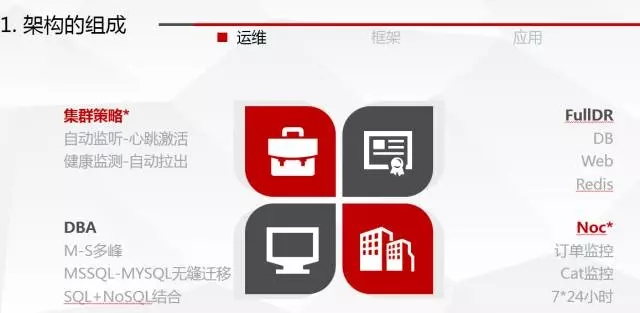  
总体来说，架构由三部分组成：运维、框架、应用  
###1.1 运维
谈到高可用和稳定性，我们首先想到的肯定是运维。携程的运维是应用和架构坚强的后盾，主要有四大亮点。
####1.1.1 集群管理策略
携程的Web集群有slb控制流量，根据healcheck的结果可以自动拉出和拉入。发布和扩容过程对开发透明，当机器check成功且没有报错时，机器将拉入集群。当check失败或单位时间报错超过阀值，机器将自动拉出集群。
####1.1.2 FullDR机制
Web、DB、Redis集群都有长效的FullDR机制，当一个IDC完全挂掉，比如网络故障、网线拔断等发生时，FullDR将发挥功效。携程定期对FullDR进行演练，以确定DR对订单的影响。
>DR：指定路由器（Designated Router）

####1.1.3 DBA策略
数据的安全是重中之重，携程将用户数据放在稳定的首位。我们使用M-S机制和FullDR结合保证数据的高可用。同时为了因应互联网的发展，我们将MSSQL的数据无缝迁移至MYSQL，虽然花费了很多时间和成本，但是为了稳定，投入也是值得的。同时我们保证迁移过程对用户是透明的。

SQL+NoSQL的结合是互联网发展的趋势，而携程的数据存储更是包含MSSQL、MYSQL、Redis、Hive、ES等多种方式和技术，保证数据的高可用、最终一致性。
####1.1.4 NOC机制
在携程，作为开发负责人是非常艰苦的，因为如果你负责的应用一旦出现异常，NOC 7*24小时都可能联系你。NOC通过专门的订单大图和异常图表监控所有应用的运行状态。订单量同比、环比的上升、下降都会被严密的监控。
>NOC：Network Operation Center用来监视或处理网路或网际网路控制问题地点

###1.2.框架
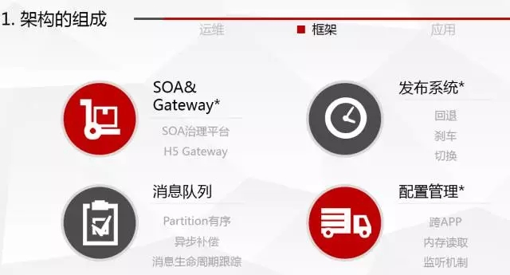  
框架是应用的基石，而携程框架更是经历过且正在经历着演变和迭代。其中特别值得分享的包括：  
####1.2.1 SOA&Gateway
SOA&Gateway是服务的治理平台。有着非常悠久的历史，我后面会详细展开。
####1.2.2 发布系统
携程的发布系统集成了很多特色功能，比如刹车、回退、版本切换、共用dll打包、pom检测等等。发布系统经历了历史上最严重的灾难性故障，在故障中浴火重生，非常值得给大家分享其演变和迭代。
####1.2.3 消息队列
市面上开源的消息队列工具非常多，Storm、MSMQ、ActiveMQ、RabbitMQ等。携程结合各第三方的优点，加以融合，结合自身情况，自主研发了消息队列。核心功能有Partition有序、异步补偿和消息生命周期跟踪。
####1.2.4 配置管理
配置管理在任何规模的公司都会做，而对配置而言最重要的不外乎是便捷、高效和高性能。携程配置管理的演变恰恰反映了这种趋势。
###1.3 应用
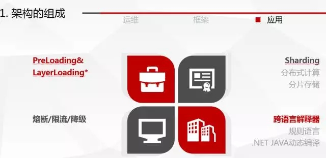  
经过和多家知名互联网企业架构师沟通，看下来大家的应用架构都是比较相近的，一般都会用到PreLoading&LayerLoading、Sharding、熔断、限流、降级等技术。

而经过无数经验证明，上述措施确实极大的提升了网站和APP的稳定性。比如，当灾难发生时，PreLoading可以保证用户可以看到预设的内容；而网络情况较差情况下，LayerLoading可以保证用户操作不卡顿。

##2 架构的演变
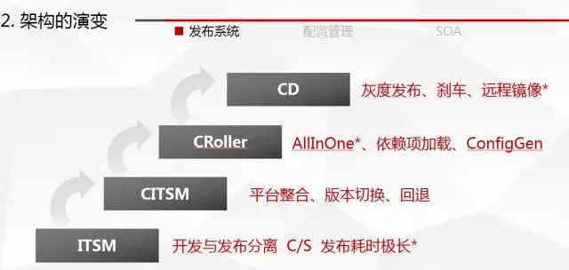  
###2.1 发布系统
携程发布系统至今大体经历了四个“年代”。
1)	ITSM
2)	CITSM
3)	CRoller（ROP）
4)	Tars（CD）
说到发布，一定要提一下 “最传统”的发布方式。传统公司会有专门的售后团队负责部署、或直接由开发人员负责发布。发布方式简单粗暴，直接登录到服务器上覆盖文件。

携程作为互联网企业，第一代发布系统已经做到了开发和发布隔离，使用一个C/S的软件名叫ITSM做发布，发布人员只需要简单点击按钮就可以完成发布。但是那个年代，一旦提到发布，我们往往就先要买第二天的早饭了。因为一个集群上的若干应用发布是排队的，必须一个应用发布且验证完毕才发第二个。同时因为是C/S结构，需要发布人员做本地安装，使得协同工作特别困难。

鉴于ITSM不断被诟病，携程自主开发了CITSM发布系统，功能和ITSM相似，但用B/S实现，协同发布变成可能，且将发布系统与框架其他系统进行整合，为开发人员提供了极大的便利。同时引入版本管理和回退机制，形成了一个飞跃。

第三代的发布系统进一步收紧了开发人员的权限，引入了All In One、ConfigGen、自动加载等。所谓All In One，是将原本配置在database.config中的内容，由发布系统实现，开发不再需要知道DB的连接字符串信息，取而代之的是获得一个Key，在代码中配置这个Key，由发布系统在发布过程中将这个Key翻译成DB连接字符串。但第三代发布系统因为集成功能太多，自身权限过大，最终导致了一个重大的生产故障，该故障以后第三代发布系统连人带系统都被淘汰了。

取而代之的是第四代发布系统，被取名叫Tars（又名CD）。针对前三代发布系统最致命的漏洞：发布都是本地备份。Tars引入了异地备份，即使本地磁盘整个被清空，仍可以从远程恢复。网站的稳定性又得到了质的飞跃。
###2.2 配置管理
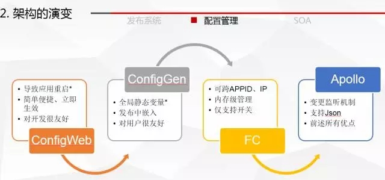  
其次值得一提的就是配置管理。携程的配置管理大体也经历了4个时代。

第一代配置系统，将web.config做了简单的封装，提供Web页供开发人员做编辑，故有简单便捷等优点。对开发人员非常友好。

第二代配置系统恰相反，将config的修改集成在发布中，直接导致config等于一个全局变量。这样避免了网站的重启，对用户很友好。但开发也就不用config了。

第三代配置系统是颠覆性的，一改传统config的缺陷，改为在应用启动时通过服务获取配置信息，加载到内存中。当配置发生变化时，触发监听机制更新。但第三代配置系统仅支持开和关两个状态。

第四代配置系统支持Json等主流格式，且优化了监听机制，并做了开源。
##2.3 SOA
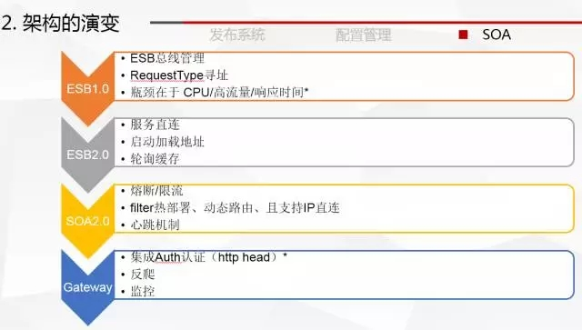  
SOA在携程一直有着特殊的地位，在历史上也有更多有趣的故事。其演变和迭代过程值得我们细细品味。

传统的API调用，是一种网状结构，难以管理和控制。故障的排查也异常的困难。如果处理不当可能出现循环调用的情况，当服务端地址变化对客户端将是一场灾难。

携程作为互联网企业，吸取上述教训，在第一代SOA就引入了治理平台，统一管理服务的地址。推出一个称为ESB总线的服务，所有调用方都请求ESB，由ESB负责寻址和分发。此种架构开始十分优美和清晰，但却有个致命的问题，ESB总线是那个最大的瓶颈。那个年代，90%的故障来自于ESB总线。

第二代SOA主要就是为了解决第一代SOA瓶颈问题，改为服务直连。SOA仅作为治理和注册，在调用方应用启动时从治理平台获取服务端的URL，并存到内存中。之后调用方就可以直接调用。第二代SOA的口号是“直连和去ESB”。

随着时间的推移，公司逐渐意识到在SOA层面可以做更多，比如熔断、限流、动态路由等。熔断即治理平台会根据服务提供方的异常情况，决定是否回应调用方的请求，如果服务提供方异常，有返回默认值、返回空值、直接报错几种可能。限流则重点监控服务提供方的连接数，如果超过阀值，则开启队列模式，阻止之后的请求。第三代SOA集成了大量实用功能，且做了大量监控、埋点，逐渐得到大家认可。

而进入无线时代后，H5和APP和服务端的交互成为了业界研究热点，而gateway这次就呼之欲出了。Gateway取代了原先MobileService设计，加入了反爬和Auth认证。使得SOA的使用范围进一步提升。

##3 UserProfile
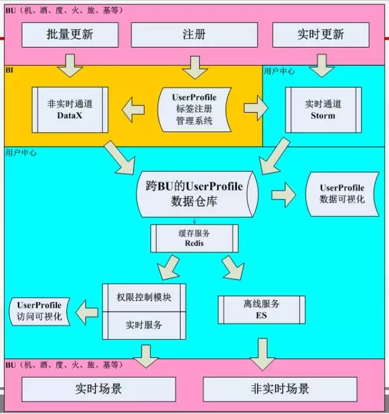  
结合本人负责的“UserProfile”项目，给大家简述一下携程的架构亮点。  
###3.1 组成
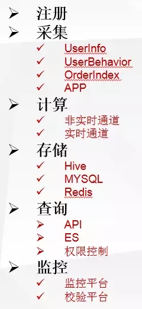  
“UserProfile”作为大数据的核心组成部分，由典型的大数据模型构成。包括注册、采集、计算、存储、查询、监控六大功能。

其中采集的数据来源包括个人信息、常旅信息、联系人信息等用户信息、用户行为信息、用户订单信息等。用户行为和用户订单采集的架构图如下所示。
###3.2 架构
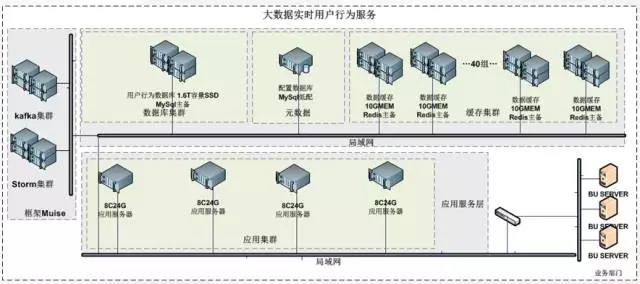  
采集到的信息通过Batch和Steaming两种通道，经过计算汇总到UserProfile仓库中。实时通道采用Kafka+Storm以及携程自主研发的Hermes消息平台。
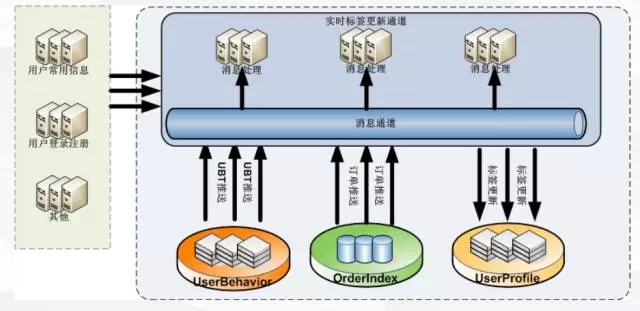  
目前存储在”UserProfile”仓库中的数据已经达到100个亿条以上，而所有储存介质，包括Hive 、MYSQL、Redis都是用FullDR + M-S设计。如下图：  
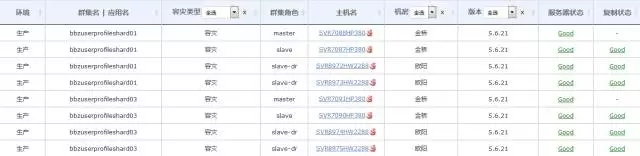  
在这样的数据量级下，服务平均响应时间一直控制在10ms左右（包括网络消耗4ms）。使用了熔断、限流、降级和Sharding组成了完整的架构保障，以实现整体的高可用。  

