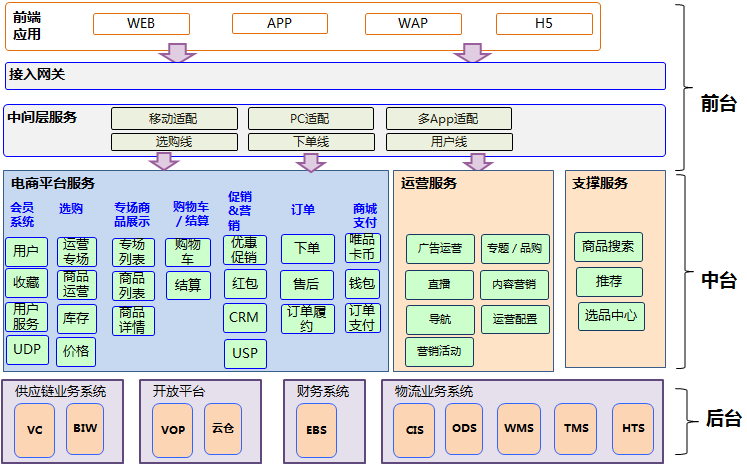
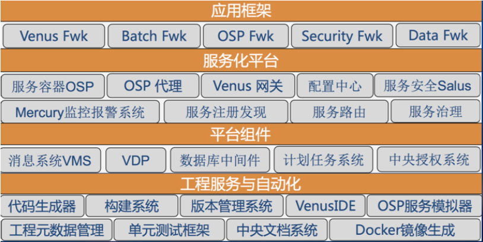
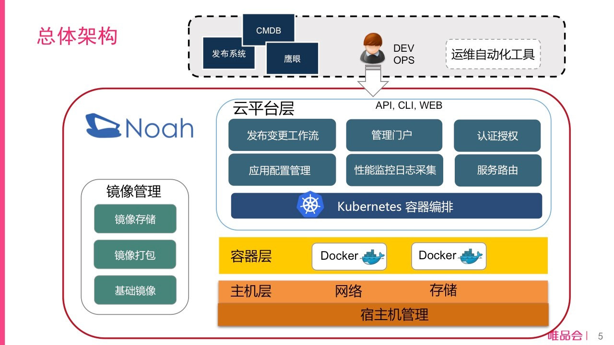
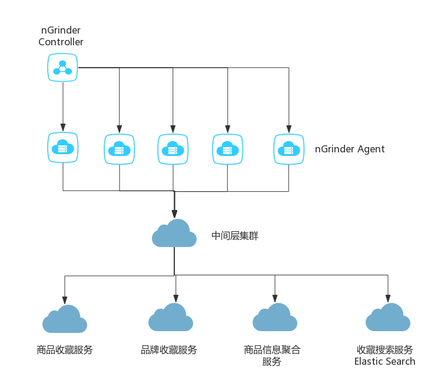
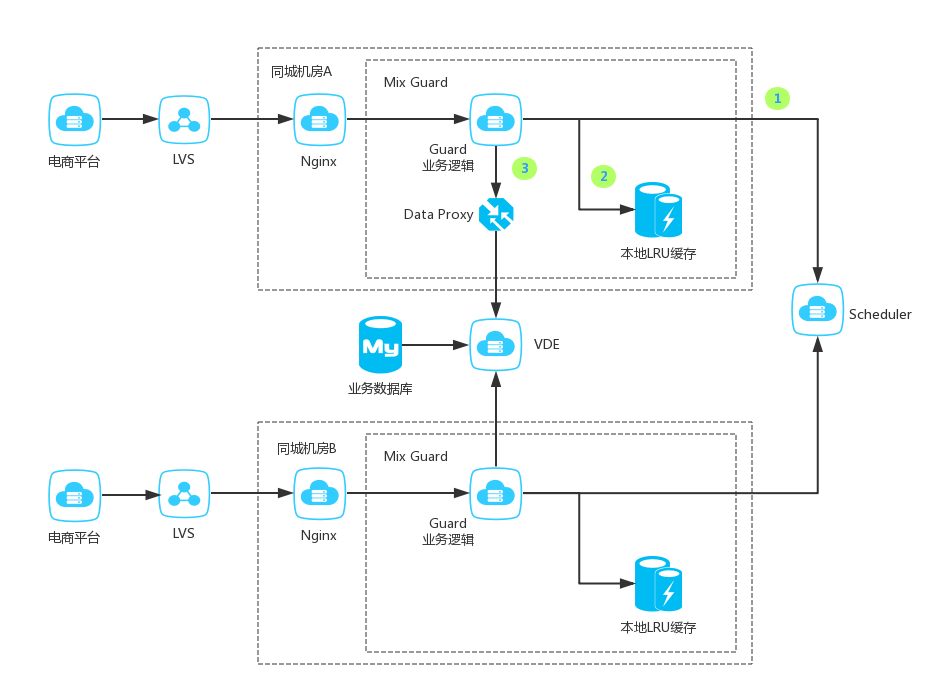
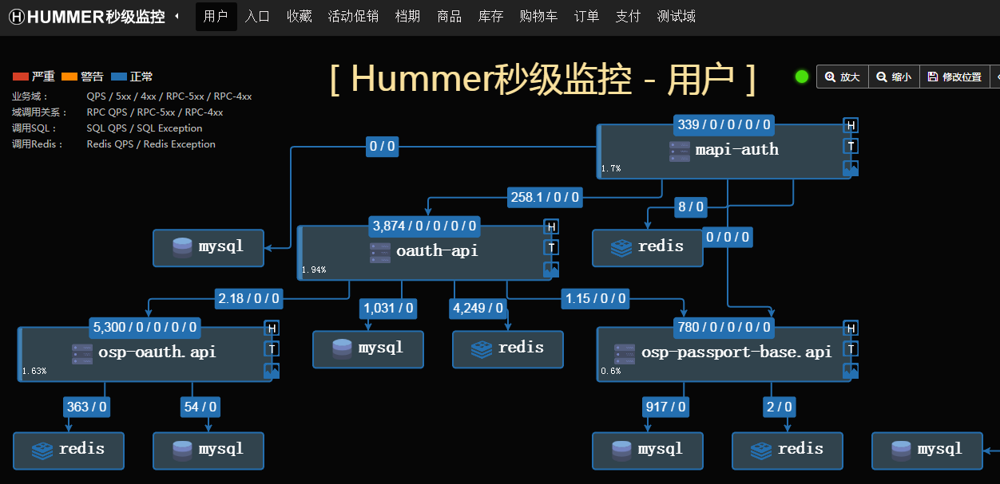

#唯品会双11大促技术保障实践
>**刘惊惊**，唯品会业务架构部高级架构师，负责唯品会电商平台的用户系统，营销系统和库存系统的架构设计工作。2016年加入唯品会，参与了唯品会电商系统的大重构，负责多个核心系统的梳理和大促准备。
>**张广平**，唯品会企业架构负责人，负责唯品会企业架构管理工作，主持公司架构评审运作；主持多个公司战略级项目的架构设计和支持工作；唯品会核心系统重构总架构师。
>责编：钱曙光（qianshg@csdn.net）

每年双11是国内各大电商贴身肉搏，激烈交锋的时刻，同时也是把几十天的交易量浓缩到一天释放的日子。为了准备双11的大促，各家都会在营销、促销、技术保障、物流、售后、客服等各个环节付出相当大的努力。唯品会作为中国第三大电商公司，自然也会在这场盛宴中付出自己的努力，收获应有的成绩。

##第一章：夯实基础，梳理业务
唯品会是一家专注于特卖闪购的电商公司。业务系统为了支撑特卖的场景，在业务架构上有一些鲜明的特点：购物车库存扣减，特卖专场作为营销和流量的入口，优惠活动设置在专场维度，营销触达的周期性峰值明显，自建物流系统支持分区售卖等。图1给出了整个业务架构的概览。

  
**图1 唯品会业务架构示意图**

随着业务量的迅速增长，原有的PHP服务逐渐无法应对高并发大流量的网络请求。为了支撑增长迅速的业务，唯品会在过去2年中启动了大规模的重构。在服务Java化过程中，基础架构部开发了的OSP RPC框架，采用带Sidebar的Local Proxy + Zookeeper作为整个框架的核心组成部分，提供了去中心化的服务注册、发现、治理的能力。

OSP框架还内嵌服务追踪机制，将服务调用路径抽样展示，便于监控服务调用中发生的4xx/5xx错误，及时发现拥塞、调用错误等情况。

  
**图2 唯品会基础架构示意图**

由于唯品会特卖的特点，特卖专场集中在早上10点和晚上8点推出，特卖模式下流量峰值变化极大。业务特点决定了弹性云平台对唯品会有极大的价值。唯品会搭建的Noah云平台，在Kubernetes的基础上，开发了与现有生产系统流程集成的一系列组件。其中包括支撑运维自动化的Noah API Server， DevOps使用的管理平台Noah Portal，与S3存储系统类似的分布式镜像仓库，以及自主研发的网络方案、磁盘网络隔离方案。

为了应对双11的峰值，唯品会借鉴HPA的思想，开发了自动扩缩容功能。所有容器均自动跨机器跨机架部署，纯容器域在双机房部署并自动邻近路由，混合域（物理机+容器）则支持一键切换物理机和容器流量，以及一键跨机房迁移等功能。

2017年双11是Noah云平台经历的首次大促考验。共有52个业务域运行在云平台上，其中在5个核心域上云平台承担了30%－50%的流量。

  
**图3 云平台Noah架构示意图**

##第二章：容量预估，适当扩容
唯品会历年大促峰值数据都会进行妥善的整理，核心业务系统按照不同的促销等级，预估了不同的峰值流量。双11按照去年12.8店庆的2倍来估算系统峰值容量。以用户鉴权系统举例，单台服务器压力测试约为25000QPS，全域提供约25万QPS的服务能力，可以满足2倍峰值量，本次大促就无需扩容了。

对于一些需要扩容的服务，如类目服务、库存规则服务等，优先选择容器扩容。使用Noah云平台进行扩容后，广告、风控等系统的容器使用占比都达到了50%以上。起到了节省机器和弹性扩容的目的。

##第三章：线上压测，心中有底
有了上述的基础服务能力，线上压力测试就有了基本的技术储备。双11来临前，核心系统按照预估的容量进行了线上压力测试。下面我们就以收藏系统作为例子，来展示的具体实践经验。

收藏是唯品会会员应对特卖闪购模式的重要工具，收藏量的多少和收藏展示分类的数量，直接决定了整个大促的销售成绩，因此收藏系统的稳定至关重要。在双11到来之前，商品收藏和品牌收藏都进行了大面积的改版，业务从前到后均做了比较大的改动，并在双11前1个月部署到生产环境。那么如何检验新版的收藏系统可以顶住大促的洪峰流量呢？下图展示了收藏系统线上压力测试的系统部署图。

  
**图4 双11大促收藏系统压测示意图**

线上压测的具体步骤分为以下几个步骤：Top 10接口筛选，线上回放脚本准备，nGinder压测集群搭建，压测指标确认。

找到收藏系统日常Top 10访问量的接口抓取线上日志（约占总流量的80%以上），生成线上回放脚本，按照去年店庆12.8的峰值流量的2倍给出了压测目标值。线上压测安排在凌晨流量最低的时刻，当达到压测目标值的过程中，监控系统情况，看看系统有没有超时、异常，应用服务器的CPU、I/O、内存等资源消耗情况。在整个压测过程中，先后发现了物理机和容器流量不均匀的问题，若干接口请求到达1w QPS时，出现200ms超时等问题。通过调整权重以及分片数量等方法加以解决。

核心系统都通过类似的线上压测的方法，发现了大量的潜在隐患，有力的保障了大促的顺利进行。

##第四章：丢卒保车，降级求生
核心系统对于依赖系统都准备了降级和灾备方案。对于容易被黑产攻击的脆弱部位，以及非重要业务都做了降级处理。大促降级分为以下四个方面：
###1. 系统设计层面需要考虑兼容依赖系统服务不可用的情况
“Design for Failure”是一个非常好的设计原则，在系统设计中我们需要充分考虑依赖服务的可靠性，在依赖服务不可用时，需要有对应的策略。在核心系统梳理上面，着重梳理了对外部系统依赖部分，确定可以降级的依赖，以及无法降级的依赖。对于可以降级的依赖，在出现异常时，尽量保证服务的可用性，必要时果断降级。对于无法降级的依赖，如核心数据库宕机，直接启动系统预案，避免错误的扩大化。

我们总结了一些实践经验：
- 调用下游系统服务接口或者访问缓存／数据库时，需要设置超时时间
- 超时设定，打破部门墙，尽量不要在客户端直接设定
- 对只读方法设置重试
- 不是每个方法都适合熔断，可单独关闭，比如：支付的捞单接口，同一个接口处理多个银行，权衡熔断的利弊
- 主动降级，不依赖于客户端开关，主动关闭某个方法，某个来源域

###2. 非核心流程可使用开关关闭
非核心流程一般提供一些系统增强服务，如复购推荐，时效标识展示等。由于唯品会业务的特殊性，新专场上线有固定的时间点，所以峰值流量可以预计。在峰值流量到达的前后，关闭非关键路径的业务，可以有效的降低系统的负荷，保障核心业务的可用性。

- 对于计算复杂，QPS不高的服务，会提前关闭，保障服务器的核心服务接口的可用性。比如促销活动的试算开关。
- 对于非核心系统的大量数据同步，在峰值前后进行关闭。如自动促销系统的数据抓取行为。

我们的服务框架OSP提供了一个非常好的功能，可以有选择性的关闭某些服务或者服务接口。

###3. 核心业务降级预案
核心系统通过线下压测，可以确认峰值的服务能力，在大促前进行扩容。并且按照测试峰值配置开关，当出现峰值告警时，打开开关，启动限流，提供有损服务，保障数据库平稳渡过峰值。风控系统在峰值来临前，会清理高危账户的登录状态，降低被攻击的风险。

##第五章：多机房部署，异地容灾
为应对容灾需求，核心系统需要分别部署在全国范围内多个机房中，避免单机房出现故障情况下服务不可用。多机房部署带来一些挑战，如机房之间的服务调用延时、数据同步不一致性、专线的稳定性等等，需要对应用系统以及所依赖的数据库／服务系统做规划设计。

对于一些基础服务如用户标签，个性化推荐等，访问量非常大。这些服务位于多个关键路径上，一旦瘫痪，无法降级求生，因此需要多机房部署，做异地容灾，才能保证核心系统的稳定运行。

下图展示了核心系统 – 个性化推荐系统的同城双机房部署的架构。Guard模块可以调用同机房的Scheduler流量调度模块，也可以调用其他机房的Scheduler模块，具体的调用路由配置中心下发。具体的触发时机，可以是由配置中心手动下发，也可以由底层框架检查出错误比例自动触发。流量执行模块也是多机房部署，在灾难发生时，可以保证一键切换，仅增加跨机房的毫秒级时延，对用户无感知。

Guard模块冗余的本地缓存，也会存储一份保底数据，这部分数据在后端系统服务不可用时，起到保底作用。保证极端情况下展示页面不留白，防止同城机房光纤全部被挖断的情况。

  
**图5 个性化推荐系统同城双机房容灾**

##第六章：秒级监控，迅速反应
为了提高故障响应速度，引入了Hummer系统。Hummer是一个秒级监控工具，会实时统计生产环境发生的生产日志，在发生系统异常情况下，更快的发出报警，方便技术人员、运维人员迅速排查问题，采取行动，降低损失。Hummer解决了下列几个问题：

- 现有Metric统计结果延迟较大，分钟级统计只能在分钟结束后得到结果，不能实时更新分钟内的结果。
- 问题发生时，影响了运维的响应速度，会造成较大的损失。
- 秒级监控之前都是独立开发，不能通用。
- 不能高并发的访问统计结果。

核心系统目前大部分都接入了秒级监控Hummer系统。下图展示了秒级监控的监控台。可以清晰的看到出故障的环节。核心系统目前大部分都接入了秒级监控Hummer系统。下图展示了秒级监控的监控台。可以清晰的看到出故障的环节。

  
**图6 用户系统秒级监控展示**

##总结
大促技术保障是多部门的技术协作，从双11前2个月各系统就开始了梳理和准备，经历了几轮的系统梳理，压测，问题总结和修复，核心代码审查等工序，最终圆满的完成了大促的保障任务，在这个过程中，团队得到了锻炼，系统问题得到了总结，加深了对系统的理解。

