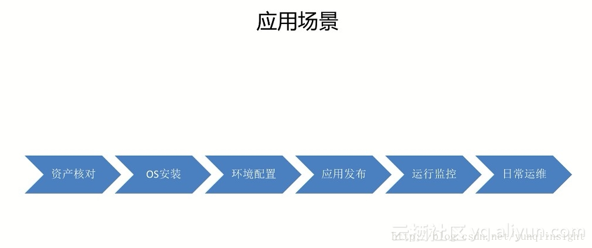
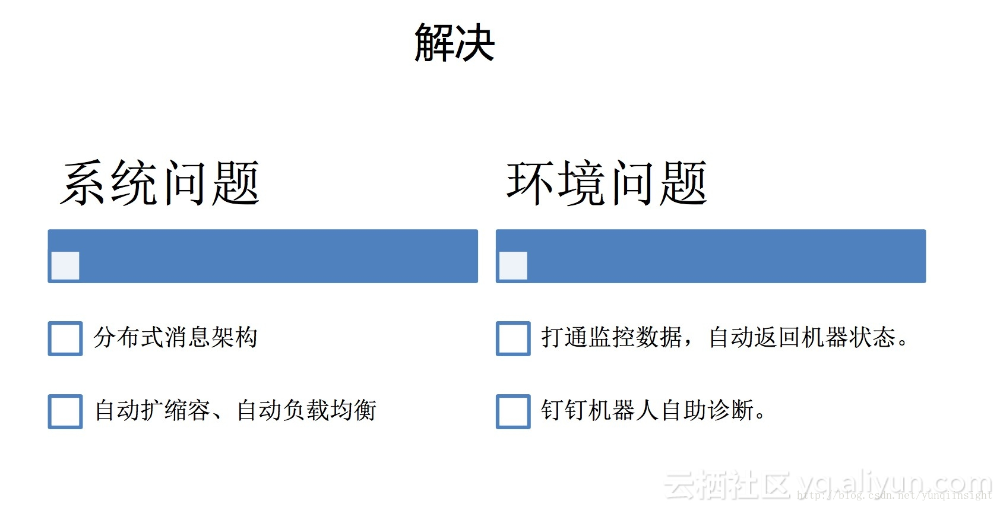

#双11黑科技，阿里百万级服务器自动化运维系统StarAgent揭秘
>**摘要：**还记得那些年我们半夜爬起来重启服务器的黑暗历史吗？双11期间，阿里巴巴百万量级主机管理能安全、稳定、高效，如丝般顺滑是如何做到的？阿里巴巴运维中台技术专家宋意，首次直播揭秘阿里IT运维的基础设施StarAgent，详细分析StarAgent是如何支持百万级规模服务器管控？如何像生活中的水电煤一样，做好阿里运维的基础设施平台？

>**宋健(宋意)**：阿里巴巴运维中台技术专家。工作10年一直专注在运维领域，对于大规模运维体系、自动化运维有着深刻的理解与实践。2010年加入阿里巴巴，目前负责基础运维平台。加入阿里后曾负责：从零建立支付宝基础监控体系、推动整个集团监控体系整合统一、运维工具&测试PE团队。

##StarAgent
从云效2.0智能化运维平台(简称：StarOps)产品的角度来看， 可以将运维划分为两个平台，基础运维平台和应用运维平台。基础运维平台是统一的，叫StarAgent，它可以当之无愧的说是阿里巴巴IT运维的基础设施。

从1万台服务器发展到10万台，又逐步达到百万级服务器，基础设施重要性并不是一开始就被意识到的，是逐渐被发现的过程。无论是运维系统稳定性、性能、容量显然已经无法满足服务器数量和业务的快速增长。在2015年我们做了架构升级，StarAgent系统成功率从90%提升到了99.995%，单日调用量也从1000万提升到了1亿多。

服务器规模达到百万级的企业，在全球应该也是屈指可数的，而且很多企业内部又按业务做了拆分，各业务管理自己的服务器，一套系统管理百万台机器的场景应该更少，因此我们没有太多可以借鉴的东西，大部分情况都是自己在摸索中前进，我们的系统也是在这个过程中一步步演变成今天这个样子。

##产品介绍
  
如上图所示，StarAgent分了三层：主机层、运维层、业务层，各团队按分层的方式进行协作，通过这个图可以大致了解StarAgent产品在集团所处的位置，是集团唯一官方默认的Agent。

**主机层：**指所有服务器，每台机器上默认安装了我们的Agent。  
**运管层：**指运维管控系统，包括应用运维体系、数据库运维体系、中间件运维体系、安全体系，各专业领域产品有独立Portal，通过StarAgent来实现对服务器的操作。  

业务层：指各个BU的业务，大部分BU会直接使用运维层的管控系统，但有的BU可能会有些个性的需求，所以也会有基于下层能力封装出面向自己业务的一个专用运维portal。  

##应用场景
  
StarAgent贯穿整个服务器的生命周期：

**资产核对：**服务器上架后会设置为网络启动，然后会加载一个mini的OS在内存中运行，这个OS中就已经包含了我们的Agent，OS启动后就可以下发指令来采集服务器的硬件信息做资产核对，如CPU、内存、磁盘的厂商及大小信息等。  
**OS安装：**交付业务前会先安装OS，安装什么样的OS也是向这个内存中的Agent下发命令实现的。  
**环境配置：**OS安装完成后像机器上的账号、通用运维脚本、定时任务等基础环境的初始化。  
**应用发布：**应用配置与软件包的上线发布。  
**运行监控：**上线后应用与业务的监控脚本、监控Agent的安装。  
**日常运维：**登录服务器、单机、批量等日常运维操作，包括业务下线前的清理工作等。  

##产品数据 
  
这也是我们产品在阿里内部的一些数据，每天有上亿次的服务器操作，1分钟可以操作50万台服务器，插件有150多个，管理服务器规模在百万级，Agent资源占有率也特别低，支持Linux/Windows主流发行版。

##产品功能
  
StarAgent核心功能可以总结为两大块：管控通道和系统配置。这与开源的saltstack/puppet/ansible等配置管理产品类似，我们做的更精细一些。

**管控通道：**所有运维操作最终都会转化为命令到服务器上去执行，这个命令通道是全网唯一的，这里会有相应的用户权限控制、操作审计、高危命令拦截等能力。  
**系统配置：**公共运维脚本、定时任务、系统账号、监控Agent等等，这些配置会在Agent启动后自动初始化，OS中默认打包有Agent，所以可以做到开机后全自动完成服务器运维基础环境的初始化。  

  
按照Portal、API、Agent细分后的功能列表，Portal主要给一线开发与运维同学使用， API更多是给到上层运维系统来调用，Agent代表每台机器上直接可以使用的能力。

##Portal
**运维市场：**也叫插件平台，类似于手机中的应用市场。各个业务的负责人在市场中如果发现了一些不错的小工具，点下安装就可以自动安装到业务对应的机器上，业务如果新扩容了服务器也会自动地安装这些小工具。小工具的开发也是来自于一线的同学，大家都可以把自己开发的工具上传到运维市场，分享给其他人使用。  
**WEB终端：**在Portal上点下一台机器后会自动弹出一个终端，和SSH登录到服务器的效果完全一样，基于当前登录人信息全自动鉴权，这个终端还可以通过JS的方式嵌入到任何其它网页中。  
**文件分发：**比较好理解就不展开介绍了。  
**定时任务：**与crontab类似，不过我们支持秒级并且可以打散执行，比如对一批机器增加每分钟执行一次的定时任务，用crontab所有机器会固定的在每分钟第1秒执行，我们在保证每分钟执行一次的同时每台机器上的执行时间不一样。  
**主机账号：**包括三块功能：个人登录服务器的账号、机器上admin等公共账号、一台机器与其它机器之间打通SSH通道。  
**API账号：**与右边的API功能是紧密相关的，如果要使用右边这些能力，必须先申请一个API账号。  

##API
**CMD：**调用时传入目标机器与命令信息，就可以实现让指定台机器执行命令，登录机器上执行的命令都可以通过CMD接口来调用。  
**Plugin：**对应前面的运维市场，如果通过运维市场把一些脚本安装到机器上，可以通过plugin的方式来直接执行这些脚本。  
**File/Store：**两者都是做文件分发，区别是file依赖下载源，store可以在调用HTTP API时直接把脚本内容POST过来。File基于P2P实现，在阿里内部有一个叫蜻蜓的产品专门做文件下载，好处是几百台、几千台机器同时下载时只会回源一次，对源的压力非常小，机器之间能够互相共享下载，目前蜻蜓已经开源。  
**Action：**对以上功能组装使用，例：先用file去下载脚本，下载完成后再用cmd来执行，并且中间支持and or的条件判断，下载成功才会用cmd执行。  

##Agent
**Hostinfo：**提供采集服务器的主机名、IP、SN等信息。  
**数据通道：**在每台机器上执行的命令或脚本的输出直接丢到这里，会自动把数据上传到中心，然后在中心消费这些数据。  
**增量日志和P2P文件：**都是第三方来开发的，在运维市场通过插件的方式安装到每台机器上。  

  
图：左边是Web终端，自动鉴权而且可以通过JS的方式嵌到任何web页面里面。 
右边是批量执行命令的功能，先选中一批机器，在这个页面输入的命令都会发到这一批机器上。

##系统架构
###逻辑架构 
  
我们的系统是三层架构，Agent安装在每台机器上，与channel建立长连接，然后channel定期把连接自己的agent信息上报到中心，中心会维护完整的agent与channel关系数据。分享两个流程：
**1.Agent注册**
Agent有一个默认配置文件，启动后首先连接ConfigService，连接时会上报本机的IP、SN等必要信息，ConfigService计算出应该连哪个channel集群，返回给channel列表，收到结果后断开与ConfigService的连接，然后与channel建立起长连接。

**2.下发命令**
外部系统都是调用proxy来下发命令，proxy收到请求后会根据目标机器查出对应channel，然后把任务下发给channel，channel再把命令转发到agent去执行。

###部署架构 
  
最下面是每个IDC，channel会在每个IDC中部署一套集群，Agent会随机在其中的一台建立长连接。上面就是中心，中心做了双机房容灾部署，同时在线提供服务，其中一个机房挂掉对业务是没有影响的。

##问题&挑战
  
如上图：是我们前年在做系统重构时遇到的问题：  
前三个问题有点类似，主要是任务由状态导致，1.0的manager可以理解为2.0中的proxy，server等同于channel，每时每刻线上都有大量系统在下发命令，在1.0中如果把manager/server/agent任何一个角色重启，那么在这条链路上的任务都会失败，比如server重启后与它相连的agent都会断开，因为链路断了，当时经过这台server下发的命令就拿不到结果了。重启server又会引发第六个负载不均的问题，假设一个IDC中有一万台机器，两台server各连了5000台，重启后这一万台就全连到了一台server上。

用户如果调用API下发命令失败就会找过来让我们查原因，有的时候确实是系统的问题，但也有很多是本身的环境问题，比如机器宕机、SSH不通、负载高、磁盘满等等，百万级规模的服务器，每天百分之一的机器也有一万台，由此带来的答疑量可想而知。当时我们非常痛苦，团队每天一半的人员在做答疑，半夜有断网演练还需要爬起来去重启服务来恢复。

面对这些问题如何解决呢？我们将问题分为系统问题和环境问题两大类。 

  

##系统问题
我们把系统做了一次彻底的重构，采用分布式消息架构，还是以下发命令为例，每次下发是一次任务，在2.0中对每个任务增加了状态，proxy在收到下发命令请求后，会先记录并把状态置为收到任务，然后再向agent下发，agent收到任务后会立即响应，proxy收到agent的响应后会把状态置为执行中，agent执行完成后主动上报结果，proxy收到结果后再把状态置为执行完成。

整个过程中proxy与agent之间的消息都有确认机制，没有得到确认就会进行重试，这样任务执行过程中涉及角色如果重启，对任务本身就没有太大影响了。

2.0中channel集群内的机器之间会互相通信，定期报告自己连的agent数量等信息，结合收到的信息与自己的信息，如果自己连的agent过多，会自动断开近期无任务执行的机器，通过这样的方式解决负载均衡的问题。中心节点与所有channel都有长连接，同时保存有每台channel连接的agent数量，当发现某个机房有channel异常或者容量过高时，会自动触发扩容或者从其它机房临时借调channel，在容量恢复后又会自动剔除扩容的channel。

##环境问题
在2.0中proxy/channel/agent每一层都有详细的错误码，通过错误码可以直观判断是什么原因导致的任务出错。

针对机器本身的问题，与监控系统中的数据打通，任务失败后会触发环境检查，包括宕机、磁盘空间、负载等，如果有相应问题API会直接返回机器有问题，并且把机器的负责人也一并返回，这样用户一看结果就知道什么原因该找谁处理。同时还会把这些诊断能力用钉钉机器人的方式开放出来，这样大家平时可以直接在群里@机器人来做检查确认。

  

##稳定
通过前面的介绍可以看到我们其实是运维的基础设施，就像生活中的水电煤一样，大家所有对服务器的操作强依赖我们。当我们出现故障的时候，如果线上业务也出现了严重故障，这时候业务故障只能干等着，因为操作不了服务器，做不了发布和变更，所以对系统稳定性的要求非常高，做到了同城双机房、异地多中心容灾部署，依赖的存储有mysql/redis/hbase，这些存储本身就有高可用保障，在这个之上我们又做了存储间的冗余，确保任何一个单一存储故障不会影响到业务，相信整个业内很少有系统会做到这个程度。

##安全
1分钟可以操作50万台服务器，输入命令敲回车就这么一瞬间，就可以操作数万台机器，如果是个恶意的破坏性操作，影响可想而知。所以做了高危命令阻断的功能，对于一些高危操作自动识别与拦截。整个调用链路也是经过加密与签名，确保第三方无法破解或篡改。针对API账号可能存在的泄露问题，还开发了命令映射的功能，把操作系统中的命令用映射的方式改掉，比如执行reboot命令，可能要传入a1b2才行，每个API账号的映射关系都是不一样的。

##环境
机器宕机这类环境问题，通过与监控数据打通解决，前面已经讲过，网络隔离的问题也不再过多陈述。这里重点说明下CMDB中录入的数据与Agent采集的数据不一致的问题，主要是SN、IP这些基础信息，因为大家在使用的时候都是先从CMDB取出机器信息，再来调用我们的系统，如果不一致就会导致调用直接失败，为什么会出现SN/IP不一致的问题？

CMDB中的数据一般由人工或者其它系统触发录入，而Agent是从机器上真实采集的，有的机器主板没烧录SN、有的机器有很多块网卡等，环境比较复杂各种情况都有。

这种情况就是通过建立规范来解决，分别制定SN、IP采集规范，允许机器上自定义机器的SN/IP，配合规范还提供有采集工具，不仅是我们的Agent，所有其它采集机器信息的场景都可以使用这个采集工具，当规范发生更新时我们会同步更新小工具，以此实现对上层业务的透明化。

