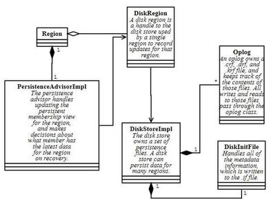

#大数据管理平台Apache Geode 分布式系统内部结构剖析
Apache Geode于去年11月从Apache孵化器毕业成为顶级项目，是一个相当成熟、强健的的数据管理平台，提供实时的、一致的、贯穿整个云架构地访问数据关键型应用。Geode自身功能比较多，首先它是一个基于JVM的NoSQL分布式数据处理平台，同时集中间件、缓存、消息队列、事件处理引擎、NoSQL数据库于一身的分布式内存数据处理平台。可用来进行完成分布式缓存、数据持久化、分布式事物、动态扩展等功能。目前，有超过600家大中型企业级用户，使用了Apache Geode。他们主要是应用于必须满足低延迟和24x7高可靠要求的、高可扩展性的关键业务应用系统。

Apache Geode设计的核心理念是跨集群节点分布数据，完全复制数据到所选节点，或者跨所选节点的分区数据。当数据条目在内存中更新时，这个更新同步到一个或者多个内存池中的节点。Apache Geode允许数据被查询，参与到事务中，共享引用进程空间，同步到外部数据源(同步或者异步方式)。经验告诉我们，大多数的OLTP应用的数据集都足够小而且分散在各个OLTP服务器上，这样Apache Geode把关注点从磁盘I/O的优化转向到分布式内存的优化。这种通过优化内部数据结构的存储方式，把内存作为一种资源，达到了可高并发访问数据的目的。

为了有效地定位跨应用的持续性数据变化，和优化资源利用率。Jaguar在集群中动态地扩展和收缩。在分布式进程之间，或者跨地域的集群之间，通过有效的复制技术来保障数据一致性和可靠性。Apache Geode更是提供了跨网络地，及时地Delta更新传播技术，通过使用内存访问来替代磁盘I/O访问，在高可靠的和日益增长的带宽下，以池化的形式处理数据。这种好处显而易见，性能大大提升，比传统的数据库或者高可靠的磁盘复制存储效能更高。

在Apache Geode中，成员之间以点对点的网络形式互相连接形成分布式系统。Apache Geode支持动态成员关系，集群中的成员能够随时加入和离开分布式系统而不影响其他成员正常运行。这种动态化成员关系的能力是非常重要的，在较高的SLA要求下，允许有状态的应用内置在分布式系统中而不影响高性能和高可靠性。成员关系的改变不引入锁和资源争抢。成员之间能够通过多播或者基于TCP/IP的位置发现服务互相发现，如果网络没有启用多播，系统将自动选举组成员协调者-一个成员负责授权其他成员加入到分布式系统中和把成员关系改变通告给系统中的所有成员。

Apache Geode 整体架构如下图所示：  
  

作为 Apache Geode作为分布式内存管理平台，有着极强的弹性伸缩能力，这得益于Apache Geode内部复杂的分布式结构来保证。下面我们就来剖析一下Apache Geode分布式系统的内部结构。

Apache Geode的核心是由几个单例系统组成：
- InternalDistributedSystem - 这是管理分布式系统连接的单例
- LonerDistributionManager，DistributionManager - InternalDistributedSystem对两者进行管理，两个管理器进行实际的消息通信。这是对等体或服务器的实例DistributionManager。由于其配置而不能具有对等体的成员是“loners”。"loners"常用于客户端。这两个类都实现了DM类。
- GemfireCacheImpl - 这是拥有所有缓存和相关资源的单例。它实现了Cache接口并拥有所有区域(Region)，磁盘存储，缓存服务器等。

###序列化框架
Apache Geode有自己的序列化框架，允许开发者实现自己的DataSerializable接口。序列化框架的示例可参考https://github.com/theseusyang/geodedemo  
其中 Data 类为 Geode 序列化的代码示例。  

Data类实现了DataSerializable接口, 开发了自己的public void fromData(DataInput in)和public void toData(DataOutput out)方法，将Data类的属性作为数据输入对象和数据输出对象进行序列化和反序列化进行传递。

内部类使用相同的框架进行序列化，但我们不使用公共的Instantiator框架。相反，内部类实现DataSerializableFixedID。

###日志和统计系统
Geode使用log4j2进行日志记录。要获取记录器，请向类中添加一个静态记录器字段：
private static final Logger logger = LogService.getLogger();

###分布式消息通信系统

成员名称  
在特定的分布式系统成员上，您可以通过使用 InternalDistributedMember 引用其他成员。当你发送一条消息给对等体，你传递 InternalDistributedMember 对象以标明目的地。该DM提供了获取所有当前正在运行的对等体的所有名单，并增加监听器监控分布式系统内对等体的加入和离开。最终从 DistributionAdvisor 获取成员列表。请参阅下面的顾问部分。

要创建新消息类型，首先创建子类 DistributionMessage。子类应该实现DataSerializableFixedID，并且负责序列化需要作为消息的一部分发送的任何字段。实现过程方法。在远程端点，将调用过程方法，并且可以在远程端点执行所需的任何逻辑。

要发送消息，请创建您的 DistributionMessage 子类的实例，调用setRecipient或setRecipients以标明目标，并调用 DM.putOutgoing（yourMessage）。该消息将发送给收件人。

ReplyProcessor21和ReplyMessage  
  
如果Geode分布式系统能够发送消息，说明节点间可以正常通信，但您还需要能够发送获取响应的请求，或等待，直到你确定对等体已处理消息。

应答处理器模式用于处理需要应答的消息。这里是一个代码示例（这是从RemovePersistentMemberMessage。
~~~java
Set members =// 从顾问或从 DM 获得此成员列表

DM dm =// 分布式管理器. 我们能够从上下文中获得这个 DM

// (例如, 一个区域能够找到它的 DM

ReplyProcessor21 processor =newReplyProcessor21(dm, members);

RemovePersistentMemberMessage msg =newRemovePersistentMemberMessage(regionPath,

id, initializingId, processor.getProcessorId());

msg.setRecipients(members);

dm.putOutgoing(msg);

processor.waitForRepliesUninterruptibly();
~~~
第一行创建一个ReplyProcessor21的实例，并向其传递一组收件人。这实际上做的是分配回答处理器一个唯一的ID，并注册一个单身的ProcessorKeeper。参见ReplyProcessor21.keeper。处理器的唯一ID将添加到调用processor.getProcessorId（）的消息中。

通过putOutgoing的调用，消息被发送到收件人。然后线程在处理器.waitForRepliesUninterruptibly（）中等待答复处理器。

在远程调用方面，这是过程方法的样子：  
~~~java
protectedvoidprocess(DistributionManager dm) {

try{

	// 删除持久化成员

	//...

}finally{

	ReplyMessage replyMsg =newReplyMessage();

	replyMsg.setRecipient(getSender());

	replyMsg.setProcessorId(processorId);

	if(exception !=null) {

		replyMsg.setException(exception);

	}

	dm.putOutgoing(replyMsg);

	}	

}
~~~  
这里，远程端发送具有相同唯一ID的ReplyMessage。最后，当在消息的原始发送者上接收到ReplyMessage时，它查找ReplyProcessor并通知它。这会唤醒processor.waitForRepliesUninterruptibly()中的线程。

###顾问(Advisor)

分发管理器跟踪所有对等体。在通常情况下，我们想要在分布式系统中形成子组。例如，Geode 仅向具有特定区域的对等体发送消息。

DistributionAdvisor类提供创建群组的能力。每个成员创建一个DistributionAdvisor的实例，并执行初始化配置文件交换的操作。在配置文件交换期间，对等体给予配置文件的每个其他实例，其提供关于该对等体的信息。

在代码中，用户可以从DistributionAdvisor获取对等体列表。

不同的组件使用DistributionAdvisor和Profile的不同子类。例如，DistributedRegion使用 CacheDistributionAdvisor 交换 CacheProfile 对象。CacheDistributionAdvisor 提供了特殊的方法来根据对象的配置文件内容获取对等体的子组。例如，CacheDistributionAdvisor.advisePersistentMembers() 仅返回对指定区域使用持久性的成员。

###地区(Region)
LocalRegion  
LocalRegion是其他类型区域的基类。本地区域实现公共区域接口并保存具有区域数据的HashMap。  
  

分布区域  
DistributedRegion类是我们用于复制区域的类。分布式区域扩展了本地区域，但是具有用于消息传递的顾问。
  

分区  
当用户创建分区区域时，创建一个PartitionedRegion类的实例。本质上，分区区域的工作方式是，对于用户放置的每个键，我们使用密钥的哈希码来确定密钥应该去的桶。然后将桶分配给各个成员。分区区域确保我们制作足够的存储桶副本以满足冗余级别。  
  

当向一个成员分配存储桶时，该成员将创建一个BucketRegion的实例，该实例扩展了DistributedRegion。bucket区域存储bucket的实际数据。  
  

存储桶区域与分布区域稍有不同，因为它们具有主要区域。选择一个成员作为每个存储桶的主要成员。当用户执行put时，PartitionedRegion类将put放置到主服务器。  
  

###客户端和服务器
客户端服务器消息  
客户端服务器消息传递的实现方式与对等消息传递层不同。消息传递的服务器端部分在com.gemstone.gemfire.internal.cache.tier.sockets.command中实现每个消息类型都有自己的服务器端类，它读取特定消息，处理它和回复。

消息的客户端在com.gemstone.gemfire.cache.client.internal作为AbstractOp的子类。这些操作负责发送消息并读取回复。

服务器端
服务器代码在BridgeServerImpl和AcceptorImpl中实现。AcceptorImpl具有实际的服务器套接字和运行循环，它接受该套接字上的连接。  
  

实际上，服务器有两种不同的模式，基于max-connections和max-threads设置。如果允许服务器使用与连接一样多的线程，则每个套接字都会获得自己的专用线程。如果允许的连接多于连接，则连接由线程池和选择器处理。

从连接读取的线程在ServerConnection中实现。

客户端  
在客户端，客户端到服务器的连接被管理PoolImpl。每个客户区域保存一个区域可以调用操作的ServerRegionProxy。代理使用池将操作发送到服务器端。  
  

客户端队列  
客户端可以订阅具有Region.register兴趣或连续查询的事件。当服务器端的事件通过异步队列更改时，它们将接收更新。
  

持久化

每个成员写入它自己的独立磁盘存储。成员从不共享磁盘工件。例如，如果新成员需要创建区域的副本，我们从一个成员读取磁盘文件，将逻辑键和值发送给另一个成员，该成员写入它自己的磁盘文件。

DiskStoreImpl类拥有一个特定的磁盘存储。在磁盘上，磁盘存储的布局看起来像这样：
- BACKUPdiskStore1.if
- BACKUPdiskStore1_1.crf
- BACKUPdiskStore1_1.drf
- BACKUPdiskStore1_1.krf
- BACKUPdiskStore1_2.crf
- BACKUPdiskStore1_2.drf
- BACKUPdiskStore1_2.krf
- BACKUPdiskStore1_3.crf
- BACKUPdiskStore1_3.drf

.if文件包含磁盘存储的元数据（磁盘存储中的什么区域，每个区域的成员资格信息等）。在内部，init文件由DiskInitFile类管理。每当进行元数据更改时，逻辑更改将附加到.if文件。在恢复时，读取整个文件，并应用所有更改，直到最终的元数据。当.if文件变大时，我们将当前元数据转储为新文件，并删除旧的.if文件。

_X.crf，_X.drf和_X.krf文件一起构成操作日志或oplog。因此，在上面的示例中，有三个oplog，编号为1,2和3. Oplog包含区域操作。.crf文件包含创建或更新。.drf文件包含任何删除。并且可选的.krf文件包含oplog中的键的副本，以加速恢复。每个oplog由Oplog类管理。

当用户执行操作时，操作被记录到当前oplog。当当前oplog达到给定的大小限制时，它关闭并且开始新的oplog。在这一点上，我们可以为旧的oplog生成一个.krf文件。

在恢复期间，我们读取所有的oplogs以建立该地区的内容。如果一个krf文件存在，我们可以读取而不是.crf。这意味着我们不需要在恢复期间读取值。

为了防止oplogs永远增长，老oplogs被压缩。当旧oplog中的超过50％的数据是垃圾（因为对较新的oplog中的相同键有较新的更新）时，剩余数据被向前复制到当前oplog，并且旧的oplog从磁盘中删除。
  

查询和索引
Geode提供了一种类似SQL的查询语言，称为OQL，允许应用程序访问存储在区域中的数据。

OQL允许用于查询复杂对象，对象属性和方法的附加功能。

查询 - 可以在DefaultQuery中找到查询的实现。这个类是查询执行的起点，是在调试器中开始跟踪的好地方。当执行查询时，引擎采用的第一步是解析查询。我们使用antlr来完成这个任务，生成一个AST树，然后编译树并执行。

查询分区区域 - 分区区域查询执行稍微复杂一些。存在用于确定向哪些节点发送查询，在远程节点上执行查询以及在协调节点上收集结果的逻辑，其中诸如排序结果和重试失败的节点。这样做的逻辑可以在PRQueryProcessor和PartitionedRegionQueryEvaluator中找到。

IndexManager - 当在区域上创建索引时，为每个区域创建一个IndexManager。每个区域有一个索引管理器。索引管理器管理每个索引的创建，删除和更新。它保留索引表达式到索引的映射，以便可以避免重复的索引，并且还用于确定索引是否可用于查询。

索引 - 用于为经常被查询的字段提供速度改进，但是以保持索引的内存成本和非常小的成本。内部有各种类型的索引。这些包括CompactRangeIndex，RangeIndex，HashIndex，MapRangeIndex，CompactMapRangeIndex，PartitionedIndex和PrimaryKeyIndex。

RangeIndex - 使用ConcurrentNavigableMap存储一个键来存储RegionEntryToValuesMap。RegionEntryToValuesMap是使用条目作为键和结构作为值的映射结构的一个示例（注意与结构相关联的索引iter命名，以及结构是否是组合，位置的组合）：struct（index_iter1：组合[ID = 8 status =活动类型= type2 pkid = 8 XYZ：位置secId = XYZ out = 100.0 type = a id = 7 mktValue = 8.0，AOL：位置secId = AOL out = 5000.0 type = a id = 5 mktValue = 6.0，APPL：Position secId = APPL out = 6000.0 type = a id = 6 mktValue = 7.0，P1：Position secId = MSFT out = 4000.0 type = a id = 4 mktValue = 5.0，P2：null]，index_iter2：Position secId = APPL out = 6000.0 type = a id = 6 mktValue = 7.0） 
CompactRangeIndex - 一个内存高效但稍微受限的RangeIndex版本。如果可能，将优选由发动机超过范围指数。使用ConcurrentNavigableMap存储键和值对，其中值可以是RegionEntry，包含RegionEntries的IndexElemArray或包含RegionEntries的IndexConcurrentHashSet。ConcurrentNavigableMap还传递了一个Comparator，允许Indexes在不同的数字类型之间匹配。

MapRangeIndex - 此索引包含一个映射，其中键是映射键，值是范围索引。因此，例如portfolio.positions'key'='IBM'映射范围索引将具有键为'key'的映射，并且该值将是范围索引。范围索引将具有另一个映射，其中键是“IBM”，值将是RegionEntryToValuesMap。RegionEntryToValuesMap将是一个映射，其中键是条目本身，值为“IBM”。

CompactMapRangeIndex - 类似于MapRangeIndex，但是是CompactRangeIndexes的映射。对CompactRangeIndex和RangeIndex之间的类似限制。

HashIndex - 是一个不存储键值的内存节省索引，而是从对象提取密钥，并使用密钥的散列将RegionEntry插入数组。

PrimaryKeyIndex - 主键索引是一个非常轻量级的索引，它提示查询引擎应该做一个region.get（key）。

PartitionedIndex - 分区索引是作为区域的存储桶的索引的集合。
