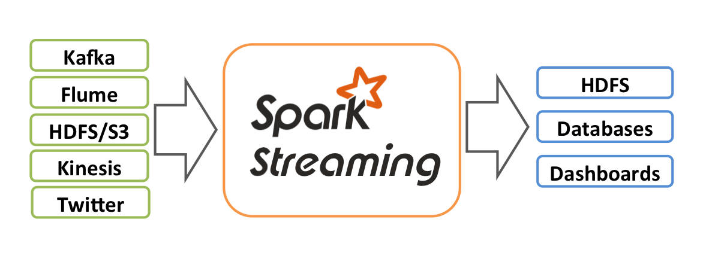

>原文：Spark Streaming vs. Kafka Stream 
作者：Mahesh Chand Kandpal 
翻译：雁惊寒  
译者注：本文介绍了两大常用的流式处理框架，Spark Streaming和Kafka Stream，并对他们各自的特点做了详细说明，以帮助读者在不同的场景下对框架进行选择。以下是译文。

[TOC]

流式处理的需求每天都在增加，仅仅对大量的数据进行处理是不够的。数据必须快速地得到处理，以便企业能够实时地对不断变化的业务环境做出反应。

流式处理是持续而又并发地对数据进行实时处理。流式处理是处理数据流或传感器数据的理想平台，而“复杂事件处理”（CEP）则利用了逐个事件处理和聚合等技术。

对于实时数据处理功能，我们有很多选择可以来实现，比如Spark、Kafka Stream、Flink、Storm等。

在这个博客中，我将讨论Apache Spark和Kafka Stream的区别。

##Apache Spark
Apache Spark是大规模数据处理的通用框架，支持多种不同的编程语言和概念，例如MapReduce、内存处理、流式处理、图形处理和机器学习。它也可以用于Hadoop的顶层。数据可以从多种来源（例如Kafka、Flume、Kinesis或TCP套接字）获取，并且使用一些复杂的算法（高级功能，例如映射、归约、连接和窗口等）对数据进行处理。
  

在框架内部，它的工作原理如下图。 Spark Streaming接收实时输入数据流，并将数据分成多个批次，然后由Spark引擎对其进行处理，批量生成最终的结果流。  
  
Spark Streaming提供了一个被称为离散化数据流（discretized stream，缩写为DStream）的高级抽象，它代表了一个持续的数据流。DStream可以从诸如Kafka、Flume或Kinesis等来源的输入数据流中创建，或者通过对其他DStream执行高级操作来创建。在框架内部，DStream可以看成是一系列的RDD（Resilient Distributed Datasets，弹性分布式数据集）。  

##Kafka Stream
Kafka Streams是一个用于处理和分析数据的客户端库。它先把存储在Kafka中的数据进行处理和分析，然后将最终所得的数据结果回写到Kafka或发送到外部系统去。它建立在一些非常重要的流式处理概念之上，例如适当区分事件时间和处理时间、窗口支持，以及应用程序状态的简单（高效）管理。同时，它也基于Kafka中的许多概念，例如通过划分主题进行扩展。此外，由于这个原因，它作为一个轻量级的库可以集成到应用程序中去。这个应用程序可以根据需要独立运行、在应用程序服务器中运行、作为Docker容器，或通过资源管理器（如Mesos）进行操作。

Kafka Streams直接解决了流式处理中的很多困难问题：
- 毫秒级延迟的逐个事件处理。
- 有状态的处理，包括分布式连接和聚合。
- 方便的DSL。
- 使用类似DataFlow的模型对无序数据进行窗口化。
- 具有快速故障切换的分布式处理和容错能力。
- 无停机滚动部署。

Apache Spark可以与Kafka一起使用来传输数据，但是如果你正在为新应用程序部署一个Spark集群，这绝对是一个复杂的大问题。

为了克服这个复杂性，我们可以使用完整的流式处理框架，Kafka streams正是实现这个目的的最佳选择。  
  
我们的目标是简化流式处理，使之成为异步服务的主流应用程序编程模型。这是我知道的第一个库，它充分利用了Kafka，而不仅仅把Kafka当做是一个信息中介。

Streams建立在KTables和KStreams的概念之上，这有助于他们提供事件时间处理。

给出一个与Kafka的核心抽象高度集成的处理模型，能够减少流式架构中移动件的总数。

将状态表与事件流完全整合起来，并在单个概念框架中提供这两个东西，这使得Kafka Streams完全成为一个嵌入式的库，而不是流式处理集群（只是Kafka和你的应用程序）。当你向应用程序加入了一个新的实例，或者现有的实例发生崩溃的时候，它能够自动均衡负载，并维护表的本地状态，使得系统能够从故障中恢复出来。

Kafka Streams具备低延迟的特点，并且支持易于使用的事件时间。它是一个非常重要的库，非常适合某些类型的任务。这也是为什么一些设计可以针对Kafka的工作原理进行深入地优化的原因。你不需要设置任何种类的Kafka Streams集群，也没有集群管理器。如果你需要实现一个简单的Kafka的主题到主题的转换、通过关键字对元素进行计数、将另一个主题的数据加载到流上，或者运行聚合或只执行实时处理，那么Kafka Streams适合于你。

如果事件时间不相关，并且秒级的延迟可以接受，那么Spark是你的第一选择。它相当稳定，并且可以很容易地集成到几乎任何类型的系统中去。此外，每个Hadoop发行版都包含它。而且，用于批处理应用程序的代码也可以用于流式应用程序，因为API是相同的。

##结论
我认为，Kafka Streams最适用于“Kafka > Kafka”场景，而Spark Streaming可用于“Kafka > 数据库”或“Kafka > 数据科学模型“这样的场景。

希望这个博客对你有所帮助。

参考文献
- Apache Kafka Streams文档
- Apache Spark Streaming编程指南
