#RocketMQ Apache顶级项目之路
[TOC]  
##序言
2016年11月，阿里将RocketMQ捐献给Apache软件基金会，正式成为孵化项目。至此，RocketMQ 开启了迈向全球顶级开源软件的新征程。通过社区半年多的努力。9 月 25 日，Apache 软件基金会官方宣布，阿里巴巴捐赠给 Apache 社区的开源项目 RocketMQ 从 Apache 社区正式毕业，成为 Apache 顶级项目（TLP）。

在通向Apache顶级项目的这些时间里，团队走了很多路，也经历了很多事。
- 第一次按照Apache Way走通Apache软件发布流程，完成了在整个IPMC都极为罕见的Rc3发布壮举，体现了中国团队的严谨、高效，赢得了社区的赞誉。
- 第一次吸纳外籍Committer - 日本博士Roman。2个月时间里，他提交近20个Pull Request，推动RocketMQ跟Apache其它顶级社区项目合作，对社区起步做出了卓越贡献。
- 第一次面向社区举办编程马拉松。PMC成员全程跟进，帮助参赛选手评审设计、Review代码。
- 第一次吸纳PMC成员。在RocketMQ社区，PMC是对Committer持续贡献的进一步Merit。
- 第一次向Apache社区昭告OpenMessaging标准的愿景。紧接着, ASF Director Jim毛遂自荐，加入到RocketMQ超强豪华的全球Mentor阵营中。
- 第一次面向国内社区举办了大型MeetUp。全球图文现场直播，5场纯技术Messaging & Streaming干货分享，传达了团队誓将做好社区，搞好生态的决心。
- 第一次......

人生就是一场跋涉，走久了，才知心酸，才知艰难，才有坚韧，才有渴望。前方的路，尽管遥远，尽管颠簸。但脚步依然，追求依然，方向依然。

2017年8月3号，经过了半年多的发展，团队正式发起了冲击TLP的讨论。接下来的一个月时间里，讨论和投票，几乎成了每天的必修课。终于，抢在Java 9发布之前，RocketMQ 正式通过董事会决议，结束了在Apache上的孵化，正式成为Apache 340多个顶级项目中的一员。这一刻，完全出自中国团队，来自阿里巴巴的分布式消息引擎成为全球互联网中间件、大数据领域璀璨的新星。下一站，等待它的将是在国际舞台上与世界顶级老牌消息中间件的激烈角逐。相信在Apache先进的社区理念指引下，RocketMQ社区生态会继续蓬勃发展，完成我们所赋予它的光荣使命。

接下来，我们从产品、社区、生态这三个维度，分别回顾一下RocketMQ这半年多的Apache孵化历程。

##产品篇章
与Apache大多数顶级项目不同，RocketMQ在进入Apache之前，Open Source之路已经走过了3个春秋。历经多次双十一洗礼，在国内积累了一定的口碑，社区也有不错的Active Contributors，但这些还远远不够。在正式开启捐赠之前，团队对RocketMQ甚至包括社区做了大量重塑工作。如国际化方面，在Github上利用sidebar特性重新设计编排了文档。如今，User Guide, Quick Start, Architecture & Design, How to contribute, Community, FAQ 这些几乎成为了团队新产品标配的文档结构。

代码层面更是进行了比较“激进”地优化。如去除GBK字符，全面拥抱UTF-8。重写API JavaDoc。清理代码，优化代码结构。利用JDepend优化组件之间的抽象依赖关系。利用Findbugs扫描代码漏洞，指导规范编码。交付方面，规范Release流程，New Features、Improvement and Bug 分类Release note。社区层面则开启了全英式互动，发布问问题的技巧。

经过这些精心的准备，RocketMQ完成了从3.0到4.0的悄然升级。而4.0是个过渡版本（和3.0相比，架构层面没有较大的改变），也是在Apache开启孵化的版本。通过孵化，团队重新认识了软件研发流程的重要性，尤其是像精细设计，代码Review，编码规约，分支模型，发布规约等容易被忽略的过程。无以规矩不成方圆，尤其是当你置身于并领导一个全球协作的开源项目时，这些都显得是尤为重要。
##编码规约
RocketMQ的编码规约是比较宽松的，至少在4.0这个版本上。与其它Apache顶级项目不同，我们并没有从编码细节上去做过多约束，如静态变量如何使用，日志怎么打，异常怎么捕获、处理。而主要通过Code Style, Copyright, Code Template 3块来进行一些大方向上的约束。为了防止不遵循规约的代码合并仓库，我们通过PR Checklist, checkstyle和持续集成来自动化校验行为。因为我们相信，凡是有人介入的地方，就存在check的必要。凡是有人介入的地方，就存在自动化的可能。
##研发流程
RocketMQ的开源模式不是传统意义上的开放内核模式，而是和Apache Hadoop和OpenStack这一类开源平台模式类似，我们尝试把开源世界和专有世界最好的结合起来，在真正意义上的协作平台上生产专有产品。我们希望Redhat，CentOS和Fedora这样的产品簇协同发展效应也能体现在RocketMQ未来的演进中。为了迎接这样的挑战，团队必须从软件研发流程方面做出改变，构建能够同时支撑内部、开源社区以及商业化的生态体系。

###分支模型
RocketMQ在设计之初就曾设想过未来One Kernel这样的产品形态。这些年下来，围绕着它，团队打造了AliwareMQ、MetaQ、以及Notify 3.0等内部、商业化产品。随着RocketMQ进入Apache，代码的演进变得愈加复杂，而传统的Master分支模型很难满足开源、商业化、集团内部和公有云、私有云共用一个RocketMQ内核这样的需求。通过不断的思考与实践，我们通过引入镜像仓库机制解决了这一难题。具体讲，就是通过在每个仓库配置master和develop分支，不同的仓库直接由镜像节点进行转换和特性缓冲。这样下来，在Apache上孵化的特性可以一路合并至内部甚至输出到公有云、私有云，在内部孵化的特性也能以PATCH的方式反哺到开源社区。如下图所示：  
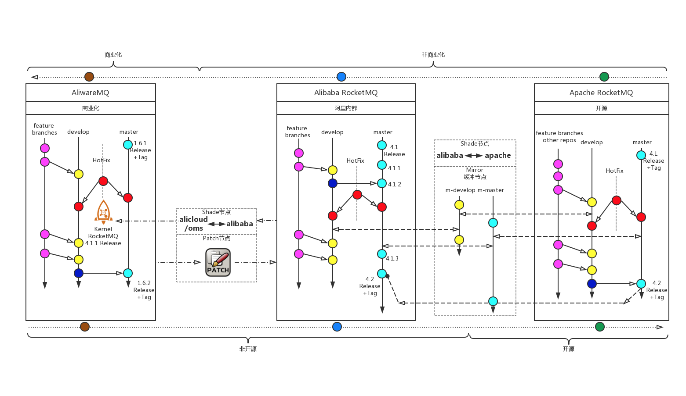  
###持续集成、持续压测，持续交付
借助Travis和Jenkins，我们搭建了两套基础设施。在Github上，Travis会对所有commit，所有PR触发持续集成，这是它的一个强大之处。除此之外，它还支持跨JDK，跨平台的Matrix验证（不过很可惜，OSX平台似乎一直都有问题）。在内部，利用Jenkins 2.0的Pipeline实现了持续集成，持续压测，持续交付（Docker，Pandora以及AWS Cloud，Azure Cloud）。如下图所示：  
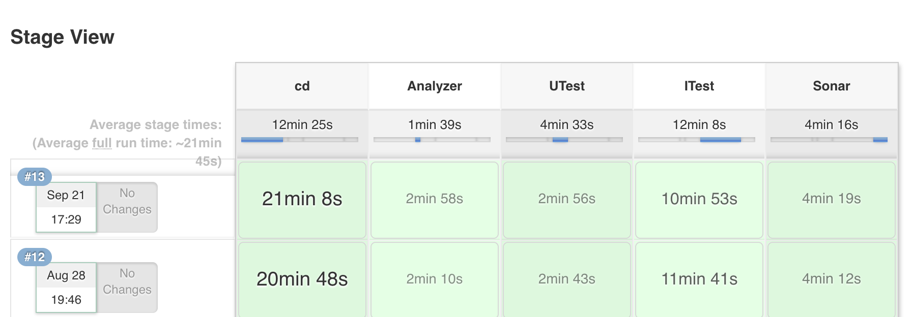  
由上图可知，整个持续集成分为代码静态检测，单元测试，集成测试，Sonar质量评测这个几个Stage。对于单元测试，不仅要覆盖核心逻辑，而且要快（内置3分钟阈值，超过就报错和发邮件）。无数实践告诉我们，如果不够快，就会有更多的同学在本地编译时选择跳过单测，久而久之，单测就慢慢失去了意义，变得愈发不可维护。要全，要快，还要可维护性。这对单测编写者来说无疑是个巨大挑战，这就要求多线程之间的交互尽量避免依赖sleep，自底向下的尽可能Mock依赖，动宾状结构的优雅命名，断言异常而不是抛出异常。
###发布规约
进入Apache后，尤其在孵化阶段，学习并遵循Apache发布流程显得尤为重要。  
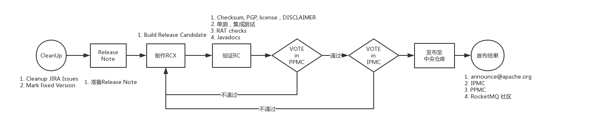  
上面这幅图描述的是Apache孵化项目的发布流程。快、稳，这是RocketMQ团队第一次发布传达给社区的信息。纵观所有Apache孵化项目，能够在这么短的时间内，用这么少的次数(RC3)学习并走完发布，用行动证明中国人同样具备严谨且专业地做事态度。当然，我们也是幸运地，幸运地碰到了Justin和Bruce这两位热心、专业的Mentor。这里，需要强调下Release生成的几个重要文件，如下图：  
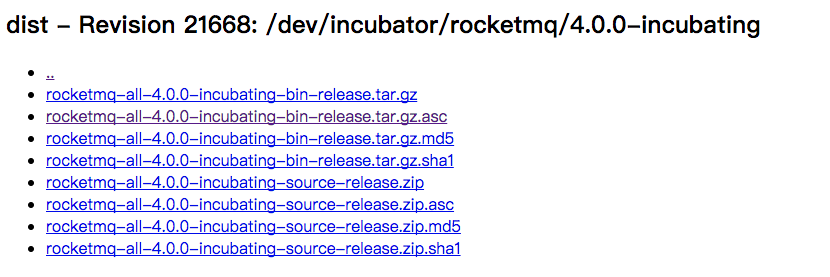  
源码(src)和二进制文件(bin)被分别打包。asc是一个签名文件，committer使用自己的私钥对分发包进行签名，任何人可以用我们对外公布的512位的公钥进行验证。

另外，还有一个不得不提的事情。Apache对License进行了严格的分类，比如Apache License 2.0/1.1，BSD，MIT/X11等属于Category A，这些协议与Apache License是兼容的，可以放心地引入。对于Category B中的License，比如EPL 1.0，MPL 1.0/1.1/2.0等能够以binary的形式引入。对于Category X中的License如GPL，LGPL则不能引入到产品当中。

针对License的问题，RocketMQ在首次发布的时候，在社区里进行了充分讨论。如何处双重License的依赖，如何区分Source和Binary Release依赖的License问题，如何处理NOTICE。这些知识被我们“现学现卖”的用在了指导社区贡献上面，既加强了记忆，又很好地传承给了社区。

###PR & Jira处理
这是一个RocketMQ way的具体体现。针对PR，我们设计了一套Checklist，如下图所示：  
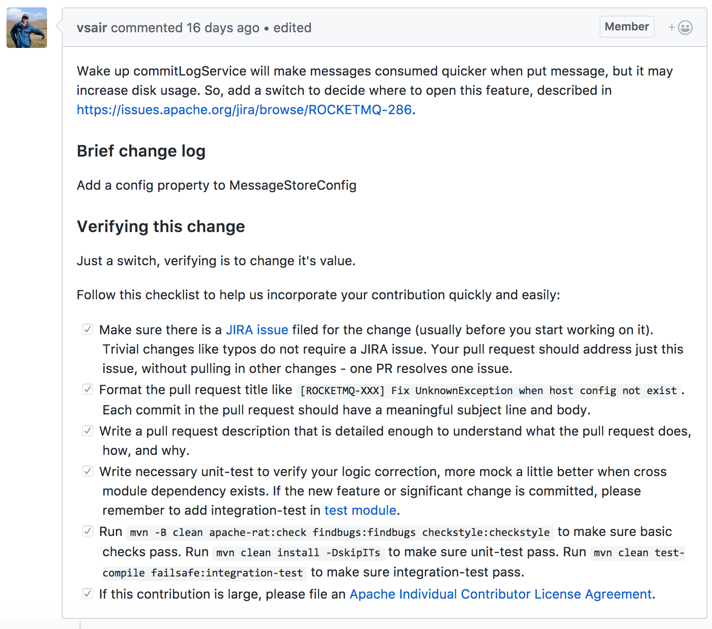  
所有PR必须有3+ Committer Review，Committer提交的PR，尽量不要自己Merge。另外，PR的合并是个费时费力的工作，团队成员通过研究，编写了一个自动化Python脚本，巧妙地将原先几分钟的常态工作缩减到了几秒钟，一定程度上体现了中国工程师“懒中求胜”的匠心精神。而Jira，我们强调component，每个component都有2到3位committer or maintainer把持。Jira的处理一般是需要经过Resolve阶段，最后才是Close，并且详细标明受影响的版本，在哪个版本修复掉。

##社区篇章
在产品篇章里，我们主要从编码规约，分支模型，持续交付，发布规约等环节回顾了这半年来可喜的变化。接下来的社区篇，我们将聚焦社区，重点介绍Apache Way，RocketMQ Way，以及社区成熟度模型。至于品牌&社区的Building，业界也有很多实践，如DevRel，JUG等。这里，放张图感受一下。
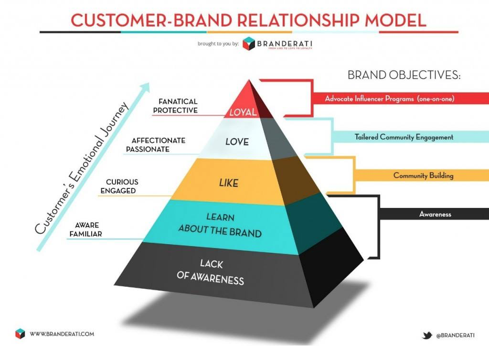  
###Apache Way
在Apache社区，一个很重要的理念，Community over Code。社区是判断一个孵化项目能否毕业的重要考核标准。但这并不意味着Code就不重要。仔细回想一下，在你接触过的所有Apache顶级项目中，有没有给你留下深刻印象的Code（请允许我拿代码来说事，代码就像一面镜子，是工程师的门面，也是工匠荣辱的最直接体现）。相信那些研究过大量Apache顶级项目的同学，一定有和我一样的感受。Apache在大力强调社区的今天，很容易给大家让大家误解 - 设计不重要了，代码不重要了。试想下，如果产品的设计，产品的质量不过硬，又怎么指望会有一个健康多元的社区呢？所以，我们重视社区，但也重视设计，重视代码质量，重视产品带给用户的体验。
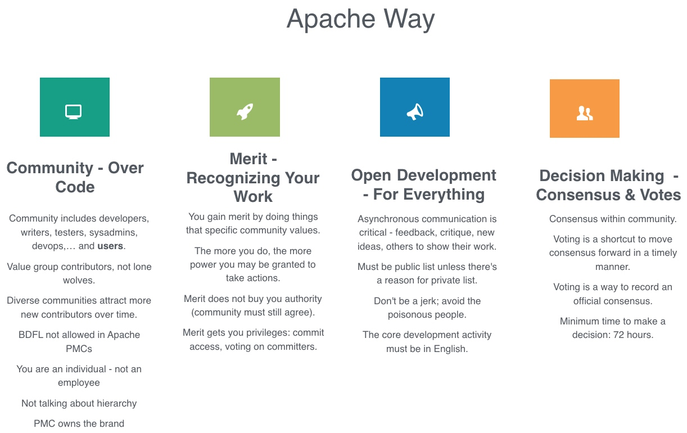  
上面这幅图节选自之前MeetUp上的分享，是我们对于Apache Way的理解  
- Community - Over Code，首先要认识社区，社区包罗万象，有Developers，Writers，Testers，Sysadmins，Devops，Users等等，但不需要Employee。由Employees打造的社区是不健康的，不可持续的，缺乏多元化。国际上一些大公司，早期参与Apache项目，一味想着控制社区，殊不知Apache社区理念的精髓在于与社区，与其它企业，其它个人贡献者，培养协作，加速项目与个人的成长。社区不会凭空产生，不是把项目往Github上一丢就是开源了，然后社区就会自动产生。一个社区的经营是需要花费心思的，发展一个社区成员，争取一个国际贡献者，这些都是一个长期经营的过程。RocketMQ社区的第一个国际贡献者，我们整整跟进、鼓励了近2个月。当然，还有不少老外也表达出了贡献社区的兴趣，万丈高楼平地起，先从最基本的工作做起，让社区看到你的努力，看到你持续跟进、贡献社区的决心，Apache Committer（认证程序员）自然离你不远。
- Merit - Recognizing Your Work，参与社区的建设能获得什么，一个Contributor在社区的所有努力是有目共睹和有迹可循的，提交了多少Issue和PR？参与了多少Code Review，邮件列表里是否总有真知灼见冒出来，这一切都在Github、JIRA、和邮件列表里进行了沉淀，在得到社区的认可后，Contributor变成为了Committer，Committer变成为了PMC Member。一步一步，社区认可了你的贡献，你也获得了不错的成长。
- Open Development - For Everything，社区一切都是开放的，特别是对于开发，每个人都可以参与到每行代码中，从开发前的DISCUSS，再到Pull Request中的Code Review，甚至作为User使用方面的Feedback。所有的讨论，思想的碰撞，甚至是争论，都是Public的。对于国内社区，我们一直在鼓励所有线下(包括QQ)的重要讨论，在邮件列表里都能有所体现，一切都是开放与透明的，没有私下的决定。
- Decision Making - Consensus & Votes，绝对的开放也会带来一定的弊端，如流程上的繁琐与拖沓。在社区做决议，首先需要通过在邮件列表中发起讨论，达成一致后，需要再发起一次投票，并至少等待72小时（考虑全球时区）后才能宣布投票结果。流程虽繁，但决议一旦通过，就坚决执行，这也是一种社区执行力的体现。

在学习和实践Apache Way的过程中，团队也摸索出了一套我们称之为RocketMQ Way的最佳实践。  
- International Collaboration - 禁止中文注释，允许User邮件列表使用中文提问，但Dev邮件列表必须使用英文。关于几个邮件列表的用途，请参考官方说明。
- PR Management - Pull Request提交、合并需遵循一定的规约(checklist)；每个PR必须有足够的单元测试，集成测试，有增量的代码覆盖率要求；PR的合并有3+ +1，Committer提交的PR不要自己Merge。
- Diversity Review - 对于Committer代码实施CTR(Commit then Review)策略，对于Contributor则是RTC(Review then Commit)策略。
- Branch Model - 采用双主干模式（Master与Develop），秉持One kernel的理念。
- Community CodeMarathon - 不定期的编程马拉松，挖掘社区活跃的贡献者，培养并辅导社区的深度参与者。
- Ecosystem Assemble - 独立仓库，为社区项目安营扎寨。每个个体在贡献之前，首先要提交Apache的ICLA。
One contributor, One Mentor - 每位PMC成员都有义务帮助社区Contributor，辅导并带领他们熟悉Apache Way，成为Committer甚至是PMC Member。 

###网站流量的变化
半年多的时间里，我们陆续在云栖社区，CSDN，InfoQ中文站、国际站发表了多篇技术文章，撰写国际论文，在ApacheCon、LinuxCon等国际顶级开源峰会发表主题演讲，全球图文同步直播Meetup。通过这一系列国际输出，网站流量迎来了可喜变化。
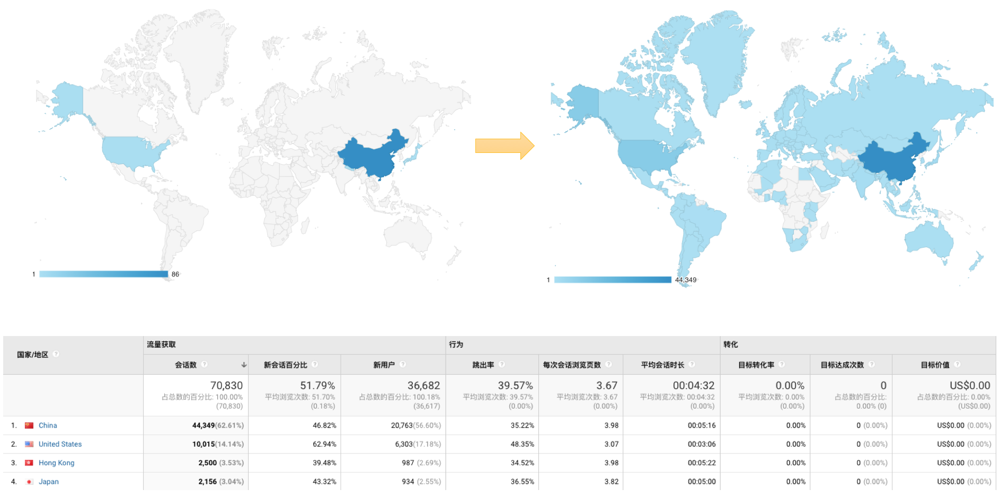  
通过这幅图可以看到，美国现在已经是RocketMQ全球第2大访问国。这对团队即将开展的Aliware MQ国际战略，奠定了良好的基础。同时，这种持续走高的流量也在不断鞭策着我们，写高质量代码，做高质量产品，向全球输出中国智(质)造。
###成熟度评估
坦白说，RocketMQ进入Apache之初，并没有针对这个模型做任何学习（讨厌应试教育）。我们希望通过自己的理解和践行，完成全球社区的构建，完成毕业。令人惊喜的是，当团队8月份开始正式审视毕业TODO List时，发现Apache的理论指导和我们的实践惊人的一致。理解万岁！下图是RocketMQ的社区成熟度评估。
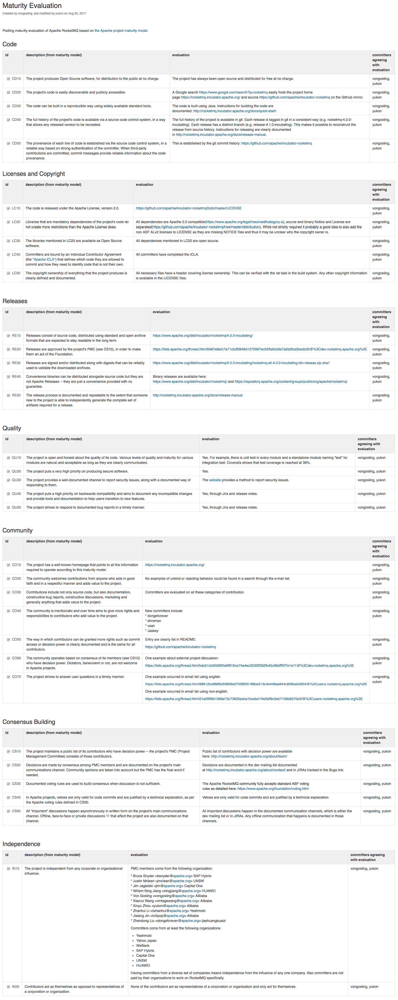  
##生态篇章
作为国内首个非Hadoop、Spark大数据生态下的Apache顶级项目，我们在打造多元化社区的同时，也在努力构建以Messaging为Core的生态体系。之前提到过的，我们为社区生态贡献者提供了单独的Apache代码仓库。这一做法，现在也在纷纷被其它Apache顶级项目所效仿。截止目前为止，来自社区贡献的RocketMQ-Console, RocketMQ-JMS, RocketMQ-Flume，RocketMQ-CPP 等生态项目已经在诸多公司内部进行了线上验证，像RocketMQ-Druid，RocketMQ-Ignite，RocketMQ-Storm等项目，代码更是被合并进对方仓库，这也使RocketMQ和其它顶级开源项目、社区之间有了更多连接。更多的生态项目介绍，请参考官网介绍。
[官网介绍](https://github.com/apache/incubator-rocketmq-externals)  
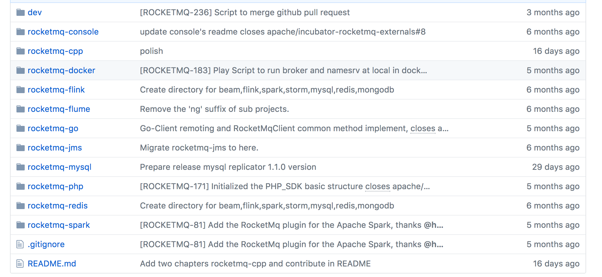  
###Messaging生态
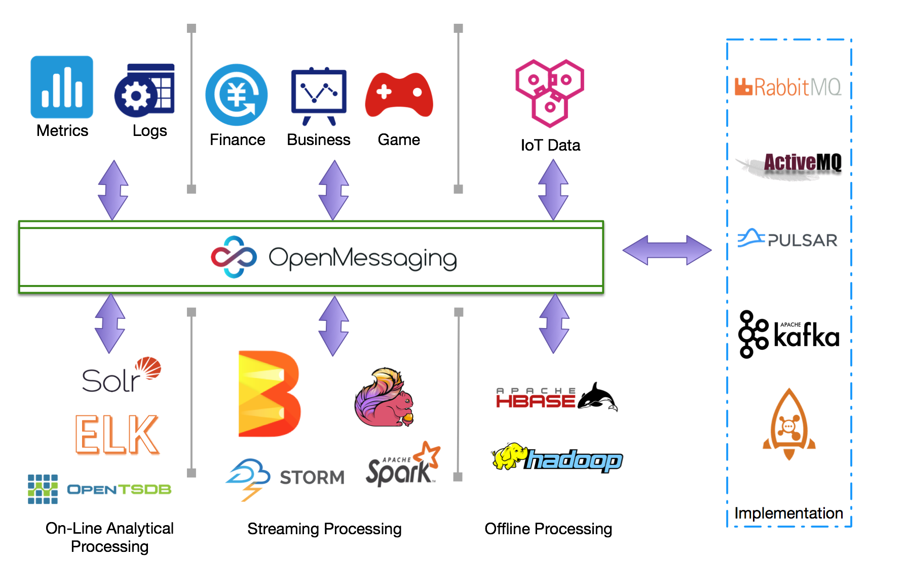  
上面这幅图是团队围绕着[OpenMessaging 标准](http://openmessaging.cloud/)而努力打造的生态体系。OpenMessaging是团队多年来从事Messaging领域研究的一个经验提炼。经过半年多的发展，这套标准已经进入Linux基金会，接下来会进入到CNCF，成为云计算不可或缺的标准之一。而这套API级的跨平台，跨语言标准，会尝试解决之前我们遇到但未曾彻底解决的所有问题。如下图所示，分布式事务，我们内部的产品MateQ和Notify也有类似的特性，但这种分布式事务更多的是发送者分布式事务，并不是真正意义上的分布式事务。负载均衡，在拉模式和推模式下策略会有所不同，消息本身的sharding也会因业务场景不同而不同。分布式追踪，主要是考虑Linux CNCF中的opentracing。协议桥接，主要是考虑如何和现有的标准，如JMS进行无缝桥接。流计算，通过引入流计算算子，在消息投递过程中针对内容进行计算。Benchmark，类似SPECJMS，把所有Messaging Engine拉到同一基调上做性能测试。
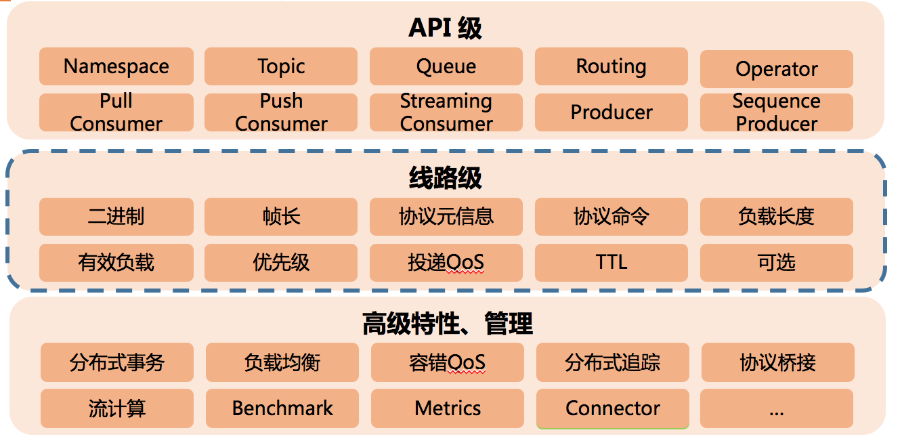  
总结一下，基于OpenMessaging的下一代的消息引擎RocketMQ 5.0主要会在四个领域持续发力：电子商务，高并发下削峰填谷。物联网领域，海量连接同时在线。大数据领域，吞吐为王。金融领域，重要的是高可靠，数据冗余。
##结束语
和其它国际顶级开源项目略有不同（如Hadoop，Spark等），除了在开源社区的努力外，团队在阿里集团也支撑着非常有挑战的内部业务（万亿级消息体量）。此外，RocketMQ商业版Aliware MQ已经对外云输出2年之久，服务了国内外上千家企业。除了这些，团队也在积极打造消息流计算生态，在Kafka，RabbitMQ，中继和数据同步等产品上持续耕耘。最近，OpenMessaging标准项目也正式入驻Linux基金会，这也是国内首个在全球范围内发起的分布式消息领域国际标准。所有这一切，对团队来说都极具挑战，我们希望在分布式、大数据、多语言架构领域有较高造诣，有追求的同学加入团队，而团队也会努力提供极具挑战的施展空间。我们重视成长，关注可持续发展。Apache RocketMQ顶级项目的毕业只是一个开始。前路漫漫，未来可期！
##作者简介
**冯嘉**，阿里巴巴高级技术专家，Aliware MQ负责人、主架构师，Apache RocketMQ联合创始人，LInux OpenMessaging 标准创始人。具有丰富的分布式软件架构、高并发网站设计、性能调优经验，拥有国内外多项分布式、推荐领域的专利。开源爱好者，专注分布式、大数据领域，关注 Hbase/Hadoop/Spark/Flink 等大数据技术栈。联系方式: vongosling@apache.org
