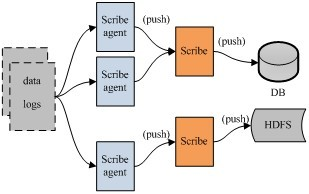
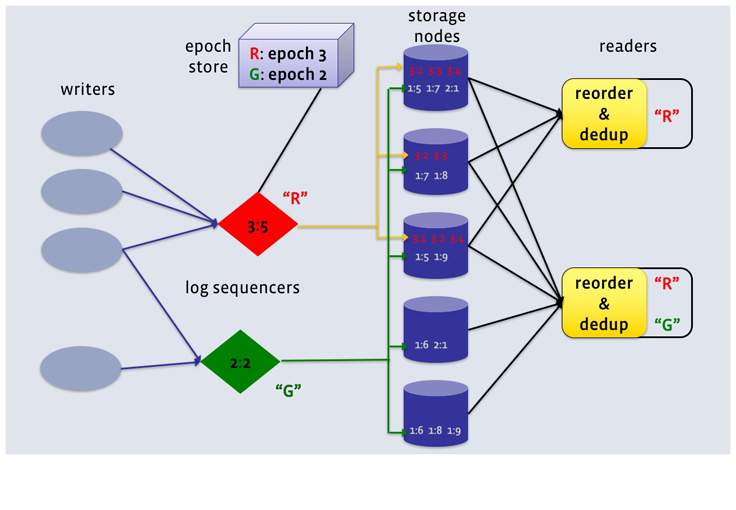
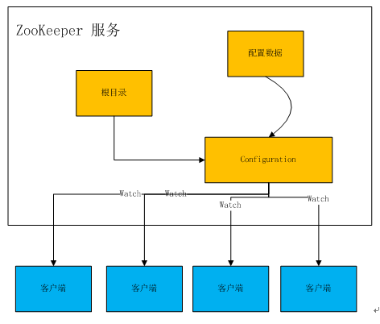

#LogDevice：来自Facebook的分布式日志数据存储系统
[TOC]
##写在前面
做过分布式系统的人都知道，想要在大规模集群下处理高并发事务时同时满足CAP（一致性、可用性、分区容错），从理论上来说不可能，当然听说最近谷歌已经实现了这样的分布式系统，但是总的来说确实非常难。对于社交媒体的海量日志文件，如果我们也提出了需要确保高可用、持续写入数据、按照记录顺序返回数据等三条要求，你觉得是否可以实现？FaceBook的LogDevice实现了。  

##什么是日志
日志是记录一系列序列化的系统行为的信息，我们需要确保它们能够被保存在可靠的地方。对于应用程序来说，日志的作用一般有两个，即Troubleshooting和显示程序运行状态。好的日志记录方式可以提供我们足够多定位问题的依据。对于一些复杂系统，例如数据库，日志可以承担数据备份、同步作用，很多分布式数据库都采用“write-ahead”方案，在节点数据同步时通过日志文件恢复数据。

日志一般具有三个特性：
1. 面向记录：写入日志的一定是孤立的行，而不是一个字节。日志实质上是问题的最小单元，用户也一定是读取整行日志。日志的存储原则上按照顺序，即按照LSN（日志顺序数字）存放，但是也不完全这么要求，所以日志系统可以优先高写入需求，对写入失败容错。
2. 日志天生就是递增的：也就是说，日志是不会修改的，那么也就意味着，日志系统的设计应该是以高写入、高读取为目标，不需要担心更新操作的数据一致性问题。
3. 日志存储周期长：可能是一天，也可能是一个月，甚至于一年。这也就意味着，日志的删除规则一般都是按照时间或者空间进行设定的，具有固定的规则。

##来个假如
假如我们要设计一个分布式日志存储系统，你会怎么设计？

日志信息需要传输、存储，为了实现稳定的数据交换，我们可以采用Kafka作为消息中间件。

Kafka实际上是一个消息发布订阅系统。Producer向某个Topic发布消息，而Consumer订阅某个Topic的消息，进而一旦有新的关于某个Topic的消息，Broker会传递给订阅它的所有Consumer。在Kafka中，消息是按Topic组织的，而每个Topic又会分为多个Partition，这样便于管理数据和进行负载均衡。同时，它也使用了Zookeeper进行负载均衡。

Kafka在磁盘上的存取代价为O(1)，即便是普通服务器，每秒也能处理几十万条消息，并且它本身就是分布式架构，也支持将数据并行加载到Hadoop。

上面这张图是一个典型的采用消息中间件进行日志数据交换的系统设计架构，但是没有实现数据存储，也没有描述数据是如何被抽取并发送到Kafka的。

如果想要实现数据存储，并描述清楚内部处理流程，我们可以采用怎么样的日志处理系统架构呢？这里推荐你FaceBook的Scribe，它是一款开源的日志收集系统，在Facebook内部已经得到大量的应用。它能够从各种日志源上收集日志，存储到一个中央存储系统 （可以是NFS，分布式文件系统等）上，以便于进行集中统计分析处理。

Scribe最重要的特点是容错性好。当后端的存储系统奔溃时，Scribe会将数据写到本地磁盘上，当存储系统恢复正常后，Scribe将日志重新加载到存储系统中。
  
Scribe的架构比较简单，主要包括三部分，分别为Scribe Agent， Scribe和存储系统。Scribe Agent实际上是一个Thrift Client。Scribe接收到Thrift Client发送过来的数据，根据配置文件，将不同topic的数据发送给不同的对象。存储系统实际上就是Scribe中的Store，当前Scribe支持非常多的Store。

貌似市面上已经有很多分布式日志收集系统了，为什么FaceBook还需要推出LogDevice呢？而且FaceBook自己已经有了Scribe，为什么还要继续设计LogDevice?因为Scribe更多实现了日志数据的收集，它不是一个完整的日志处理、存储、读取服务，系统设计也较为死板，存储更多依赖HDFS，使用过程中一定出现了不能满足自身需求的情况。而对于开源的哪些分布式日志收集系统，更多的是集成各个开源组件，共同完成日志存储系统设计需求。对于FaceBook的工程师来说，他们一贯秉承着用于创新的精神，想想Apache Cassandra，其实当时已经有HBase等成熟的NoSQL数据库，但是由于存在中心节点等诸多设计上的限制，FaceBook自己搞了一个全新的无中心化设计的架构，即便在初期饱受质疑，后续也在不断地改进，到目前为止，Cassandra真正进入到了它的黄金时代。

##LogDevice
- 
- 设计背景
FaceBook拥有大量的分布式服务用于保存和处理数据，如果想要构建高可用的数据密集型分布式服务，FaceBook认为，一定需要保存日志。为了处理FaceBook内部日志的高强度负载、性能需求，FaceBook把LogDevice设计成了可以调节的系统，而不是一套方案应对所有需求。

- 需求整理
对于日志服务的需求，也就是对于LogDevice的需求，第一条就是服务必须永远在线，不允许出现离线状态，因为FaceBook内部各个系统都需要保存日志，也就是说高可用。第二条是持久性，也就是说不允许丢数据，特别是返回客户端写入成功之后，绝对不能丢失数据。第三条是存在一定程度的数据读取，并且通常是读取最近写入的日志数据，这一条实质上是要求写入响应快。

- 设计思路
对于整个日志系统来说，整个设计应该更加关注数据的写入速度，怎么样设计才能具有更快的写入速度，并能支撑一定的读取速度，所以需要看看数据是如何被写入到LogDevice的。
如果需要提升日志文件的写入速率，或者更高一点要求，希望没有写入速率限制，你该怎么实现？我们可以模仿分布式文件系统或者分布式数据库的设计方式，采用多处副本方式，即一个文件有多个副本，那么每次日志写入请求就有了几处写入地址选择，而不是单一一个节点，或者几个特定的节点。这样做的好处是，当集群中的一部分节点宕机或者失去联系时，日志写入请求不会受到大规模的干扰，并且写入负载能够做到相对均衡。
  

数据副本设计，有没有其他系统实现？

有，非常多，例如HDFS、Cassandra。我们这里还是以FaceBook自己出品的Cassandra为例。

Cassandra在多个节点上存储副本以确保可用性和数据容错。副本策略决定了副本的放置方法。集群中的副本数量被称为复制因子，复制因子为1表示每行只有一个副本，复制因子为2表示每行有两个副本，每个副本不在同一个节点。所有副本同等重要，没有主次之分。作为一般规则，副本因子不应超过在集群中的节点的树木。当副本因子超过节点数时，写入不会成功，但读取只要提供所期望的一致性级别即可满足。目前Cassandra中实现了不同的副本策略，包括：  
1. SimpleStrategy：复制数据副本到协调者节点的N-1个后继节点上；
2. NetworkTopologyStrategy：用于多数据中心部署。这种策略可以指定每个数据中心的副本数。在同数据中心中，它按顺时针方向直到另一个机架放置副本。它尝试着将副本放置在不同的机架上，因为同一机架经常因为电源、制冷和网络问题导致不可用。

多数据中心集群最常见的两种配置方式是：  
1. 每个数据中心2个副本：此配置容忍每个副本组单节点的失败，并且仍满足一致性级别为ONE的读操作。
2. 每个数据中心3个副本：此配置可以容忍在强一致性级别LOCAL_QUORUM基础上的每个副本组1个节点的失败，或者容忍一致性级别ONE的每个数据中心多个节点的失败。  

LogDevice将日志里的记录顺序和实际存储的顺序区分开来，通过序列器产生一个学号，对每一行存储的日志进行重新序列标定。一旦一行记录被标定了这个序列号，接下来该条记录（数据）就会被保存在集群中任一位置。注意，这里提到的序列号不是一个数字，而是一对数字，第一个数字叫做“ epoch number”，第二个是相对于第一个的偏移量。序列号生成器本身也是需要做好容灾的，也就是说，一旦一个序列号生成器服务不在线，另一个一定要被立即启用，而它生成的序列号要比当前已经存在的序列号大。FaceBook使用ZooKeeper保存序列号（Epoch Number）。  
>**这里为什么要选择ZooKeeper存储序列号？**  
>ZooKeeper作为Hadoop
项目中的一个子项目，是Hadoop集群管理的一个必不可少的模块，它主要用来控制集群中的数据，如它管理Hadoop集群中的NameNode，还有HBase中Master节点的选举机制、服务器之间的状态同步等。除此之外，ZooKeeper还可以被用在构建高可用性集群、统一命名服务管理、分布式缓存机制设计、配置文件管理、集群管理、分布式锁机制设计、队列管理等等。
存储序列号的思路配置文件管理类似。
配置文件的管理在分布式应用环境中很常见，例如同一个应用系统需要多台PC Server运行，但是它们运行的应用系统的某些配置项是相同的，如果要修改这些相同的配置项，那么就必须同时修改每台运行这个应用系统的PC Server，这样非常麻烦而且容易出错。诸如这样的配置信息完全可以交给ZooKeeper来管理，将配置信息保存在ZooKeeper的某个目录节点中，然后将所有需要修改的应用机器监控配置信息的状态，一旦配置信息发生变化，每台应用机器就会收到ZooKeeper的通知，然后从ZooKeeper获取新的配置信息应用到系统中。
  
如上图所示，实际应用时我们可以通过自动监测Master节点内是否形成了新的配置文件，并在检测到形成了新的配置文件后主动上传到ZooKeeper，并下发到各Slave节点加载到内存中用于搜索任务的处理，无需管理人员在发现Master节点形成了新的配置文件之后，重启Master节点才将新的配置文件上传，显然降低了Master节点与Slave节点间配置文件同步的繁琐性，提高了设备的智能性，降低了同步成本。

根据FaceBook的设计思路，由于日志文件本身是可以随机读的，并且很多节点上都存在数据，这有点像小文件存储方式，每个节点上的数据都可以被读取，因此不会造成IO和网络资源的浪费。

>**数据是怎么做到负载均衡的？**
FaceBook没有在文章中描述实现原理。我们可以看看HDFS是怎么实现的。
数据平衡过程由于平衡算法的原因造成它是一个迭代的、周而复始的过程。每一次迭代的最终目的是让高负载的机器能够降低数据负载，所以数据平衡会最大程度上地使用网络带宽。下图1数据平衡流程交互图显示了数据平衡服务内部的交互情况，
包括NameNode和DataNode。
步骤分析如下：
>
>1. 数据平衡服务首先要求NameNode生成DataNode数据分布分析报告。
2. 选择所有的DataNode机器后，要求NameNode汇总数据分布的具体情况。
3. 确定具体数据块迁移路线图，保证网络内最短路径，并且确保原始数据块被删除。
4. 实际开始数据块迁移任务。
5. 数据迁移任务完成后，通过NameNode可以删除原始数据块。
6. NameNode在确保满足数据块最低副本条件下选择一块数据块删除。
7. NameNode通知数据平衡服务任务全部完成。
>
>HDFS数据在各个数据节点间可能保存的格式不一致。当存放新的数据块(一个文件包含多个数据块)时,NameNode在选择数据节点作为其存储地点前需要考虑以下几点因素：
>
>1. 当数据节点正在写入一个数据块时，会自动在本节点内保存一个副本。
>2. 跨节点备份数据块。
>3. 相同节点内的备份数据块可以节约网络消耗。
>4. HDFS数据均匀分布在整个集群的数据节点上。

FaceBook采用内存+磁盘的方式存储日志，HDD硬盘可以达到100-200MBps每秒的顺序读写速度，随机读写速度顶峰可以达到100-140MBps每秒。用来存储日志的服务被称为LogsDB，它是针对写入性能进行特殊优化过的。LogsDB本身又是构建于RocksDB之上的，RocksDB是基于LSM树的有序Key-Value存储层。RocksDB的每一个实例对应LogsDB的分区，当写入日志文件时，会写入到最新的分区，也就是最近访问过的RocksDB实例（以log id、LSN排序），然后以顺序方式保存到磁盘（称为SST文件）。这种方式确保了写入的方式是顺序方式，但是需要合并文件（当达到LogsDB分区的最大文件数量时）。  

##总结
就在我写文章的时候，微博因为“鹿晗介绍女朋友”事件奔溃了，系统启动之后的数据同步、验证过程，日志的作用非常重要。目前LogDevice还没有开源，但是从它的介绍来看，它应该是结合了FaceBook内部的多个开源项目的精髓，例如Cassandra，它的无中心化存储、碎片化存储（SSTable）、SSTable文件合并等等优秀的特性，为确保日志文件的高速写入、快速读取提供技术支撑。FaceBook已经明确今年年底会开源LogDevice，喜欢分布式实时处理、存储系统的同学们，就等着它了。

##作者介绍
周明耀，2004年毕业于浙江大学，工学硕士。13年软件研发经验，近10年技术团队管理经验，4年分布式计算、大数据技术经验。出版书籍包括《大话Java性能优化》、《深入理解JVM&G1 GC》、《技术领导力-码农如何才能带团队》。个人微信号michael_tec，个人公众号“麦克叔叔每晚10点说”，每天发布一篇技术短文。
