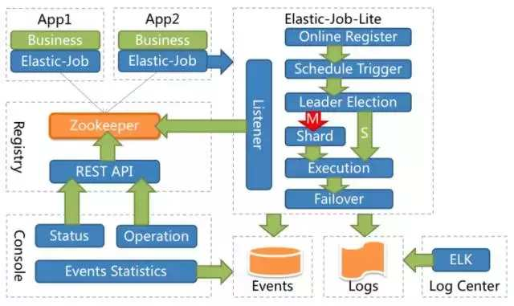
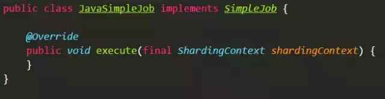

#分布式定时任务中间件架构及其实现
>2018年03月04日 19:54:50
>关键字：分布式

在互联网应用中，各式各样的定时任务存于系统各个角落。我们希望由一个平台统一将这些作业管理起来。通过这个系统，作业的宕机、崩溃等状态就可收入运维同学掌控，直接对接报警系统，将发现的挂掉作业再启动就好。但一旦平台中运行大量的作业，发现异常作业并手动处理难免会感到繁琐，而且人工处理带来的误操作以及时间差和7*24小时在线支持的要求都带来了额外的成本。

##什么是分布式定时任务中间件
最大限度的减少人工干预不仅是分布式定时任务中间件，也是所有的分布式中间件的核心价值所在。解决这个问题的方式就是高可用，让作业在被系统发现宕机之后能自动切换。高可用和马上要聊的弹性化可以一起看，弹性化可以认为是高可用的进阶版本，在高可用的同时还能够提升效率和充分利用资源。

如果作业处理的数据较多或计算量较大，单一实例效率不足的时候，最好可以做到增加一台服务器就能提升一部分的处理能力，也就是动态扩容。而一旦有运行中的服务器宕机，也不会影响整体的作业运行，无非是由于运行资源的减少而导致运行效率下降而已，这就是动态缩容。这通常采用分片的方式实现。它需要将一个任务拆分为多个独立的任务项，然后由分布式的服务器分别执行某一个或几个分片项。例如：有一个遍历数据库某张表的作业，现有2台服务器。为了快速的执行作业，那么每台服务器应执行作业的50%。 为满足此需求，可将作业分成2片，每台服务器执行1片。作业遍历数据的逻辑应为：服务器A遍历ID以奇数结尾的数据；服务器B遍历ID以偶数结尾的数据。 如果分成10片，则作业遍历数据的逻辑应为：每片分到的分片项应为ID%10，而服务器A被分配到分片项0,1,2,3,4；服务器B被分配到分片项5,6,7,8,9，直接的结果就是服务器A遍历ID以0-4结尾的数据；服务器B遍历ID以5-9结尾的数据。而将将分片总数设置为1，并使用多于1台的服务器执行作业，作业将会以1主n从的方式执行。一旦执行作业的服务器崩溃，等待执行的服务器将会在下次作业启动时替补执行。

另外还有一些作业完整性的需求，如：当作业执行时间过长造成下次该执行的作业的时间被错过时，需要提供被错过作业重执行机制；当一个作业分片失效时，需要立即在其他可运行节点运行，即失效转移功能等。

无论是高可用、分片还是错过作业重执行、失效转移，都需要依托于一个注册中心，用于记录作业的状态并且能够进行分布式组件的协调，一般使用ZooKeeper居多。使用ZooKeeper的临时节点和监听功能可以有效的做到分布式的协调，用于发现新上线节点和处理已下线节点。

总结一下，分布式定时任务中间件的关注点从易到难是：集中化 -> 高可用 –> 弹性化。

##去中心化和中心化
介绍完了关键功能点，接下来我们聊一下实现分布式定时任务中间件的两种架构方案，去中心化和中心化。

去中心化架构是指所有的作业节点都是对等的。每个作业从注册中心拉取自己的执行时间并且各自定时执行，执行时均使用作业服务器的本地时钟，在作业无需分片调整时并不会对注册中心产生写操作，进而不会导致注册中心更新缓存，因此执行效率很高，对注册中心产生的压力非常小。每个作业执行实例在执行时拉取仅属于自己实例的作业分片（通过本地缓存即可，并不直接读取注册中心），并传递给业务代码，供其根据所得分片项编写业务逻辑。去中心化架构需要一个被选举出来的主节点处理分片行为，仅分片行为不是去中心化的，需要集中处理。主节点是通过选举获得的非永久节点，一旦主节点的服务器宕机，则需要重新选举主节点。当作业服务器的在线状态发生变化时，则触发ZooKeeper监听，并设置需要重新分片的标记。在下次作业运行时，主节点将根据这个标记确定是否重分片并在需要时分片，分片时其他从节点一律处于阻塞状态。主节点的唯一特别之处就是负责作业运行之前的分片，其他方面的运行节点别无二致，主节点也是一个作业运行节点。

去中心化架构的优点是轻量级，仅提供一个lib就可以与业务代码一同工作，部署成本低，只需搭建注册中心即可。缺点是如果各作业服务器时钟不一致会产生同一作业的不同分片运行有先有后，缺乏统一调度。并且不能跨语言。

中心化架构将系统分为调度节点和执行节点。由调度节点发起作业的分片和执行，然后通过RPC发布给作业执行节点，或者通过写注册中心让监听注册中心的作业执行节点主动触发。同样可以采用注册中心来协调作业调度节点和执行节点的状态，也可以将注册中心退化为配置中心，专门用于存储作业配置元数据，转而由调度中心负责监听各个执行节点的状态。

中心化架构模式可以解决服务器时间差以及跨语言的问题（如果采用跨语言RPC或REST发送执行信令的方式）。缺点是部署和运维稍复杂，需要单独部署调度节点并需要维护其高可用，这也会造成一定的资源浪费。

无论是中心化还是去中心化，在分布式的场景下由于网络重试造成的顺序不一致等原因，可能导致ZooKeeper的数据与真实运行的作业产生不一致，这种不一致通过正向的校验无法完全避免。需要另外启动一个线程定时校验注册中心数据与真实作业状态的一致性，即通过检测的方式维持最终一致性。
##分布式定时任务中间件——Elastic-Job
Elastic-Job最初的版本分离于当当内部的应用框架ddframe，是一个纯Java实现的分布式方案，参照dubbo的方式，提供无中心化解决方案。它采用all in jar的理念，使用时无需区分主从或调度、执行节点，一切都采用自我协调。Elastic-Job采用ZooKeeper作为注册中心，用于处理作业的高可用、分片、失效转移等分布式协调功能。每个使用Elastic-Job的应用都需要与ZooKeeper建立连接，这样会造成ZooKeeper的连接过多，容易成为分布式ZooKeeper的瓶颈。它的分片逻辑根据IP地址抓取所在服务器的分片，IP地址不冲突是前提条件。Elastic-Job的架构图如下：
  
此时，每个团队自己搭建和管理各自的注册中心和服务器，因此使用Elastic-Job的项目都散落在各处。

随着私有云的技术栈越来越普及，公司决定将业务平台逐渐迁入私有云。作为入云的第一步，选择合理、风险易控的方向则很重要。经过多方面权衡，我们选择了基于Mesos + 自研Framework的作业云方案。而之前公司大量的使用Elastic-Job的项目都需要迁移，因此我们希望完全兼容Elastic-Job的原有API，所以Chronos等作业调度框架并不能满足我们的需求。我们要做的是将Elastic-Job结合到云平台，并增加结合硬件资源的掌控，以及部署发布自动化等功能。Elastic-Job本身包含Quartz，可以直接进行Job定时调度。因此，我们的最初想法是将Elastic-Job作为常驻服务启动，用Kubernetes或Mesos + Marathon运行。

如果想进一步学习java分布式的朋友可以来我的交流群，群里有阿里大牛直播讲解技术，以及Java大型互联网技术的视频和其他Java高级架构技术免费分享给大家：318261748.

Elastic-Job当时并未考虑Cloud Native，设计本身存在一个问题，那就是分片是基于IP地址的。如果运行在私有云，每个Job实例一旦分配到同一台Server，同样的IP地址会导致Job分片冲突。虽然用CNI等网络解决方案可以处理这方面的问题，但我们希望提供更加轻量级的解决方案。原因是我们不希望仅搭建公司级别的私有云，更希望遵循公司的一贯理念，将整个体系开源。

涉及到中心调度的需求，就不能仅使用Mesos + Marathon，或者Kubernetes做简单的治理了，需要自研一套框架来解决这些事情。当时的Kubernetes刚刚推出Multi-Scheduler，并未经过太多的验证。因此自研的灵活度上，采用Tow-Level调度体系的Mesos比较容易满足我们的需求。我们最终选定Mesos + 自定义Framework的方案搭建作业云平台。为了与Elastic-Job兼容，作业云沿用了Elastic-Job的API，新的基于Mesos的framework叫做Elastic-Job-Cloud，原Elastic-Job更名为Elastic-Job-Lite。

既然需要对Elastic-Job进行修改，那么其他需求也如雨后春笋一般冒了出来。最关键的需求是作业云平台应该可以同时支持常驻和瞬时两种作业。常驻作业就是之前提到的将Elastic-Job放到Marathon运行的形态。它由作业jar本身负责定时任务的调度，无论作业是否在执行，都会一直占有资源。常驻作业适合执行间隔短或初始化时间长的作业，以业务作业居多。比如订单拉取作业，需要初始化Spring容器，建立各种资源的连接，然后执行复杂的业务逻辑，并且订单拉取的时间间隔不会太长。另一种瞬时作业就像Chronos处理的方式，由中心调度，每次调度执行结束后都释放占用的资源。它适合间隔时间长，资源占用高的作业，以报表作业居多。

Elastic-Job-Cloud包括Mesos Framework的Scheduler和Customized Executor两部分。

Elastic-Job-Cloud放弃了采用ZooKeeper作为注册中心的方案，转而采用Mesos framework API提供的statusUpdate方法处理。statusUpdate的治理能力还是非常不错的，通过对Executor回传状态的解读来处理高可用、重新分片以及失效转移等功能。ZooKeeper在Elastic-Job-Cloud中彻底退化为存储媒介，仅用于存储Job的Metadata和待运行队列等状态数据。之所以仍然采用ZooKeeper是为了避免采用过多的第三方依赖，保持和Mesos使用统一的技术栈。作业运行的实时状态，由于大量的读写请求，放在ZooKeeper会极大的影响整个作业云的性能，因此直接放在内存中。未来我们希望将Job Metadata以及队列状态迁移至etcd，希望Mesos支持etcd作为配置中心的版本尽快出现。

Elastic-Job-Cloud采用中心节点分片，直接将分片任务转化为Mesos的TaskInfo，这样就屏蔽了IP地址的限制。资源分配在Lite中是缺失的，Mesos这样的平台可以将硬件资源和业务应用有机结合。我们最初开发的资源分配策略十分不稳定，无论是优先向一台Server分配，还是整个集群平均分配，算法都比较复杂，而且分配的维度不止一个。目前我们对CPU和Meomry资源进行管理，Disk，GPU资源等暂时未关注。经历了几次压测，整个系统的资源利用率极不稳定，直到采用了由netflix开源的Fenzo，一个专注于Mesos资源分配的框架，一切问题迎刃而解。吐槽一下，这是用Java开发Mesos framework的福利，Fenzo至今还未有其他语言的版本。Fenzo除了能够提供便利的资源分配策略之外，还能提供弹性资源伸缩分配等功能。但Fenzo使用不当会造成内存泄漏，关键点在于Fenzo会在内存中存储当前已分配的Task，Task运行结束后需要释放。但添加Task时，直接使用Fenzo生成的TaskAssigner对象，释放时却需要提供TaskID。Elastic-Job-Cloud的业务逻辑中TaskID中会包含Mesos的slaveID，用于通过TaskID回溯运行时状态。但Fenzo需要分配Server前即提供TaskID，因此我们的解决方案是先提供一个伪造的SlaveID，在分配完成后替换为真实的SlaveID。这样在记录Task时，由于Fenzo API的关系，不太容易注意到TaskID的作用，注销Task时使用真正的TaskID是无法清除的，而Fenzo未提供任何报错或日志，非常容易造成内存泄漏。

Elastic-Job-Cloud的作业调度采用两个队列，Offer队列用于收集Mesos分配的资源，Job队列用于堆积待执行作业。当待执行作业可以从资源队列中匹配到合适的资源时，才会分配并生成TaskInfo执行。这种方式对于运行在同一Mesos集群中的其他framework不太友好，可能在作业需求不多的情况下造成Offer的囤积。但对于Offer收取和Job执行同为异步的情况下，也没什么其他更好的方案了。

Scheduler开发是自研Mesos framework的必需品，而Customized Executor则不然，很多Mesos framework直接使用Default Executor，已经能满足基本需求。我们采用Customized Executor主要是两方面原因。第一个原因是为了兼容Elastic-Job-Lite的API，另一个原因是为了做到更合理的资源利用。这两个原因的根源在于Java。公司的很多项目都是Java开发的，Elastic-Job的API也是基于java，它根据Mesos分配好的分片处理相应的业务逻辑。像下面这样：
  
更合理的资源利用说起来比较复杂。Java的生态圈非常繁杂，用于支撑业务的作业框架不能只做到简单的能够触发调用，还需要和Spring这样的容器深度融合，至少需要通过依赖注入获取Spring容器中的bean。每次Job启动都初始化Spring容器是很大的浪费。Elastic-Job-Cloud的Executor在第一次启动时即实例化Spring容器，以后每次Job调度都复用Spring容器即可。以何种维度复用Executor是个值得探讨的问题，一开始我们采用每个Job的维度复用Executor，如果一个Job分为10片，分配到2台Mesos的Agent，那么每个Executor会开启多线程执行被分配到的分片项，而不同的Job则开启不同的Executor。但是应用的需求是无止境的，这种方式针对某些需求就不合适。如果发生很多Job只是名字以及配置不同，但Jar相同，而这种Job又很多的情况下，为每个Job创建独立的Executor就会造成资源过度浪费。举个具体的例子会更容易理解：系统监控作业，监控各种RESTFul API的可用性，有的每分钟监控一次，有的每5分钟监控一次，而各API的URL又不同。每个监控作业都是一个独立的Job，有不同的name和cron，但它们均来源于同一个Jar。针对这种情况，我们采用以Jar的App URL为维度复用Executor。成百上千个类似的Job汇聚成线程而不是进程，进一步节省资源。

Elastic-Job-Cloud的架构图如下：
  
为了使开源的Elastic-Job系列更加完善，Elastic-Job-Lite仍旧是必不可少的组成部分。我们看到了Elastic-Job-Cloud的强大功能，也看到了Elastic-Job-Lite的巨大潜力，因此我们再度对Elastic-Job-Lite出手，并于近日发布了2.1.0的支持Cloud Native 里程碑版本。

新版本支持单服务器跑任意多的相同作业实例，原作业实例标识由IP地址替换为作业启动瞬时产生的UUID。在新的Cloud Native架构下，作业物理服务器概念大幅弱化。为了向前兼容，作业物理服务器仅包含控制服务器是否可以禁用这一功能。为了更加纯粹的实现作业核心，作业物理服务器统计和操作功能未来可能删除，可下放至容器治理部署系统。

使用新增加的运行实例概念全面替换原服务器概念，Elastic-Job-Lite与容器治理系统的对接由原来的服务器维度转变为运行实例维度，每个运行实例都是动态的，会随着作业下线而消失。

习惯根据服务器静态分配作业的使用者也不用太过担心新版本带来的变化，服务器信息以另外一个维度可选的存在于作业管理信息中，使用者仍然可以继续使用服务器静态部署的方式。

通过这次修改，Elastic-Job-Lite已经可以非常容易的对接Mesos + Marathon以及Kubernetes，相信使用者可以非常轻松的搭建一个深度定制版的作业私有云。

并且在这次更新中，我们实现了自修复能力使稳定性进一步提升。刚才聊过，在分布式场景由于网络重试导致的顺序不一致，很难完全通过正向的方式保证每个节点间的状态完全同步。而Elastic-Job原来的版本在网络不稳定的情况下，可能发生主节点选举卡死，或某个分片不运行的情况，可以通过重启应用修复。在新版本中使用异步线程，定期（可配置时间间隔）检测集群中不正确的状态，以反向检查的方式查找并自动修复分布式的不一致，为分布式稳定性的完善增加了最后一块拼图。

虽然从功能上看Elastic-Job-Cloud更加完善，但由于依托于Mesos，使用复杂度较高，不易整合进公司现有系统，对新手来说使用成本较高，因而更加轻量级的Elastic-Job-Lite在实际使用中更受青睐。Elastic-Job-Lite只需在pom.xml中引入Elastic-Job的maven坐标，并且参照在GitHub上的example编写几行代码即可，唯一的外部依赖是ZooKeeper。

Elastic-Job已开源接近2年，目前为止已更新发布17次，提交千余次，GitHub的star数量也逐渐接近2000。它已在分布式作业领域占有一席之地，明确采纳的公司已超过50家，未收录的采纳公司不计其数，更有多个开源产品衍生自Elastic-Job。

Elastic-Job项目的开源地址：https://github.com/dangdangdotcom/elastic-job

