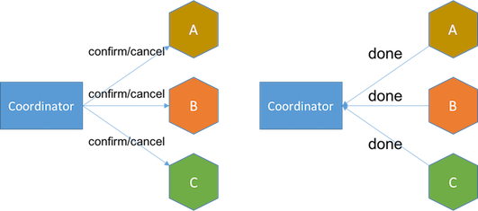

#ServiceComb中的数据最终一致性方案
>2017年10月30日 15:23:37
>本文由华为微服务引擎技术团队&&ServiceComb社区授权发布。
>关键字：微服务,一致性

数据一致性是构建业务系统需要考虑的重要问题 ， 以往我们是依靠数据库来保证数据的一致性。但是在微服务架构以及分布式环境下实现数据一致性是一个很有挑战的的问题。ServiceComb作为开源的微服务框架致力解决微服务开发过程中的问题。我们最近发起的ServiceComb-Saga项目来解决分布式环境下的数据最终一致性问题。本文将向大家介绍为什么数据一致性如此重要？Saga又是什么？

##单体应用的数据一致性
想象一下如果我们经营着一家大型企业，下属有航空公司、租车公司、和连锁酒店。我们为客户提供一站式的旅游行程规划服务，这样客户只需要提供出行目的地， 我们帮助客户预订机票、租车、以及预订酒店。从业务的角度，我们必须保证上述三个服务的预订都完成才能满足一个成功的旅游行程，否则不能成行。

我们的单体应用要满足这个需求非常简单，只需将这个三个服务请求放到同一个数据库事务中，数据库会帮我们保证全部成功或者全部回滚。
  

当这个功能上线以后，公司非常满意，客户也非常高兴。
##微服务场景下的数据一致性
这几年中，我们的行程规划服务非常成功，企业蒸蒸日上，用户量也翻了数十倍。企业的下属航空公司、租车公司、和连锁酒店也相继推出了更多服务以满足客户需求， 我们的应用和开发团队也因此日渐庞大。如今我们的单体应用已变得如此复杂，以至于没人了解整个应用是怎么运作的。更糟的是新功能的上线现在需要所有研发团队合作， 日夜奋战数周才能完成。看着市场占有率每况愈下，公司高层对研发部门越来越不满意。

经过数轮讨论，我们最终决定将庞大的单体应用一分为四：机票预订服务、租车服务、酒店预订服务、和支付服务。服务各自使用自己的数据库，并通过HTTP协议通信。 负责各服务的团队根据市场需求按照自己的开发节奏发版上线。如今我们面临新的挑战：如何保证最初三个服务的预订都完成才能满足一个成功的旅游行程， 否则不能成行的业务规则？现在服务有各自的边界，而且数据库选型也不尽相同，通过数据库保证数据一致性的方案已不可行。
  
##Sagas
幸运的是我们在互联网找到一篇精彩的论文，文中提出的数据一致性解决方案Saga恰好满足我们的业务要求。
>Saga是一个长活事务，可被分解成可以交错运行的子事务集合。其中每个子事务都是一个保持数据库一致性的真实事务。

在我们的业务场景下，一个行程规划的事务就是一个Saga，其中包含四个子事务：机票预订、租车、酒店预订、和支付。
  
Chris Richardson在他的文章Pattern: Saga中对Saga有所描述。 Caitie McCaffrey也在她的演讲中提到如何在微软的光晕 4游戏中如何应用saga解决数据一致性问题。
##Saga的运行原理
>Saga中的事务相互关联，应作为（非原子）单位执行。任何未完全执行的Saga是不满足要求的，如果发生，必须得到补偿。要修正未完全执行的部分， 每个saga子交易T1应提供对应补偿事务C1

我们根据上述规则定义以下事务及其相应的事务补偿： 
  
>当每个saga子事务 T1, T2, …, Tn 都有对应的补偿定义 C1, C2, …, Cn-1, 那么saga系统可以保证 [1]
 · 子事务序列 T1, T2, …, Tn得以完成 (最佳情况)
 · 或者序列 T1, T2, …, Tj, Cj, …, C2, C1, 0 < j < n, 得以完成

换句话说，通过上述定义的事务/补偿，saga保证满足以下业务规则：
- 所有的预订都被执行成功，如果任何一个失败，都会被取消
- 如果最后一步付款失败，所有预订也将被取消

##Saga的恢复方式
原论文中描述了两种类型的Saga恢复方式：
- 向后恢复 补偿所有已完成的事务，如果任一子事务失败
- 向前恢复 重试失败的事务，假设每个子事务最终都会成功

显然，向前恢复没有必要提供补偿事务，如果你的业务中，子事务（最终）总会成功，或补偿事务难以定义或不可能，向前恢复更符合你的需求。

理论上补偿事务永不失败，然而，在分布式世界中，服务器可能会宕机，网络可能会失败，甚至数据中心也可能会停电。在这种情况下我们能做些什么？ 最后的手段是提供回退措施，比如人工干预。

##使用Saga的条件
Saga看起来很有希望满足我们的需求。所有长活事务都可以这样做吗？这里有一些限制：
- Saga只允许两个层次的嵌套，顶级的Saga和简单子事务 [1]
- 在外层，全原子性不能得到满足。也就是说，sagas可能会看到其他sagas的部分结果 [1]
- 每个子事务应该是独立的原子行为 [2] 
在我们的业务场景下，航班预订、租车、酒店预订和付款是自然独立的行为，而且每个事务都可以用对应服务的数据库保证原子操作。

我们在行程规划事务层面也不需要原子性。一个用户可以预订最后一张机票，而后由于信用卡余额不足而被取消。同时另一个用户可能开始会看到已无余票， 接着由于前者预订被取消，最后一张机票被释放，而抢到最后一个座位并完成行程规划。

补偿也有需考虑的事项：
- 补偿事务从语义角度撤消了事务Ti的行为，但未必能将数据库返回到执行Ti时的状态。（例如，如果事务触发导弹发射， 则可能无法撤消此操作）

但这对我们的业务来说不是问题。其实难以撤消的行为也有可能被补偿。例如，发送电邮的事务可以通过发送解释问题的另一封电邮来补偿。

现在我们有了通过Saga来解决数据一致性问题的方案。它允许我们成功地执行所有事务，或在任何事务失败的情况下，补偿已成功的事务。虽然Saga不提供ACID保证，但仍适用于许多数据最终一致性的场景。那我们如何设计一个Saga系统？

##Saga Log
Saga保证所有的子事务都得以完成或补偿，但Saga系统本身也可能会崩溃。Saga崩溃时可能处于以下几个状态：
- Saga收到事务请求，但尚未开始。因子事务对应的微服务状态未被Saga修改，我们什么也不需要做。
- 一些子事务已经完成。重启后，Saga必须接着上次完成的事务恢复。
- 子事务已开始，但尚未完成。由于远程服务可能已完成事务，也可能事务失败，甚至服务请求超时，saga只能重新发起之前未确认完成的子事务。这意味着子事务必须幂等。
- 子事务失败，其补偿事务尚未开始。Saga必须在重启后执行对应补偿事务。
- 补偿事务已开始但尚未完成。解决方案与上一个相同。这意味着补偿事务也必须是幂等的。
- 所有子事务或补偿事务均已完成，与第一种情况相同。

为了恢复到上述状态，我们必须追踪子事务及补偿事务的每一步。我们决定通过事件的方式达到以上要求，并将以下事件保存在名为saga log的持久存储中：
- Saga started event 保存整个saga请求，其中包括多个事务/补偿请求
- Transaction started event 保存对应事务请求
- Transaction ended event 保存对应事务请求及其回复
- Transaction aborted event 保存对应事务请求和失败的原因
- Transaction compensated event 保存对应补偿请求及其回复
- Saga ended event 标志着saga事务请求的结束，不需要保存任何内容
  

通过将这些事件持久化在saga log中，我们可以将saga恢复到上述任何状态。

由于Saga只需要做事件的持久化，而事件内容以JSON的形式存储，Saga log的实现非常灵活，数据库（SQL或NoSQL），持久消息队列，甚至普通文件可以用作事件存储， 当然有些能更快得帮saga恢复状态。

##Saga请求的数据结构
在我们的业务场景下，航班预订、租车、和酒店预订没有依赖关系，可以并行处理，但对于我们的客户来说，只在所有预订成功后一次付费更加友好。 那么这四个服务的事务关系可以用下图表示：
  
将行程规划请求的数据结构实现为有向非循环图恰好合适。 图的根是saga启动任务，叶是saga结束任务。  
  

##Parallel Saga
如上所述，航班预订，租车和酒店预订可以并行处理。但是这样做会造成另一个问题：如果航班预订失败，而租车正在处理怎么办？我们不能一直等待租车服务回应， 因为不知道需要等多久。

最好的办法是再次发送租车请求，获得回应，以便我们能够继续补偿操作。但如果租车服务永不回应，我们可能需要采取回退措施，比如手动干预。

超时的预订请求可能最后仍被租车服务收到，这时服务已经处理了相同的预订和取消请求。
  
因此，服务的实现必须保证补偿请求执行以后，再次收到的对应事务请求无效。 Caitie McCaffrey在她的演讲Distributed Sagas: A Protocol for Coordinating Microservices中把这个称为可交换的补偿请求 (commutative compensating request)。

##ACID and Saga
ACID是具有以下属性的一致性模型:
- 原子性（Atomicity）
- 一致性（Consistency）
- 隔离性（Isolation）
- 持久性（Durability）

Saga不提供ACID保证，因为原子性和隔离性不能得到满足。原论文描述如下：
>full atomicity is not provided. That is, sagas may view the partial results of other sagas [1]

通过saga log，saga可以保证一致性和持久性。

##Saga 架构
最后，我们的Saga架构如下：
  
- Saga Execution Component解析请求JSON并构建请求图
- TaskRunner 用任务队列确保请求的执行顺序
- TaskConsumer 处理Saga任务，将事件写入saga log，并将请求发送到远程服务

在上文中，我谈到了ServiceComb下的Saga是怎么设计的。 然而，业界还有其他数据一致性解决方案，如两阶段提交（2PC）和Try-Confirm / Cancel（TCC）。那saga相比之下有什么特别？

##两阶段提交 Two-Phase Commit (2PC)
>两阶段提交协议是一种分布式算法，用于协调参与分布式原子事务的所有进程，以保证他们均完成提交或中止（回滚）事务。

2PC包含两个阶段：
- 投票阶段 协调器向所有服务发起投票请求，服务回答yes或no。如果有任何服务回复no以拒绝或超时，协调器则在下一阶段发送中止消息。 
  
- 决定阶段 如果所有服务都回复yes，协调器则向服务发送commit消息，接着服务告知事务完成或失败。如果任何服务提交失败， 协调器将启动额外的步骤以中止该事务。 
  

在投票阶段结束之后与决策阶段结束之前，服务处于不确定状态，因为他们不确定交易是否继续进行。当服务处于不确定状态并与协调器失去连接时， 它只能选择等待协调器的恢复，或者咨询其他在确定状态下的服务来得知协调器的决定。在最坏的情况下， n个处于不确定状态的服务向其他n-1个服务咨询将产生O(n2)个消息。

另外，2PC是一个阻塞协议。服务在投票后需要等待协调器的决定，此时服务会阻塞并锁定资源。由于其阻塞机制和最差时间复杂度高， 2PC不能适应随着事务涉及的服务数量增加而扩展的需要。

有关2PC实现的更多细节可参考2和3。
##Try-Confirm/Cancel (TCC)
TCC也是补偿型事务模式，支持两阶段的商业模型。

- 尝试阶段 将服务置于待处理状态。例如，收到尝试请求时，航班预订服务将为客户预留一个座位，并在数据库插入客户预订记录，将记录设为预留状态。 如果任何服务失败或超时，协调器将在下一阶段发送取消请求。
  
- 确认阶段 将服务设为确认状态。确认请求将确认客户预订的座位，这时服务已可向客户收取机票费用。数据库中的客户预订记录也会被更新为确认状态。 如果任何服务无法确认或超时，协调器将重试确认请求直到成功，或在重试了一定次数后采取回退措施，比如人工干预。 
  

与saga相比，TCC的优势在于，尝试阶段将服务转为待处理状态而不是最终状态，这使得设计相应的取消操作轻而易举。

例如，电邮服务的尝试请求可将邮件标记为准备发送，并且仅在确认后发送邮件，其相应的取消请求只需将邮件标记为已废弃。但如果使用saga， 事务将发送电子邮件，及其相应的补偿事务可能需要发送另一封电子邮件作出解释。

TCC的缺点是其两阶段协议需要设计额外的服务待处理状态，以及额外的接口来处理尝试请求。另外，TCC处理事务请求所花费的时间可能是saga的两倍， 因为TCC需要与每个服务进行两次通信，并且其确认阶段只能在收到所有服务对尝试请求的响应后开始。

有关TCC的更多细节可参考[Transactions for the REST of Us.](https://www.infoq.com/presentations/Transactions-HTTP-REST)  

##事件驱动的架构
和TCC一样，在事件驱动的架构中，长活事务涉及的每个服务都需要支持额外的待处理状态。接收到事务请求的服务会在其数据库中插入一条新的记录， 将该记录状态设为待处理并发送一个新的事件给事务序列中的下一个服务。

因为在插入记录后服务可能崩溃，我们无法确定是否新事件已发送，所以每个服务还需要额外的事件表来跟踪当前长活事务处于哪一步。
  
一旦长活事务中的最后一个服务完成其子事务，它将通知它在事务中的前一个服务。接收到完成事件的服务将其在数据库中的记录状态设为完成。
  
如果仔细比较，事件驱动的架构就像非集中式的基于事件的TCC实现。如果去掉待处理状态而直接把服务记录设为最终状态，这个架构就像非集中式的基于事件的saga实现。 去中心化能达到服务自治，但也造成了服务之间更紧密的的耦合。假设新的业务需求在服务B和C之间的增加了新的流程D。在事件驱动架构下，服务B和C必须改动代码以适应新的流程D。 
  
Saga则正好相反，所有这些耦合都在saga系统中，当在长活事务中添加新流程时，现有服务不需要任何改动。

更多细节可参考[Event-Driven Data Management for Microservices.](https://www.nginx.com/blog/event-driven-data-management-microservices/)  

##集中式与非集中式实现
这个Saga系列的文章讨论的都是集中式的saga设计。但saga也可用非集中式的方案来实现。那么非集中式的版本有什么不同？ 
非集中式saga没有专职的协调器。启动下一个服务调用的服务就是当前的协调器。例如，
- 服务A收到要求服务A，B和C之间的数据一致性的事务请求。
- A完成其子事务，并将请求传递给事务中的下一个服务，服务B.
- B完成其子事务，并将请求传递给C，依此类推。
- 如果C处理请求失败，B有责任启动补偿事务，并要求A回滚。 

  
与集中式相比，非集中式的实现具有服务自治的优势。但每个服务都需要包含数据一致性协议，并提供其所需的额外持久化设施。

我们更倾向于自治的业务服务，但服务还关联很多应用的复杂性，如数据一致性，服务监控和消息传递， 将这些棘手问题集中处理，能将业务服务从应用的复杂性中释放，专注于处理复杂的业务，因此我们采用了集中式的saga设计。

另外，随着长活事务中涉及的服务数量增长，服务之间的关系变得越来越难理解，很快便会呈现下图的死星形状。 
  

图片来源: [http://www.slideshare.net/BruceWong3/the-case-for-chaos (s12)](http://www.slideshare.net/BruceWong3/the-case-for-chaos)
同时，在长活事务中定位问题也变得更加复杂，因为服务日志遍布群集节点。  

##Summary
本文将saga与其他数据一致性解决方案进行了比较。Saga比两阶段提交更易扩展。在事务可补偿的情况下， 相比TCC，saga对业务逻辑几乎没有改动的需要，而且性能更高。集中式的saga设计解耦了服务与数据一致性逻辑及其持久化设施， 并使排查事务中的问题更容易。

##References
https://en.wikipedia.org/wiki/Two-phase_commit_protocol  
https://cs.nyu.edu/courses/spring03/G22.2631-001/lecture8.pdf  
http://courses.cs.vt.edu/~cs5204/fall00/distributedDBMS/duckett/tpcp.html  
https://www.infoq.com/presentations/Transactions-HTTP-REST  
https://www.nginx.com/blog/event-driven-data-management-microservices/  
Original Paper on Sagas by By Hector Garcia-Molina & Kenneth Salem  
Original Paper on Sagas by By Hector Garcia-Molina & Kenneth Salem  
Gifford, David K and James E Donahue, “Coordinating Independent Atomic Actions”, Proceedings of IEEE COMPCON, San Francisco, CA, February, 1985  
Chris Richardson: http://www.chrisrichardson.net/  
ServiceComb Saga Project: https://github.com/ServiceComb/saga  
ServiceComb官方网站  
ServiceComb Github  