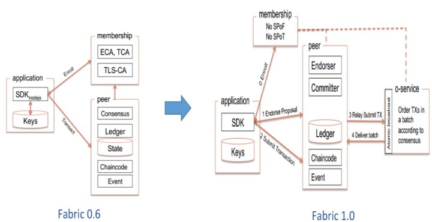
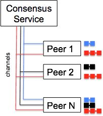
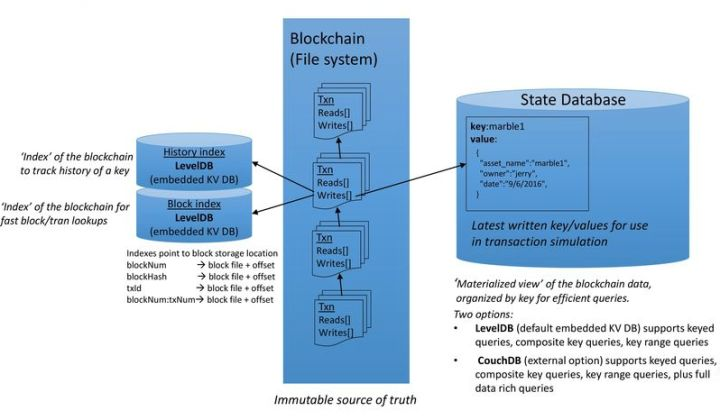
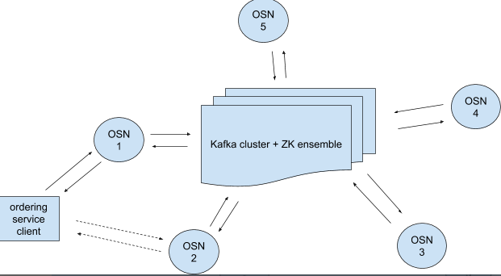
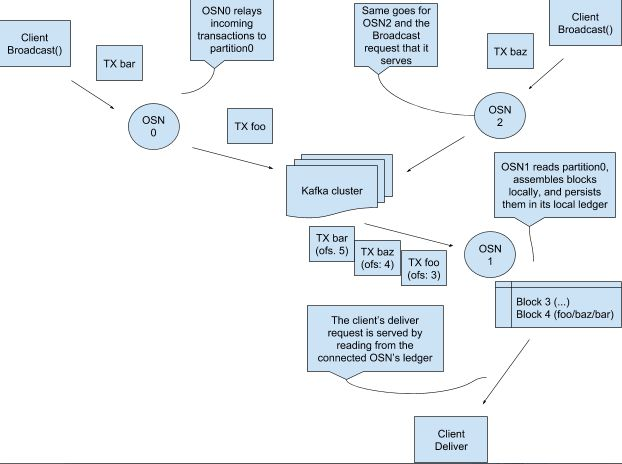

#一文理解超级账本Hyperledger Fabric的架构与坑

[TOC]

接触区块链的童鞋都知道比特币或者说以太坊，但是了解超级账本（Hyperledger）的肯定不多。在区块链的世界观里，一直有公有链、联盟链和私有链的分别，但后两者没有公有链引起的反响大，也被很多公有链的拥趸所鄙视。

但是我们不应该采取非一即二的思想看待这个问题，世界上没有任何客观实体是非黑即白，站的角度不同，结论也不一样。联盟链（私有链）是现有中心化商业团体联盟之间（团体内部）进行商业活动的手段和渠道，B2B 的业务很难迁移到公有链上，不仅仅是性能更是因为商业机密等问题。我相信未来是公有链与联盟链（私有链）共存，各自都有自己的使用场景，正如广域网与局域网，互有利弊，各司其职。

拉扯完背景，拖上这篇文章的主角：Hyperledger Fabric，它是由 IBM 带头发起的一个联盟链项目，于 15 年底移交给 Linux 基金会，成为开源项目。Hyperledger 基金会的成员有很多大牌，诸如 IBM，Intel，思科等。基金会里孵化了很多区块链项目，Fabric 是其中最出名的一个，一般我们说超级账本（Hyperledger）基本上指的都是 Fabric。在接下来的篇幅里，我会讲解 Fabric 的架构，包括多链多通道、账本设计等等，以及链码的编写和部署流程，最后再讲讲遇到的坑和 Fabric 的一些不足。

##Fabric 架构
Fabric 的架构历经了两个版本的演进，最初接触的 0.6 版本只能被用来做商业验证，无法被应用于真实场景中。主要原因就是结构简单，基本所有的功能都集中在 peer 节点，在扩展性、安全性和隔离性方面有着天然的不足。因此在后来推出的 1.0 正式版中，将 peer 节点的功能进行分拆，把共识服务从 peer 节点剥离，独立为 orderer 节点提供可插拔共识服务。更为重要的一个变化就是加入了多通道（multi-channel）功能，可实现了多业务隔离，在 0.6 版本的基础上可以说是质的飞跃。
  

##多链与多通道
Fabric 中的链（chain）包含了链码（chaincode）、账本（ledger）、通道（channel）的逻辑结构，它将参与方（organization）、交易（transaction）进行隔离，满足了不同业务场景不同的人访问不同数据的基本要求。通常我们说的多链在运维层次上也就是多通道。一个 peer 节点可以接入多条通道，从而加入到多条链，参与到不同的业务中。如图所示：
  
图中（P1、PN）、（P1、P2、P3）、（P2、PN）组成了三个相互独立的链，peer 节点只需维护自己加入的链的账本信息，感应不到其他链的存在。这种模式与现实业务场景有诸多相似之处，不同业务有不同的参与方，不参与该业务，不应该看到业务相关的任何信息。多通道特性是 Fabric 在商用区块链领域推出的杀手锏，当然也不完美，虽然 peer 节点不能看到不相关通道的交易，但是对于 orderer 节点来说，还是所有通道的交易都可以看到，虽然可以使用技术手段分区，但无疑增加了复杂度。

##账本结构
账本简单的说，是一系列有序的、不可篡改的状态转移记录日志。状态转移是链码（chaincode）执行（交易）的结果，每个交易都是通过增删改操作提交一系列键值对到账本。一系列有序的交易被打包成块，这样就将账本串联成了区块链。同时，一个状态数据库维护账本当前的状态，因此也被叫做世界状态。在 1.0 版本的 Fabric 中，每个通道都有其账本，每个 peer 节点都保存着其加入的通道的账本，包含着交易日志（账本数据库）、状态数据库以及历史数据库。
  
账本状态数据库实际上存储的是所有曾经在交易中出现的键值对的最新值。调用链码执行交易可以改变状态数据，为了高效的执行链码调用，所有数据的最新值都被存放在状态数据库中。就逻辑上来说，状态数据库仅仅是有序交易日志的快照，因此在任何时候都可以根据交易日志重新生成。状态数据库会在 peer 节点启动的时候自动恢复或重构，未完备前，该节点不会接受新的交易。状态数据库可以使用 LevelDB 或者 CouchDB。LevelDB是默认的内置的数据库，CouchDB是额外的第三方数据库。跟 LevelDB 一样，CouchDB 也能够存储任意的二进制数据，而且作为 JSON 文件数据库，CouchDB 额外的支撑 JSON 富文本查询，如果链码的键值对存储的是 JSON，那么可以很好的利用 CouchDB 的富文本查询功能。

Fabric 的账本结构中还有一个可选的历史状态数据库，用于查询某个 key 的历史修改记录，需要注意的是，历史数据库并不存储 key 具体的值，而只记录在某个区块的某个交易里，某 key 变动了一次。后续需要查询的时候，根据变动历史去查询实际变动的值，这样的做法减少了数据的存储，当然也增加了查询逻辑的复杂度，各有利弊。

账本数据库是基于文件系统，将区块存储于文件块中，然后在 LevelDB 中存储区块交易对应的文件块及其偏移，也就是将 LevelDB 作为账本数据库的索引。文件形式的区块存储方式如果没有快速定位的索引，那么查询区块交易信息可能是噩梦。现阶段支持的索引有：
- 区块编号
- 区块哈希
- 交易 ID 索引交易
- 区块交易编号
- 交易 ID 索引区块
- 交易 ID 索引交易验证码

##Kafka共识
基于 Kafka 实现的共识机制是 Fabric1.0 中提供的共识算法之一。之所以将 0.6 版本中提供的 PBFT 暂时取消，一是因为交易性能达不到要求；二一点是因为 Fabric 面向的联盟链环境中，因为节点都是有准入控制的，拜赞庭容错的需求不是很强烈，反而是并发性能最重要。因此，也就有了 Kafka 共识的出现。
  
一个共识集群由多个 orderer 节点（OSN）和一个 kafka 集群组成。orderer 之间并不直接通信，他们仅仅和 Kafka 集群通信。在 orderer 的实现里，通道在 kafka 中是以 topic 的形式隔离。每个 orderer 内部，针对每个通道都会建立与 kafka 集群对应 topic 的生产者及消费者。生产者将 orderer 节点收到的交易发送到 kafka 集群进行排序，在生产的同时，消费者也同步消费排序后的交易。

那么如何鉴别某个交易属于哪个区块呢？Fabric 的区块结块由两个条件决定，区块交易量和区块时间间隔。当配置的交易量达到阈值时，无论是否达到时间间隔，都会触发结块操作；另一方面，如果触发了设置的时间间隔阈值，只要有交易就会触发结块操作，也就是说 fabric 中不会有空块。结块操作是由 orderer 节点中的 kafka 生产者发送一条 TTC-X（Time to cut block x）消息到 kafka 集群，当任意 orderer 节点的 kafka 消费者接收到任意节点发出的 TTC-X 消息时，都会将之前收到的交易打包结块，保存在 orderer 本地，之后再分发到各 peer 节点。以上过程可由下图描述：
  

##链码
前面介绍的 Fabric 架构更多的是针对 Fabric 平台运维工程师，而对更多的应用开发者来说，链码其实才是最重要的。链码（chaincode）是 Hyperledger Fabric 提供的智能合约，是上层应用与底层区块链平台交互的媒介。现阶段，Fabric 提供 Go、Java 等语言编写的链码，但不管是哪种语言编写的链码，套路都是差不多的。

所有的链码都继承两个接口，init 和 invoke。init 接口用于初始化合约，在整个链码的生命周期里，该接口仅仅执行一次。剩下的 invoke 接口是编写业务逻辑的唯一入口，虽然只有一个入口，但是可以根据参数传递的不同自由区分不同业务逻辑，灵活性很高。比如应用开发者规定 Invoke 接口的第一个参数是合约方法名，剩余的 Invoke 参数列表是传递给该方法的参数，那么就可以在 Invoke 接口方法体中根据方法名的不同分流不同业务了。

那么在合约里能够获取哪些内容呢？我把合约接口能获得数据分为三类：
1. 输入参数获取。这点很好理解，我们只有知道此次调用的输入，才能处理逻辑，推导输出；
2. 与状态数据库和历史数据库交互。在合约层，我们可以将区块链底层当做是一个键值对数据库，合约就是对数据库中键值的增删改查；
3. 与其他合约的交互。在合约执行的过程中，可以与其他合约交换数据，做到类似跨链的效果。有了这种形式的数据获取方式，其实就可以将联系不紧密的业务逻辑拆分为多个合约，只在必要的时候跨合约调用，非常类似于现在提倡的微服务架构。

编写链码还有一个非常重要的原则：不要出现任何本地化和随机逻辑。此处的本地化，不是指语言本地化，而是执行环境本地化。区块链因为是去中心架构，业务逻辑不是只在某一个节点执行，而是在所有的共识节点都执行，如果链码输出与本地化数据相关，那么可能会导致结果差异，从而不能达成共识。比如，时间戳，随机函数等。这些方法是链码编程的禁地，除非你知道你的用意，否则慎用！

##链码部署
在最初接触 Fabric 的那段时间，我其实是很混淆 peer、通道和链码间的关系的，直到我从头到尾完成了一次平台的部署。简单的说，peer 是一个独立存在的计算机节点，不管是物理机还是虚拟机，总之是独立实体。在 peer 没有加入任何通道之前，是不能够做任何业务的，因为他没有业务载体。而通道就是业务载体，是纯粹的逻辑概念，可以独立于 peer 存在，但也因此也没任何存在的意义了。最后链码就是业务，业务是跑在通道里的，不同的通道即便是运行相同的链码，因为载体不同，可认为是两个不同业务。peer 是地，通道是路，链码是车，三者相辅相成才能构建一套完整的区块链业务系统。经过以上分析，链码的部署也就如“把大象放进冰箱分几步”这么简单了：
1. 创建业务载体通道；
2. 将通道与 peer 节点绑定；
3. 在通道上实例化链码。

从逻辑上来说，就是如此的简单。当然，在实际的操作过程中，肯定要复杂的多，感兴趣的读者可以对照着官方文档从头到尾撸一遍，之后再读这篇文章，我相信你会有更清晰的认识。

##坑与不足
区块链是门新技术，Hyperledger Fabric 是更新的区块链实现，在我们调研实践的过程中，基本上除了官方文档以外再也找不到其他资料可供我们参考，我们唯一可行的学习途径就是：撸源码！通过撸代码去了解内部实现机制，出现未知错误，直接看源码反推，使用之路确实艰辛。在使用的过程中，我们也发现了很多坑，一些坑我们可以采用其他办法绕过，另外的就只能当做是 Fabric 的不足了。
- 通道的管理：在 Fabric 的设计里，通道其实就相当于账本的概念。现阶段仅仅只有创建，而没有删除功能，当然这可以理解，区块链的一个重要特性是不可篡改，如果能直接将整个链删除了那还了得。但是在使用 kafka 共识的过程中，如果数据操作不当，直接在 kafka 中删除数据，而 orderer 没有逻辑去处理这种异常删除，因此会不断的重试，在达到重试极限后直接崩溃整个进程。因为一个通道的错误，影响了整个系统的运转，这不是一个好的设计；
- 没有完善的数据管理方案：在我们的使用场景中，数据增长是很快的，如果使用 CouchDB 作为底层数据引擎，数据更是几何倍数的爆发。现有的解决方案只能是在云上部署节点，提供可持续扩充的云硬盘，再者使用 LevelDB 替换掉 CouchDB，避免使用模糊查询。

##学习建议
之前因为学习资料的缺失，我们只能通过撸代码来学习。而现在这个时间点，Fabric1.0 版本已经推出有一段时间了，网络上已经有了很多学习资料，基本免费开源，此处不做推荐。之后也会具体的针对 Hyperledger Fabric 推出更有侧重点的文章，敬请期待。

##参考资料
Hyperledger Fabric 官方文档 2017：http://hyperledger-fabric.readthedocs.io/en/latest/index.html

A Kafka-based Ordering Service for Fabric 2017：https://docs.google.com/document/d/1vNMaM7XhOlu9tB_10dKnlrhy5d7b1u8lSY8a-kVjCO4/edit

##作者介绍
**自游，**区块链底层架构师。16 年初接触区块链并全职投入，现供职于某世界 500 强企业做区块链底层研究及 BAAS 平台搭建。精通区块链底层存储、共识等技术，职业方向偏重联盟链体系。

