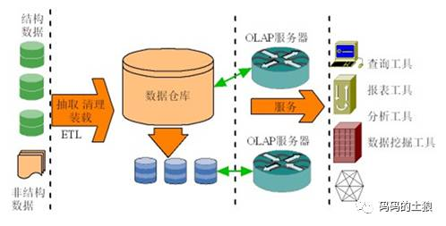

#企业数据集成模式研究
>2017-05-05 码码的土狼
>

近年来，国内工业领域很多企业在信息化建设上取得了长足的发展，先后上马了一批核心业务系统，如ERP、MES、PDM、CAPP等，很大程度上提高了企业的信息化管理水平，但是又迎来了新的问题，由于开发时间或开发部门的不同，这些系统的数据源彼此独立、相互封闭，使得数据难以在系统之间交流、共享和融合，从而形成了"信息孤岛"。随着信息化应用的不断深入，企业内部、企业与外部信息交互的需求日益强烈，连通“信息孤岛”、进行企业层面的信息(数据)集成已势在必行。

很多企业在早期实施数据集成的过程中，并没有一个统一的整体规划，经常是被动的碰到个别系统的实际数据使用需求才采取行动，采用的集成方式也五花八门，往往采用数据文件导入导出、数据库层的直接连接(如dblink)、应用API等点对点的集成模式，这些模式不仅在实时性，安全性方面存在缺陷，而且随着互联系统的增多，点对点连接越来越多,形成了网状,导致IT应用环境越来越复杂(图1)，这种模式也越来越难以为继，逐渐被淘汰。
  
图1 点对点集成

随后又出现了“数据联邦”集成模式(图2)，这种模式更多关注数据库层面的集成，由半自治数据库系统构成联邦数据库系统( FDBS)，相互之间分享数据。这种模式不但对IT前期整体架构要求极高，而且无法解决所有数据源语义上（尤其是SQL）的问题，需要对现存系统做大量修改，现在也少有问津。  
  
图2 数据联邦集成

随着企业服务总线(ESB)和面向服务的体系架构(SOA)的兴起，又出现了以中间件技术为支撑的数据集成模式(图3)。这种模式通过中间件技术搭建一个虚拟数据流动层，通过数据适配器连接不同的业务系统和数据源，可以很好的解决异构系统的兼容性及数据实时性问题。中间件模式是目前比较流行的数据集成方式，但这种模式最大的问题在于太“重”，ESB和SOA体系的搭建是一个长期、高投入的过程，而且牵涉到对企业大量现有系统的重新规划和调整，周期长、见效慢往往导致很多企业在这方面裹足不前、难以决策。
  
图3 中间件集成

与中间件技术同时兴起的还有数据仓库(DW)模式(图4)。这种模式可以根据企业管理和决策中的需要来构建面向主题的、集成的、与时间相关的和不可修改的数据集合。但数据仓库不仅投资巨大，而且其中的数据更多的是重度汇总后的数据，实时性很差，很难被其它业务系统直接使用，另外其服务的对象更多的是BI(报表、OLAP)这类商业分析系统，这些都让其很难承担起成为企业数据集成中心的重任。
  
图4 数据仓库

工业领域企业既想变革又对大范围变动IT体系架构有所顾虑，通过深入分析上述各种企业数据集成模式，结合工业领域尤其是复杂工业领域安全保密性高、企业规模较大、制造环节及数据繁多、标准难以统一的特点。这里推荐一种轻量且见效快的解决数据集成问题的新模式(图5)。
  
图 5 “轻量混杂”集成模式

这种模式主要由如下几个核心点构成：  
- 通过数据适配器技术获取不同数据源的数据模型，构建企业数据标准体系，数据资源目录，明确核心数据资产。
- 利用数据仓库中的ETL技术（数据加载、转换、清洗），将数据模型所映射的数据从各个业务系统中抽取出来，经过清洗、转换、标准化之后加载到单一数据视图中，这种数据视图介于DW和ODS(操作型数据存储)之间，是一种轻度汇总后的相对静态的核心业务数据。
- 用流程及定时器技术对数据及其利用过程进行标准化、规范化并时时监控数据质量。
- 利用不同协议适配器构建安全受控的数据访问通道，用“推”和“拉”两种模式让企业内部各种业务系统能够方便快捷的访问单一视图中的标准核心业务数据。

这种模式采用了一种“轻量混杂”的技术架构，重点关注核心业务数据集成，不追求面面俱到，摒弃了中间件技术复杂的路由寻址功能及数据仓库过“重”的模型设计，将这两种集成技术的相关技术（适配器、安全、轻流程、ETL）有效糅合在一起，构成了一种轻量化的数据集成模式，这种模式让企业有更灵活的选择，“有需要才采用，不需要则不用”，对企业现有的IT体系架构侵入性极小。采用这种模式，可以帮助企业由小及大，逐步创建并维护整个企业内核心业务数据的单一视图，并保证单一视图的准确性、一致性以及完整性，从而提高数据质量。通过这种数据集成管理模式，能有效改变企业数据利用的现状，从而更好地为企业信息化建设服务。

--EOF--