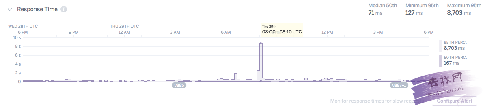
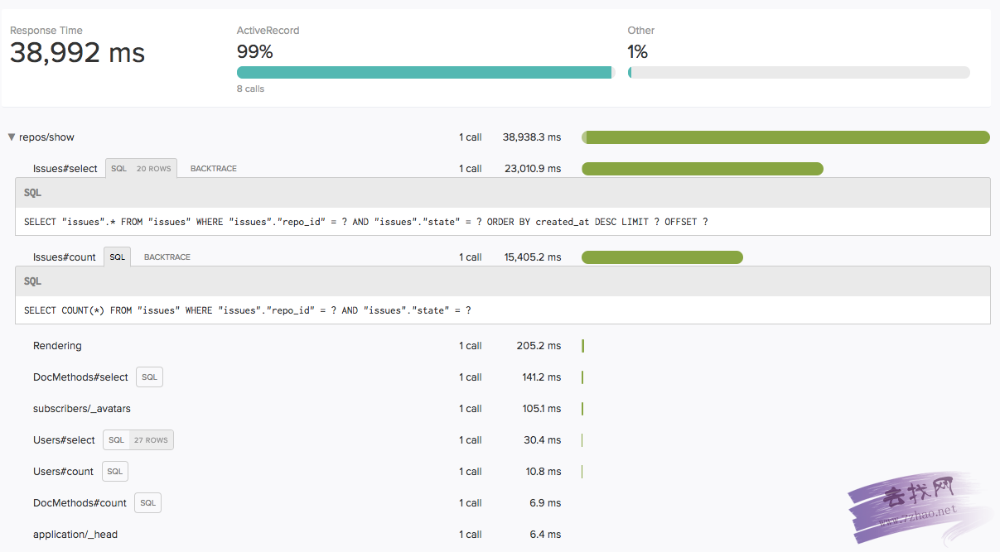
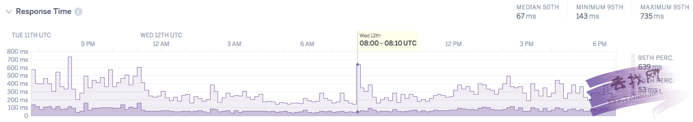

#我是如何降低数据库80%负载的
[TOC]

>原文：How I Reduced My DB Server Load by 80% 
>作者：Richard Schneeman 
>译者：roy
>

译者注：一个前端开发者介绍了他和他的数据库朋友们是如何降低基于Ruby网站数据库负载的故事。以下为译文：  

数据库负载可能是个沉默的性能杀手。我一直都在优化我的一个网站应用，用来吸引人们参与到开放代码社区，但我注意到一些随机的查询时间异常，有时会长达15s或更长。虽然我注意到这个现象有些时候了，但直到最近才开始优化我的数据库查询。首先通过建立索引优化了我的主页(并且使用Rack Mini Profiler工具)，然后追踪并删除掉了一些代价高昂的查询。在这些重要的提升后，平均响应时间在50ms左右，95%在1s以内。但是，我遇到一个讨厌的问题，在24小时内，95%响应时间可能急升到15s或30s并在短时间内超时。本文将介绍我如何查找并解决这个问题。这最终使我的数据库降低了80%的负载。

这是我的响应时间图，我希望移除这些异常峰值。

  

为了理解为什么这个(或这些)请求是如此的慢，我用了计量工具。在本例中使用了Heroku Scout 插件。修改了比例来展示过去12小时内的请求(默认是3小时)。然后聚焦到这些巨大的峰值。这是我看到的 

  

应用或者数据库肯定有些不对劲。在scout的输出里，你可以看到一个查询要38秒才能完成。我试着手工去访问这个页面但是它很快就加载了。所以不会是页面的问题。 
很幸运的是我在Heroku工作，我立即在我们数据库工程师的Slack聊天室里问他们是什么可能的原因引起了性能的下降。他们问我数据库的平均负载。我用的是一个standard-o 数据库Heroku声称它可以承受0.2 负载。我打开了Papertrail 日志 并寻找 load-avg。 我在那条慢请求时间附件发现这条记录

>Jun 29 01:01:01 issuetriage app/heroku-postgres: source=DATABASE sample#current_transaction=271694354
sample#db_size=4469950648bytes sample#tables=14 sample#active-connections=35
sample#waiting-connections=0 sample#index-cache-hit-rate=0.87073  sample#table-cache-hit-rate=0.47657
sample#load-avg-1m=2.15 sample#load-avg-5m=1.635 sample#load-avg-15m=0.915
sample#read-iops=16.325 sample#write-iops=0 sample#memory-total=15664468kB
sample#memory-free=255628kB sample#memory-cached=14213308kB sample#memory-postgres=549408kB

一般负载在0.2或以下是正常的，但我的应用峰值到了2.15，呦呵！ 
我已经花了不少时间来优化我的查询时间，所以我对此还是很意外的。一位数据工程师建议我使用 pg:outliers 命令(Heroku pg:extra CLI 扩展)  

如果你不使用Heroku，你可以通过 _pg_stat_statements_ 表来得到同样的数据

当我安装了这个扩展并使用该命令发现一条查询语句占了高达(你猜对了)80%的执行时间。

~~~
$ heroku pg:outliers
total_exec_time  | prop_exec_time |   ncalls    |   sync_io_time   |                                                                                       query
------------------+----------------+-------------+------------------+------------------------------------------------------------------------------------------------------------------------------------------------------------------------------------
3790:50:52.62102 | 80.2%          | 100,727,265 | 727:08:40.969477 | SELECT  ? AS one FROM "repos" WHERE LOWER("repos"."name") = LOWER($1) AND ("repos"."id" != $2) AND "repos"."user_name" = $3 LIMIT $4
493:04:18.903353 | 10.4%          | 101,625,003 | 52:09:48.599802  | SELECT COUNT(*) FROM "issues" WHERE "issues"."repo_id" = $1 AND "issues"."state" = $2
~~~

这是那个查询语句(方便较小的显示屏幕)  

~~~SQL
SELECT ?
AS one
FROM "repos"
WHERE LOWER("repos"."name") = LOWER($1) AND
("repos"."id" != $2) AND
"repos"."user_name" = $3
LIMIT $4
~~~

>Started POST "/repos" for 131.228.216.131 at 2017-06-29 09:34:59
Processing by ReposController#create as HTML
  Parameters: {"utf8"=>"✓", "authenticity_token"=>lIR3ayNog==", "url"=>"https://github.com/styleguidist/react-
  User Load (0.9ms)  SELECT  "users".* FROM "users" WHERE "users".
  Repo Load (1.1ms)  SELECT  "repos".* FROM "repos" WHERE "repos".
   (0.9ms)  BEGIN
  Repo Exists (1.9ms)  SELECT  1 AS one FROM "repos" WHERE LOWER( $3 LIMIT $4
   (0.5ms)  COMMIT
   (0.8ms)  BEGIN
  RepoSubscription Exists (4.3ms)  SELECT  1 AS one FROM "repo_ns"."user_id" = $2 LIMIT $3
  SQL (5.6ms)  INSERT INTO "repo_subscriptions" ("created_at",
   (6.1ms)  COMMIT
[ActiveJob] Enqueued SendSingleTriageEmailJob (Job ID: cbe2b04a-d271
Redirected to https://www.codetriage.com/styleguidist/react-
Completed 302 Found in 39ms (ActiveRecord: 21.9ms)
Jun 29 02:35:00 issuetriage heroku/router:  at=info method=POST path="/repos" host=www.codetriage.com request_id=5e706722-7668-4980-ab5e-9a9853feffc9 fwd="131.228.216.131" dyno=web.3 connect=1ms service=542ms status=302 bytes=1224 protocol=https

为了简洁，日志的标签被移除了

这有点难读，但你可以看 Repo Exists右边的查询语句。我查看了那个控制入口函数(ReposController#create)并检查了一些可疑方法，但是结果都没问题(例如，都没有调用 SQL LOWER 函数)。那么问题来了，这些查询语句是从哪里来的呢？

最终答案是来自于我的数据模型中的这一行代码。这行貌似无害的代码承担了我数据库80%的负载。这个 Validate 调用是 Rails 试图保证两个 Repo 记录没有相同的用户名和用户姓名。它没有采用在数据库中强制执行一致性，而是在模型对象上加了一个 before commit的钩子，这样在模型对象写入数据库前，它会查询数据库来确保我们创建一个新 repo 记录的时候没有重复的记录。

在我写这个验证逻辑的时候并没有想太多。看这个验证代码本身也很难相信它居然引发如此大的数据库负载。毕竟我只有大概2000条repo记录。理论上这个验证调用最多调用2000次，对吧？

为了回答这个问题，我重新查找日志并找到另外一处这个SQL语句执行的地方。

>Jun 29 07:00:32 issuetriage app/scheduler.8183:  [ActiveJob] Enqueued PopulateIssuesJob (Job ID: 9e04e63f-a515-4dcd-947f-0f777e56dd1b) to Sidekiq(default) with arguments: #<GlobalID:0x00000004f98a68 @uri=#<URI::GID gid://code-triage/Repo/1008>>
Performing PopulateIssuesJob (uri=#<URI::GID gid://code-
  User Load (10.4ms)  SELECT
   (35.4ms)  BEGIN
  Repo Exists (352.9ms)  SELECT  $3 LIMIT $4
  SQL (3.7ms)  UPDATE "repos"
   (4.5ms)  COMMIT
Performed PopulatessuesJob (Job ID: 9e04e63f-a515-4dcd-947f-0f777e56dd1b) from Sidekiq(default) in 629.22ms

为了简洁，日志的标签被移除了

这一次这个查询语句不是来自网页动作，而是一个后台作业。当我检查时，我意识到这个验证不止在创建时执行，它还在_任何_记录的修改时执行。即使用户名或用户姓名没有改动，它还是会查询数据库来确保没有重复。

我有一个晚间任务来遍历所有的代码库并且有时会更新他们的记录。事实是后台任务和这个慢网络请求发生在几乎相同的时间。我自己的后台任务使得数据库负载急升，远超一般负载容量。其他普通的对时间敏感的网络请求就因为没有数据CPU时间而被迫等待并超时。

我立刻删除了这个验证并用一个单一索引代替，同时在数据库上加了限制。

~~~ruby
class AddUniqueIndexToRepos < ActiveRecord::Migration[5.1]
  def change
    add_index :repos, [:name, :user_name], :unique => true
  end
end
~~~

现在我们可以确定在数据库里没有两个记录会有相同的用户名/用户名字组合，Rails程序也不需要在每次修改记录时去查询数据库。

更不用提Rails程序验证存在竞争并且实际上并不保证一致性，最好是在数据库层面确保这些(一致性)事情。

你可能注意到 SQL LOWER 函数并没有在我的单一性索引中出现。在我的应用中，我已经对存储的数据做了规范化处理，所以这个逻辑是多余的。

在删除验证代码并增加单一性索引后，我的应用再也没有出现过30秒以上的请求延时。数据库一直都在0.2 load-avg 或以下 运行。
  

当我们面对数据库运行变慢时，我们倾向于考虑一个单独的查询语句的性能。我们很少考虑一个或几个查询语句可能相互影响并拖慢整个网站。

在看到 pg:outliers 结果后，我可以在其他几个合适的位置加上索引来减少负载。 例如：

issuetriage::DATABASE=> EXPLAIN ANALYZE SELECT “repos”.* FROM “repos” WHERE “repos”.”full_name” = ‘schneems/wicked’ LIMIT 1;

##QUERY PLAN
Limit (cost=0.00..39297.60 rows=1 width=1585) (actual time=57.885..57.885 rows=1 loops=1) 
-> Seq Scan on repos (cost=0.00..39297.60 rows=1 width=1585) (actual time=57.884..57.884 rows=1 loops=1) 
Filter: ((full_name)::text = ‘schneems/wicked’::text) 
Rows Removed by Filter: 823 
Total runtime: 57.912 ms 
(5 rows)

这里整体执行时间并不是在几秒内，这个并不算好。那个串行化的扫描很快，但并非没有代价。我对 _full_name 加了一个索引，现在它快的要飞起来。同样的查询可以在 1ms 内返回。针对这些调用的所以也帮助我减少了数据库负载。

总结一下：

- 一个高的 load-avg 会拖慢所有的查询语句，不仅仅是那些慢查询语句。
- 使用 pg:outlier 来发现那些占用了更多CPU时间的查询语句(如果你使用Heroko),如果你使用其他平台，你也可以使用 _pg_stat_statements
- 使用日志来定位查询语句发生的时间并用 EXPLAIN ANALYZE 来分析为什么一个查询如此耗时。
- 你的查询语句的输入很重要并且可能严重影响到查询性能
- 添加索引，改变数据的存储或者改变程序逻辑来避免异常的查询
- 如果可能的话，利用数据库来保证数据一致性而不是使用程序代码

事后来看，这是个很简单的错误并且很容易定位和修复，只是要花点时间和使用正确的工具。我注意到那个30s+的请求延时峰值有几个月了，甚至几年。我从没有去深挖原因，因为我原以为这会很麻烦。它也只是每天发生一次，对用户的影响很小。利用正确的工具和我们数据库工程师的建议，我很快就解决了。我不认为我掌握了数据库优化，但至少现在我达到了目标。谢谢你阅读我的数据库负载之旅。

