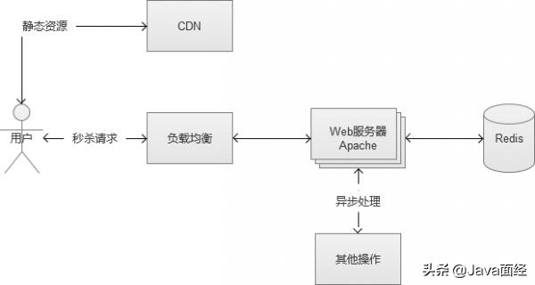
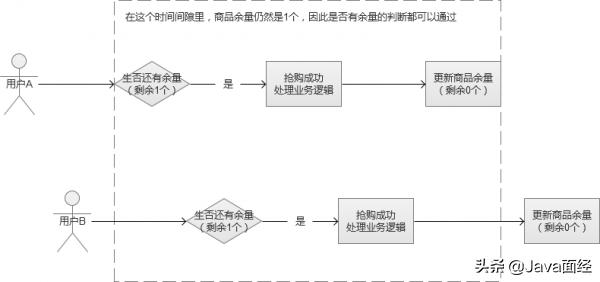
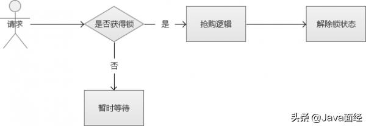
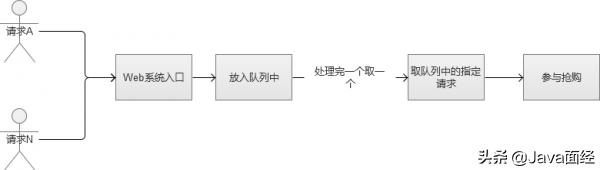
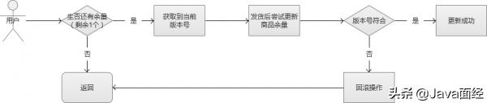

#秒杀系统：并发队列 接口设计 并发请求数据安全处理

##1 并发队列的选择
Java的并发包提供了三个常用的并发队列实现，分别是：ArrayBlockingQueue、ConcurrentLinkedQueue 和 LinkedBlockingQueue 。  

ArrayBlockingQueue是初**始容量固定**的阻塞队列，我们可以用来作为数据库模块成功竞拍的队列，比如有10个商品，那么我们就设定一个10大小的数组队列。

ConcurrentLinkedQueue使用的是CAS原语无锁队列实现，是一个异步队列，**入队的速度很快**，出队进行了加锁，性能稍慢。

LinkedBlockingQueue也是阻塞的队列，入队和出队都用了加锁，当队空的时候线程会暂时阻塞。  

在请求预处理阶段，由于我们的系统入队需求要远大于出队需求，一般不会出现队空的情况，所以我们可以选择ConcurrentLinkedQueue来作为我们的请求队列实现  

##2 请求接口的合理设计
一个秒杀或者抢购页面，通常分为2个部分，一个是静态的HTML等内容，另一个就是参与秒杀的Web后台请求接口。

通常静态HTML等内容，是通过CDN的部署，一般压力不大，核心瓶颈实际上在后台请求接口上。这个后端接口，必须能够支持高并发请求，同时，非常重要的一点，必须尽可能“快”，在最短的时间里返回用户的请求结果。为了实现尽可能快这一点，接口的后端存储使用内存级别的操作会更好一点。仍然直接面向MySQL之类的存储是不合适的，如果有这种复杂业务的需求，都建议采用异步写入。  
  

当然，也有一些秒杀和抢购采用“滞后反馈”，就是说秒杀当下不知道结果，一段时间后才可以从页面中看到用户是否秒杀成功。但是，这种属于“偷懒”行为，同时给用户的体验也不好，容易被用户认为是“暗箱操作”  

##3 高并发下的数据安全
我们知道在多线程写入同一个文件的时候，会存现“线程安全”的问题（多个线程同时运行同一段代码，如果每次运行结果和单线程运行的结果是一样的，结果和预期相同，就是线程安全的）。如果是MySQL数据库，可以使用它自带的锁机制很好的解决问题，但是，在大规模并发的场景中，是不推荐使用MySQL的。秒杀和抢购的场景中，还有另外一个问题，就是“超发”，如果在这方面控制不慎，会产生发送过多的情况。我们也曾经听说过，某些电商搞抢购活动，买家成功拍下后，商家却不承认订单有效，拒绝发货。这里的问题，也许并不一定是商家奸诈，而是系统技术层面存在超发风险导致的。

###3.1 超发的原因
假设某个抢购场景中，我们一共只有100个商品，在最后一刻，我们已经消耗了99个商品，仅剩最后一个。这个时候，系统发来多个并发请求，这批请求读取到的商品余量都是99个，然后都通过了这一个余量判断，最终导致超发
  
在上面的这个图中，就导致了并发用户B也“抢购成功”，多让一个人获得了商品。这种场景，在高并发的情况下非常容易出现

###3.2 悲观锁思路
解决线程安全的思路很多，可以从“悲观锁”的方向开始讨论。

悲观锁，也就是在修改数据的时候，采用锁定状态，排斥外部请求的修改。遇到加锁的状态，就必须等待。  
  
虽然上述的方案的确解决了线程安全的问题，但是，别忘记，我们的场景是“高并发”。也就是说，会很多这样的修改请求，每个请求都需要等待“锁”，某些线程可能永远都没有机会抢到这个“锁”，这种请求就会死在那里。同时，这种请求会很多，瞬间增大系统的平均响应时间，结果是可用连接数被耗尽，系统陷入异常。  

###3.3 FIFO队列思路
对上面场景进行优化，我们直接将请求放入队列中的，采用FIFO（First Input First Output，先进先出），这样的话，我们就不会导致某些请求永远获取不到锁  
  

然后，我们现在解决了锁的问题，全部请求采用“先进先出”的队列方式来处理。那么新的问题来了，高并发的场景下，因为请求很多，很可能一瞬间将队列内存“撑爆”，然后系统又陷入到了异常状态。或者设计一个极大的内存队列，也是一种方案，但是，系统处理完一个队列内请求的速度根本无法和疯狂涌入队列中的数目相比。也就是说，队列内的请求会越积累越多，最终Web系统平均响应时候还是会大幅下降，系统还是陷入异常  

###3.4 乐观锁思路
这个时候，我们就可以讨论一下“乐观锁”的思路了。乐观锁，是相对于“悲观锁”采用更为宽松的加锁机制，大都是采用带版本号（Version）更新。实现就是，这个数据所有请求都有资格去修改，但会获得一个该数据的版本号，只有版本号符合的才能更新成功，其他的返回抢购失败。这样的话，我们就不需要考虑队列的问题，不过，它会增大CPU的计算开销。但是，综合来说，这是一个比较好的解决方案  
  
有很多软件和服务都“乐观锁”功能的支持，例如Redis中的watch就是其中之一。通过这个实现，我们保证了数据的安全。  

