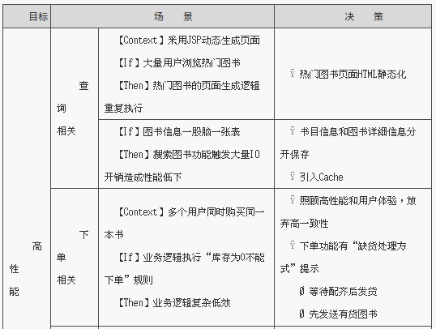

**一线架构师指南**  
架构师的失败：①不懂需求；②缺乏需求的大局观  
# 1 绪论
##1.1 一线架构师：6个经典困惑
4个实际问题的困惑，2个职业发展的困惑  
4个实际问题困惑：  

- 将系统划分模块，如何更合理？  
- 大系统架构设计，如何起步？  
- 总觉需求很糟糕，影响了架构设计  
- 非功能需求重要，如何设计？

2个职业发展困惑：  

- 架构新手：缺乏指导，架构设计不知所措  
- 架构老手：缺乏总结，仍“怕”下一个项目  

##1.2 4个核心主张  

- 方法提醒是大趋势  
- 质疑驱动的架构设计  
- 多阶段方法  
- 内置最佳实践的方法  

###1.2.1 方法体系是大趋势
ADMEMS（Architectural Design Method has been Extended to Method System 架构设计方法已经扩展到方法体系）是多个方法组成的方法体系  
###1.2.2 质疑驱动的架构设计
架构设计是需求驱动  
架构设计过程需要不断引入质疑，通过“质疑”引入更多“质量属性”、“特殊功能场景”  
###1.2.3 多阶段还是多视图 
架构设计首先是多阶段，其次才是多视图  

- 阶段1：把握需求特点，确定架构驱动力  
- 阶段2：根据重大需求，确定概念架构  
- 阶段3：细化架构设计，关注不同视图（此处才体现多视图）  

先做后做叫阶段，齐头并进叫视图  

**任何好方法都必须以时间为轴来组织，这样才有利于指导实践**  
概念架构设计（偏向方案）、细化架构数据（偏向开发），是架构的两个阶段，不是两个架构视图  
###1.2.4 内置最佳实践
■逻辑架构设计的10条经验  
■质疑驱动的逻辑架构设计  
  
...  

##1.3 ADMEMS方法体系：3个阶段，1个贯穿环节
■预备架构（Pre-architecture）阶段（PA）  
→误区：架构师是技术人员，不必懂业务  
→要点：摒弃“需求列表”，建立【二维需求观】  
→工具：ADMEMS矩阵  
■概念架构（Conceptual Architecture）阶段（CA）  
→误区：概念架构=理想设计  
→要点：重大需求塑造概念概念架构  
→工具：鲁棒图、目标-场景-决策表等  
鲁棒图（样例）  
  
目标-场景-决策表（样例）  
  
■细化架构（Refined Architecture）阶段（RA）  
→误区：架构=模块+接口  
→要点：贴近实践的5视图法  
→工具：包图、包-接口图、灰盒包图、序列图、目标-场景-决策表等  

**架构设计的三个阶段**  
  

■PA ADMEMS矩阵方法  
ADMEMS矩阵（样例）  
  

■CA 重大需求塑造做概念架构  
需要考虑功能、质量、约束各个环节  
  

■RA 落地的的5视图方法  
  

■RA 目标-场景-决策 表  
非功能需求思维工具  
  

■6个困惑的路线图  
  

■子系统划分的4大原则  
1）职责分离原则  
2）通用专用分离原则  
3）技能分离原则  
4）工作量均衡原则  
  

#2 Pre-architecture阶段
**定义：**理解需求、建立需求大局观、确定架构设计方向  
■要重视非功能性**约束**  
■要重视**关键质量**目标  
在构建架构之初就要第一时间判断关键质量之间的冲突关系  
**质量事项之间相互影响**（“+”表促进，“-”表影响）  
  

■架构师不是需求专家，但一定是**需求分类**、**需求折中**、**需求变更**方面的专家，否则项目将输在起跑线上  
需要建立需求理解的大局观，把握需求特点、确定架构设计的驱动力  

■架构的决定性因素：功能需求、质量属性及约束  
架构师在获得需求后，会基于北京、系统规模、技术趋势、开发团队现状等情况，对需求进行理性的、有针对性的权衡、取舍、补充。  

■ADMEMS矩阵为核心的"四步法"  
1）需求结构化  
2）分析约束影响  
3）确定关键质量  
4）确定关键功能  
利用ADMEMS矩阵等工具进行大局梳理：
1）业务需求：建设系统的目标达成共识，通过【愿景文档】，明确投资、工期标准、整合等约束  
2）用户需求：系统帮助用户干什么、不能干什么，确定需求的scope。用例必须完整  
3）行为需求：大量行为未明确定义，核心功能的《用例规约》已定义  
  
如果连上述3个最基本条件都不具备就开始架构设计是盲目的  

■架构设计失败的常见原因  
1）遗漏至关重要的架构影响因素：50%  
2）不能驯服频繁变化的需求：40%  
3）不能覆盖架构各方面：30%  
4）不能验证架构并做出调整：40%  

■架构师参与项目需求  
1）全程参与需求分析工作，不为任何具体需求捕获、需求分析、需求文档工作负责  
2）不能被动等待《软件需求规格说明书》发版  

■Pre-architecture阶段针对需求所做的工作：  
1）分析业务需求和约束背后的衍生需求  
2）发现遗漏需求  
3）确定关键功能  
4）确定关键质量  
5）权衡质量属性之间的矛盾关系  

■Pre-Architecture的现状  
1）唯经验论  
架构师根据经验发现需求的遗漏、权衡需求间矛盾、确定架构设计的重点目标  
2）目标不变论  
架构设计有一些原则，如：重用、简单、可扩展等，但不能说这样目标就只有这三点。领域不同、规模不同（项目、产品、平台）、条件不同（工期、预算、标准），架构必然不同  
重用、简单、可扩展不能加最，不符合架构设计的现实。灵活、简单常常存在矛盾  
3）需求分类法  
体现主要脉络：  
  
  
需求层次论：  
  
4）需求决定架构的原理亟待归纳  
需求决定架构原理：  
①功能影响架构原理，研究得最透彻  
职责协作链  
②质量影响架构的原理，也有基本共识  
动态  
质量不能抛开需求单独决定架构。质量考虑通过对

 
