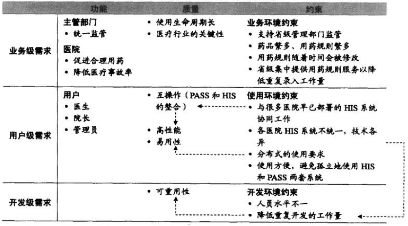

**一线架构师指南**  

[TOC] 

架构师的失败：①不懂需求；②缺乏需求的大局观  
## 1 绪论
###1.1 一线架构师：6个经典困惑
4个实际问题的困惑，2个职业发展的困惑  
4个实际问题困惑：  

- 将系统划分模块，如何更合理？  
- 大系统架构设计，如何起步？  
- 总觉需求很糟糕，影响了架构设计  
- 非功能需求重要，如何设计？

2个职业发展困惑：  

- 架构新手：缺乏指导，架构设计不知所措  
- 架构老手：缺乏总结，仍“怕”下一个项目  

###1.2 4个核心主张  

- 方法体系是大趋势  
- 质疑驱动的架构设计  
- 多阶段方法  
- 内置最佳实践的方法  

####1.2.1 方法体系是大趋势
ADMEMS（Architectural Design Method has been Extended to Method System 架构设计方法已经扩展到方法体系）是多个方法组成的方法体系  
####1.2.2 质疑驱动的架构设计
架构设计是需求驱动  
架构设计过程需要不断引入质疑，通过“质疑”引入更多“质量属性”、“特殊功能场景”  
####1.2.3 多阶段还是多视图 
架构设计首先是多阶段，其次才是多视图  

- 阶段1：把握需求特点，确定架构驱动力  
- 阶段2：根据重大需求，确定概念架构  
- 阶段3：细化架构设计，关注不同视图（此处才体现多视图）  

先做后做叫阶段，齐头并进叫视图  

**任何好方法都必须以时间为轴来组织，这样才有利于指导实践**  
概念架构设计（偏向方案）、细化架构数据（偏向开发），是架构的两个阶段，不是两个架构视图  
####1.2.4 内置最佳实践
■逻辑架构设计的10条经验  
■质疑驱动的逻辑架构设计  
  
...  

###1.3 ADMEMS方法体系：3个阶段，1个贯穿环节
■预备架构（Pre-architecture）阶段（PA）  
→误区：架构师是技术人员，不必懂业务  
→要点：摒弃“需求列表”，建立【二维需求观】  
→工具：ADMEMS矩阵  
■概念架构（Conceptual Architecture）阶段（CA）  
→误区：概念架构=理想设计  
→要点：重大需求塑造概念概念架构  
→工具：鲁棒图、目标-场景-决策表等  
鲁棒图（样例）  
  
目标-场景-决策表（样例）  
  
■细化架构（Refined Architecture）阶段（RA）  
→误区：架构=模块+接口  
→要点：贴近实践的5视图法  
→工具：包图、包-接口图、灰盒包图、序列图、目标-场景-决策表等  

**架构设计的三个阶段**  
  

■PA ADMEMS矩阵方法  
ADMEMS矩阵（样例）  
  

■CA 重大需求塑造做概念架构  
需要考虑功能、质量、约束各个环节  
  

■RA 落地的的5视图方法  
  

■RA 目标-场景-决策 表  
非功能需求思维工具  
  

■6个困惑的路线图  
  

■子系统划分的4大原则  
1）职责分离原则  
2）通用专用分离原则  
3）技能分离原则  
4）工作量均衡原则  
  

##2 Pre-architecture阶段
**定义：**理解需求、建立需求大局观、确定架构设计方向  
■要重视非功能性**约束**  
■要重视**关键质量**目标  
在构建架构之初就要第一时间判断关键质量之间的冲突关系  
**质量事项之间相互影响**（“+”表促进，“-”表影响）  
  

■架构师不是需求专家，但一定是**需求分类**、**需求折中**、**需求变更**方面的专家，否则项目将输在起跑线上  
需要建立需求理解的大局观，把握需求特点、确定架构设计的驱动力  

■架构的决定性因素：功能需求、质量属性及约束  
架构师在获得需求后，会基于北京、系统规模、技术趋势、开发团队现状等情况，对需求进行理性的、有针对性的权衡、取舍、补充。  

■ADMEMS矩阵为核心的"四步法"  
1）需求结构化  
2）分析约束影响  
3）确定关键质量  
4）确定关键功能  
利用ADMEMS矩阵等工具进行大局梳理：
1）业务需求：建设系统的目标达成共识，通过【愿景文档】，明确投资、工期标准、整合等约束  
2）用户需求：系统帮助用户干什么、不能干什么，确定需求的scope。用例必须完整  
3）行为需求：大量行为未明确定义，核心功能的《用例规约》已定义  
  
如果连上述3个最基本条件都不具备就开始架构设计是盲目的  

■架构设计失败的常见原因  
1）遗漏至关重要的架构影响因素：50%  
2）不能驯服频繁变化的需求：40%  
3）不能覆盖架构各方面：30%  
4）不能验证架构并做出调整：40%  

■架构师参与项目需求  
1）全程参与需求分析工作，不为任何具体需求捕获、需求分析、需求文档工作负责  
2）不能被动等待《软件需求规格说明书》发版  

■Pre-architecture阶段针对需求所做的工作：  
1）分析业务需求和约束背后的衍生需求  
2）发现遗漏需求  
3）确定关键功能  
4）确定关键质量  
5）权衡质量属性之间的矛盾关系  

■Pre-Architecture的现状  
1）唯经验论  
架构师根据经验发现需求的遗漏、权衡需求间矛盾、确定架构设计的重点目标  
2）目标不变论  
架构设计有一些原则，如：重用、简单、可扩展等，但不能说这样目标就只有这三点。领域不同、规模不同（项目、产品、平台）、条件不同（工期、预算、标准），架构必然不同  
重用、简单、可扩展不能加最，不符合架构设计的现实。灵活、简单常常存在矛盾  
3）需求分类法  
体现主要脉络：  
  
  
需求层次论：  
  
4）需求决定架构的原理亟待归纳  
需求决定架构原理：  
①功能影响架构原理，研究得最透彻  
职责协作链  
②质量影响架构的原理，也有基本共识  
动态  
质量不能抛开需求单独决定架构  
**实操**  
1）不同需求影响架构的不同原理，是架构设计思维的基础  
**需求决定架构**  
**功能：**每个功能都是由一条“职责协作链”完成的，架构师通过为功能规划职责协作链，将职责分配到子系统、为子系统界定接口、确定基于接口的交互机制，来推动架构设计的进行  
**质量：**  
- （必须）基于当前的架构设计中间成果，进一步考虑具体质量需求时，对架构设计中间成果进行细化、调整、甚至推倒重来，一步步地使架构设计完善起来  
- 质量和功能共同影响架构设计，抛开功能，单依据质量要求设计架构是不可能的  

**约束：**  
- 直接制约设计决策的约束（运行在Unix平台上）  
- 转化为功能需求的约束（如：本应系统执行先行利率，引出“利率调整”功能）  
- 转化为质量数学需求的约束（如：柜员计算机水平不高，引出易用性需求）  
功能影响框架的基本原理  
  
质量影响框架的基本原理  
  
约束影响架构的示例  
  

■二维需求观与ADMEMS矩阵方法  
  

■关键需求决定架构，其余需求验证架构  
1）功能做减法：选一组“关键功能子集”  
2）质量需求做减法：确定架构设计重点支持哪些质量属性，作为架构设计的驱动力  
3）约束性需求做加法：考虑需求方及业务环境因素、用户群及使用环境因素、开发方及构建环境因素、业界当前技术环境因素等。以加法思维，识别约束背后衍生需求  

■Pre-Architecture阶段的4个步骤  
  

##3 需求结构化与分析约束影响
需求结构化、分析约束影响  
■【软件需求规格说明书】不是需求的全部：需求规则说明书不全；需求经常变化。架构师需要：对需求进行理性的、有针对性的权衡、取舍、补充  

[ADMEMS Template](ADMEMS Template.xlsx)  

■需求的三个方面，三种类型：  
- 功能需求：更多体现各级直接目标要求
- 质量属性：运行期质量+开发期质量
- 约束需求：业务环境因素+使用环境因素+构建环境因素+技术环节因素

■约束对项目的影响  
来自方方面面的约束性需求潜藏大量风险因素。架构师需要主动分析约束影响，识别架构影响因素，以便在架构设计中引入相应决策予以应对  

■四类约束在ADMEMS矩阵中的位置  
  
1. 客户、出资方约束  
上线时间、预算限制、集成需要等非功能需求  
客户所处业务领域、业务规则、业务限制  
是否需要关注相应法律法规、专利限制  
2. 用户约束性需求  
软件将提供给何阶层用户？  
用户年龄段？使用偏好？  
用户是否遍及多个国家？或者整个国家？  
使用期间的环境有电磁干扰、车船移动等因素？  
3. 开发者、升级维护人员约束  
团队技术水平、团队磨合程度、分布在不同城市  
开发管理方面、源代码保密方面是否需要顾及？  
4. 业界当前技术环境约束  
技术平台、中间件、编程语言等流行度、认同度、优缺点等  
技术发展趋势如何？  

■Big Picture  
架构师对约束理解过于零散，影响了系统化思维。推荐采用Big Picture理解约束  
  
  
约束是要解决的问题的上下文（约束是架构设计的上下文）  
软件需求 = 功能需求 + 质量属性 + 约束  

ADMEMS矩阵方法应用法则有两个：  
①推导法则：从上到下，从右到左  
②查漏法则：重点是质量属性遗漏  

■ADMEMS需求矩阵案例1  
  
  
  
  
  
  
■ADMEMS需求矩阵案例2  
  
分析约束约束影响：业务级需求因素的潜在影响分析
  
用户群及使用环境对约束的影响
  

##4 确定关键质量与关键功能
###4.1 确定关键质量的5大原则
- 分类合适 + 必要扩充
参考ISO9126的分类，但仅参考ISO9126是远远不够的。现存的标准多数是对过去的总结，而架构师所面临的往往是新问题
  
可参考的分类：FURPS、ISO 9126、运行期质量+开发期质量
基于某种"质量分类方式"进行扩充的质量属性要求，在实践中很常见：
	- 可管理性：对于复杂系统必要
	- 开放性：对于期望有较长生命周期的需求重要，对于可重用性有极大影响
	- 性能≠效率。性能=速度+吞吐量+持续高速性；效率=CPU、内存、硬盘、网络的利用率
- 考虑多方涉众
- 检查性思维
通过过Checklist，看每个质量属性是否确实算不上“关键质量”，防止遗漏关键需求
- 识别矛盾 + 划定优先级
质量属性关系矩阵  
  
- 严格程度符合领域与规模特点
根据项目或产品的规模不同，要求的属性的个数也不同  
要求属性，产品比项目多，平台比产品多  

  
注意：不必研究系统所用功能。了解系统功能通过职责链进行协助，相互传递消息。只要在功能中筛选一个功能子集，研究每个子集中每个功能的职责协作链。  
识别每个职责单元。**重视：**职责单元间的职责协作关系  

###4.2 确定关键功能的4条规则
1. 核心功能
识别标志：业务层接口要反映这些功能  
如：项目管理系统中，项目信息查看、添加项目任务等核心功能
2. 必做功能
识别标志：依据客户方背景，“必须实现的功能”。可以【愿景解决方案】中“主要特征”来引导客户“必做功能”  
从业务系统而言，支持“运营”功能比支持“管理”功能优先级要高  
3. 高风险功能
4. 独特功能（覆盖前3点没有涉及的职责）
5. 两点注意事项：
	- “关键功能子集”的确定不存在“标准答案”。关键功能子集是否覆盖所有职责模块只能在“事后证明”，不可能“事前证明”。提取【关键功能】的目的用有限的时间，针对关键需求把设计做到位，减小需求变更对架构设计的影响
	- 关键功能所占比例：RUP指出比例应在20%~30%，但也不能教条，应灵活确定
6. 运行期质量：
 - 可伸缩性：几乎没上限，需求随时变
 - 性能：既强调速度，又强调吞吐量
 - 易用性：最便捷的操作方式，也几乎没有上限
 - 安全性：数据安全
 - 持续可用性/可靠性：不停机
 - 互操作性：与各系统间互操作
7. 开发期质量：
 - 可扩展性

##5 Conceptual Architecture阶段
架构 = 组件 + 交互  VS  架构 = 模块 + 接口
###5.1 概念架构“5大因素”
1. 系统涉及不同使用者
2. 分工式的特点明显
3. 集成的特点明显
4. 较高的持续可用性要求
5. 降低HIS系统差异带来的影响

###5.2 概念架构
概念架构：确定最关键的设计要素和交互机制。需要把握：重大需求、特色需求、高风险需求，有针对性的进行设计  
概念架构：是系统的高层组件及其中的关系。概念性架构对系统适当分解，而不拘泥于细节。管理人员、市场人员、用户等非技术人员交流架构。概念性架构规定了每个组件的非正式规约及架构图，不涉及接口细节  
- 概念架构满足“架构 = 组件 + 交互”基本定义，概念架构仅关注高层组件  
- 概念架构对高层组件职责进行笼统界定，给出高层组件之间相互关系  
- 概念架构不涉及接口细节  

###5.3 概念架构误区
- 将“概念架构”等同于“理想架构”  
只体现功能、只体现用例对于概念架构设计，只能设计出理想化架构。对概念架构的最大误解  
- 把“阶段”当“视图”
概念视图，也称“逻辑视图”，体现系统的主要部分及它们之间的相互关系  
这种将“概念架构阶段”理解为“概念视图”是错误的
  - 阶段是先后关系，视图是并列关系，这是本质区别
  - 不同阶段解决不同层次问题——概念架构确定架构设计的大方针  
  - 阶段对应明确里程碑，概念架构确定的高层分割方案及其他重要决策是否合理

###5.4 实践要领
概念架构阶段的3个步骤：  
1. 初步设计：基于关键功能，借助鲁棒图以发现职责为目的的初步设计。新系统必须重视这步  
2. 高层分割：对系统这个黑盒进行高层切分  
3. 考虑非功能需求：概念架构 ≠ 理想化架构，不仅要考虑功能，也必须考虑非功能。采用ADMEMS推荐目标-场景-决策表

  

###5.5 初步设计
关键需求决定架构  -->  基于关键功能，进行初步设计  
- 需求分析 ≠ 系统分析
- 系统分析 ≈ 初步设计

需求分析：做什么。随着掌握的需求信息越来越多，需求分析和整理的工作也越来越多  
系统分析：怎么做。伴随问题的分析，在**高层次提出相应的应对策略**，这恰恰是系统分析工作  
系统分析是针对系统所要面临的问题，搜集相关的资料，以了解产生问题的原因所在，进而提出解决问题的方法与可行的逻辑方案，以满足系统的需求，实现预定的目标  

####5.5.1 基于鲁棒图进行初步设计的10条经验
- 语法
	- 遵守建模规则
	- 简化建模语法
- 思维
	- 遵循3种元素的发现思路
	- 增量建模
	- 实体对象≠持久化对象
- 技巧
	- 只对关键功能（用例）画鲁棒图
	- 每个鲁棒图有2~5个控制对象
- 注意
	- 勿关注细节
	- 勿过分关注UI，除非辅助或验证UI设计
	- 鲁棒图≠用例规约的可视化

1. 遵守加密规则
1）参与者只能与边界对象交谈
2）边界对象只能与控制对象和参与者交谈
3）实体对象也只能与控制对象交谈
4）控制对象既能与边界对象交谈，也能与控制对象交谈，但不能与参与者交谈
  
2. 简化建模语法
精力要集中在初步设计，不要关注细节。不要拘泥与分支如何判断，注意鲁棒图的语法：  
  
3. 遵循3种元素的发现思路
一个用例可能是N个场景（Scnario），每个厂家的实现都是一连串的职责进行协作的结果。
  
4. 增量建模
先识别明显的职责对象，之后逐步完善对象之间的职责关系  
以压缩文件软件为例：  
  
  
  
  

 
