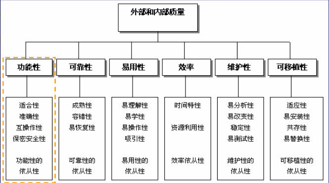

#ISO 9126质量模型：软件质量模型的6大特性和27个子特性 
ISO9126软件质量模型是评价软件质量的国际标准，由6个特性和27个子特性组成，建议大家深入理解各特性、子特性的含义和区别，在测试工作需要从这6个特性和27个子特性去测试、评价一个软件。这个模型是软件质量标准的核心，对于大部分的软件，都可以考虑从这几个方面 着手进行测评。  
  

##一、功能性(Functionality)
指软件是否满足了客户的需求，结合其子属性
1. 适合性：所提供的功能是用户所需要的，及用户所需要的功能软件系统已提供。笔者觉得此质量属性更适合由前端的需求人员把握，当然测试人员也需根据需求的适用性，以定义测试的重点与优先级。
比如在医疗软件系统上如果有一款可供娱乐的游戏，试想医生一边给病人看病一边玩游戏会造成什么后果呢。
2. 准确性：软件系统提供给用户的功能是否满足用户对该功能的精确度要求。
在实际的工程应用中也常遇到，例如财务类软件。如果不涉及特殊用户的需求（如科研机构的特种应有），精度一般都容易满足。
3. 互操作性：产品与产品之间交互数据的能力
例如，运行在windows操作系统上的应用软件，与运行在Linux系统上的软件进行通信
4. 保密安全性：指软件系统保护信息和数据的能力
1）防止未得到授权的人或系统访问相关的信息或数据；
2）保证得到授权的人或系统能正常访问相关的信息或数据。
常见的安全性测试：
1）用户验证：登录密码验证（如windows登录验证，邮箱验证等）、IP地址访问限制等；
2）用户权限管理:验证低级别用户是否具有了高级别用户的权限，各级别用户权限都得到了实现。例如windows 7操作系统，某些应用程序的运行必须以管理员身份才允许；
3）系统数据的保护:例如对系统文件、用户密码文件等进行隐藏，机密文件内容进行加密、备份；
5. 功能性的依从性：遵循相关的标准（国际标准、国家标准、行业标准、企业内部规范等)约定或法规以及类似规定的能力。
例如：在中国研发与生产的医疗设备如果要在美国上市销售必须经过FDA（Food and Drug Administration美国食品及药物管理局）的审核，并通过。细心读者，你会发现每一质量属性都包括其依从性的子属性，由于定义类同。

##二、可靠性：
产品在规定的条件下，在规定的时间内完成规定功能的能力
1. 成熟性：防止内部错误导致软件失效的能力
例如：模块A更改了某参数，但没考虑到某参数同时被模块B调用，由于模块B并未作相关更改，结果使得模块B的相关功能失效
2. 容错性：软件出现故障，自我处理能力；软件系统防止外部接口错误扩散而导致系统失效的能力
例如：应用软件在操作过程中需操作一个文件，但由于此文件已遭破坏，由于缺少容错处理，结果执行文件操作时，软件崩溃。
3. 易恢复性：系统失效后重新恢复原有功能、性能的能力，包括对原有能力恢复的程度与速度
例如：我们经常使用的windows系统有时会遇到系统不响应的情况，只好按Reset或关掉电源重新开机。这种情况，当前未保存的数据当然是丢失了，系统重启后能否正常进入系统便是易恢复性的一种体现
4. 可靠性的依从性

##三、易用性：
在指定使用条件下，产品被理解、 学习、使用和吸引用户的能力
1. 易理解性：易理解性指用户在使用软件系统的过程中，展示给用户的信息是否准确、清晰、易懂，能帮助用户准确理解系统当前真实的状态，并指导其进一步的操作
2. 易学性：指软件提供相关的辅助手段，帮助用户学习使用它的能力
3. 易操作性：指用户基本不用额外学习即能操作软件，包括多方面的内容
1）常用功能路径不要太深，最好能提供快捷键，且这些快捷键具有普适性（用户已广泛接受），如前面提到的windows程序激活帮助功能的快捷键F1。目前有很多软件采用这种已符合人们的使用习惯的操作。
2）最好提供一键返回桌面的功能，这一点苹果的Iphone手机做得比较好，无论用户当前在什么位置，只要按下“返回桌面”主键，立即可退出。
3）操作尽量简单，例如软件的安装或升级，按提示点击“下一步”且不要太长的时间或多个选择路径。
4. 吸引性：软件具体某些独特的，能让用户眼前一亮的属性，包括GUI（Graphical User Interface,图形用户界面），多媒体应用
5. 易用性的依从性：

##四、效率性：
在规定台条件下，相对于所用资源的数量，软件产品可提供适当性能的能力
1. 时间特性：平均事务响应时间，吞吐率，TPS（每秒事务数）
2. 资源利用性：CPU 内存 磁盘 IO 网络带宽 队列 共享内存
3. 效率依从性：

##五、软件维护性：
"四规"， 在规定条件下，规定的时间内，使用规定的工具或方法修复规定功能的能力
1. 易分析性：分析定位问题的难易程度
2. 易改变性：指软件缺陷的修复容易被实施，这与软件的设计有着密切关系
3. 稳定性：指软件系统在长时间连续工作环境下能否正常工作，不出错，无异常情况等。测试人员常用长时间压力测试的方式检验软件的稳定性，稳定性与资源效率有紧密联系
4. 易测试性：使已修改软件能被确认的能力
5. 维护性的依从性

##六、软件可移植性：
从一种环境迁移到另一种环境的能力
1. 适应性：适应不同平台
2. 易安装性：被安装的能力
3. 共存性：指软件系统在公共环境与其共享资源的其他系统共存的能力。这个特性表明我们在测试时不仅需要关注自身软件特性的实现，还要关注本软件是否影响了其他软件的正常功能
4. 易替换性：指软件系统的升级能力，包括在线升级、打补丁升级等。易替换性相对于嵌入式产品软件系统来说，由于涉及硬件物料的更新换代，如某主控芯片、USB接口芯片的换代，还可能会触发底层驱动的升级
5. 可移植性的依从性：
