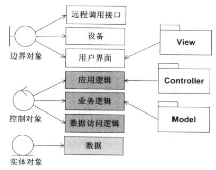
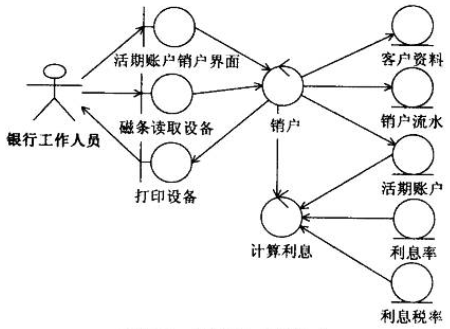

#鲁棒图
##1 鲁棒图3要素
鲁棒图3要素：边界对象、控制对象、实体对象
- 边界对象对模拟外部环境和未来系统之间的交互进行建模。边界对象负责接收外部输入，处理内部内容的解释，并表达或传递相应的结果
- 控制对象对行为进行封装，描述用例中事件流的控制行为
- 实体对象对信息进行描述，往往来自领域概念和领域模型中的对象有良好的对应关系

  

##2 鲁棒图 VS MVC
  

##3 样例
  

##4 鲁棒图理论
鲁棒性的含义：在系统出现：非法输入数据、软硬件单元故障、未预料操作情况时，软件仍能正确运行功能的能力  
- 鲁棒图是一种静态模型
- 可以帮助改进用例文本，确保用例文本的正确性，没有指定不合理或者不可能的系统行为（健康性检查Sanity Check）。鲁棒图基于要使用的一组对象，从而将用例文档从纯粹的用户手册角度变为对象模型上下文中的使用描述
- 确保用例考虑到所有必需的分支流程，从而提高完整性、正确性检查。在后续绘制时序图时节省3~4倍的时间
- 有利于发现对象，发现对象命名冲突等问题。有效确定大部分实体类、边界类

