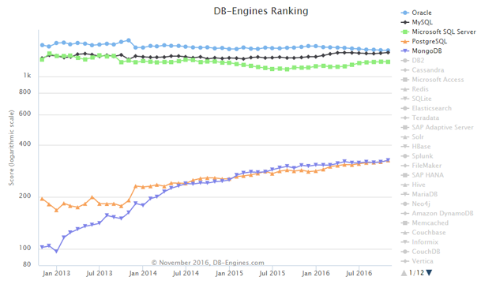

#2016数据库技术盘点
>**作者：**汪洋，平安集团平安科技数据库技术部总监。迄今已从事Oracle相关开发运维工作20年。在平安负责数据库技术引入，数据库产品选型，数据库架构设计，数据库规范制定，开发、测试、生产环境运维等工作。近年，对开源数据库技术以及DBaaS产生浓厚兴趣，一直致力于相关的研究和引入工作。  
>**责编：**仲培艺，关注数据库领域，纠错、寻求报道或者投稿请致邮：zhongpy@csdn.net。  
>本文为《程序员》原创文章，未经允许不得转载，更多精彩文章请订阅2017年《程序员》  
对于数据库技术领域来讲，2016无疑是飞速发展的一年，同时也是令人振奋的一年。在这一年快要过去，2017即将到来的时刻，是时候对数据库领域进行盘点，看看都发生了什么，正在发生什么，以及即将发生什么。

随着近几年互联网、大数据的快速发展和广泛应用，数据格式趋于多样化，数据库引擎也如雨后春笋一般，层出不穷，多达三、四百种之多，充分证明数据库技术的日新月异。篇幅有限，无法对每种数据库引擎展开陈述，我们将主要聚焦在DB-Engines Ranking TOP 5引擎，它们已经可以代表当今数据库技术的发展趋势，况且也积极吸收来自于其他数据库好的技术和经验，无论从技术前瞻性还是功能实现上并不落后。

  
##流行度比较
截止2016年到11月，在DB-Engines上排名的数据库引擎多达310种。我们先简单解释其排名依据。它并非按照数据库引擎的技术指标或者市场占有率进行排名，而是当前的流行度。而流行度的评判取决于以下6个维度：
- 在搜索引擎中被提及的次数（包括Google、Bing、Yandex）；
- 公众对该数据库的兴趣，借用了Google Trend；
- 关于该数据库技术讨论的频度，例如在Stack Overflow；
- 与该数据库相关的职位数量；
- 在专业社交网络中提及到该数据库的profile数量，例如LinkedIn；
- 在社交网络中的相关性，例如Twitter中提到的数量。
  
从图2中可以看出，前3名Oracle、MySQL和Microsoft SQL Server相比起其他数据库引擎的领先优势非常明显，几乎可以用望尘莫及来形容。从表格中具体的分值也可以看到差距巨大。相对其他数据库也比较稳定，已经位于成熟期，但同时也说明成长空间有限。而PostgreSQL和MongoDB虽然和前面3个巨无霸相比仍有明显差距，但发展势头却很好，一直以来都有稳定的增长。

排名覆盖了近4年来的走势。如果单看头三名，也有一些值得注意的现象。
  
Oracle做为老大哥，虽然一直位于第一，但分值却处于下滑通道，和第二名MySQL的差距越来越小，极有被超越的可能，不禁让人担心领先的地位还能保持多久？MySQL年轻气盛，在前3年一直比较稳定，匀速前进，但进入2016后却突然发力，增长非常迅速。在11月的统计中，差距只有2.83%，极有在未来超越的可能。Microsoft SQL Server做为常青树，前期下滑趋势非常明显，给人感觉似乎体力不支，后继无力，于2015年9月跌至谷底。但从2015年10月开始却突然又获得了动能，一路向上，让人有所期待。  
##最新发布版本新特性对比
2016年，各个数据库厂商或者社区都在频频发力，或发布版本，或完善功能以期获得更大的市场占用率。可以说，今年是各数据库产品大版本发布非常集中的一年，带来了很多令人激动的新特性。我们现在就来看一下。

Oracle于9月18-22号的Oracle Open World大会上，发布了12c的第二个Major Release，期待已久的12cR2。了解Oracle的都知道，Oracle的每一个大版本例如10g、11g等都会包含两个Major Release，Release 1和Release 2。而Release 2是非常稳定的版本，各种新功能和新特性也基本固定，不会再有大变化。所以一般生产系统的升级都会等待Release 2发布才开始。12cR2包含了16个大类多达几百种新特性，涵盖了开发、分布式、性能、高可用、安全等方方面面。而对于我个人来讲，最吸引的莫过于Sharding功能的发布了。也就是说Oracle在12cR2，数据库内置支持分库分表，而且对于应用完全透明，无需修改代码。这也秉承了Oracle一贯的原则，一是对应用透明；二是要么不做，要做就做到极致。Sharding特性的发布大大增强了应用系统的线性扩展能力，对于一直需要使用Oracle数据库来获得最高的可用性、稳定性、可靠性但又愁于无法获得象MySQL一样线性扩展和跨数据中心部署的企业无疑是一个巨大的福音。Oracle的Sharding特性提供：  
- 数据相关的路由；
- Oracle Data Guard自动化部署；
- Statement-level Routing and Cross-Shard Queries；
- 线性的扩展能力；
- 良好的故障隔离性；
- 应用数据的跨地域分布部署；
- 数据库的滚动升级；
- 简化云部署，支持本地、云以及混合部署方式。

Sharding被集成到Oracle数据库的方方面面，也就是说在使用Sharding的同时，你仍然可以享受Oracle给你带来的所有好处，获得整体良好的体验。

PostgreSQL做为一个近几年发展迅速的RDBMS产品，一直维持着一年发布一个大版本的节奏，在每个版本中都能给我们带来很多惊喜。在9月29号发布了令人期待的9.6版本，无论从垂直扩展性，系统性能、管理维护都有很大的提升。主要的特性包括：  
- 增加了对于全表扫描、表关联和聚合的并行执行。这是一个里程碑式的进步，可以使得查询充分利用服务器的多核资源，大幅提升处理性能；
- 避免在进行vacuum freeze操作时扫描不必要的数据页面；
- 为了提升系统整体可靠性，同步复制现在可以配置多个Standby Servers；
- 内置的全文检索功能可以针对段落进行查询；
- postgres_fdw现在支持remote joins, sorts, UPDATEs and DELETEs；
- 系统性能大幅提升，特别针对多CPU服务器的扩展能力。

还有一点非常值得注意，在经过开发社区严肃的讨论之后，对于PostgreSQL之后的版本编号策略进行了修订。也就是说，从明年开始，PostgreSQL不再延续当前的编号规则发布5.7版本，而是直接从10开始。以后就是10、11、12依此类推。这是PostgreSQL发展的必然结果，是否也意味着每个版本都会有更多的新特性呢？我们先来看一下10的特性都可能会有哪些吧，摘录如下：   
- Logical Replication；
- Column Storage & Executor Efficiency；
- 分布式系统，将Postgres-XL引入PostgreSQL核心，内置支持Sharding；
- 更多的并行处理，例如vacuum和analyze；
- 进一步简化分区管理维护以及提升分区查询性能；
- Adaptive Query Planning；
- 对于等待事件的监控，方便问题的定位和诊断。

是否很令人期待？

Microsoft SQL Server做为一个老牌数据库也在今年6月1号发布了最新产品SQL Server 2016，难怪排名从5、6月份开始直线上升。而在Garner于10月5号发布的Operational Database Management Systems的“魔力象限报告”中，SQL Server也连续第二年不仅位于Leaders象限中，而且领先于Oracle。版本中的新特性包括：  
- 数据库作用域配置。新的 ALTER DATABASE SCOPED CONFIGURATION (Transact-SQL) 语句可用于控制特定数据库的特定配置；
- 内存优化表格式更改以及支持并行扫描；
- 并行更新抽样统计信息以及实时查看查询的活动执行计划；
- 查询存储是一种新功能，让DBA可以探查查询计划选择和性能；
- SQL Server 2016针对导入和导出JSON以及处理JSON字符串添加了内置支持；
- PolyBase允许使用T-SQL语句访问存储在Hadoop或Azure Blob存储中的数据并以即时方式对其进行查询；
- Stretch Database是SQL Server 2016中的新功能，可以既透明又安全地将历史数据迁移到Microsoft Azure云，无缝访问SQL Server数据，不管这些数据位于本地还是延伸到云中  

值得一提的是Stretch Database技术，数据位置对于应用透明，无论这些数据是位于自己的数据中心还是云中。Gartner也特别提到了SQL Server 2016的这一特性。

此外，微软今年动作多多，不仅宣布了自己的SQL Server将会推出Linux版本，而且在前两天还加入了Linux基金会，积极向开源社区靠拢。

MySQL在10月12号发布了5.7.16 GA版。但更重要的是，MySQL的版本编号策略也和PostgreSQL一样进行了调整，下一个MySQL版本不再是5.7，而且直接从8开始，然后9、10，依此类推。这难道是开源数据库的趋势吗？每一个大版本都是重要的里程碑，使用小数点之后的数字区分不再适合。MySQL 8.0在9月12号发布了第一个Release，虽然不是GA版本，但我们直接来看一下即将到来的8会带来什么令人期待的新特性吧：  
- MySQL服务器开始使用事务数据字典来存储数据库对象的信息；
- 开始支持role角色的概念；
- 可以通过innodb_deadlock_detect来禁用死锁检测，对于高并发系统，可以提升系统并发度。而可以依赖innodb_lock_wait_timeout来处理死锁事务；
- 新的innodb_cached_indexes报告每个索引在buffer pool中缓存的索引页数量；
- 所有innodb临时表创建在共享临时表空间ibtmp1中；
- JSON处理的增强  
        ■ 增加->>操作符；  
        ■增加两个JSON聚集函数JSON_ARRAYAGG()和JSON_OBJECTAGG()。  

MongoDB做为TOP 5中唯一的NoSQL数据库，而且是Document DB类别中的佼佼者，也在2015年11月3号发布了3.2版本。而一年过去，就在2016年11月1号，MongoDB正式宣布了3.4版本，虽然还没有发布GA版本。我们将3.2和3.4合并一起来看下MongoDB这颗冉冉升起之星都包含了哪些特性，为什么会获得市场的认可。  
- 为内存计算和对安全敏感的应用设计的新型可插拔存储引擎；
- 在实时分析和搜索上提供更快的商业洞察；
- 通过document合法性校验提供简化的数据治理；
- 通过提供更强的管理平台，提升分布式跨地区的部署的uptime，零停机升级等降低维护成本，提升运维效率啊；
- Multimodel支持。提供内置图计算，实时分析和针对BI和Spark的连接器；
- Mission-Critical应用支持：  
    □跨地域分布式MongoDB区
    □弹性集群
    □可调节的一致性级别
    □增强的安全性
    □提供丰富的DBA和DevOps工具，更快地和更高质量地发布应用：
    □Schema Management
    □细粒度监控
    □内置的云集成工具
由此可以看出，现在的数据库市场确实是一个百花齐放，百家争鸣的时代。但其中也
有很多共性，不知大家发现没有？  
##分布式数据库技术
分布式数据库技术由于其优良的线性横向扩展能力和良好的故障隔离性，近几年也受到了普遍关注。市场上不仅出现了很多新兴的分布式数据库引擎，老牌的数据库也在分布式技术上投入重兵，加紧部署。

Oracle通过12cR2版本中Sharding功能的发布，支持了数据库的跨地域分布式部署。一个SDB（Sharded Database）在逻辑上是一个数据库，但每一个Shard其实都是一个独立的传统意义上的Oracle数据库，Shard之间不共享任何资源，主机、存储都是独立的，属于Share-nothing架构。同时，每一个Shard又可以搭建自己的高可用架构，例如RAC、同城和远程灾备。这样就保证了SDB整体上的高可用、线性扩展能力以及故障隔离性。通过Sharding功能的推出，Oracle在高可用和横向扩展上拥有了两种技术，一种是RAC，一种是Sharding，两种技术既可独立使用，也可以协同使用。各自适应于不同的场景供企业选择。

而PostgreSQL在分布式方面也发展迅速，社区非常活跃，积极地推进。当前存在几种分布式的技术。

以Postgres-XL和Postgres-XZ为代表的技术，具备全局事务管理功能，协调器负责接收客户端请求，解析和生成执行计划并将它们发往数据节点进行处理，可以同时运行OLTP和OLAP负载。

还有Citus公司的开源插件pg_shard，现在已经进化为citus插件，并于今年3月24号开源。

再者就是基于postgres_fdw实现的sharding。postgres_fdw最近1年发展也非常迅速。现在已经可以实现join、sorts和aggregates下放到各foreign server也就是shard上面执行，以释放协调器的资源提升整体吞吐量。未来还可以在整个架构中增加全局事务管理器，保证全局事务一致性，想象空间很大。

PostgreSQL的FDW（Foreign Data Wrapper）非常强大，其强大之处在于经过适当的配置甚至可以实现MySQL的Sharding。

还有一种分布式数据库技术是基于Google的F1和Spanner，通过Paxos协议实现了同步跨数据中心的复制和分布式事务的强一致性，例如CockroachDB和TiDB。其中TiDB是我们的国产数据库，将传统的RDBMS和NoSQL的优势合为一体。TiDB与MySQL完全兼容，得益于其架构中的MySQL协议层，MySQL应用无需修改便可直接运行。TiDB还支持多种存储引擎，未来的发展值得期待。

MongoDB自不用说，做为NoSQL数据库的翘楚，从产品设计之初便充分考虑了Sharding的支持和跨地域分布式部署。整个架构中包括路由节点、配置服务器和shard。通过路由节点和配置服务器，MongoDB对于数据在shard间的分布一清二楚，而数据的位置对于应用也完全透明。每一个shard都是一个独立的副本集用于实现高可用和读写分离。在实际运维过程中，一个副本集内主从的切换非常方便，对于应用透明，由MongoDB自动完成，大大减少了运维复杂度和风险。
##消除数据孤岛，实现对不同数据存
随着IoT和大数据时代的来临，以及Polyglot Persistence概念的提出，数据的格式和存储趋于多样化。同时，产生数据的速度越来越快，数据量越来越大，企业不可能将所有数据放置于一个数据库中，也不可能由单一的数据库引擎来管理。如何将企业的数据逻辑上整合为一个整体，减少数据迁移成本，数据的位置对于计算引擎或者分析引擎透明成为了另外一个重要课题。各个数据库厂商和社区也纷纷推出自己的解决方案来支持未来的发展。

在这个领域，Oracle推出了Big Data SQL。对于企业，无论数据是在Oracle中，还是在Hadoop上，抑或是在NoSQL数据库里，都可以使用统一的SQL查询语言来访问，极大得降低了对人员技能的门槛要求以及进行企业数据分析的复杂度。Big Data SQL可以：  
- 无缝地查询位于Oracle、Hadoop以及NoSQL数据库中的数据；
- 使用Oracle SQL的强大功能查询分析企业的全部数据；
- 将Oracle数据库的安全特性扩展至Hadoop和NoSQL数据库。  

可以看到，基本上可以实现全互联互通，充满无限可能。通过PostgreSQL的SQL查询，我们可以访问存储在任何外部数据源中的数据，以统一的方式进行，并且实现安全管理。这正好符合了Gartner提出的LDW（Logical DataWarehouse）的概念，无论何时何地，在你面前只有一个PostgreSQL数据库。

这个领域，MongoDB也不甘落后，推出了两款产品。一个是BI Connector，可以让用户将他们存储在MongoDB中的数据通过当前的关系型商业智能工具例如Tableau实现可视化。但有趣的是，BI Connector是通过PostgreSQL的FDW实现对MongoDB数据的SQL访问。另外一个产品是Spark Connector，可以允许我们使用所有Spark的库来访问和分析存储在MongoDB中的数据，包括SQL访问、streaming、机器学习以及Graph API等。
##Multimodel数据库的出现和发展
Polyglot Persistence多态化存储是指根据不同的数据格式提供不同持久化存储格式，以往很难通过一种数据库引擎达成，因此市场上出现了很多针对不同数据格式的数据库产品。数据库市场变得生机勃勃的同时，也带来了一个问题，就是数据孤岛Data Silo。每种数据库引擎还可能提供不同的接口来访问数据，无法统一。这些都给企业访问、分析数据带来了很头疼的问题。虽然有前面提到的Big Data SQL，PostgreSQL FDW等技术可以使企业数据看起来是一个逻辑上的整体，可是对于不同数据间关联分析的需求还是不理想，无论从性能上还是成本上。如何消除这些数据孤岛，使得数据可以被更加便捷地访问？数据库厂商或者开源社区也意识到了这个潜在的市场空间，Gartner也相应地提出了一个新概念Multimodel database。顾名思义，Multimodel就是在一个数据库产品中支持多种数据模型，包括关系型和非关系型（例如document、key-value和graph），并且提供统一的访问接口，这样就大大简化了数据访问层的复杂度，而且提升了访问性能。而且，Gartner预测，2017年所有的Operational DBMS将会在一个DBMS平台上同时支持多种数据模型，关系型和非关系型。2017年，NoSQL也将不再会成为区分multimodel、key-value、document、graph和table-style引擎的标签。事实上，各个数据库厂商已经开始支持multimodel。而对于multimodel来讲，对JSON数据类型的支持几乎成为代表，不可不提。

对于Oracle来讲，一直以来的原则就是在一个数据库中可运行任意类型的负载，支持任何数据类型，One For All。所以很早就支持结构化数据和非结构化数据同时存储在数据库中并且通过标准的SQL语言进行访问，例如对Spatial和XML的支持。在当前最新的12c版本中，Oracle也提供了对JSON的支持来进一步完善Multimodel组合。而在12cR2中，Oracle进一步优化和改进了对JSON的支持，包括对JSON文档查询和JSON索引查询的改进，在PLSQL中增加对JSON处理的操作符，在In-Memory中增加对JSON的支持等很多新特性。

PostgreSQL可谓是支持JSON数据类型的先驱，早在Oracle和MySQL之前于2012年9.2版本就开始增加了对JSON数据类型的支持。此后在每个版本中也都针对JSON进行持续的优化，例如在2014年的9.4版本又增加了对JSONB存储格式的支持。由于多年经验的积累，PostgreSQL在处理JSON方面的功能也是相当完善的。此外，PostgreSQL还通过H-Store插件提供对key-value的支持。

MySQL在5.7.8版本中开始支持JSON数据类型，并且在8中增加了很多对JSON的操作。需要特别提到的是，MySQL还支持通过Memcached的访问接口来访问innoDB中的数据。

SQL Server 2016也针对导入和导出JSON以及处理JSON字符串添加了内置支持。

MongoDB宣称自己的体系结构就是multimodel。允许用户在一个环境中自由搭配多种存储引擎，而数据库能够通过内置的复制功能自动地管理数据在不同存储引擎间的移动。MongoDB允许数据以多种形态出现，既可以是简单的key-value，也可以是扁平的table-style结构，也可以是带有深层嵌套数组和子文档的复杂文档结构。而这些数据也可以通过多种方式被访问，包括简单的查找到JOIN到图遍历都可以。因为这种灵活的存储架构，应用程序可以针对不同的负载和访问类型选择不同的存储引擎。

##图数据库（Graph Database）的兴起
互联网、移动互联、物联网（IoT）带来了数据爆炸式的增长，而数据的增长反过来又促进了人与人、人与物之间的联系，未来我们将会生活在一个万物互联的世界。事实上，比之以前，我们已经生活在一个互联的时代。几乎每个人都在使用微信、Facebook或者Twitter这些社交网络，有自己的社交圈。而Facebook也正是利用这些数据帮我们找到了已经失去联系的朋友，或者向我们推荐可能感兴趣的内容。我们在Amazon网站下的每一个书籍的订单，也被用于向我们推荐更适合自己品味的书籍或者其他商品。这一切都依赖于relationship，不同的是，这个relationship不止指人与人，也指人与物和物与物；而每个人，每个物品都是这个无形的巨大网络中的node（节点）。Node和relationship正是世间万物最自然的表达方式。如何存储node和relationship数据，以及如何进行快速访问来回答我们的问题，改善我们的生活，Graph Database应运而生。

Graph Database两个最重要的概念就是node和relationship，更学术一些的名称是vertices和edges。通过node和relationship数据，可以非常容易地回答类似这样的问题：
-    我朋友的朋友都有哪些朋友？
-    我买的书同时还有谁买并且他们还买了什么其他书？

大家可否发现，这些问题正是我们熟知的称之为推荐引擎所做的事情？这样的问题可以有无穷多，这正是Graph Database的应用场景之一。以下是Graph Database的一些应用场景：  
-    实时推荐；
-    MDM（Master Data Management）；
-    金融服务行业的反欺诈；
-    基于图的搜索，例如两点之间的路径搜索以及最短路径；
-    网络和IT运维；
-    身份和访问管理。

可以看到，应用场景非常丰富，因此Graph Database的前景非常光明。有人也许会有疑问，关系型数据库不是也有entity和relationship的概念吗？难道不能实现这些功能？不是不行，但代价高昂。关系型数据库中的entity存储具有相同属性的数据，entity之间的relationship需要通过JOIN来实现，这就是在关系型理论中的ER图。JOIN是相对昂贵的操作，而且稍有不慎，便会对计算和I/O资源产生巨大消耗。像上面的问题，需要在不同的entity之间多级JOIN才能回答，不仅性能不理想，而且会对资源造成较大消耗。而Graph Database通过对图的遍历（Traversal）操作则可以在资源消耗最低的情况下快速完成查询给出答案。传统关系型数据库不具备天然的Graph Traversal功能。

当前Graph Database主要分为两类：Native和Non-native图技术。而区分两种技术分为两个层面：storage和processing。

Storage是指用于存储graph data的存储格式。对于Native graph storage来讲，设计上从每一个角度对node和relationship数据的写入和查询进行优化，确保相关联的nodes和relationships在物理上是接近的，可以进行高速访问。而Non-native graph storage依赖于外部存储引擎，可以是关系型、columnar或者NoSQL例如MongoDB。由于这些外部存储引擎并没有针对graph data进行存储优化，nodes和relationships可能被存放在相互距离很远的地方而造成访问延迟。

另一个关键因素processing是指如何对图数据进行处理。对于native graph processing来讲，一个关键区分点是进行无索引的相邻访问（index-free adjacency）。在写入时，确保每一个node都能够写入到相邻的nodes和relationships；而在查询时，由于相邻的nodes和relationships在物理上相近，无需索引便可完成高速访问。而non-native processing则需要借助于global indexes完成访问，而且访问的速度可能还会取决于整个数据集的大小。

Graph Database的代表应该是Neo Technology公司的Neo4j数据库。Neo4j同时也是一个native graph database，无论从存储格式上还是访问处理上都针对graph data进行了大量优化。在2016年的4月26号，Neo4j也发布了自己的3.0版本，在各方面都进行了重大改进：  
-    新的存储引擎解决了之前的扩展性限制并且保持了良好的访问性能；
-    为快速访问图数据而设计的新的二进制协议bolt；
-    新的基于成本的优化器无论对于写入还是查询提供更好更快的访问；
-    新的配置和日志结构更好地支持各种部署场景。

此外，Neo4j还支持诸如服务端脚本、触发器、主从复制、事务ACID等特性。所有这些，使得Neo4j的流行度越来越高，获得了大家的认可。eBay、Walmart、Cisco、UBS等大型企业都有采用。

还有一点需要提到，Neo4j使用Cypher做为描述性的图查询语言。

另外一个native graph database叫做orientdb。但是orientdb不止是一个graph database，它还是一个支持multi-model的分布式数据库引擎。也就是说，除了图数据，还支持documents、对象、key-value、spatial和full-text类型的数据，而所有这些数据类型都被orientdb的核心直接管理，从而可以获得良好的性能。除了对不同数据类型的支持，orientdb还支持不同的schema模式，schema-full、schema-less和schema-hybrid在orientdb中都可以使用。Orientdb区别于Neo4j还有两点：一是可以进行multi-master replication，而Neo4j是master-slave replication；二是orientdb支持数据分片sharding而具有横向扩展能力。

前面两个graph database发展时间较长，而将要介绍的却是一个新星，同样属于native graph database家族，叫做DGraph。DGraph使用时下流行的Go语言编写，设计之初的考虑就是要支撑高并发和具备良好的扩展性。DGraph具有7大设计原则：  

-    分布式，可以扩展至上百台服务器并且跨越数据中心；
-    低延迟，提供不仅低而且稳定的延迟，通过最小化查询访问的机器和网络调用的数量；
-    高吞吐量，提供读和写两种操作的高并发；
-    开源；
-    强壮，足够强壮和可靠以做为用户的主要数据库来使用；
-    最小化，保持核心的简单化和最小化，避免任何不必要的功能；
-    干净的设计。

但DGraph仍然在紧锣密鼓地开发过程中，当前的版本是0.4.2，并不能够应用于生产环境。DGraph通过GraphQL查询语言来访问。

接下来要介绍的是一个non-native graph database，叫做Titan。Titan也是一个具备扩展能力的分布式graph databsae。它支持多种存储引擎来存放图数据，例如Cassandra。成千上万亿的vertices和edges都可以存放在Titan由多台服务器组成的集群中，并且可以进行高并发的实时复杂图遍历。Titan的特性包括：  
-    数据的分布式存储和复制；
-    多数据中心的高可用和热备份；
-    支持ACID和最终一致性；
-    支持多种存储引擎，包括Cassandra、HBase和Oracle BerkeleyDB；
-    通过和大数据平台技术集成支持全局图数据分析，报表和ETL，包括Hadoop和Spark；
-    通过ElasticSearch、Solr和Lucene支持地理信息和全文检索；
-    和TinkerPop内置集成，支持Gremlin图查询语言。

在graph database小节的最后，再介绍一种non-native graph database，叫做Cayley。和前面介绍的DGraph一样，Cayley也是使用Go语言开发。和DGraph不同的是Cayley没有自己的存储引擎，使用的是外部存储，因此属于non-native分类。Cayley的特性包括：  

-    使用Go语言编写，可以做为Go库被使用；
-    提供RESTful API；
-    内置的查询编辑器和可视化组件；
-    支持多种查询语言包括Gremlin和MQL；
-    支持多种存储引擎包括LevelDB、Bolt、PostgreSQL和MongoDB。其中使用MongoDB可以提供分布式存储特性；
 -   模块化的设计，很容易扩展使用新的语言和后端存储引擎。

从以上对于graph database的介绍来看，这个领域整体上处于快速成长期，并没有形成统一的标准和规范。无论存储引擎还是查询语言每个产品都有自己的实现，迁移转换的成本较高。大家在选择使用graph database时，需要谨慎评估和选型。

最后总结一下，本文通过以下几个维度对2016年数据库技术的发展趋势进行了盘点。  

-    在db-engines.com网站上的流行度走势分析；
-    本年度发布的版本中的新特性；
-    分布式数据库技术的流行；
-    大数据时代对于数据统一访问和分析的需要；
-    数据类型多样化促使multimodel数据库的发展；
-    图形数据库在万物互联下应运而生。

在每个维度中都以代表性的数据库进行了详细的阐述，从这些数据库厂商又或者是活跃的开源数据库身上，我们更可以清晰地看出当前世界数据库技术发展的方向。

我相信，2017也将会是数据库技术蓬勃发展的一年，让我们一起期待！