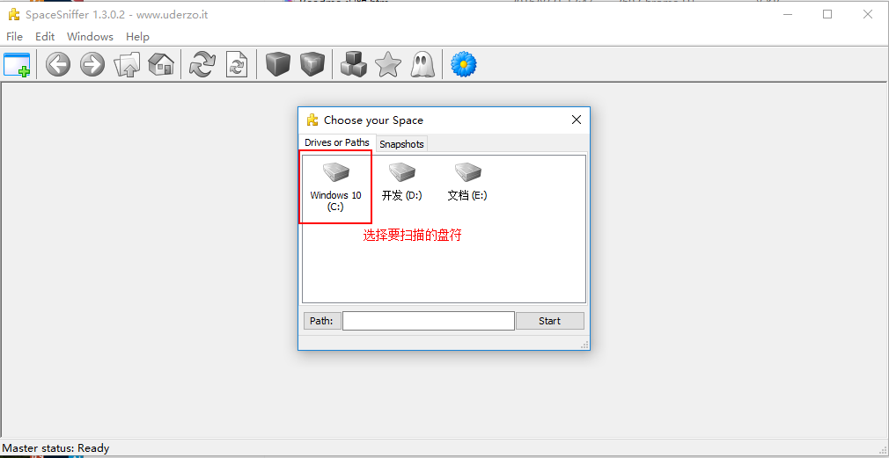
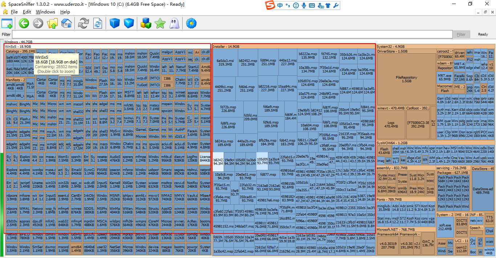
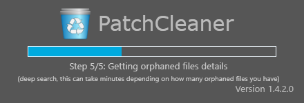
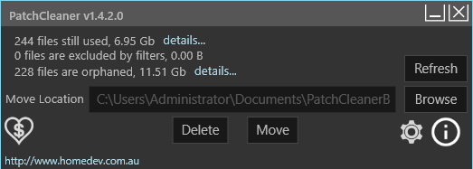
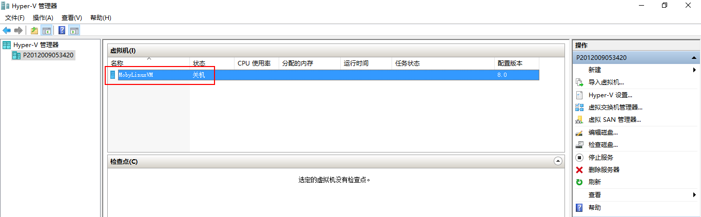
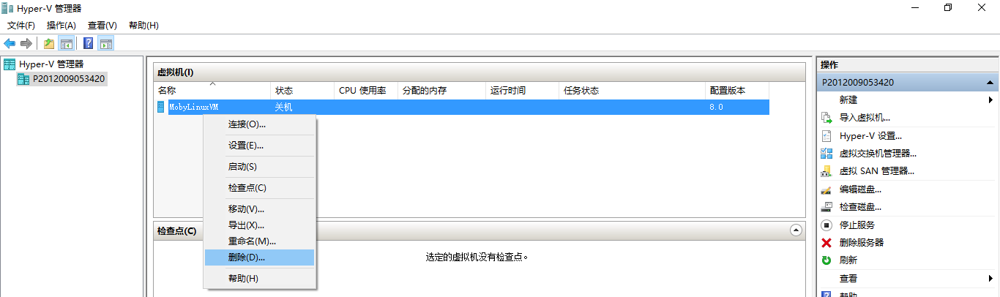

#软件使用技巧
[TOC]
##1 腾讯视频
###1.1 腾讯视频下载
1. 下载腾讯视频客户端

2. 进入腾讯视频客户端，选择【下载】按钮，再选择【设置】，查看观看的节目存储位置：  
  
3. 在客户端中点击视频，之后按照节目存储目录地址下查看vodcache目录下，就会出现缓存的视频文件
  
在目录下回出现多个tdl视频片段  
4. cmd进入dos，切换到tdl视频所在目录。执行`copy/b *.tdl [file_name].mp4`命令，将tdl文件组合成名为file_name.mp4的文件  
  
###1.2 查看嵌入网页中腾讯视频的原始地址
在网页中【审查元素】，查看视频的地址。如：  
https://v.qq.com/iframe/preview.html?vid=y0558tk9wtz&width=500&height=375&auto=0  
找到vid后面的部分，加上一个前缀`https://v.qq.com/x/page/`以及后缀`.html`  
如：  
`https://v.qq.com/x/page/y0558tk9wtz.html`  

##2 Windows
###2.1 Windows空间清理
Windows系统运行一段时间后，系统盘会膨胀。需要进行清理。
1. 采用Space Sniffer（v1.3.0.2）选择磁盘进行扫描  
2. 经过扫描按照文件夹所占空间进行显示
  
  
以上图为例，Windows目录下的Installer与WinSXS目录非常膨胀，上网查看后，下载PatchCleaner V1.4.2.0对补丁包进行清理
3. 启动PatchCleaner V1.4.2.0
  
  
点击【Delete】删除不必要的补丁包  
4. Hiberfil.sys也占据超过3GB，该文件为Windows 休眠功能（Windows Hibernation）将内存数据与会话保存至硬盘、以便计算机断电重新启动后可以快速恢复会话所需的内存镜像文件。以管理员身份打开cmd通过如下命令对休眠镜像控制：  
powercfg -h -size 【size 如：70】  如果物理内存为4G，通过该命令将70%的内存作为镜像存到本地磁盘，当size小于100时，存入磁盘时需要进行压缩  
powercfg -h off  关闭内存镜像，Hiberfil.sys文件将自动被删除  
5. MobyLinuxVM.vhdx占据10G以上空间，如果不需要进行docker for Windows可以将该镜像删除。开启Hyper-V管理器，将该镜像删除  
  
  
删除虚拟机镜像后，在`C:\Users\Public\Documents\Hyper-V\Virtual hard disks`路径下删除`MobyLinuxVM.vhdx`文件  

