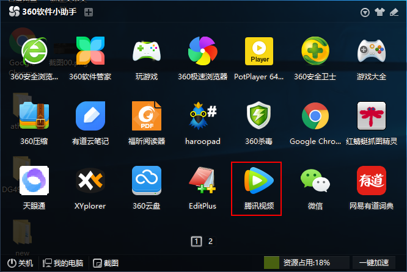
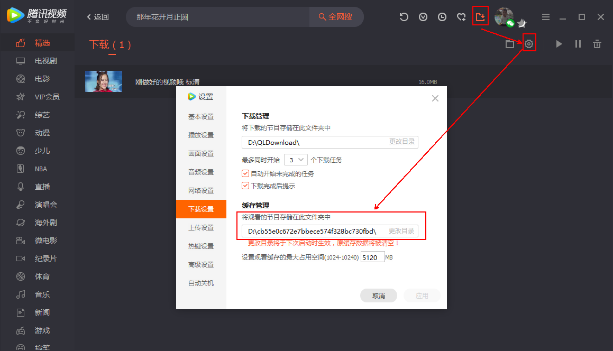
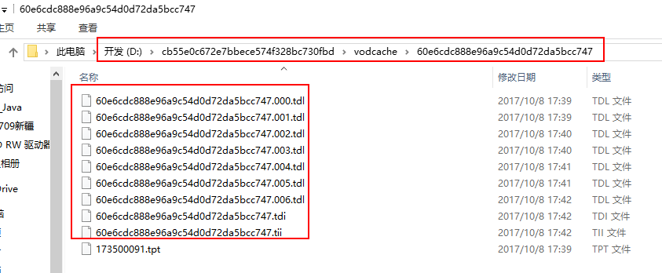
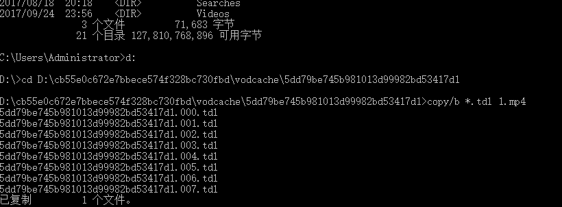

#软件使用技巧
[TOC]
##1 腾讯视频
###1.1 腾讯视频下载
1. 下载腾讯视频客户端

2. 进入腾讯视频客户端，选择【下载】按钮，再选择【设置】，查看观看的节目存储位置：  
  
3. 在客户端中点击视频，之后按照节目存储目录地址下查看vodcache目录下，就会出现缓存的视频文件
  
在目录下回出现多个tdl视频片段  
4. cmd进入dos，切换到tdl视频所在目录。执行`copy/b *.tdl [file_name].mp4`命令，将tdl文件组合成名为file_name.mp4的文件  
  
###1.2 查看嵌入网页中腾讯视频的原始地址
在网页中【审查元素】，查看视频的地址。如：  
https://v.qq.com/iframe/preview.html?vid=y0558tk9wtz&width=500&height=375&auto=0  
找到vid后面的部分，加上一个前缀`https://v.qq.com/x/page/`以及后缀`.html`  
如：  
`https://v.qq.com/x/page/y0558tk9wtz.html`  

