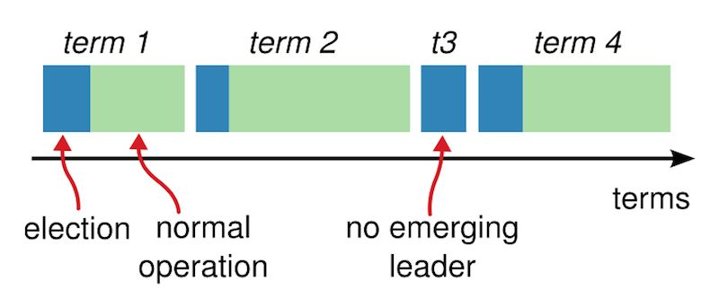
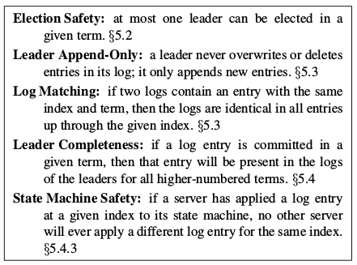

[TOC]
##Raft
此文会对Raft做一个归纳总结，大部分的内容基于raft 论文 。  

Raft是一个共识算法，目的是为了保证多个副本在多个服务器的情况下数据的一致性，以及保证一定的容错能力。  

Raft的卖点是understandable，论文中一直在强调可理解（这个可理解对没接触过分布式的人来说，其实也不太好理解…）。这个可理解应该是相对于paxos来说的。基于understandable这个目标，Raft把整个共识的过程分成三块，分别是leader election， log replication和safety，下面我们会一一介绍。  

##复制状态机（Replicated state machines）
所谓的复制状态机其实并不是指某个服务器，而是一种用来容错的方法。比如说无论是GFS还是HDFS都需要有一个master服务器来保存metadata，那么就会存在这个master宕机的情况，一旦宕机，你的整个服务就不可用。解决方法就是通过复制多个副本到另外的服务器来备用，一旦master宕机，备用的服务器就可以立刻上线来充当master。但是这里存在一个问题，如何保证master和备用服务器的数据一致性？最直接的办法，就是在master上执行的命令，都在备用服务器都执行一遍。那么如何让备用服务器知道执行什么命令？通过log。当master接到客户端的命令之后，把这个命令写到log中，接着把log发给所有的备用服务器，等到大部分备用服务器接收到log，并反馈给master之后，master才提交这个命令（表示这个命令可以执行了）。但是这当中会有一些问题，比如备用服务器宕机，网络丢包等等。这其实就是Raft需要解决的核心问题，保证master和备用服务器的数据一致，也就是所有log都按顺序执行。那么master和备用服务器合在一起，就像是一个服务器一样，无所谓请求哪个服务器都会得到一致的结果。   

##Raft的状态
Raft分为以下三个状态。  
- Leader
- Candidate
- Follower

Raft简单的地方在于，日志是由Leader到Follower的单向传递。也就是说Leader相当于一个总控节点，由它负责接受client的请求，并且把日志发送各个Follower，进行复制。也是只有Leader能决定何时提交一个日志。  

其实整个Raft算法都是围绕着Leader进行的，主要分成以下三块。  
- Leader election  
一开始每个服务器都是Follower，那么需要决定由谁来做Leader，这里延伸出Leader election的问题。而且当Leader宕机的时候也需要重新进行选举。  
- Log replication  
当Leader选举出来之后，需要把日志复制到每个Follower。这里复制需要保证所有日志都有序且正确的复制到Follower上。也就是说Follower上的日志不管是顺序还是内容都要和Leader上的一样。  
- Safety
一但Leader把一项日志复制到绝大多数（容错）的Follower时，需要执行这个日志。这里的安全性是指所有的服务器都要在这同一个位置执行同一个Log，简单来说就是所有的服务器都要按一样的顺序执行相同的Log。比方说一个log，index = 3, command = x -> 2，那么所有的服务器在Index=3这个位置必须执行x->2这个操作，不然就会数据不一致了。Safety可能翻译成正确性更容易理解。  

##Leader election
###任期（Term）
在讲领导选举之前有一个比较关键的概念，就是任期（Term）。按照论文上的说法，term相当于一个逻辑上的时钟，用来检测过时的信息。请仔细理解上面这句话。Follower在超时之后就会成为Candidate，成为Candidate之后，它自增任期，并且把票投给自己，并且发送RPC请求给各个服务器，在得到绝大多数选票之后，成为Leader。为什么是绝大多数选票？因为一个任期只能有一个领导。假如Candidate没有拿到绝大多数选票，即有其他Candidate在竞争选票，那么Candidate会再次自增Term，发起下一轮投票。  

这里有一个关键的点，就是一个任期只能有一个领导。假如领导宕机，会重新进行选举换领导，那么Term也会改变。所以通过这个方式可以用Term来感知过时的信息。假设有这一种情况，一开始a为领导，然后a断开了网络，集群的服务器因收不到a的心跳包，重新选举出一位领导b，b的任期大于a，当a再次加入网络，当发送心跳给b或者接受到b的心跳包时，通过比较Term可知a已经过期，会把a的Term改成b的Term，且状态变回Follower。  
  
###选举
我们再来捋一下这个选举的过程  
1. 服务器刚启动时，状态都是Follower。假如Follower在定时器设定的时间（随机）内，收到来自Leader或者Candidate合法的RPC请求，会继续保持Follower，并重置定时器的时间。
2. 在定时器设定的时间内，没有收到合法的RPC请求，那么则发生election timeout，表示此时没有Leader。则超时的Follower，转换成Candidate。
3. 成为Candidate之后，立即开始投票。先Term自增，然后投票给自己，重置定时器，并且并发的发送RequestVote给所有的服务器。接下来有三种情况会发生。
	- A.收到绝大多数服务器的选票，赢得选举，成为Leader
	- B.另一个服务器成为Leader，选举失败。（如何得知另一个服务器成为Leader？）
	- C.定时器超时，仍然没有Leader产生，说明有另外的Candidate竞争，产生平票之类的情况，则进入下一轮选举（也就是重做3）。
			
这里产生了Raft的第一个特性
	- Election Safety
	一个任期内只能有一个Leader。（任期不同即表示Leader已经换过了）
###情况A
服务器按照先来先服务的原则进行投票（这里还有Safety的限制，只有含有全部commit log的Candidate才能获得选票）。所谓绝大多数的选票是指大于n/2。一旦赢得选举之后，则转成Leader，并且发送心跳包给另外的服务器来保证不会election timeout。
###情况B
假设另一个服务器成为了Leader，那么会发生什么？也就是当前这个Candidate会收到来自另一个Leader合法（Term没有落后）的AppendEntries请求。说明当前Term已经选举出Leader了，当前Candidate可以转为Follower了。
###情况C
也就是多个Follower都成为了Candidate，各自抢了一部分选票，一个都没赢。这种情况会再次发生election timeout，则直接进行下一轮竞选。  

这里有个关键的问题，就是如何保证最终一定会产生一个Leader？办法是定时器设置的时间随机的（150–300 ms）。  

##Log replication
当Leader选出来之后，就到了发送log的环节了。这一部分的本质要解决的问题就是让Follower和Leader的日志顺序和内容都完全相同（指提交的部分），这样才能保证一致性。  

阅读以下内容时请牢记Log replication要解决的本质问题是什么，也就是上面那句话。  

Raft维护了两个属性来保证Follower和Leader的日志顺序和内容完全相同（提交的部分）。  
- 如果两个entry在不同的服务器中，拥有同样的index和term，则保证他们保存了相同的命令
- 如果两个entry在不同的服务器中，拥有同样的index和term，则保证在两个entry之前的所有entry都相等

第一个属性要保证很简单，leader每次创建entry时，都只会使用新的index，而不会去改写之前index的内容。这也就是在给定index和term的情况下，只会创建一个entry。那么也就保证了相同index和term，相同命令。  

第二个属性需要在每次AppendEntries的时候进行检查。Leader每次发送entry给follower时，会带上前一个entry的index和term。当Follower收到RPC时，会检查最后一个entry的index和term是不是和AppendEntries中的prevIndex和prevTerm相同，不相同则拒绝。若不相同则说明该entry保存的命令和Leader上保存的命令不同，则自然要拒绝。这个也就是所谓的一致性检查（the consistency check）。  

正常情况下（没有机器宕机的情况），follower的日志是和leader同步的，不会有check失败的情况，但是如果考虑宕机的情况，就各种情况都有可能发生，参考下面一张图。  
  
Follower可能会缺少log，也可能会有多余的log，甚至都发生。  

要解决这种情况，Follower需要从最后一次确认的entry之后，删除多余的entry，并且继续追加缺失的entry。  

Raft简单的地方在于，Leader从来不会修改自己log，而是让Follower自己去修改log。  

方法就是Leader维护一个nextIndex[i]数组，用来保存下个发给Follower[i]的Index，如果consistency check通过，则nextIndex[i]++，不然的话则nextIndex[i]--，直到双方同步log位置。这个感觉有点类似于tcp传数据时的ack，总是返回下一个期望收到的数据包。  

也就是说这里除了nextIndex的更新之外，Leader不需要做什么额外的动作。这就是Raft可理解的地方了。  

##Safety
###选举限制
那么是不是这样就能保证，Follower和Leader都按顺序执行相同的命令呢？不一定！考虑上面那张图的情况。假设这个时候Leader宕机，Follower(f)被选举成为Leader，那么会发生什么？nextIndex会一直uncheck直到index=4的entry，把2发给每个Follower，但是之前4已经复制到了大部分机器上，已经commit了，这时候会发生覆盖已经commit的entry的情况了！  

所以在选举的时候会加上限制，在RequestVote中加上Candidate的最后一个entry的index以及term。Follower会与自己的最后一个entry的index和term进行比较。假设term不相等，那么只有拥有最新term的Candidate才能获得选票。若假设term相等，则比较index，最长的那个获得选票。  

也就是说只有一个Candidate包含了全部已经commit的entry的情况下，才能获得选票。这就是所谓的at least up-to-date，其实也就是保证term最新，若term相同，则保证log最长。这样选出来的leader肯定包含所有commit的entry。（其实这个命题，同样要加上一点约束才是正确的，也就是下面的commit限制）  
###commit限制
我们先来看下面的图。
  
黑框表示为Leader。注意c的时候，2已经拷贝到大部分服务器上，提交以后，s1宕机，然后此时s5仍然能获得s2，s3，s4的选票成为Leader，但是这种情况s5不知道2已经被提交了，那么2就会被3覆盖！  

这里限制的条件就是，在c的时候2无法提交！Leader仅仅只能提交当前Term的entry!这样的话如果没提交，即使被覆盖也没什么。如果到e这种情况，s5已经无法获得选票了。  

通过上述两个限制保证Leader选举成功时一定会包含全部已经commit的entry。  

##总结
此文大致描述了Raft算法的基本样貌。我觉得理解Raft最重要的还是理解下面五个性质。  
  
最后再上一张pass所有test的截图！  
  

##Reference
[In Search of an Understandable Consensus Algorithm](https://raft.github.io/raft.pdf)  

