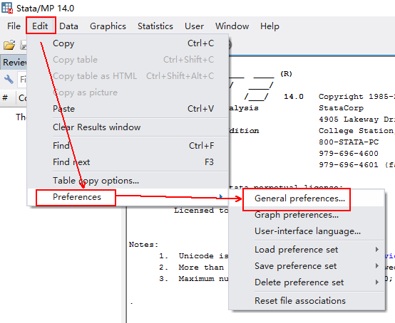
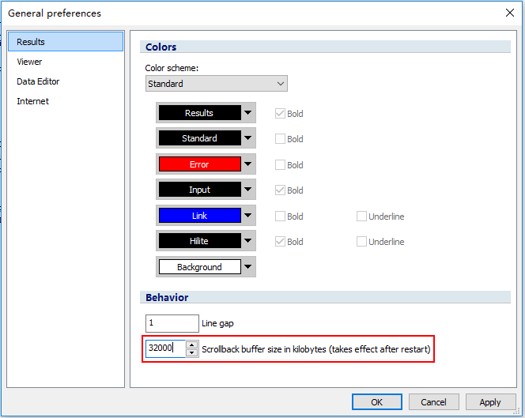
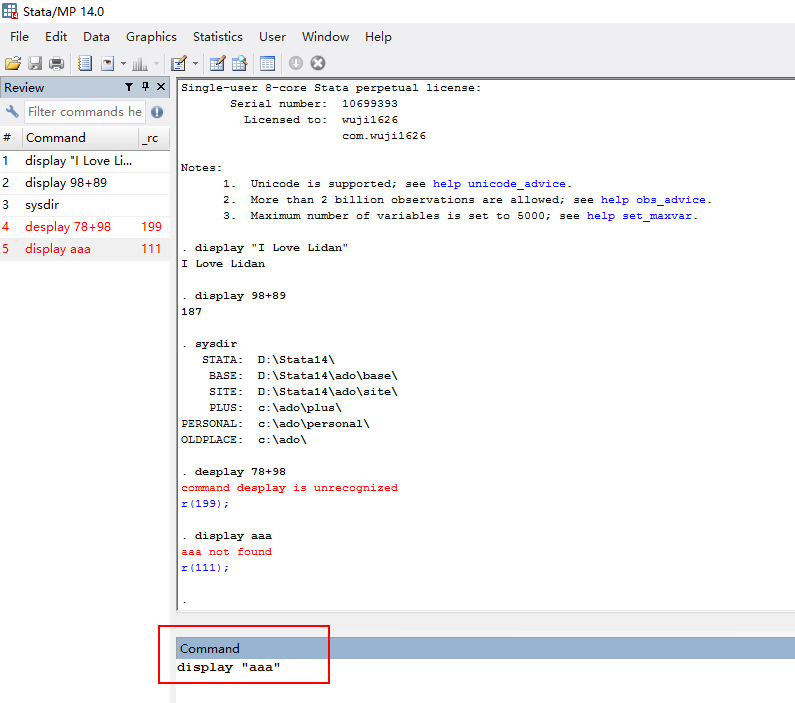
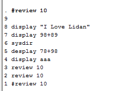
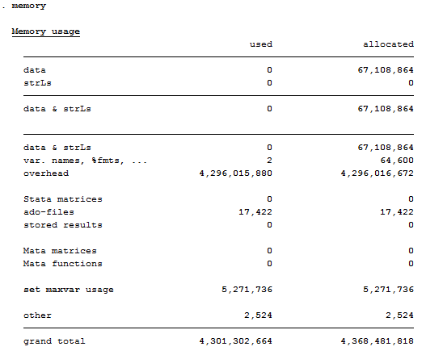
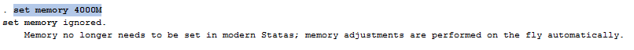

[TOC]

##1 Stata基础
###1.1 Stata文件类型
文件类型|扩展名|说明
----|-----|-----
数据文件|.dta|
命令程序文件|.do|内容为提交给Stata执行的一系列命令集合
运行程序文件|.ado|Stata用以完成用户提交的数据处理与统计分析任务的程序文件。其文件名是该程序在Stata中的命令名
帮助文件|.hlp|它与相应的.ado文件有相同的文件名（仅扩展名不同），形成一对文件，成为Stata的在线帮助的重要组成部分。其内容为提示用户怎样使用该命令，即该命令的语法结构及其解释以及一些用法实例
记录文件|.smcl或.log|记录Stata运行结果。.smcl是stata专用的结果文件格式，.log则是一般文本格式
图形文件|.gph|用于存储Stata画出的图形；同时可以导出.ps、.wmf、.eps等图形格式
数据代码文件|.dct|文本格式的文件编写了数据说明、数据等内容

###1.2 Stata使用
####1.2.1 设置窗口缓冲结果行数
在Edit → Preferences → General Preferences的Results页签中设置  
  
  

也可以使用set scrollbufsize #
10000 < # < 500000

设置每行的长度：
set linesize #

####1.2.2 执行命令
在command栏中输入Stata语法，即可在结果页面中显示命令与结果  
  
####1.2.3 回放命令
从当前命令倒数n个命令  
  
####1.2.4 常用dos命令
命令|说明
---|----
mkdir|新建目录
dir|显示目录中的文件
cd|改变当前工作目录
erase|删除文件
type|显示文本文件内容
####1.2.5 内存设定
- 通过memory命令查看内存情况  
  
- 通过`set memory [数量]`设置内存大小  
不过Stata14中的内存已经不需要设定，系统将自动调整
  

###1.3 命令
Stata命令的结构：  
[prefix:]  command  [varlist]  [= exp.]  [if exp.]  [using filename]  [in range]  [weight = ]  [, options]
- prefix：命令前缀。指导Stata命令如何运行。常见的是以by varlist形式出现，Stata命令需要对varlist的每个取值运行一次。用":"隔开  
- command：命令  
- varlist：变量串  
- = exp.：表达式。界定变量之间的管理  
- if exp.：条件表达式。界定Stata命令执行任务的对象必须满足这些逻辑表达式的条件  
- using filename：使用的文件
- in range：观察个案范围  
- weight：权重，Stata命令执行任务时的权重参数变量  
- options：选型。必须由","与命令及命令结构中的其他部分隔开。选项是用来限定或是指导命令的执行的  

####1.3.1 命令的缩写
命令|缩写
---|---
list|li
describe|d
display|di，dis
summarize|sum
tabulate|ta，tab
label|lab
rename|ren
recode|rec
generate|gen，g
graph|gr
regress|reg
memory|mem
variable|var
value|val
detail|d
column|col

##2 数据结构

