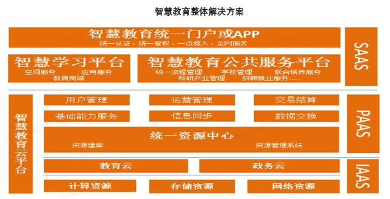

>新型智慧城市，是指运用信息和通信技术手段，感测、分析、整台城市运行核心系统的各项关键信息，从而对包括民生、环保、公共安全、城市服务、工商业活动在内的各种需求做出智能响应。它不单是仅仅基于某一种技术，而是包括云，人工智能等等技术的综合应用解决方案，旨在帮助城市更好运转，为人们创造更美好的生活。

>新型智慧城市主要应用领域包括：智慧政务、智慧交通、智慧安防、智慧教育、智慧医疗。

##智慧政务：政务云建设加速，云计算、大数据以及AI等新技术不断落地
智慧政务是运用云计算、大数据、物联网、人工智能等技术，通过监测、整合、分析、智能响应，实现各职能部门的各种资源的高度整合，提高政府的业务办理和管理效率。通过智慧政务体系，可以加强职能监管，使政府更加廉洁、勤政、务实，提高政府的透明度，并形成高效、敏捷、便民的新型政府，保证城市可持续发展，为企业和公众建立一个良好的城市生活环境。

云计算、大数据、人工智能以及区块链技术快速发展，智慧政务开始进入“架构优化”阶段，存储和计算环节新技术应用显着增加，为政务、企业以及民生服务应用提供支撑。通过架构的优化，打破了原有的应用竖井和数据孤岛，真正实现了数据共享、智慧决策和管理。

  
资料来源:中兴通讯、IDC、平安证券研究所

##智慧交通：基于智能调度系统建设，重点满足实时监控、智慧调度等需求
慧交通是在交通智能调度系统的基础上，融入物联网、云计算、大数据、移动互联等IT技术，通过信息技术对汇交通信息的汇集和处理，提供实时交通数据服务。随着我国城镇化建设的不断深入，我国对“智慧交通”工程建设的需求增长快速。

智慧交通大量使用了数据模型、数据挖掘等数据处理技术，实现了系统性、实时性、信息交流的交互性以及服务的广泛性。智慧交通系统主要解决四个方面的应用需求。第一，监控实时交通，获知何处发生了交通事故、何处交通拥挤等，并以最快的速度提供给驾驶员和交通管理人员；第二，实现驾驶员与调度管理中心之间的双向通信，管理公共车辆，以提升商业车辆、公共汽车和出租车的运营效率；第三，通过多媒介多终端向外出旅行者及时提供各种交通综合信息；第四，利用实时数据辅助驾驶员驾驶汽车，或替代驾驶员自动驾驶汽车。
  
资料来源:平安证券研究所  

##智慧安防：国内进入公共安全事件高发期，视频监控等安防系统需求旺盛
随着经济发展和城市建设速度的加快，以及地缘政治、宗教、战争问题的加剧，全球各地的安全问题呈现出明显加剧态势，国内也正在进入“突发公共安全事件的高发期”和“社会高风险期”。公开数据显示，国内每年因为各种自然灾害、事故造成的经济损失达到6500亿元左右，占GDP的比重高达6%。应对重大突发公共安全事件的处置能力是城市现代化程度的一个重要标志，特别是近几年，随着信息技术的发展，构建和谐社会、建设平安城市的需要以及大型赛事、展会活动的安防需求,对公共安全有效管理的需求越来越旺盛，标准越来越高。

智慧安防系统强调的重点是对城市的更为智能的感知，主要依托的技术就是视频监控系统为基础，通过各种有线、无线网络，整合城市各类视频数据，建设一个庞大的城市公共安全防控平台，利用云计算技术，对海量的城市视频进行存储与分析，实现事前积极预防、事中实时感知和快速响应以及事后的快速调查分析。智慧安防的优势在于信息传送及时，集布防、检测、报警、记录于一体，结构简单，适用面广，可以面向任何单位和个人使用。

目前，国内主流的智慧城市解决方案或者平台提供商均可以提供智慧安防的解决方案，而在高清视频监控系统方面有着明显优势的企业包括海康威视、大华、宇视科技等。目前，国内智慧安防典型的解决方案主要包括感知层、传输层、平台层、应用层和展现层。感知层主要承担数据采集任务，国内领先企业基本都具备提供高清视频监控体系的能力。传输层主要通过通信专网、无线技术完成数据传输任务。平台层主要完成的是数据交换、分析和处理工作。应用层则是通过后台数据的支撑，提供监控检查、应急救援、日常监控预警等服务，变以前的被动式安防管理为主动管理。
  
资料来源:平安证券研究所

##智慧教育：通过优质教育资源共建共享，解决教育均等化和公平化问题
教育作为最大的民生之一，伴随着城市化的快速推进，教育资源短缺、分配不均、人才支撑体系不够、社会培训体系不健全等问题开始凸显。通过引入新一代信息技术，打造智慧教育平台，可以实现教育的数字化、网络化、智能化和多媒体化；通过教育门户网站、智慧教育学习平台以及教育资源交易平台等模式，快速高效实现优质教育资源的共建共享，推动教育教学以及管理的深层次变革，推动教育的均等化和公平化。通过智慧教育的发展，有望打破当前教育纯粹由政府进行投资的模式，真正能够引入社会资本，探索公司化运营，培育智慧教育产业，构建起全民参与的终生教育体系，为学生和市民提供便捷、优质、安全、高效的教育服务。

从技术层面看，多数地区都是基于云的架构展开，在教育云和政务云的基础上，构建统一资源中心，搭建起“智慧教育云平台、智慧学习平台和智慧教育公共服务平台”，最后通过统一的门户网站或者APP对市民提供服务。

在很多地区，云平台都是基于原有教育城域网和信息化设备搭建而成，提供云存储和云计算服务。智慧教育学习平台一般而言是应用平台，实现在线学习和终身教育。智慧教育公共服务平台是各部门乃至于全体市民提供教育管理服务的主要平台，主要是通过教育基础数据库，为教育决策服务，主要功能包括教育行政管理、教师管理、学生管理、教育惠民等，实现教育系统横向和纵向的互联互通，提高行政决策水平和效率。

  
资料来源:平安证券研究所

近年来，国内智慧教育发展效果较为突出，不少地区还找到了创新发展的新路径：一，信息化基础设施建设水平明显提升，很多地区都上线了智慧教育门户网站或者应用。一些较为发达的地区，数字化校园工程建设已经十分完善，很多城市都实现了教学、科研、管理、公共服务的网络化、数字化和虚拟化。其中，教育云是智慧教育投资的重点，一些城市采用了政府采购租赁服务的方式，改变了传统的政府自建机房的模式，既节省了资金，还减轻了建设运维的压力，确保了云平台始终处于技术领先的地位。

二、智慧教育帮助不少地区建立了统一教育资源数据池。资源池将教育资源和系统软件资源集成到一个平台上，通过一站式全方位的资源服务模式，打破了传统教育信息化的边界。该平台向上为教育资源共建共享和交易提供了基础条件，向下在收集、沉淀和管理各种数据。同时，通过教育云和政务云的打通，为市民网络学习空间市民认证创造了条件。

三、智慧教育让优质的教育资源服务实现了均衡化。通过智慧学习平台，将大量的优质教学资源利用信息化手段，快速高效地实现低成本、大规模普及，一定程度上缓解了当前择校、家教等市民关心的热点问题，有助于实现教育资源的均衡化。

##智慧医疗：建设重点从HIS转向至临床信息化，资本和云商横向进入加速
除了教育之外，医疗服务也是当前城镇化进程中的一个重要短板。由于国内公共医疗管理系统的不完善，医疗成本高、渠道少、覆盖面低等问题困扰着大众民生。大医院人满为患，社区医院无人问津，病人就诊手续繁琐等等问题都是由于医疗信息不畅，医疗资源两极化，医疗监督机制不全等原因导致，这些问题已经成为影响社会和谐发展的重要因素。政府一直高度重视在医疗领域的信息资源的配置，智慧医疗建设就是重要内容。

2015年，国务院办公厅颁布了《全国医疗卫生服务体系规划纲要（2015-2020年）》，指出“开展健康中国云服务计划，积极应用移动互联网、物联网、云计算、可穿戴设备等新技术，推动惠及全民的健康信息服务和智慧医疗服务，推动健康大数据的应用，逐步转变服务模式，提高服务能力和管理水平”。智慧医疗就是推动惠民医疗的重要手段，通过信息技术手段的运用，打造一个平台体系，降低患者等疗时间，并通过提供便捷的支付手段，给患者提供公平、安全、便捷、优质的诊疗服务。

智慧医疗由三部分组成，分别为智慧医院系统、区域卫生系统，以及家庭健康系统。

（1）智慧医院系统。该系统主要为实现病人诊疗信息和行政管理信息的收集、存储、处理、提取及数据交换，可提供的服务包括远程探视、远程会诊、自动报警、临床决策系统、智慧处方等。

（2）区域卫生系统。该系统包括区域卫生平台和公共卫生系统两部分。前者主要是收集、处理、传输社区、医院、医疗科研机构、卫生监管部门记录的所有信息，可以提供一般疾病的基本治疗，慢性病的社区护理，大病向上转诊，接收恢复转诊，科研管理等服务。后者主要提供疫情监控等公共卫生服务。

（3）家庭健康系统。该系统是最贴近市民的健康保障，包括针对行动不便无法送往医院进行救治病患的远程医疗，对慢性病以及老幼病患远程的照护，对智障、残疾、传染病等特殊人群的健康监测，还包括自动提示用药时间、服用禁忌、剩余药量等的智能服药系统。

  
资料来源:平安证券研究所

从目前智慧医疗发展模式来看，政府依然是投资的主体，而且侧重点还主要集中在医院的信息化上，对从根本上改善医疗服务的严重短缺问题还存在较大差距。从智慧医院系统的建设进度看，当前HIS系统的普及率明显提升，建设的重点已经转向到临床管理信息化（CIS）方面，但短期内院内信息化以硬件为主的收入结构不会改变。国内智慧医疗提供商主要有东软集团、东华软件、卫宁健康、万达信息等，这些企业占据了全国智慧医疗40%左右的份额，但是行业议价能力整体不强，区域化明显，尚未形成具有全国竞争力的企业。

随着三医（医疗、医保、医药）联动、医保异地支付政策的放开预期的上升，电商和资本进入智慧医疗领域的动力显着加强。2018年，阿里系创立了阿里健康和“医疗云”服务，腾讯也在加速在智慧医疗领域的部署，而且两家公司均在在二级市场直接参股了专业智慧医疗服务商，其中腾讯参股了东华软件，而阿里则参股了卫宁健康；而在H股，医疗信息化服务机构平安好医生登陆资本市场，而阿里健康也完成了自身的重大资产重组，将健康服务电商业务全面注入上市公司。

>更多资料请参考中商产业研究院发布的《2018-2023年中国新型智慧城市前景调查及投资机会研究报告》。

